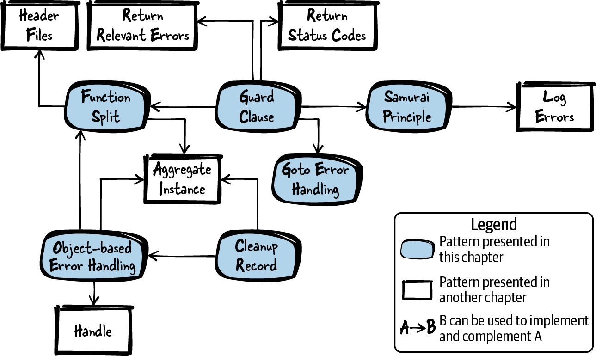

# 第 1 章  错误处理

错误处理是软件开发中绕不开的一环，处理得不好，软件就会变得难以扩展和维护。C++、Java 这类语言提供了"异常"和"析构函数"机制，让错误处理轻松不少；C 语言原生没有这些机制，而关于如何用 C 做好错误处理的资料又散落在互联网的各个角落。

本章把这些知识整理成一组 C 错误处理模式，并用一个贯穿全章的运行示例演示这些模式的应用。这些模式沉淀了经过实践检验的设计决策，并详细说明了各自的适用时机与带来的后果。有了它们，程序员就不必事无巨细地亲自做每个决定，而是可以直接依赖这些知识，以之为起点写出好代码。

[图 1-1](#fig_error_handling) 给出了本章所有模式及其相互关系的总览，[表 1-1](#tab_error_handling) 则是各模式的一句话摘要。



###### 图 1-1  错误处理模式总览

|  | 模式名 | 摘要 |
|----|----|----|
|  | 函数拆分（Function Split） | 函数身兼数职，导致难以阅读和维护。因此，把它拆开：把函数中一段看起来能独立成篇的部分拿出来，新建一个函数放进去，再调用这个新函数。 |
|  | 卫语句（Guard Clause） | 函数把前置条件检查和主逻辑混在一起，难以阅读和维护。因此，先梳理出必须满足的前置条件，一旦条件不满足就立即从函数返回。 |
|  | 武士道原则（Samurai Principle） | 返回错误信息时，你默认调用方会检查这些信息；可调用方完全可能省略检查，错误就此被埋没。因此，函数要么凯旋而归，要么根本不返回；如果遇到你明知无法处理的错误，就直接终止程序。 |
|  | goto 错误处理（Goto Error Handling） | 在函数内部多处获取和清理多个资源，代码会变得难以阅读和维护。因此，把所有资源清理和错误处理集中到函数末尾；一旦某个资源获取失败，就用 `goto` 语句跳转到清理代码。 |
|  | 清理记录（Cleanup Record） | 当代码要获取和清理多个资源、尤其当这些资源彼此依赖时，很难让这段代码易读易维护。因此，连续调用资源获取函数直到失败为止，并记录哪些资源需要清理；再根据这些记录决定调用哪些清理函数。 |
|  | 基于对象的错误处理（Object-Based Error Handling） | 资源获取、资源清理和资源使用挤在一个函数里，会让代码难以实现、阅读、维护和测试。因此，把初始化和清理拆到独立的函数中——类似面向对象编程里构造函数与析构函数的概念。 |

表 1-1  错误处理模式

# 运行示例

你要实现一个函数：解析文件中的若干关键字，并返回其中哪个关键字被找到的信息。

在 C 语言里，表示错误状态的标准做法是通过函数返回值。为了携带更多错误信息，老式 C 函数常常把 `errno` 变量（见 *errno.h*）设为特定的错误码，调用方随后检查 `errno` 即可获知错误详情。

不过在下面的代码中，你并不需要那么细的错误信息，所以直接用返回值就够了。于是你写出了最初这版代码：

```
int parseFile(char* file_name)
{
  int return_value = ERROR;
  FILE* file_pointer = 0;
  char* buffer = 0;

  if(file_name!=NULL)
  {
    if(file_pointer=fopen(file_name, "r"))
    {
      if(buffer=malloc(BUFFER_SIZE))
      {
        /* parse file content*/
        return_value = NO_KEYWORD_FOUND;
        while(fgets(buffer, BUFFER_SIZE, file_pointer)!=NULL)
        {
          if(strcmp("KEYWORD_ONE\n", buffer)==0)
          {
            return_value = KEYWORD_ONE_FOUND_FIRST;
            break;
          }
          if(strcmp("KEYWORD_TWO\n", buffer)==0)
          {
            return_value = KEYWORD_TWO_FOUND_FIRST;
            break;
          }
        }
        free(buffer);
      }
      fclose(file_pointer);
    }
  }
  return return_value;
}
```

这份代码里每个函数调用的返回值都要检查有没有出错，结果就是 `if` 语句层层嵌套。由此带来以下几个问题：

- 函数很长，错误处理、初始化、清理和功能代码混杂在一起，难以维护。

- 真正读取和解释文件数据的主逻辑深深嵌在 `if` 子句里，程序逻辑难以一眼看清。

- 清理函数与对应的初始化函数相距甚远，很容易漏掉某项清理——函数里有多个 return 语句时尤其如此。

为了让代码变好，你先做一次函数拆分（Function Split）。

# 函数拆分

## 上下文

你有一个函数干了多件事。比如：分配一个资源（如动态内存或某个文件句柄）、使用这个资源、再清理它。

## 问题

**函数身兼数职，导致难以阅读和维护。**

这样的函数可能同时负责分配资源、操作资源、清理资源；清理逻辑甚至散落在函数各处，在有些地方还重复出现。尤其是资源分配失败时的错误处理，动不动就以嵌套 `if` 语句收场，让函数愈发难读。

在一个函数里同时应付多个资源的分配、清理和使用，很容易漏掉某个资源的清理，日后修改代码时更是如此。比如在代码中间新加一个 return 语句，此时函数里已经分配的资源就很容易忘记释放。

## 方案

**把它拆开：把函数中一段看起来能独立成篇的部分拿出来，新建一个函数放进去，再调用这个新函数。**

判断该把哪一部分拆出去很简单：看这段代码能不能起一个有意义的名字，拆分之后职责是不是被隔离了。比如可以拆成一个只含功能代码的函数和一个只含错误处理代码的函数。

一个明显的拆分信号是：同一个资源的清理代码在函数里出现了多处。这时最好把代码拆成两个函数——一个负责分配和清理资源，另一个使用这些资源。使用资源的被调函数随后就可以放心地写多个 return 语句，不必在每个 return 之前清理资源，因为清理由外层函数统一完成。如下面的代码所示：

```
void someFunction()
{
  char* buffer = malloc(LARGE_SIZE);
  if(buffer)
  {
    mainFunctionality(buffer);
  }
  free(buffer);
}

void mainFunctionality()
{
  // implementation goes here
}
```

现在一个函数变成了两个。这当然意味着调用方函数不再自包含，而是依赖另一个函数，你得决定把那个函数放在哪里。第一步可以先与调用方放在同一个文件里；如果两个函数耦合并不紧密，也可以考虑把被调函数放进单独的实现文件，并通过头文件包含它的声明。

## 后果

代码得到了改善：两个短函数比一个长函数更易读、易维护。比如，清理代码离需要清理的资源更近了，资源分配和清理不再与主逻辑纠缠，主逻辑也就更容易维护、更容易在日后扩展功能。

被调函数现在可以轻松容纳多个 return 语句，因为不必在每个 return 之前操心资源清理——清理由调用方函数在单一位置统一完成。

如果被调函数用到的资源很多，这些资源就得统统传给它。参数一多，代码就难读了，调用时把参数顺序搞反还可能埋下错误。这种情况下可以用聚合实例（Aggregate Instance）来规避。

## 已知应用

下面是一些应用该模式的实例：

- 几乎所有 C 代码都既有应用这个模式的部分，也有没应用、因而难以维护的部分。按照 Robert C. Martin 在《Clean Code: A Handbook of Agile Software Craftsmanship》（Prentice Hall，2008，中译《代码整洁之道》）中的说法，每个函数应当只做一件事（单一职责原则），因此资源处理与其他程序逻辑永远应该拆到不同的函数里。

- 在 Portland Pattern Repository 中，这个模式叫作 Function Wrapper。

- 在面向对象编程中，模板方法（Template Method）模式同样描述了通过拆分来组织代码的方式。

- 何时、何地拆分函数的判断标准，在 Martin Fowler 的《Refactoring: Improving the Design of Existing Code》（Addison-Wesley，1999，中译《重构：改善既有代码的设计》）中以提炼函数（Extract Method）模式的形式给出。

- 游戏 NetHack 在它的 `read_config_file` 函数中应用了该模式：资源在该函数中处理，随后调用 `parse_conf_file` 函数去使用这些资源。

- OpenWrt 代码在多处用这个模式处理缓冲区。例如负责 MD5 计算的代码：先分配一个缓冲区，把它传给另一个函数去处理，处理完再清理。

## 应用于运行示例

代码已经好看多了：原先一个巨大的函数，现在是两个职责分明的函数——一个负责获取和释放资源，另一个负责查找关键字，如下所示：

```
int searchFileForKeywords(char* buffer, FILE* file_pointer)
{
  while(fgets(buffer, BUFFER_SIZE, file_pointer)!=NULL)
  {
    if(strcmp("KEYWORD_ONE\n", buffer)==0)
    {
      return KEYWORD_ONE_FOUND_FIRST;
    }
    if(strcmp("KEYWORD_TWO\n", buffer)==0)
    {
      return KEYWORD_TWO_FOUND_FIRST;
    }
  }
  return NO_KEYWORD_FOUND;
}

int parseFile(char* file_name)
{
  int return_value = ERROR;
  FILE* file_pointer = 0;
  char* buffer = 0;

  if(file_name!=NULL)
  {
    if(file_pointer=fopen(file_name, "r"))
    {
      if(buffer=malloc(BUFFER_SIZE))
      {
        return_value = searchFileForKeywords(buffer, file_pointer);
        free(buffer);
      }
      fclose(file_pointer);
    }
  }
  return return_value;
}
```

`if` 瀑布的深度降下来了，但 `parseFile` 函数里仍然有三个检查资源分配错误的 `if` 语句，还是太多。接下来实现卫语句（Guard Clause），让这个函数更干净。

## 上下文

你有一个函数，它执行的任务只有在特定条件下（比如输入参数合法）才能成功完成。

## 问题

**函数把前置条件检查和主逻辑混在一起，导致难以阅读和维护。**

分配了资源就必须清理。如果你先分配了资源，随后才发现函数的另一个前置条件不满足，那么这个资源也得一并清理。

前置条件检查散落在函数各处、尤其是嵌套在 `if` 语句里时，程序流程会很难看清。这类检查一多，函数就变得很长——这本身就是一种代码坏味道。

# 代码坏味道

如果代码结构糟糕、或者编写方式让它难以维护，我们就说这段代码"有坏味道"。典型例子包括超长函数、重复代码等。更多坏味道及对策可参阅 Martin Fowler 的《Refactoring: Improving the Design of Existing Code》（Addison-Wesley，1999，中译《重构：改善既有代码的设计》）。

## 方案

**梳理出必须满足的前置条件，一旦条件不满足就立即从函数返回。**

比如检查输入参数的合法性，或者检查程序当前状态是否允许执行函数的其余部分。要仔细斟酌你想为函数设定什么样的调用前置条件：一方面，对函数输入卡得越严，你自己日子越轻松；另一方面，对可能的输入越宽容，函数调用方的日子越轻松（正如 Postel 定律所说："对自己要做的事保守，对从别人那里接受的东西宽容"）。

如果前置条件检查很多，可以单独封装一个函数来执行检查。无论如何，检查都要放在任何资源分配之前——此时直接返回函数即可，没有任何资源需要清理，轻松干净。

把函数的前置条件在接口上写清楚。记录这一行为的最佳位置是声明该函数的头文件。

如果调用方有必要知道具体是哪个前置条件没满足，可以向调用方返回错误信息。例如可以返回状态码（Return Status Codes），但务必只返回相关错误（Return Relevant Errors）。下面的代码演示了一个不返回错误信息的版本：

*someFile.h*

```
/* This function operates on the 'user_input', which must not be NULL */
void someFunction(char* user_input);
```

\
*someFile.c*

```
void someFunction(char* user_input)
{
  if(user_input == NULL)
  {
    return;
  }
  operateOnData(user_input);
}
```

## 后果

前置条件不满足就立即返回，比嵌套 `if` 结构易读得多。代码里清清楚楚：条件不满足，函数执行到此为止。前置条件因此与其余代码隔离得非常干净。

不过，有些编码规范禁止在函数中间返回。例如需要做形式化证明的代码，通常只允许 return 语句出现在函数最末尾。这种情况下可以改用清理记录（Cleanup Record）；如果你想给错误处理找一个集中位置，它也是更好的选择。

## 已知应用

下面是一些应用该模式的实例：

- 卫语句在 Portland Pattern Repository 中有专门条目。

- Klaus Renzel 的文章《Error Detection》（Proceedings of the 2nd EuroPLoP conference，1997）描述了非常相似的错误检测（Error Detection）模式，建议引入前置条件和后置条件检查。

- NetHack 游戏在代码多处应用了该模式，例如 `placebc` 函数。这个函数给 NetHack 主角套上一条锁链作为惩罚，降低主角的移动速度；一旦没有可用的锁链对象，函数立即返回。

- OpenSSL 代码使用了该模式。例如 `SSL_new` 函数遇到非法输入参数时会立即返回。

- Wireshark 的 `capture_stats` 代码负责抓包时收集统计信息，它先检查输入参数的合法性，参数非法时立即返回。

## 应用于运行示例

下面的代码展示了 `parseFile` 函数如何用卫语句检查函数的前置条件：

```
int parseFile(char* file_name)
{
  int return_value = ERROR;
  FILE* file_pointer = 0;
  char* buffer = 0;

  if(file_name==NULL) 
  {
    return ERROR;
  }
  if(file_pointer=fopen(file_name, "r"))
  {
    if(buffer=malloc(BUFFER_SIZE))
    {
      return_value = searchFileForKeywords(buffer, file_pointer);
      free(buffer);
    }
    fclose(file_pointer);
  }
  return return_value;
}
```

[](#co_error_handling_CO1-1)  
传入非法参数时立即返回；此时还没有获取任何资源，因此无需任何清理。

这段代码用返回状态码（Return Status Codes）来实现卫语句，在参数为 `NULL` 的特定情形下返回常量 `ERROR`。调用方于是可以通过检查返回值（Return Value）得知是否给函数传了非法的 `NULL` 参数。但非法参数通常意味着编程错误，而在代码中检查编程错误、层层传递这种信息并不是好主意。这种情形下，直接祭出武士道原则（Samurai Principle）更省事。

# 武士道原则

## 上下文

你有一段错误处理很复杂的代码，其中一些错误非常严重。你的系统不执行安全攸关的动作，高可用性也不那么重要。

## 问题

**返回错误信息时，你默认调用方会检查这些信息；可调用方完全可能省略检查，错误就此被埋没。**

在 C 语言里，检查被调函数的返回值并不是强制性的，调用方可以径直忽略函数返回值。如果函数里发生的错误很严重、调用方也无法优雅处理，你就不该让调用方来决定错误要不要处理、怎么处理，而是要确保一定的动作必然发生。

即便调用方处理了错误，程序十有八九还是会崩溃，或者错误换个地方冒出来——也许出在调用方的调用方那段并不善于处理错误的代码里。这种情况下，"处理"反而掩盖了错误，要找到根因、调试修bug 就难上加难。

代码里的某些错误可能极其罕见。为这些情形返回状态码、再在调用方代码里处理，会让代码可读性下降——它分散了对主逻辑和调用方本职工作的注意力。调用方可能得为此写上许多行代码，只为应付极少发生的状况。

返回这类错误信息还有个问题：信息到底怎么传出去？用函数的返回值或输出参数（Out-Parameters）传递错误信息，会让函数签名更复杂、代码更难懂。因此，你不会希望函数平添几个只用来返回错误信息的参数。

## 方案

**函数要么凯旋而归，要么根本不返回（武士道原则）。如果遇到你明知无法处理的错误，就直接终止程序。**

不要用输出参数或返回值传递错误信息。错误信息就在你手上，就地处理掉。出错时，干脆让程序崩溃：用 `assert` 语句以结构化的方式终止程序。还可以像下面的代码那样，随 `assert` 语句附上调试信息：

```
void someFunction()
{
  assert(checkPreconditions() && "Preconditions are not met");
  mainFunctionality();
}
```

这段代码检查 `assert` 语句中的条件，条件为假时，`assert` 语句连同右侧字符串会打印到 `stderr`，程序随即终止。用不那么结构化的方式终止也未尝不可——比如不检查 `NULL` 指针就直接解引用。总的原则是：让程序在错误发生的那一刻崩溃。

卫语句常常是遇错终止程序的好位置。例如，如果你知道发生了编码错误（调用方传来了 `NULL` 指针），那就终止程序、留下调试日志，而不是把错误信息返回给调用方。但也不要逢错必崩——像非法用户输入这类运行时错误，就绝不应该导致程序终止。

调用方必须清楚你的函数的行为，所以函数会在哪些情形下终止程序，必须写进函数的 API 文档。例如，函数文档要写明：给函数传 `NULL` 指针作为参数，程序会不会崩溃。

当然，武士道原则并不适用于所有错误、所有应用领域。你不会希望程序因为一个意料之外的用户输入而崩溃；但面对编程错误，快速失败（fail fast）、让程序崩溃倒是合适的——这能让程序员以最简单的方式发现错误。

而且，这种崩溃未必直接暴露给用户。如果你的程序只是某个大型应用中无关紧要的一环，你也许仍然愿意让它崩掉；但在整个应用的语境里，它可能会静默失败，不去打扰应用的其余部分和用户。

# 发布版可执行文件中的断言

使用 `assert` 语句时，绕不开一个争论：断言只该在调试版可执行文件里生效，还是发布版里也保留？只要在包含 *assert.h* 之前定义宏 `NDEBUG`，或直接在工具链中定义该宏，`assert` 语句就会被禁用。主张发布版禁用断言的主要理由是：调试版测试阶段你早已捕获了那些依赖断言的编程错误，没必要冒着断言触发导致程序终止的风险。主张发布版保留断言的主要理由是：反正你用它兜底的是那些无法优雅处理的严重错误，这类错误绝不能无声无息地溜走——哪怕是在客户使用的发布版里。

## 后果

错误在冒头的地方就地处理，绝不可能被漏掉；调用方也卸下了检查错误的担子，代码更简洁。代价是：调用方失去了选择如何应对错误的权利。

某些场景下终止应用是可以接受的，因为痛快地崩溃好过日后不可预测的行为。但你仍须考虑如何把这个错误呈现给用户——也许用户看到的是屏幕上的一条终止提示。而对于使用传感器和执行器与环境交互的嵌入式应用，就要更加小心：要掂量程序终止对环境的影响是否可以接受。许多场景下，应用必须更健壮，简单粗暴地终止并不行。

终止程序并在错误冒头之处记录错误日志（Log Errors），错误无从藏身，查找和修复都更容易。因此长远看，应用这个模式会让你的软件越来越健壮、bug 越来越少。

## 已知应用

下面是一些应用该模式的实例：

- Adam Tornhill 在《Patterns in C》（Leanpub，2014）中描述了类似模式断言上下文（Assertion Context），建议给 `assert` 语句附加调试信息字符串。

- Wireshark 网络嗅探器在其代码中广泛使用该模式。例如 `register_capture_dissector` 函数用 `assert` 检查解剖器（dissector）的注册是否唯一。

- Git 项目源码使用 `assert` 语句。例如存储 SHA1 哈希值的函数用 `assert` 检查哈希值存储文件的路径是否正确。

- OpenWrt 中处理大数的代码在其函数里用 `assert` 语句检查前置条件。

- Pekka Alho 和 Jari Rauhamäki 在文章[《Patterns for Light-Weight Fault Tolerance and Decoupled Design in Distributed Control Systems》](https://oreil.ly/x0tQW)中提出了名为让它崩溃（Let It Crash）的类似模式。该模式面向分布式控制系统，建议让单个故障安全（fail-safe）进程崩溃后快速重启。

- C 标准库函数 `strcpy` 不检查用户输入的合法性。给它传 `NULL` 指针，它就崩给你看。

## 应用于运行示例

`parseFile` 函数现在顺眼多了。返回错误码的地方换成了一句简单的 `assert`，代码因此更短，调用方也不必再劳神检查返回值：

```
int parseFile(char* file_name)
{
  int return_value = ERROR;
  FILE* file_pointer = 0;
  char* buffer = 0;

  assert(file_name!=NULL && "Invalid filename");
  if(file_pointer=fopen(file_name, "r"))
  {
    if(buffer=malloc(BUFFER_SIZE))
    {
      return_value = searchFileForKeywords(buffer, file_pointer);
      free(buffer);
    }
    fclose(file_pointer);
  }
  return return_value;
}
```

不需要清理资源的 `if` 语句已经消掉了，但涉及清理的部分仍然是嵌套的 `if` 语句，而且 `malloc` 失败的错误情形还没有处理。这些都可以用 goto 错误处理（Goto Error Handling）来改进。

# goto 错误处理

## 上下文

你有一个函数要获取和清理多个资源。也许你已经用卫语句、函数拆分或武士道原则降过一轮复杂度，但代码里仍有深深嵌套的 `if` 结构——尤其是资源获取造成的。资源清理代码甚至可能已有重复。

## 问题

**在函数内部多处获取和清理多个资源，代码会变得难以阅读和维护。**

这种代码难写的原因在于：每次资源获取都可能失败，而每个资源只有获取成功了才谈得上清理。要实现这些逻辑，需要大量 `if` 语句；实现得不好，单个函数里嵌套的 `if` 会让代码既难读又难维护。

由于必须清理资源，出问题时从函数中间直接返回并不可取——每个 return 之前都得把已获取的资源全部清理掉。结果就是同一资源的清理代码在函数里多处出现，而你并不想要重复的错误处理和清理代码。

## 方案

**把所有资源清理和错误处理放到函数末尾。一旦某个资源无法获取，就用 `goto` 语句跳转到清理代码。**

按需要的顺序获取资源，函数末尾按相反顺序清理。为每个清理函数设置独立的标号（label），出错或资源获取失败时就跳到对应标号。注意：不要连续多次跳转，且只向前跳，如下面的代码所示：

```
void someFunction()
{
  if(!allocateResource1())
  {
    goto cleanup1;
  }
  if(!allocateResource2())
  {
    goto cleanup2;
  }
  mainFunctionality();
cleanup2:
  cleanupResource2();
cleanup1:
  cleanupResource1();
}
```

如果你的编码规范禁止 `goto` 语句，可以用 `do{ ... }while(0);` 循环包住代码来模拟：出错时用 `break` 跳到循环末尾的错误处理处。不过这个变通通常不是好主意——既然编码规范不允许 `goto`，你也不该为了按自己的风格继续写而变着法子模拟它。可以改用清理记录（Cleanup Record）作为 `goto` 的替代。

当然，`goto` 的出现本身可能就是一个信号：你的函数已经太复杂了。用基于对象的错误处理（Object-Based Error Handling）之类的办法拆分函数，也许是更好的选择。

# goto：是善是恶？

关于 `goto` 的利弊争论从未停歇。最著名的反对文章出自 [Edsger W. Dijkstra](https://oreil.ly/yXkyq)，他认为 `goto` 会模糊程序流程。如果用 `goto` 在程序里来回跳，确实如此；但 C 语言里的 `goto` 没法像 Dijkstra 当年批评的那些语言那样被严重滥用。（在 C 里，`goto` 只能在函数内跳转。）

## 后果

函数只有一个返回点，主流程与错误处理、资源清理泾渭分明。为此不再需要嵌套的 `if` 语句；不过，不是所有人都习惯和喜欢读 `goto` 语句。

使用 `goto` 语句要小心：拿它做错误处理和清理之外的事情很有诱惑力，而那绝对会让代码没法读。另外，务必让清理函数落在正确的标号下——手一滑把清理函数放错标号，是个常见的坑。

## 已知应用

下面是一些应用该模式的实例：

- Linux 内核代码基本采用基于 `goto` 的错误处理。例如 Alessandro Rubini 和 Jonathan Corbet 的《[*Linux Device Drivers*](https://oreil.ly/linux-device-drivers)》（O'Reilly，2001）一书就描述了 Linux 设备驱动编程中基于 `goto` 的错误处理。

- Robert C. Seacord 的《The CERT C Coding Standard》（Addison-Wesley Professional，2014）建议使用 `goto` 做错误处理。

- 用 `do-while` 循环模拟 `goto` 的做法，在 Portland Pattern Repository 中被记录为平凡 do-while 循环（Trivial Do-While-Loop）模式。

- OpenSSL 代码使用 `goto` 语句。例如处理 X509 证书的函数用 `goto` 向前跳转到集中的错误处理处。

- Wireshark 代码用 `goto` 语句从其 `main` 函数跳转到函数末尾的集中错误处理处。

## 应用于运行示例

尽管不少人强烈反感 `goto` 语句，但比起上一版代码，这里的错误处理确实更好了。下面的代码中没有嵌套的 `if` 语句，清理代码与主流程分离得干干净净：

```
int parseFile(char* file_name)
{
  int return_value = ERROR;
  FILE* file_pointer = 0;
  char* buffer = 0;

  assert(file_name!=NULL && "Invalid filename");
  if(!(file_pointer=fopen(file_name, "r")))
  {
    goto error_fileopen;
  }
  if(!(buffer=malloc(BUFFER_SIZE)))
  {
    goto error_malloc;
  }
  return_value = searchFileForKeywords(buffer, file_pointer);
  free(buffer);
error_malloc:
  fclose(file_pointer);
error_fileopen:
  return return_value;
}
```

现在假设你不喜欢 `goto` 语句，或者编码规范禁止使用，但资源还是得清理。替代方案是有的——比如，改用清理记录（Cleanup Record）。

# 清理记录

## 上下文

你有一个函数要获取和清理多个资源。也许你已经用卫语句、函数拆分或武士道原则降过一轮复杂度，但由于资源获取，代码里仍有深深嵌套的 `if` 结构。资源清理代码甚至可能已有重复。你的编码规范不允许实现 goto 错误处理，或者你就是不想用 `goto`。

## 问题

**当代码要获取和清理多个资源、尤其当这些资源彼此依赖时，很难让这段代码易读易维护。**

这种代码难写的原因在于：每次资源获取都可能失败，而每个资源只有获取成功了才谈得上清理。要实现这些逻辑，需要大量 `if` 语句；实现得不好，单个函数里嵌套的 `if` 会让代码既难读又难维护。

由于必须清理资源，出问题时从函数中间直接返回并不可取——每个 return 之前都得把已获取的资源全部清理掉。结果就是同一资源的清理代码在函数里多处出现，而你并不想要重复的错误处理和清理代码。

## 方案

**连续调用资源获取函数直到失败为止，并记录哪些资源需要清理；再根据这些记录决定调用哪些清理函数。**

在 C 里可以借助 `if` 语句的惰性求值来实现：把一串函数调用放进同一个 `if` 语句，让它们依次执行到失败为止；每次调用都把获取到的资源存进变量。使用资源的代码放在 `if` 语句体里，所有资源清理放在 `if` 语句之后，且仅当资源获取成功才执行。下面的代码演示了这种写法：

```
void someFunction()
{
  if((r1=allocateResource1()) && (r2=allocateResource2()))
  {
    mainFunctionality();
  }
  if(r1) 
  {
    cleanupResource1();
  }
  if(r2) 
  {
    cleanupResource2();
  }
}
```

[](#co_error_handling_CO2-1)  
为了让代码更好读，也可以把这些检查挪进清理函数内部。如果本来就要把资源变量传给清理函数，这种写法就很合适。

## 后果

嵌套的 `if` 语句没有了，函数末尾仍有单一的集中清理点。主流程不再被错误处理搅浑，代码易读性大幅提升。

函数只有单一出口，同样好读。不过，为了记录哪些资源获取成功，需要维护很多变量，这让代码变复杂了。也许聚合实例（Aggregate Instance）能帮忙规整这些资源变量。

如果要获取的资源很多，单个 `if` 语句里就得塞进大量函数调用，这个 `if` 会非常难读、更难调试。因此，资源一多，更好的解法是改用基于对象的错误处理。

另一个改用基于对象的错误处理的理由是：上面的代码依然复杂，因为单个函数既包含主功能，又包含资源分配和清理——一个函数还是身兼数职。

## 已知应用

下面是一些应用该模式的实例：

- Portland Pattern Repository 给出了一个类似方案：每个被调函数向一个回调列表注册清理处理器，清理时依次调用列表中的所有函数。

- OpenSSL 的 `dh_key2buf` 函数利用 `if` 语句的惰性求值跟踪已分配的字节，稍后再统一清理。

- Wireshark 网络嗅探器的 `cap_open_socket` 函数利用 `if` 语句的惰性求值，把在该 `if` 语句中分配的资源存入变量；清理时检查这些变量，资源获取成功才执行清理。

- OpenWrt 源码的 `nvram_commit` 函数在 `if` 语句内分配资源，并就地存入变量。

## 应用于运行示例

现在，`goto` 语句和嵌套 `if` 都不见了，只剩一个 `if` 语句。下面代码不用 `goto` 的好处是，错误处理与主流程分离得很好：

```
int parseFile(char* file_name)
{
  int return_value = ERROR;
  FILE* file_pointer = 0;
  char* buffer = 0;

  assert(file_name!=NULL && "Invalid filename");
  if((file_pointer=fopen(file_name, "r")) &&
     (buffer=malloc(BUFFER_SIZE)))
  {
    return_value = searchFileForKeywords(buffer, file_pointer);
  }
  if(file_pointer)
  {
    fclose(file_pointer);
  }
  if(buffer)
  {
    free(buffer);
  }
  return return_value;
}
```

但代码还是不好看。这一个函数仍然身兼数职：资源分配、资源释放、文件处理、错误处理。这些职责应该用基于对象的错误处理拆到不同的函数里去。

# 基于对象的错误处理

## 上下文

## 问题

**资源获取、资源清理和资源使用挤在一个函数里，会让代码难以实现、阅读、维护和测试。**

难就难在：通常每次资源获取都可能失败，而每个资源只有获取成功了才谈得上清理。要实现这些逻辑，需要大量 `if` 语句；实现得不好，单个函数里嵌套的 `if` 会让代码既难读又难维护。

由于必须清理资源，出问题时从函数中间直接返回并不可取——每个 return 之前都得把已获取的资源全部清理掉。结果就是同一资源的清理代码在函数里多处出现，而你并不想要重复的错误处理和清理代码。

即使已经用上清理记录或 goto 错误处理，函数依然难读，因为不同的职责还是混在一起：它既负责获取多个资源，又负责错误处理，还负责清理多个资源。而一个函数本应只做一件事。

## 方案

**把初始化和清理放进独立的函数——类似面向对象编程中构造函数与析构函数的概念。**

在主函数里，只需依次调用：一个函数获取全部资源，一个函数使用这些资源，一个函数清理这些资源。

如果获取的资源不是全局的，就得在函数之间传递它们。资源一多，可以打包成聚合实例（Aggregate Instance）来传递；如果想把真实资源对调用方隐藏起来，则可以用句柄（Handle）在函数之间传递资源信息。

如果资源分配失败，把这个信息存进变量（比如内存分配失败时存一个 `NULL` 指针）。在使用或清理资源时先检查资源是否有效。这个检查不要放在主函数里，而要放进被调函数——这样主函数会清爽得多：

```
void someFunction()
{
  allocateResources();
  mainFunctionality();
  cleanupResources();
}
```

## 后果

函数现在好读了。尽管它仍然涉及多个资源的分配、清理和使用，但这些任务已经清晰地分进了不同的函数。

把对象式的实例在函数间传来传去，这种风格称为"基于对象"（object-based）的编程风格。它让过程式编程更接近面向对象编程，习惯面向对象的程序员读起来也更亲切。

主函数里再没有必要写多个 return 语句了，因为资源分配与清理的逻辑已不再产生嵌套的 `if` 语句。当然，这些逻辑并没有凭空消失——它们都还在被拆出去的函数里，只是不再与资源的使用搅在一起罢了。

一个函数变成了多个函数，理论上可能有性能损失，但通常无伤大雅：性能影响很小，对绝大多数应用都无关紧要。

## 已知应用

下面是一些应用该模式的实例：

- 面向对象编程中隐式调用构造函数和析构函数的清理方式，就是这个模式的应用。

- OpenSSL 代码使用了该模式。例如缓冲区的分配和清理由 `BUF_MEM_new` 和 `BUF_MEM_free` 两个函数完成，全代码库的缓冲区处理都靠它们。

- OpenWrt 源码的 `show_help` 函数在上下文菜单中显示帮助信息。它先调用初始化函数创建一个 `struct`，然后操作这个 `struct`，最后调用函数清理它。

- Git 项目的 `cmd__windows_named_pipe` 函数用句柄（Handle）创建管道，然后操作管道，最后调用专门的函数清理管道。

## 应用于运行示例

最终你得到了下面的代码：`parseFile` 函数调用其他函数来创建和清理一个解析器实例：

```
typedef struct
{
  FILE* file_pointer;
  char* buffer;
}FileParser;

int parseFile(char* file_name)
{
  int return_value;
  FileParser* parser = createParser(file_name);
  return_value = searchFileForKeywords(parser);
  cleanupParser(parser);
  return return_value;
}

int searchFileForKeywords(FileParser* parser)
{
  if(parser == NULL)
  {
    return ERROR;
  }
  while(fgets(parser->buffer, BUFFER_SIZE, parser->file_pointer)!=NULL)
  {
    if(strcmp("KEYWORD_ONE\n", parser->buffer)==0)
    {
      return KEYWORD_ONE_FOUND_FIRST;
    }
    if(strcmp("KEYWORD_TWO\n", parser->buffer)==0)
    {
      return KEYWORD_TWO_FOUND_FIRST;
    }
  }
  return NO_KEYWORD_FOUND;
}

FileParser* createParser(char* file_name)
{
  assert(file_name!=NULL && "Invalid filename");
  FileParser* parser = malloc(sizeof(FileParser));
  if(parser)
  {
    parser->file_pointer=fopen(file_name, "r");
    parser->buffer = malloc(BUFFER_SIZE);
    if(!parser->file_pointer || !parser->buffer)
    {
      cleanupParser(parser);
      return NULL;
    }
  }
  return parser;
}

void cleanupParser(FileParser* parser)
{
  if(parser)
  {
    if(parser->buffer)
    {
      free(parser->buffer);
    }
    if(parser->file_pointer)
    {
      fclose(parser->file_pointer);
    }
    free(parser);
  }
}
```

主流程里再也没有 `if` 瀑布了。`parseFile` 函数因此非常好读、好调试、好维护。主函数不再操心资源分配、资源释放和错误处理细节——这些细节全部进了各自的函数，每个函数只做一件事。

对比一下第一段代码，感受一下最终这版代码的美。这一路走来的各个模式，一步步把代码变得更易读、更易维护：每一步都在削减嵌套的 `if` 瀑布，改进错误处理的方式。

# 小结

本章讲解了如何在 C 中做错误处理。函数拆分（Function Split）教你把函数拆小，让各部分的错误处理更轻松；卫语句（Guard Clause）为函数检查前置条件，不满足就立即返回，给函数余下部分省下更多处理错误的义务；也可以遵循武士道原则（Samurai Principle）不返回、直接终止程序。面对更复杂的错误处理——尤其是与资源获取、释放纠缠在一起时——你有好几种选择：goto 错误处理（Goto Error Handling）让你在函数内向前跳转到错误处理段；清理记录（Cleanup Record）不跳转，而是记下哪些资源需要清理、到函数末尾统一执行；更接近面向对象做法的则是基于对象的错误处理（Object-Based Error Handling），用独立的初始化和清理函数，对应构造函数与析构函数的概念。

有了这一整套错误处理模式傍身，你已经能写出把错误情形处理得井井有条、代码依旧可维护的小型程序了。

# 延伸阅读

如果你想更进一步，下面这些资料可以帮你深化错误处理方面的功力。

- [Portland Pattern Repository](https://oreil.ly/qFLdA) 收录了大量模式和相关讨论，话题涵盖错误处理及其他领域。其中大多数错误处理模式面向异常处理或断言的使用，但也有不少 C 语言的模式。

- Thomas Aglassinger 的硕士论文《Error Handling in Structured and Object-Oriented Programming Languages》（University of Oulu，1999）全面综述了错误处理。论文分析了不同种类错误如何产生，讨论了 C、Basic、Java、Eiffel 等语言的错误处理机制，并给出这些语言中错误处理的最佳实践，例如按资源分配的相反顺序清理资源。论文还提到了若干以 C 库形式存在的第三方方案，它们为 C 提供了增强的错误处理能力，比如用 `setjmp` 和 `longjmp` 实现异常处理。

- Klaus Renzel 的文章[《Error Handling for Business Information Systems》](https://oreil.ly/bQnfx)给出了十五个面向商业信息系统的面向对象错误处理模式，其中大多数同样适用于非面向对象的领域，覆盖错误检测、错误日志和错误处理。

- Adam Tornhill 的《Patterns in C》（Leanpub，2014）为部分"四人帮"设计模式给出了带 C 代码片段的实现，还以 C 模式的形式提供了一批最佳实践，其中一些就涉及错误处理。

- [Andy Longshaw 和 Eoin Woods](https://oreil.ly/7Yj8h) 在《Patterns for Generation, Handling and Management of Errors》和《More Patterns for the Generation, Handling and Management of Errors》两篇文章中给出了一组错误日志与错误处理模式，其中大多数面向基于异常的错误处理。

# 展望

下一章将讨论更大的程序中如何处理错误——错误信息跨越接口返回给其他函数时该怎么办。那一章的模式会告诉你：该返回什么样的错误信息，以及怎么返回。
