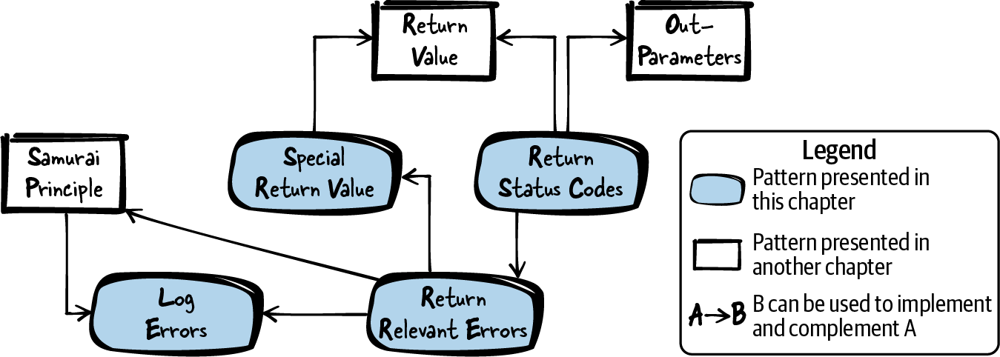

# 第 2 章  返回错误信息

上一章关注的是错误处理。本章延续这个话题，但把焦点转到：如何把你代码中检测到的错误告知使用者。

对于任何稍具规模的程序，程序员都得决定：如何应对自己代码里冒出的错误，如何应对第三方代码里冒出的错误，错误信息如何在代码中层层传递，以及最终如何呈现给用户。

大多数面向对象语言都自带异常这个好用的机制，为程序员提供了一条返回错误信息的额外通道，C 却没有原生提供这类机制。在 C 里模拟异常处理、甚至模拟异常之间的继承，办法是有的——比如 Axel-Tobias Schreiner 在《[*Object-Oriented Programming with ANSI-C*](https://oreil.ly/YK7x1)》（2011）一书中的做法。但对维护老式 C 代码的程序员、或想坚守原生 C 风格的程序员来说，引入这类异常机制并不是正路。他们需要的是一份指南：如何用好 C 原生自带的错误处理机制。

本章就是这样一份指南，讲错误信息如何在函数之间、跨越接口传递。[图 2-1](#fig_returning_errors) 给出了本章所有模式及其相互关系的总览，[表 2-1](#tab_returning_errors) 则是各模式的一句话摘要。



###### 图 2-1  返回错误信息模式总览

|  | 模式名 | 摘要 |
|----|----|----|
|  | 返回状态码（Return Status Codes） | 你需要一种向调用方返回状态信息的机制，让调用方能够据此做出反应；机制要简单易用，调用方还要能清楚区分各种可能出现的错误情形。因此，用函数的返回值（Return Value）承载状态信息，返回一个代表特定状态的值——被调方和调用方对这个值的含义必须有共识。 |
|  | 返回相关错误（Return Relevant Errors） | 一方面，调用方应能对错误做出反应；另一方面，返回的错误信息越多，你和你调用方的代码要处理的错误就越多，代码就越长——代码一长就难读、难维护，还容易引入新 bug。因此，只把对调用方有用的错误信息返回给它：调用方能据之采取行动的信息，才是有用的信息。 |
|  | 特殊返回值（Special Return Values） | 你想返回错误信息，但又不想显式地返回状态码——那样函数就很难再返回别的数据了。给函数加输出参数（Out-Parameters）也行，但会让调用变麻烦。因此，用函数返回值承载函数计算出的数据，另外保留一个或多个特殊值专用于表示出错。 |
|  | 记录错误日志（Log Errors） | 你希望出错时能轻松查明原因，但又不想因此把错误处理代码搞复杂。因此，把两类错误信息分走不同通道：对调用代码有用的错误信息正常返回；对开发者有用的错误信息（如调试细节）写进日志文件，不返回给调用方。 |

表 2-1  返回错误信息模式

# 运行示例

你要实现一个软件模块，提供"按键存储字符串值"的功能，键本身也由字符串标识——换句话说，类似于 Windows 注册表的功能。为简单起见，下面的代码不包含键之间的层级关系，也只讨论创建注册表元素的函数：

*注册表 API*

```
/* Handle for registry keys */
typedef struct Key* RegKey;

/* Create a new registry key identified via the provided 'key_name' */
RegKey createKey(char* key_name);

/* Store the provided 'value' to the provided 'key' */
void storeValue(RegKey key, char* value);

/* Make the key available for being read (by other
   functions that are not part of this code example) */
void publishKey(RegKey key);
```

*注册表实现*

```
#define STRING_SIZE 100
#define MAX_KEYS 40

struct Key
{
  char key_name[STRING_SIZE];
  char key_value[STRING_SIZE];
};

/* file-global array holding all registry keys */
static struct Key* key_list[MAX_KEYS];

RegKey createKey(char* key_name)
{
  RegKey newKey = calloc(1, sizeof(struct Key));
  strcpy(newKey->key_name, key_name);
  return newKey;
}

void storeValue(RegKey key, char* value)
{
  strcpy(key->key_value, value);
}

void publishKey(RegKey key)
{
  int i;
  for(i=0; i<MAX_KEYS; i++)
  {
    if(key_list[i] == NULL)
    {
      key_list[i] = key;
      return;
    }
  }
}
```

面对上面的代码，你还不清楚：出现内部错误、或函数输入参数非法时，该怎么给调用方提供错误信息。调用方也无从判断调用成功与否，只能写出这样的代码：

```
RegKey my_key = createKey("myKey");
storeValue(my_key, "A");
publishKey(my_key);
```

调用方代码短小好读，但它既不知道有没有出错，也无法对错误做出反应。为了让调用方拥有反应的能力，你要在代码中引入错误处理，并向调用方提供错误信息。你脑中冒出的第一个想法是：让调用方知道你的软件模块里冒出的所有错误。为此，你返回状态码（Return Status Codes）。

# 返回状态码

## 上下文

你在实现一个做了一定错误处理的软件模块，想把错误及其他状态信息返回给调用方。

## 问题

**你需要一种向调用方返回状态信息的机制，让调用方能够据此做出反应；机制要简单易用，调用方还要能清楚区分各种可能出现的错误情形。**

在 C 的远古时代，错误信息靠全局变量 `errno` 携带的错误码来传递：调用方先复位 `errno`，再调用函数，函数出错误时设置 `errno`，调用方调用之后再检查它。

相比 `errno`，你想要一种让调用方更容易检查错误的方式：调用方看一眼函数签名，就该知道状态信息怎么返回、可能返回哪些。

而且，返回状态信息的机制要在多线程环境下安全可用，返回的状态信息只能受被调函数的影响——换句话说，用了这个机制，函数仍然可以是可重入的。

## 方案

**用函数的返回值承载状态信息，返回一个代表特定状态的值——被调方和调用方对这个值的含义必须有共识。**

返回值通常是一个数字标识符。调用方拿函数返回值与标识符比对，即可做出相应处理。如果函数还必须返回其他结果，就以输出参数（Out-Parameters）的形式提供给调用方。

在 API 中用 `enum` 或 `#define` 定义这些数字状态标识符。如果状态码很多，或软件模块的头文件不止一个，可以单独建一个只放状态码的头文件，供其他头文件包含。

给状态标识符起有意义的名字，并用注释写明含义。状态码的命名方式要在整个 API 范围内保持一致。

下面的代码演示了状态码的用法：

*使用状态码的调用方代码*

```
ErrorCode status = func();
if(status == MAJOR_ERROR)
{
  /* abort program */
}
else if(status == MINOR_ERROR)
{
  /* handle error */
}
else if(status == OK)
{
  /* continue normal execution */
}
```

\
*提供状态码的被调方 API*

```
typedef enum
{
  MINOR_ERROR,
  MAJOR_ERROR,
  OK
}ErrorCode;

ErrorCode func();
```

\
*提供状态码的被调方实现*

```
ErrorCode func()
{
  if(minorErrorOccurs())
  {
    return MINOR_ERROR;
  }
  else if(majorErrorOccurs())
  {
    return MAJOR_ERROR;
  }
  else
  {
    return OK;
  }
}
```

## 后果

现在你有了这样一条返回状态信息的通道，调用方检查错误易如反掌。与 `errno` 相比，调用方不必在函数调用之外分步设置、检查错误信息，直接拿函数返回值比对即可。

返回状态码可以安全地用于多线程环境。调用方可以确信：返回的状态只受被调函数影响，没有任何旁路渠道。

函数签名清清楚楚地表明状态信息如何返回——这对调用方是明示，对编译器和静态代码分析工具同样是明示：它们可以检查调用方是否检查了函数返回值、是否覆盖了所有可能出现的状态。

函数如今在不同错误情形下返回不同结果，这些结果都得测试。与毫无错误处理的函数相比，测试工作量更大。调用方也背上了检查这些错误情形的担子，代码体积可能因此膨胀。

C 函数只能返回函数签名所规定类型的一个对象，而它现在被状态码占了。于是，返回其他函数结果就得动用更复杂的技术：要么用输出参数（代价是多出一个参数），要么返回一个同时装着状态信息和其他结果的聚合实例（Aggregate Instance）。

## 已知应用

下面是一些应用该模式的实例：

- Microsoft 用 `HRESULT` 返回状态信息。`HRESULT` 是全局唯一的状态码。状态码保持唯一的好处是：状态信息穿越许多函数之后，仍能查到它最初从哪来；代价则是状态编号的分配和管理——得记录谁有权使用哪些编号。`HRESULT` 的另一个特色是把诸如错误严重程度之类的信息，用专门的比特位编码进了状态码里。

- Apache Portable Runtime 的代码定义了 `apr_status_t` 类型来返回错误信息。凡以这种方式返回错误信息的函数，成功时返回 `APR_SUCCESS`，否则返回其他值表示出错。其他值都是通过 `#define` 定义的全局唯一错误码。

- OpenSSL 代码在多个头文件中定义状态码（*dsaerr.h*、*kdferr.h*……）。例如，状态码 `KDF_R_MISSING_PARAMETER` 或 `KDF_R_MISSING_SALT` 会向调用方详细说明输入参数缺失或有误。每个文件中的状态码只服务于该文件对应的那组函数，其取值在 OpenSSL 整个代码库内并不唯一。

- Portland Pattern Repository 描述了错误码（Error Code）模式，讲的正是通过函数返回值显式返回错误信息的思路。

## 应用于运行示例

现在，代码出错时你能给调用方提供信息了。下面的代码检查了各种可能出错的情形，并把信息返回给调用方：

*注册表 API*

```
/* Error codes returned by this registry */
typedef enum
{
  OK,
  OUT_OF_MEMORY,
  INVALID_KEY,
  INVALID_STRING,
  STRING_TOO_LONG,
  CANNOT_ADD_KEY
}RegError;

/* Handle for registry keys */
typedef struct Key* RegKey;

/* Create a new registry key identified via the provided 'key_name'.
   Returns OK if no problem occurs, INVALID_KEY if the 'key'
   parameter is NULL, INVALID_STRING if 'key_name' is NULL,
   STRING_TOO_LONG if 'key_name' is too long, or OUT_OF_MEMORY
   if no memory resources are available. */
RegError createKey(char* key_name, RegKey* key);

/* Store the provided 'value' to the provided 'key'.
   Returns OK if no problem occurs, INVALID_KEY if the 'key'
   parameter is NULL, INVALID_STRING if 'value' is NULL, or
   STRING_TOO_LONG if 'value' is too long. */
RegError storeValue(RegKey key, char* value);

/* Make the key available for being read. Returns OK if no
   problem occurs, INVALID_KEY if 'key' is NULL, or CANNOT_ADD_KEY
   if the registry is full and no more keys can be published. */
RegError publishKey(RegKey key);
```

\
*注册表实现*

```
#define STRING_SIZE 100
#define MAX_KEYS 40

struct Key
{
  char key_name[STRING_SIZE];
  char key_value[STRING_SIZE];
};

/* file-global array holding all registry keys */
static struct Key* key_list[MAX_KEYS];

RegError createKey(char* key_name, RegKey* key)
{
  if(key == NULL)
  {
    return INVALID_KEY;
  }

  if(key_name == NULL)
  {
    return INVALID_STRING;
  }

  if(STRING_SIZE <= strlen(key_name))
  {
    return STRING_TOO_LONG;
  }

  RegKey newKey = calloc(1, sizeof(struct Key));
  if(newKey == NULL)
  {
    return OUT_OF_MEMORY;
  }

  strcpy(newKey->key_name, key_name);
  *key = newKey;
  return OK;
}

RegError storeValue(RegKey key, char* value)
{
  if(key == NULL)
  {
    return INVALID_KEY;
  }

  if(value == NULL)
  {
    return INVALID_STRING;
  }

  if(STRING_SIZE <= strlen(value))
  {
    return STRING_TOO_LONG;
  }

  strcpy(key->key_value, value);
  return OK;
}

RegError publishKey(RegKey key)
{
  int i;
  if(key == NULL)
  {
    return INVALID_KEY;
  }

  for(i=0; i<MAX_KEYS; i++)
  {
    if(key_list[i] == NULL)
    {
      key_list[i] = key;
      return OK;
    }
  }

  return CANNOT_ADD_KEY;
}
```

现在调用方可以对错误信息做出反应了，比如把哪里出了问题详细告知应用的用户：

*调用方代码*

```
  RegError err;
  RegKey my_key;

  err = createKey("myKey", &my_key);
  if(err == INVALID_KEY || err == INVALID_STRING)
  {
    printf("Internal application error\n");
  }
  if(err == STRING_TOO_LONG)
  {
    printf("Provided registry key name too long\n");
  }
  if(err == OUT_OF_MEMORY)
  {
    printf("Insufficient resources to create key\n");
  }

  err = storeValue(my_key, "A");
  if(err == INVALID_KEY || err == INVALID_STRING)
  {
    printf("Internal application error\n");
  }
  if(err == STRING_TOO_LONG)
  {
    printf("Provided registry value to long to be stored to this key\n");
  }

  err = publishKey(my_key);
  if(err == INVALID_KEY)
  {
    printf("Internal application error\n");
  }
  if(err == CANNOT_ADD_KEY)
  {
    printf("Key cannot be published, because the registry is full\n");
  }
```

调用方现在能对错误做出反应了，但注册表软件模块和调用方的代码量都翻了一倍还多。把"错误码映射到错误文本"抽成单独的函数能让调用方代码稍微整洁一点，但大头仍然是错误处理。

可见错误处理不是白来的：实现它花了不少功夫，注册表 API 也看得出来——函数的注释长了一截，因为必须说明可能出现哪些错误情形；调用方也得费心琢磨：某个错误真出现了，该怎么办。

把这么细的错误信息一股脑给调用方，等于把"应对这些错误"以及"分辨哪些错误值得处理、哪些无关紧要"的担子都压给了它。所以要格外小心：一头要把必要的错误信息交给调用方，另一头别拿无用的信息把调用方淹没。

接下来你要在代码里落实这些考量，只提供对调用方真正有用的错误信息。于是，你只返回相关错误（Return Relevant Errors）。

# 返回相关错误

## 上下文

你在实现一个做了一定错误处理的软件模块，想把错误信息返回给调用方。

## 问题

**一方面，调用方应能对错误做出反应；另一方面，返回的错误信息越多，你和你调用方的代码要处理的错误就越多，代码就越长——代码一长就难读、难维护，还容易引入新 bug。**

向调用方返回错误信息，可不止"检测到错误、返回信息"这两件事：你还必须在 API 文档中写明会返回哪些错误，否则调用方无从知道该预期、该处理哪些错误。记录错误行为是一份实打实的工作，错误种类越多，文档工作量越大。

返回非常详细的、与实现绑定的错误信息，还意味着：实现一旦变更、错误信息一加，你那个记载着错误返回行为的接口在语义上就得跟着变。这种变化对现有调用方未必友好——他们得改代码来应对新增的错误信息。

错误信息太细，对调用方也未必是好事。每一条返回给调用方的错误信息都意味着额外的工作：调用方得判断这条信息相干不相干、又该怎么处理。

## 方案

**只把对调用方有用的错误信息返回给它：调用方能据之采取行动的信息，才是有用的信息。**

如果调用方对某条错误信息无从反应，那把"反应的机会"（或者说负担）交给它就是多余的。

只返回相关错误有好几种做法。一个极端是干脆不返回任何错误信息。比如有个函数 `cleanupMemory(void* handle)` 专门清理内存，清理成没成功就不必返回信息——调用方在代码层面对清理失败无能为力（多数情况下，重试一遍清理函数也不是办法），干脆让它什么都不返回。为确保函数内部的错误不被埋没，甚至可以遇错终止程序（武士道原则）。

再想象一下：你返回错误给调用方的唯一理由，是让调用方把它记进日志。这种情况下就别麻烦调用方了，自己动手记录错误日志（Log Errors）。

如果你已经在返回状态码，那么只应返回对调用方相关的部分；其余错误可以归并成一个内部错误码。同理，你调用的那些函数返回的细粒度错误码，也没必要一一透传，可以归并为一个内部错误码，如下面的代码所示：

*调用方代码*

```
ErrorCode status = func();
if(status == MAJOR_ERROR || status == UNKNOWN_ERROR)
{
  /* abort program */
}
else if(status == MINOR_ERROR)
{
  /* handle error */
}
else if(status == OK)
{
  /* continue normal execution*/
}
```

\
*API*

```
typedef enum
{
  MINOR_ERROR,
  MAJOR_ERROR,
  UNKNOWN_ERROR,
  OK
}ErrorCode;

ErrorCode func();
```

\
*实现*

```
ErrorCode func()
{
  if(minorErrorOccurs())
  {
    return MINOR_ERROR;
  }
  else if(majorErrorOccurs())
  {
    return MAJOR_ERROR;
  }
  else if(internalError1Occurs() || internalError2Occurs())
  {
    return UNKNOWN_ERROR; 
  }
  else
  {
    return OK;
  }
}
```

[](#co_returning_error_information_CO1-1)  
`internalError1Occurs` 或 `internalError2Occurs` 出错时返回同样的错误信息——因为具体是哪个实现层面的错误，对调用方无关紧要：两个错误的应对方式一模一样（上例中的应对就是终止程序）。

如果调试时需要更细的错误信息，可以记录错误日志。而如果你发现只返回相关错误之后，剩下的错误情形已经不多了，那与其用错误码，不如改用特殊返回值（Special Return Values）来传递错误信息，可能更漂亮。

## 后果

不再返回"具体是哪种内部错误"的细节，调用方如释重负：它不必再为所有可能的内部错误琢磨对策；而且由于返回的错误个个相关，调用方更可能认真处理每一个返回的错误。测试人员也可以偷着乐——函数返回的错误信息少了，要测试的错误情形也就少了。

如果调用方用的是很严格的编译器或静态代码分析工具（会核查调用方是否处理了所有可能的返回值），现在调用方也不必为不相干的错误专门写处理分支（比如一长串 fallthrough 的 switch 语句、再给所有内部错误配一段集中处理），只需处理一个内部错误码；如果你干脆遇错终止程序，调用方一个错误都不用处理。

不返回详细的错误信息，也意味着调用方无法把这些信息展示给用户、或存下来供开发者调试。不过调试这件事，更好的做法是在错误发生的软件模块内部就地记录日志，而不是劳烦调用方。

你若不返回函数内部错误的全部信息、只返回你自认为相关的部分，就有判断失手的可能：也许漏掉了调用方真正需要的信息，进而招来"补上这条信息"的变更请求。好在只要你用的是返回状态码，新增错误码很容易，函数签名不用动。

## 已知应用

下面是一些应用该模式的实例：

- 安全敏感的代码很常见"只返回相关信息"的做法。比如，一个用户认证函数若返回"认证失败是因为用户名还是密码不对"的详细信息，调用方就能拿它挨个试探哪些用户名已被占用。为了不给这种侧信道留口子，通常只返回认证成功与否的二值信息。例如，B&R Automation Runtime 操作系统中用于用户认证的函数 `rbacAuthenticateUserPassword` 返回类型是 `bool`：认证成功返回 `true`，失败返回 `false`，至于为什么失败，一概不返回。

- NetHack 游戏的 `FlushWinFile` 函数把文件刷到磁盘，它调用 Macintosh 的 `FSWrite` 函数——后者会返回错误码。但 NetHack 这层包装明确忽略该错误码，`FlushWinFile` 的返回类型是 `void`，因为使用它的代码即使出了错也无力应对，于是错误信息就没有向下传递。

- OpenSSL 的 `EVP_CIPHER_do_all` 函数用内部函数 `OPENSSL_init_crypto` 初始化密码套件，后者返回状态码。但 `EVP_CIPHER_do_all` 的返回类型是 `void`，这些细粒度错误信息被它弃之不顾——包装函数把"返回详细错误"的策略改成了"只返回相关错误"，而在这个场景里，相关错误为空集。

## 应用于运行示例

只返回相关错误之后，你的注册表代码如下。为简单起见，这里只展示 `createKey` 函数：

*函数 `createKey` 的实现*

```
RegError createKey(char* key_name, RegKey* key)
{
  if(key == NULL || key_name == NULL)
  {
    return INVALID_PARAMETER; 
  }

  if(STRING_SIZE <= strlen(key_name))
  {
    return STRING_TOO_LONG;
  }

  RegKey newKey = calloc(1, sizeof(struct Key));
  if(newKey == NULL)
  {
    return OUT_OF_MEMORY;
  }

  strcpy(newKey->key_name, key_name);
  *key = newKey;
  return OK;
}
```

[](#co_returning_error_information_CO2-1)  
原先返回 `INVALID_KEY` 或 `INVALID_STRING` 的情形，现在统一返回 `INVALID_PARAMETER`。

调用方再也无法区别对待不同的非法参数——反过来说，它也不必再琢磨怎么分别应对这些错误了。要处理的错误情形少了一种，调用方代码更简单了。

这是好事：函数返回 `INVALID_KEY` 或 `INVALID_STRING` 时，调用方又能做什么呢？重试一次毫无意义。两种情形下调用方都只能接受"调用没成"这个事实，向用户报告或者终止程序。既然调用方本来就没有理由区别对待这两个错误，你就替它卸掉了琢磨两种错误情形的担子——现在只需考虑一种，然后照办。

为了让事情更省心，你接下来祭出武士道原则（Samurai Principle）：不再返回所有这些错误码，其中一些错误直接终止程序了事：

*函数 `createKey` 的声明*

```
/* Create a new registry key identified via the provided 'key_name'
   (must not be NULL, max. STRING_SIZE characters). Stores a handle
   to the key in the provided 'key' parameter (must not be NULL).
   Returns OK on success, or OUT_OF_MEMORY in case of insufficient memory. */
RegError createKey(char* key_name, RegKey* key);
```

\
*函数 `createKey` 的实现*

```
RegError createKey(char* key_name, RegKey* key)
{
  assert(key != NULL && key_name != NULL); 
  assert(STRING_SIZE > strlen(key_name)); 

  RegKey newKey = calloc(1, sizeof(struct Key));
  if(newKey == NULL)
  {
    return OUT_OF_MEMORY;
  }

  strcpy(newKey->key_name, key_name);
  *key = newKey;
  return OK;
}
```

[](#co_returning_error_information_CO3-1)  
原先返回 `INVALID_PARAMETER` 或 `STRING_TOO_LONG` 的情形，现在只要参数不符合预期就直接终止程序。

字符串过长就终止，乍看有点激烈。但和 `NULL` 指针一样，过长的字符串就是函数的非法输入。如果你的注册表的字符串输入并非来自用户 GUI，而是来自调用方代码中的固定值，那么"字符串过长"只会在编程错误时发生，此时终止程序完全正当。

接着你发现：`createKey` 函数只剩两种返回——`OUT_OF_MEMORY` 和 `OK`。这种程度的错误信息，用特殊返回值（Special Return Values）来传达，代码可以漂亮得多。

# 特殊返回值

## 上下文

你有一个计算某种结果的函数，想在函数执行出错时向调用方提供错误信息。你只想返回相关错误（Return Relevant Errors）。

## 问题

**你想返回错误信息，但又不想显式地返回状态码——那样函数就很难再返回别的数据了。给函数加输出参数（Out-Parameters）也行，但会让调用变麻烦。**

完全不返回错误信息也不是办法：你想给调用方一点错误信息，让它能做出反应。你要提供的信息并不多，也许只是"调用成功与否"这一个比特。为这点信息返回状态码，未免杀鸡用牛刀。

你又不能祭出武士道原则终止程序，因为函数里发生的错误没那么严重；或者说，你想让调用方来决定怎么处理——它有能力优雅地处理这些错误。

## 方案

**用函数返回值承载函数计算出的数据，另外保留一个或多个特殊值专用于表示出错。**

比如函数返回指针时，可以保留 `NULL` 指针作为表示错误的特殊值。`NULL` 指针按定义就是非法指针，绝不会与函数算出的任何有效指针混淆。下面的代码演示了使用指针时如何返回错误信息：

*被调方实现*

```
void* func()
{
  if(somethingGoesWrong())
  {
    return NULL;
  }
  else
  {
    return some_pointer;
  }
}
```

\
*调用方代码*

```
pointer = func();
if(pointer != NULL)
{
  /* operate on the pointer */
}
else
{
  /* handle error */
}
```

务必在 API 文档中写明各个特殊返回值的含义。有些情形下，业界惯例会约定哪些特殊值表示错误（比如常用负整数表示错误），但即便如此，具体取值的含义仍要写进文档。

还要确保表示错误的特殊值在"没出错"时绝不可能出现。比如函数返回摄氏温度的整数值，沿用 UNIX"负值即错误"的惯例就不妥了；更好的做法是用 –300 之类的值表示错误，因为温度低于 –273 摄氏度在物理上不可能。

## 后果

返回值虽然被计算结果占用，函数现在照样能通过它返回错误信息，也不必为了错误信息额外引入输出参数。

有时可用的特殊值并不多。比如指针类型，表示错误的特殊值只有 `NULL` 一个。于是你只能告诉调用方"一切正常"还是"出事了"，无法返回更细的错误信息。这固然是短板，但也断了你返回不必要错误的念想——很多情形下，"出事了"这一个比特就够了，更细的信息调用方也无从反应。

日后若发现必须提供更细的错误信息，可能已经无路可走：特殊值用光了，只能改函数签名、改用返回状态码。而改签名未必可行——API 得对现有调用方保持兼容。如果你预见到这种变化，一开始就该用返回状态码，别用特殊返回值。

有些程序员想当然地认为"哪些返回值表示错误"是显而易见的：有人觉得 `NULL` 指针表示错误天经地义，有人觉得 –1 表示错误不言自明。于是大家都默认对方也这么想——可这些都只是臆断。无论何时，API 文档都应写明哪些值表示错误；但总有人忘了写，错以为这事根本不言自明。

## 已知应用

下面是一些应用该模式的实例：

- NetHack 游戏的 `getobj` 函数：不出错时返回指向某对象的指针，出错时返回 `NULL`。为了表达"没有对象可返回"这一特殊情形，函数返回指向全局对象 `zeroobj` 的指针——它是函数返回类型的一个对象，调用方也认识它。调用方拿返回的指针与指向该全局对象的指针一比，就能区分"指向任意有效对象的指针"和"具有特殊含义的 zeroobj 指针"。

- C 标准库函数 `getchar` 从 `stdin` 读一个字符。函数返回类型是 `int`，能承载的信息远多于单个字符。没有更多字符可读时，函数返回 `EOF`（通常定义为 −1）。由于字符不可能取负整数值，`EOF` 与正常结果泾渭分明，正好用来表示"没有更多字符"这一特殊情形。

- 大多数 UNIX/POSIX 函数用负数表示错误。例如 POSIX 函数 `write` 返回写入的字节数，出错时返回 −1。

## 应用于运行示例

用上特殊返回值之后，你的代码如下。为简单起见，只展示 `createKey` 函数：

*函数 `createKey` 的声明*

```
/* Create a new registry key identified via the provided 'key_name'
   (must not be NULL, max. STRING_SIZE characters).
   Returns a handle to the key or NULL on error. */
RegKey createKey(char* key_name);
```

\
*函数 `createKey` 的实现*

```
RegKey createKey(char* key_name)
{
  assert(key_name != NULL);
  assert(STRING_SIZE > strlen(key_name));

  RegKey newKey = calloc(1, sizeof(struct Key));
  if(newKey == NULL)
  {
    return NULL;
  }

  strcpy(newKey->key_name, key_name);
  return newKey;
}
```

`createKey` 函数清爽多了。它不再返回状态码，而是直接返回句柄，连输出参数都省了。函数的 API 文档也跟着变简单：不必解释那个额外的参数，也不必长篇大论函数结果如何返回给调用方。

调用方这边也轻松了：不必再准备一个句柄当输出参数，直接从返回值拿到句柄，代码好读也好维护。

但问题来了：与返回状态码时能给出的细粒度信息相比，现在函数透出的错误信息只剩"成没成"。错误的内部细节被丢掉了，日后想要（比如当调试信息用）也无处可寻。要解决这个问题，可以记录错误日志（Log Errors）。

# 记录错误日志

## 上下文

你有一个正在处理错误的函数。你只想向调用方返回相关错误供其在代码中应对，同时又想保留详细的错误信息备日后调试。

## 问题

**你希望出错时能轻松查明原因，但又不想因此把错误处理代码搞复杂。**

一种办法是把非常详细的错误信息——比如标识编程错误的信息——直接返回给调用方：返回状态码给调用方，调用方再把详细错误码展示给用户；用户（比如打服务热线）找上门来问这错误码什么意思、怎么解决；于是你有了详细错误信息可调试，顺藤摸瓜查出问题。

可这条路子有个大毛病：调用方对这些错误信息根本不关心，却只为了转交给你而不得不呈给用户；而用户其实也不关心这些细节。

此外，返回状态码还意味着返回值被错误信息占用、真正的函数结果得靠额外的输出参数传出。有时可以改用特殊返回值传递错误信息，但并非总能如此。你不想为了错误信息给函数平添参数——那会让调用方的代码变复杂。

## 方案

**把两类错误信息分走不同通道：对调用代码有用的错误信息正常返回；对开发者有用的错误信息（如调试细节）写进日志文件，不返回给调用方。**

出错之后，程序的使用者得把记录下来的调试信息提供给你，你才能轻松查明原因——比如用户通过电子邮件把日志文件发给你。

另一种做法是：在调用方与你的接口处既记录日志，又向调用方返回相关错误。比如告知调用方"发生了某种内部错误"，但具体何种错误并不示出。这样调用方照样能在代码里应对，无需懂得如何处理细粒度错误，你也不丢宝贵的调试信息。

为了不丢宝贵的调试信息，编程错误和意外错误都应该记录在案。这类错误值得存下严重程度和发生位置——比如源码文件名和行号，或者调用栈回溯。C 语言自带几个特殊宏，可以拿到当前行号（`__LINE__`）、当前函数（`__func__`）和当前文件（`__FILE__`）。下面的代码用 `__func__` 宏做日志：

```
void someFunction()
{
  if(something_goes_wrong)
  {
     logInFile("something went wrong", ERROR_CODE, __func__);
  }
}
```

想要更细的日志，甚至可以追踪函数调用、记录它们的返回信息。有了这些日志，还原错误情形会容易很多；当然，这种日志也带来计算开销。追踪函数调用返回值可以用下面的代码：

```
#define RETURN(x)          \
do {                       \
  logInFile(__func__, x);  \
  return x;                \
} while (0)

int soneFunction()
{
  RETURN(-1);
}
```

日志信息可以像前面的代码那样存进文件。届时你还得应付各种特殊情况：内存不够存文件、写文件写到一半程序崩溃……处理这些情况并不轻松，但日志机制必须写得健壮，因为你日后调试全指望这些日志文件——文件里的数据不对，排查编码错误时就会被引入歧途。

##### 多行宏

用 `do/while` 循环把宏里的语句包起来，可以避免下面代码中的问题：

```
#define MACRO(x) \
x=1;             \
x=2;             \

if(x==0)
  MACRO(x)
```

这段代码的 `if` 体没有加大括号，读代码时你可能以为宏里的东西只在 `x==0` 时执行。但宏展开后，实际得到的是：

```
if(x==0)
  x=1;
x=2;
```

最后一行并不在 `if` 语句体里，这并非本意。为避免这类问题，最佳实践是把宏里的语句用 `do/while` 循环包起来。

## 后果

你不必劳烦调用方处理、传递，就能拿到调试信息。调用方的日子好过多了：详细的错误信息由你自己提供，它不用经手。

有时你只是想把某个错误或情形记下来，而它对调用方完全无关紧要——那就连错误信息都不必返回。比如遇错即终止程序时，调用方根本无需应对错误；只要记录了错误日志，宝贵的调试信息一条不丢。函数也不必为返回错误信息增加任何参数，调用更省事，调用方的代码也更干净。

这些宝贵的错误信息不会丢失，日后照样可以用来排查编程错误——你只是让它们走了另一条通道（比如日志文件）。不过，怎么把日志文件拿到手得想清楚：可以请用户发电子邮件给你，更进一步可以实现自动 bug 上报机制。但两条路都不能百分之百保证日志真能回到你手上——用户若不愿意，总有办法拦下。

## 已知应用

下面是一些应用该模式的实例：

- Apache Web 服务器代码使用 `ap_log_error` 函数，把与请求或连接相关的错误写入错误日志。每条日志记录包含错误发生的文件名和代码行号，以及调用方传给函数的自定义字符串。日志信息存放在服务器的 `error_log` 文件中。

- B&R Automation Runtime 操作系统有一套日志系统，程序员在代码任何位置调用 `eventLogWrite` 函数即可向用户提供日志信息。这样就不必把信息沿整个调用栈一路向上传到某个集中的日志组件。

- Adam Tornhill《Patterns in C》（Leanpub，2014）中的断言上下文（Assertion Context）模式建议：遇错终止程序，同时在 `assert` 调用里加一个字符串语句，把崩溃原因或位置记录下来。断言失败时，包含该 `assert` 语句的那行代码会被打印出来，附加的字符串也随之现身。

## 应用于运行示例

各个模式应用完毕，你的注册表软件模块最终代码如下。它向调用方提供相关的错误信息，但不需要调用方处理任何内部错误情形：

*注册表 API*

```
/* max. size of string parameters (including NULL-termination) */
#define STRING_SIZE 100

/* Error codes returned by this registry */
typedef enum
{
  OK,
  CANNOT_ADD_KEY
}RegError;

/* Handle for registry keys */
typedef struct Key* RegKey;

/* Create a new registry key identified via the provided 'key_name'
   (must not be NULL, max. STRING_SIZE characters).  Returns a handle
   to the key or NULL on error. */
RegKey createKey(char* key_name);

/* Store the provided 'value' (must not be NULL, max. STRING_SIZE characters)
   to the 'key' (MUST NOT BE NULL) */
void storeValue(RegKey key, char* value);

/* Make the 'key' (must not be NULL) available for being read.
   Returns OK if no problem occurs or CANNOT_ADD_KEY if the
   registry is full and no more keys can be published. */
RegError publishKey(RegKey key);
```

*注册表实现*

```
#define MAX_KEYS 40

struct Key
{
  char key_name[STRING_SIZE];
  char key_value[STRING_SIZE];
};

/* macro to log debug info and to assert */
#define logAssert(X)                        \
if(!(X))                                    \
{                                           \
  printf("Error at line %i", __LINE__);     \
  assert(false);                            \
}

/* file-global array holding all registry keys */
static struct Key* key_list[MAX_KEYS];

RegKey createKey(char* key_name)
{
  logAssert(key_name != NULL)
  logAssert(STRING_SIZE > strlen(key_name))

  RegKey newKey = calloc(1, sizeof(struct Key));
  if(newKey == NULL)
  {
    return NULL;
  }

  strcpy(newKey->key_name, key_name);
  return newKey;
}

void storeValue(RegKey key, char* value)
{
  logAssert(key != NULL && value != NULL)
  logAssert(STRING_SIZE > strlen(value))

  strcpy(key->key_value, value);
}

RegError publishKey(RegKey key)
{
  logAssert(key != NULL)

  int i;
  for(i=0; i<MAX_KEYS; i++)
  {
    if(key_list[i] == NULL)
    {
      key_list[i] = key;
      return OK;
    }
  }

  return CANNOT_ADD_KEY;
}
```

与运行示例中先前的代码相比，这版代码更短，原因如下：

- 代码不再检查编程错误，而是遇编程错误直接终止程序。`NULL` 指针之类的非法参数不做优雅处理，而是在 API 文档中声明句柄不得为 `NULL`。

- 代码只返回对调用方相关的错误。例如 `createKey` 函数不返回状态码，而是出错时直接返回句柄和 `NULL`——调用方不需要更细的错误信息。

代码虽然短了，API 注释却变长了：注释如今更明确地规定了函数遇错时的行为。除了你的代码，调用方的代码也变简单了——用不着再为"各种错误信息分别怎么应对"做一堆决定：

*调用方代码*

```
RegKey my_key = createKey("myKey");
if(my_key == NULL)
{
  printf("Cannot create key\n");
}

storeValue(my_key, "A");

RegError err = publishKey(my_key);
if(err == CANNOT_ADD_KEY)
{
  printf("Key cannot be published, because the registry is full\n");
}
```

与运行示例中先前的代码相比，这段代码更短，原因如下：

- 遇错即终止的函数，返回值不必检查。

- 无需细粒度错误信息的函数直接返回所要的东西。例如 `createKey()` 现在返回句柄，调用方不必再准备输出参数。

- 标识编程错误的错误码（例如传入参数非法）不再返回，调用方自然也不必检查。

运行示例的最终代码说明：哪些错误该在代码中处理、怎么处理，值得认真思考。把所有错误一股脑返回、逼着调用方全部应付，未必是最好的方案——调用方可能根本不关心细粒度错误信息，也可能不想在应用层面对错误做出反应；也许错误足够严重，在发生之处就可以拍板终止程序。这些措施能让代码更简单，设计软件组件的 API 时都必须考虑在内。

# 小结

本章讲解了错误如何在软件的不同函数、不同部分之间传递。返回状态码（Return Status Codes）把代表错误的数字码交给调用方；返回相关错误（Return Relevant Errors）只把调用方能在代码中应对的错误返回给它，特殊返回值（Special Return Values）是实现后者的一种方式；记录错误日志（Log Errors）则提供了另一条通道，承载那些不是给调用方、而是给用户或调试用的错误信息。

这些模式为你的错误处理工具箱添了新家什，在你实现较大块代码时，它们能指引你的第一步。

# 延伸阅读

如果你想更进一步，下面这些资料可以帮你深化"返回错误信息"方面的功力。

- Thomas Aglassinger 的硕士论文《Error Handling in Structured and Object-Oriented Programming Languages》（University of Oulu，1999）全面综述了错误处理，并描述了错误处理的最佳实践，附有包括 C 在内多种语言的代码示例。

- [Portland Pattern Repository](https://oreil.ly/bs9FX) 收录了大量模式和相关讨论，话题涵盖错误处理及其他领域。其中大多数错误处理模式面向异常处理，但也有若干 C 惯用法。

- [Andy Longshaw 和 Eoin Woods](https://oreil.ly/7Yj8h) 在《Patterns for the Generation, Handling and Management of Errors》和《More Patterns for the Generation, Handling and Management of Errors》两篇文章中给出了一组错误日志与错误处理模式，侧重基于异常的错误处理。

# 展望

下一章讲解如何驾驭动态内存。要在函数之间返回更复杂的数据、要在整个应用中管理更庞大的数据及其生命周期，都绕不开动态内存——你需要建议，而这正是下一章要给的。
