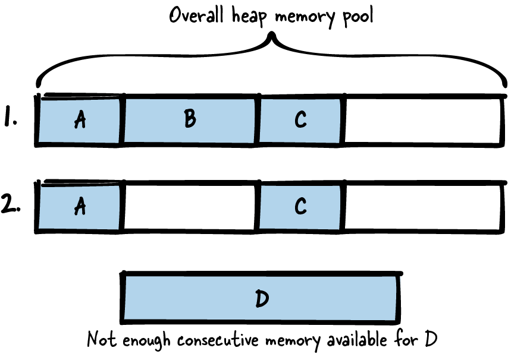

# 第 3 章  内存管理

每个程序都会在内存中存一些值，留待程序稍后使用。这个需求太普遍了，以至于现代编程语言都想方设法让它变得简单。C++ 及其他面向对象语言提供构造函数和析构函数，让内存的分配和清理有了确定的地点和时机；Java 更是自带垃圾回收器，程序不再使用的内存会被自动回收、重新可用。

相比之下，C 的特别之处在于：内存要程序员手动管理。把变量放栈上、放堆上、还是放静态内存，得程序员自己定；堆上的变量事后也得程序员自己清理。C 没有析构函数，也没有原生垃圾回收器来代劳这些活计。

关于这些任务该怎么做，相关指引散落在互联网各处，于是诸如"这个变量该放栈上还是堆上？"这样的问题都变得不好回答。为了回答这个问题以及其他问题，本章给出一组处理 C 程序内存的模式：什么时候用栈、什么时候用堆、堆内存何时清理、怎么清理。为了让模式的核心思想更容易领会，全章用一个贯穿始终的代码示例来演示这些模式的应用。

[图 3-1](#fig_memory) 给出了本章所有模式及其相互关系的总览，[表 3-1](#tab_memory) 则是各模式的一句话摘要。


###### 图 3-1  内存管理模式总览

|  | 模式名 | 摘要 |
|----|----|----|
|  | 栈优先（Stack First） | 为变量选择存储类别和内存区域（栈、堆……）是每个程序员都要反复做的决定。如果每个变量都得把所有备选方案的利弊细细掂量一遍，迟早会把人耗干。因此，默认把变量放栈上，坐享栈变量自动清理的好处。 |
|  | 永久内存（Eternal Memory） | 持有大量数据并在函数调用之间传递它并不容易：你得保证数据的内存足够大、生命周期跨越所有函数调用。因此，把数据放进程序整个生命周期内都可用的内存里。 |
|  | 惰性清理（Lazy Cleanup） | 需要大块内存、或事先不知道所需大小时，动态内存不可或缺。但动态内存的清理是个苦差事，也是许多编程错误的源头。因此，分配动态内存，然后把释放工作留给操作系统，等程序结束时统一收拾。 |
|  | 专属所有权（Dedicated Ownership） | 使用动态内存的强大能力，伴随着把它妥善清理的重大责任。在大型程序中，要确保所有动态内存都被妥善清理并不容易。因此，就在实现内存分配的那一刻，明确并记录：这块内存将在哪里清理、由谁清理。 |
|  | 分配包装器（Allocation Wrapper） | 每次动态内存分配都可能失败，所以你应当在代码中检查分配结果并做出反应。但这样的检查点遍布代码，不胜其烦。因此，把分配和释放调用包装起来，在包装函数里统一实现错误处理或额外的内存管理组织。 |
|  | 指针检查（Pointer Check） | 访问非法指针的编程错误会导致程序行为失控，且极难调试。而 C 代码到处都是指针，这类错误几乎难以避免。因此，显式地把未初始化或已释放的指针置为无效，并在访问指针前始终检查其有效性。 |
|  | 内存池（Memory Pool） | 频繁从堆上分配、释放对象会导致内存碎片化。因此，在程序整个生命周期内持有一大块内存；运行时从这个内存池中取固定大小的块，而不是直接从堆上分配新内存。 |

表 3-1  内存管理模式

# 数据存储与动态内存的问题

在 C 里，数据可以放在好几个地方：

- 可以放栈上。栈是为每个线程预留的固定大小内存（创建线程时分配）。线程中调用函数时，栈顶会为该函数的参数和自动变量保留一块；函数调用结束后，这块内存自动清理。要把数据放栈上，只要在使用它们的函数里声明变量即可。这些变量在作用域结束（函数块结束）之前都可以访问：

  ``` less-space-2
  void main()
  {
    int my_data;
  }
  ```

- 可以放静态内存。静态内存是一块固定大小的内存，其分配逻辑在编译期就已固定。要用静态内存，只需在变量声明前加上 `static` 关键字。这类变量在程序整个生命周期内可用。全局变量亦然——即使不加 `static`：

  ``` less-space-2
  int my_global_data;
  static int my_fileglobal_data;
  void main()
  {
    static int my_local_data;
  }
  ```

- 如果数据大小固定且不可变，可以直接存进存放代码的那块静态内存。固定字符串常这么存。这类数据在程序整个生命周期内可用（尽管下面例子中指向数据的指针会出了作用域）：

  ``` less-space-2
  void main()
  {
    char* my_string = "Hello World";
  }
  ```

- 可以在堆上分配动态内存来存数据。堆是系统上所有进程共用的全局内存池，何时从中分配、释放，全由程序员说了算：

  ``` less-space-2
  void main()
  {
    void* my_data = malloc(1000);
    /* work with the allocated 1000 byte memory */
    free(my_data);
  }
  ```

分配动态内存正是各种麻烦的起点，如何应对随之而来的问题正是本章的主题。在 C 程序中使用动态内存，会带来一连串必须解决、或至少必须考虑的问题。下面列出其中的主要者：

- 分配了的内存，早晚得释放。只要有一块没释放，你就会占用超出所需的内存，造成所谓的内存泄漏。泄漏频发、应用又长时间运行的话，最终内存会消耗殆尽。

- 重复释放同一块内存也是问题，可能导致未定义的程序行为——这非常糟糕。最坏的情况是：出错的那行代码本身安然无恙，程序却在日后某个随机的时刻崩溃。这类错误调试起来苦不堪言。

- 访问已释放的内存同样是问题。释放了一块内存，之后一不小心又解引用了指向它的指针（即所谓悬垂指针），由此引发的错误同样难缠。最好的结局是程序直接崩溃；最坏的结局是程序不崩，而那块内存早已易主。与这种内存使用相关的错误是安全隐患，可能在程序执行后期以某种晦涩难懂的面目现身。

- 你还得操心已分配数据的生命周期与所有权：谁、在什么时候、清理哪些数据。这在 C 里尤其棘手。C++ 可以在构造函数里为对象分配数据、在析构函数里释放；配合 C++ 的*智能指针*，对象出作用域时甚至能自动清理。C 做不到——没有析构函数，指针出作用域时没人通知我们该清理内存了。

- 与栈内存、静态内存相比，使用堆内存更耗时。堆内存的分配必须防备竞争条件，因为其他进程也在用同一个内存池，这让分配变慢。访问堆内存也更慢：相比之下栈内存访问更频繁，更可能已经待在缓存或 CPU 寄存器里。

- 堆内存的一个大麻烦是碎片化，如图 3-2 所示。假设你先后分配了内存块 A、B、C，随后释放了 B，此时空闲的堆内存就不再连续。想再分配一个大块 D，虽然内存总量足够，却不连续——`malloc` 调用会失败。对长期运行的内存受限系统（如嵌入式实时系统）而言，碎片化是大患。



###### 图 3-2  内存碎片化

这些问题不好对付。接下来各节的模式会一点一点地告诉你：要么避开动态分配，要么与它共处得体面一些。

# 运行示例

你要实现一个简单的程序，用凯撒密码加密一段文字。凯撒密码把每个字母替换为字母表中往后数固定位置的另一个字母。比如固定位置是 3，字母 A 就会被替换成 D。你先来实现执行凯撒加密的函数：

```
/* Performs a Caesar encryption with the fixed key 3.
   The parameter 'text' must contain a text with only capital letters.
   The parameter 'length' must contain the length of the text excluding
   NULL termination. */
void caesar(char* text, int length)
{
  for(int i=0; i<length; i++)
  {
    text[i] = text[i]+3; 
    if(text[i] > 'Z')
    {
      text[i] = text[i] - 'Z' + 'A' - 1; 
    }
  }
}
```

[](#co_memory_management_CO1-1)  
C 中的字符以数值形式存储，给字符加一个数值就能把它沿字母表往后移。

[](#co_memory_management_CO1-2)  
如果移过了字母 *Z*，就从字母表开头重新数起。

现在你想验证函数是否好使，得喂给它一段文本。函数接收的是指向字符串的指针，那么字符串该存在哪里？动态分配，还是用栈上的内存？你意识到最简单的方案是栈优先（Stack First）。

# 栈优先

## 上下文

你要存储一些数据，并在程序稍后访问。数据大小事先知道上限，而且不算大（区区几个字节）。

## 问题

**为变量选择存储类别和内存区域（栈、堆……）是每个程序员都要反复做的决定。如果每个变量都得把所有备选方案的利弊细细掂量一遍，迟早会把人耗干。**

在 C 程序里存数据，选择多得眼花缭乱，最常见的是栈、静态内存和动态内存。各有利弊，而变量放哪里又事关重大：它决定变量的生命周期，决定变量是自动清理、还是需要你手动收拾。

这个决定还影响程序员要付出的功夫和自律。你当然想让日子尽量好过：对数据存储没有特殊要求时，就该选那种分配、释放最省事、潜在编程错误最少的内存。

## 方案

**默认把变量放栈上，坐享栈变量自动清理的好处。**

代码块内声明的所有变量默认都是所谓的*自动变量*：放在栈上，代码块一结束（变量出作用域）就自动清理。在变量前加 `auto` 存储类别说明符可以显式声明这一点，但很少有人这么干——反正它就是默认值。

栈上的内存可以传给其他函数使用（比如调用方拥有的缓冲区，Caller-Owned Buffer），但千万别返回这种变量的地址。函数一结束变量就出作用域、被自动清理，返回它的地址只会得到悬垂指针；解引用它，轻则未定义行为，重则程序崩溃。

下面的代码是一个很简单的栈变量示例：

```
void someCode()
{
  /* This variable is an automatic variable that is put on the stack and
     that will run out of scope at the end of the function */
  int my_variable;

  {
    /* This variable is an automatic variable that is put on the stack and
       that will run out of scope right after this code block, which is
       after the first '}' */
    int my_array[10];
  }
}
```

# 变长数组

上面代码中的数组大小固定。把编译期已知大小的固定数据放栈上是最常见的做法，但栈变量的大小也可以在运行期决定：要么用 `alloca()` 之类的函数（它不属于 C 标准，分配太多会导致栈溢出），要么用变长数组（大小由变量指定的普通数组，C99 标准引入）。

## 后果

数据放栈上，访问起来轻松：与动态分配的内存相比，根本不必跟指针打交道，悬垂指针类的编程错误风险就此消除。也不存在堆碎片化，内存清理更省心：变量是自动变量，到点自动清理，无需手动 free，内存泄漏、重复释放的风险一并消失。总之，把变量放上栈，绝大多数与错误用内存相关的疑难 bug 都可以消于无形。

与动态内存相比，栈上数据的分配和访问都快得多。分配不必穿过管理空闲内存的复杂数据结构，也不必与其他线程互斥——每个线程都有自己的栈。栈数据访问通常也快：这块内存用得勤，多半早就待在缓存里了。

不过栈的短板是容量有限。与堆内存相比，栈非常小（取决于构建时对栈大小的设置，可能只有几 KB）。往栈上塞太多数据会造成栈溢出，程序通常就此崩溃。麻烦在于你不知道栈内存还剩多少——取决于你调用的那些函数已经用掉了多少，你可能只剩一丁点。所以放栈上的数据不能太大，而且大小必须提前知道。

与栈上缓冲区相关的编程错误可能成为重大安全隐患。一旦造成栈上缓冲区溢出，攻击者可以轻而易举地覆写栈上的其他数据。如果他们得手改写了函数处理完毕后返回的地址，就能执行任意代码。

而且栈也满足不了所有需求。如果要把文件内容之类的大块数据或某条网络消息的缓冲区返回给调用方，就不能简单地返回栈上某个数组的地址——函数一返回，变量就被清理了。返回大数据，得另想办法。

## 已知应用

下面是一些应用该模式的实例：

- 几乎每个 C 程序都会往栈上存东西。大多数程序把栈当作默认选择，因为它最省事。

- C 的 `auto` 存储类别说明符指明变量是自动变量、放栈上。它是默认的存储类别说明符（正因如此，代码中通常省略不写）。

- James Noble 和 Charles Weir 的《Small Memory Software: Patterns for Systems with Limited Memory》（Addison-Wesley，2000）在其内存分配（Memory Allocation）模式中说：在众多内存放置选项中，应选最简单的那个——对 C 程序员来说就是栈。

## 应用于运行示例

就这么简单。你把存储文本所需的内存放上了栈，并把它交给凯撒密码函数：

```
#define MAX_TEXT_SIZE 64

void encryptCaesarText()
{
  char text[MAX_TEXT_SIZE];
  strlcpy(text, "PLAINTEXT", MAX_TEXT_SIZE);
  caesar(text, strnlen(text, MAX_TEXT_SIZE));
  printf("Encrypted text: %s\n", text);
}
```

这个方案轻巧极了。你完全不必跟动态内存分配打交道，也不必清理内存——`text` 一出作用域就自动清理。

接下来你想加密一段更长的文本。现有方案就吃力了：内存在栈上，而栈内存通常不多，视平台而定可能就几 KB。但你还是想支持加密大文本。为了继续避开动态内存，你决定试试永久内存（Eternal Memory）。

# 永久内存

## 上下文

你有大块固定大小的数据，程序中要用很长一段时间。

## 问题

**持有大量数据并在函数调用之间传递它并不容易：你得保证数据的内存足够大、生命周期跨越所有函数调用。**

用栈当然省心，清理的活儿它全包了。但栈装不下你的场景——它没法在函数之间传递大数据；而且效率也低：给函数传数据意味着复制数据。换个思路，在程序中每个需要的地方手动分配内存、不用了立刻释放，这也行得通，但繁琐又易错。尤其是要纵观所有数据的生命周期、知道数据在哪儿何时被释放，本身就是一件复杂的事。

如果你身处安全攸关应用这类必须保证内存可用的环境，栈和动态内存都不是好选项——两者都可能耗尽，而你很难未卜先知。其实别的应用里也有必须确保内存不掉链子的代码，比如错误日志代码：它所需的内存必须保证可用，否则日志信息就靠不住，bug 定位也随之困难。

## 方案

**把数据放进程序整个生命周期内都可用的内存里。**

最常见的做法是用静态内存：要么给变量加上 `static` 存储类别说明符，要么（如果确实需要更大作用域）把它声明在所有函数之外。静态内存在程序启动时分配，整个生命周期内随取随用。下面的代码给出了示例：

```
#define ARRAY_SIZE 1024

int global_array[ARRAY_SIZE]; /* variable in static memory, global scope */
static int file_global_array[ARRAY_SIZE]; /* variable in static memory with
                                             scope limited to this file */

void someCode()
{
  static int local_array[ARRAY_SIZE]; /* variable in static memory with
                                         scope limited to this function */
}
```

除了静态变量，还有个替代方案：程序启动时调用初始化函数分配内存，程序结束时调用去初始化函数释放。这样内存同样覆盖程序整个生命周期，只是分配和释放得你自己打理。

无论你是启动时自己分配，还是用静态内存，访问这块内存都要小心。它不在栈上，线程之间没有各自的副本；多线程场景下访问它必须使用同步机制。

你的数据大小固定。与运行期动态分配的内存相比，永久内存的大小无法在运行期改变。

## 后果

你不必再为生命周期、为找释放内存的合适位置操心。规则很简单：内存活满程序整个生命周期。用静态内存的话，连分配和释放的活儿都省了。

现在你可以往这块内存里存大量数据，甚至把它传给其他函数。比起栈优先，你还能把数据提供给函数的调用方。

不过，内存需求量必须在编译期（最迟启动时）知道，因为内存在程序启动时就分配了。大小未知的内存、运行期会增长的内存，永久内存都不是最佳选择，应该改用堆内存。

使用永久内存，程序启动会变慢——所有内存都要在那一刻分配。但这是一次性的付出：运行期再也不用分配内存了。

静态内存的分配和访问都不需要操作系统或运行时环境为管理堆而维护的复杂数据结构，内存因此用得更高效。永久内存另一个巨大的优点是不产生堆碎片——你压根不在运行期反复分配、释放。但这也带来代价：内存被占住了，而视应用而定，你可能并不是时时都需要它。想要既避免碎片化又更灵活的方案，可以用内存池（Memory Pool）。

永久内存还有个问题（如果你用的是静态变量）：线程之间没有副本，必须确保多个线程不会同时访问这块内存。当然，不可变实例（Immutable Instance）这种特殊情况不算事儿。

## 已知应用

下面是一些应用该模式的实例：

- NetHack 游戏用静态变量存储游戏整个生命周期都需要的数据。例如游戏中发现的神器信息就存在静态数组 `artifact_names` 里。

- Wireshark 网络嗅探器的 `cf_open_error_message` 函数用静态缓冲区存储错误消息信息。总的来说，许多程序的错误日志功能都用静态内存或程序启动时分配的内存——出了错误，你总得确保至少这部分还能工作、不会没内存可用。

- OpenSSL 代码用静态数组 `OSSL_STORE_str_reasons` 存放处理证书时可能出现的错误情形的信息。

## 应用于运行示例

代码几乎没变，只做了两件事：在 `text` 的变量声明前加上 `static` 关键字，并把文本的容量调大：

```
#define MAX_TEXT_SIZE 1024

void encryptCaesarText()
{
  static char text[MAX_TEXT_SIZE];
  strlcpy(text, "LARGETEXTTHATCOULDBETHOUSANDCHARACTERSLONG", MAX_TEXT_SIZE);
  caesar(text, strnlen(text, MAX_TEXT_SIZE));
  printf("Encrypted text: %s\n", text);
}
```

现在文本不存栈上，而是住进了静态内存。要记住：这意味着该变量只存在一份，而且保值（多次进入函数，值还在）。多线程系统里这可能是个问题——访问这个变量时得做互斥。

你眼下没有多线程系统。但系统的需求变了：现在要从文件读取文本、加密、再显示密文。文本多长不得而知，可能相当长。于是你决定用动态分配：

```
void encryptCaesarText()
{
  /* open file (omit error handling to keep the code simple) */
  FILE* f = fopen("my-file.txt", "r");

  /* get file length */
  fseek(f, 0, SEEK_END);
  int size = ftell(f);

  /* allocate buffer */
  char* text = malloc(size);

  ...
}
```

可这代码该怎么往下写？文本分配到了堆上，内存该怎么清理？迈出第一步时你意识到：清理这活儿完全可以交给别人——操作系统。于是你选择了惰性清理（Lazy Cleanup）。

# 惰性清理

## 上下文

你要在程序中存储一些数据，数据很大（大小甚至可能事先未知）。数据大小在运行期不常变化，程序几乎整个生命周期都离不开它。你的程序寿命不长（不会一连运行许多天不重启）。

## 问题

**需要大块内存、或事先不知道所需大小时，动态内存不可或缺。但动态内存的清理是个苦差事，也是许多编程错误的源头。**

很多情形下——比如数据很大且大小未知——栈和静态内存都用不了，只能上动态内存，直面分配问题。接下来问题来了：数据怎么清理？清理正是编程错误的重灾区：可能一不留神释放得太早，落下悬垂指针；也可能一不留神把同一块内存释放两遍。这两种错误都能导致未定义的程序行为，比如程序在日后某个时刻崩溃。这类错误极难调试，C 程序员在排查它们上耗费的时间实在太多了。

所幸，大多数内存都自带某种自动清理：栈内存在函数返回时自动清理，静态内存和堆内存在程序终止时自动清理。

## 方案

**分配动态内存，把释放的工作留给操作系统，等程序结束时统一收拾。**

程序结束、操作系统清理你的进程时，大多数现代操作系统会把进程分配了但未释放的内存一并回收。占这个便宜吧：让操作系统全权负责记录哪些内存还需要清理、并真正把它们清理掉，如下面的代码所示：

```
void someCode()
{
  char* memory = malloc(size);
  ...
  /* do something with the memory */
  ...
  /* don't care about freeing the memory */
}
```

乍一看这个做法相当粗野——你在蓄意制造内存泄漏。不过，在带垃圾回收的其他语言里，你写的其实就是这种风格的代码；你甚至可以在 C 里引入某个垃圾回收库，用这种风格换取内存自动清理的好处（代价是时序行为更难预测）。

蓄意泄漏内存，对某些应用来说未尝不可，尤其是运行时间不长、分配不频繁的那些。但对另一些应用就不行了——你需要给内存定下专属所有权（Dedicated Ownership），老老实实处理释放。如果先前用了惰性清理，现在想收拾干净，有个简单的办法：用分配包装器（Allocation Wrapper）记账，程序结束时用一个函数统一释放。

## 后果

最直接的好处：动态内存的好处你全占了，释放的麻烦一点不沾。程序员的日子轻松多了。而且，释放内存的处理时间也全省了，程序的关机流程还能更快。

但代价转嫁给了系统里的其他进程——它们可能正需要那些你没释放的内存。你自己也可能再分配不到新内存：所剩无几，而本可以释放的又没释放。分配一频繁，这就成了大问题——不清理内存对你来说就不再是好方案。这时应该给内存定下专属所有权，该释放就释放。

用这个模式，等于你明知故犯地制造内存泄漏，并且认了。你自己能接受，调用你函数的人未必能接受。如果你写的是给别人用的库，库里有内存泄漏就完全说不过去。另外，如果你想让自己代码的其他部分保持干净——比如用 *valgrind* 这类内存调试工具查泄漏——只要程序里还有另一块乱糟糟、不释放内存的代码，工具结果的解读就会被搅浑。

这个模式还很容易变成"不实现正经内存清理"的借口，哪怕本该好好清理。所以务必反复确认：你确实处于可以蓄意不释放内存的场景。如果程序日后大概率会演进到必须清理内存，那最好一开始就别用惰性清理，而是从一开始就给内存定下专属所有权、规规矩矩地清理。

## 已知应用

下面是一些应用该模式的实例：

- Wireshark 的 `pcap_free_datalinks` 函数在某些情况下会蓄意不释放全部内存。原因在于 Wireshark 的一部分代码可能是用不同编译器、不同 C 运行时库构建的，释放那些代码分配的内存可能导致崩溃，所以干脆一概不释放。

- B&R Automation Runtime 操作系统的设备驱动通常压根没有去初始化功能。驱动分配的内存从不释放，因为驱动在运行期从不卸载；要换驱动，整个系统重启即可。既然如此，显式释放内存就是多余的。

- NetDRMS 数据管理系统（用于存储太阳图像供科学处理）的代码在错误情形下不会显式释放全部内存。例如出错时，`EmptyDir` 函数不会清理与文件访问相关的全部内存或其他资源——这种错误反正会导致更严重的错误和程序终止。

- 任何使用垃圾回收库的 C 代码都在应用这个模式，并用显式的垃圾回收克服内存泄漏的缺点。

## 应用于运行示例

在你的代码里，只需省掉所有 `free` 调用。另外，你把文件访问的功能重构成了独立的函数：

```
/* Returns the length of the file with the provided 'filename' */
int getFileLength(char* filename)
{
  FILE* f = fopen(filename, "r");
  fseek(f, 0, SEEK_END);
  int file_length = ftell(f);
  fclose(f);
  return file_length;
}

/* Stores the content of the file with the provided 'filename' into the
   provided  'buffer' (which has to be least of size 'file_length'). The
   file must only contain capital letters with no newline in between
   (that's what our caesar function accepts as input). */
void readFileContent(char* filename, char* buffer, int file_length)
{
  FILE* f = fopen(filename, "r");
  fseek(f, 0, SEEK_SET);
  int read_elements = fread(buffer, 1, file_length, f);
  buffer[read_elements] = '\0';
  fclose(f);
}

void encryptCaesarFile()
{
  char* text;
  int size = getFileLength("my-file.txt");
  if(size>0)
  {
    text = malloc(size);
    readFileContent("my-file.txt", text, size);
    caesar(text, strnlen(text, size));
    printf("Encrypted text: %s\n", text);
    /* you don't free the memory here */
  }
}
```

内存分配了，但没调 `free` 释放，而是任由指向内存的指针出作用域，留下一个内存泄漏。不过没关系：程序紧接着就结束了，操作系统自会收拾内存。

这个做法看着糙，但在少数场景下完全说得过去。如果内存在程序整个生命周期都要用，或者程序寿命很短、你确信代码不会演进也不会被别处复用，那么"不必操心内存清理"能让日子过得非常简单。但你得非常小心：程序别长命、别演进。真到了那一步，就必须另寻出路。

而下一步正是如此。你想加密不止一个文件，而是当前目录下的所有文件。你很快意识到：分配会频繁进行，期间一块内存都不释放是不行了——内存会被吃光，殃及你的程序或其他程序。

问题随之而来：内存该在代码的哪个位置释放？谁负责释放？这事儿没跑：你需要专属所有权。

# 专属所有权

## 上下文

你的程序里有大小事先未知的大块数据，用动态内存存储。这些内存不是程序整个生命周期都需要，而且大小各异、分配频繁，用不起惰性清理。

## 问题

**使用动态内存的强大能力，伴随着把它妥善清理的重大责任。在大型程序中，要确保所有动态内存都被妥善清理并不容易。**

清理动态内存的坑很多：可能清得太早，别人随后还想访问（悬垂指针）；可能一不留神释放了多遍。两种错误都会导致不可预期的程序行为——比如程序在日后某刻崩溃——而且属于安全隐患，可能被攻击者利用。这类错误还极难调试。

可内存终究得清理：只分配不释放，日积月累内存会被耗干，你的程序或其他进程就会无内存可用。

## 方案

**就在实现内存分配的那一刻，明确并记录：这块内存将在哪里清理、由谁清理。**

代码里要白纸黑字写清：内存归谁所有、有效期多长。最好在写下第一个 `malloc` 之前，你就问过自己这块内存将在哪里释放；函数声明里也该有注释，说明函数会不会把内存缓冲区传出去、传出去后由谁负责清理。

C++ 之类的语言可以用代码构造来记载这些：`unique_ptr`、`shared_ptr` 这样的指针构造，让人看一眼函数声明就知道谁负责清理内存。C 没有这类构造，所以要用代码注释把这份责任记录清楚，格外上心。

尽可能让同一个函数负责分配和释放——正如基于对象的错误处理（Object-Based Error Handling）那样：分配和释放分别只在代码中的一个点调用类构造、类析构函数：

```
#define DATA_SIZE 1024
void function()
{
  char* memory = malloc(DATA_SIZE);
  /* work with memory */
  free(memory);
}
```

如果分配和释放的责任散落各处、内存所有权发生转移，事情就复杂了。某些情况下这不可避免，比如只有分配内存的函数知道数据大小、而数据又要在其他函数中使用：

```
/* Allocates and returns a buffer that has to be freed by the caller */
char* functionA()
{
  char* memory = malloc(data_size); 
  /* fill memory */
  return memory;
}

void functionB()
{
  char* memory = functionA();
  /* work with the memory */
  free(memory); 
}
```

[](#co_memory_management_CO2-1)  
被调方分配了一块内存。

[](#co_memory_management_CO2-2)  
调用方负责清理这块内存。

可能的话，别把分配和释放的责任拆到不同函数里。实在拆了，务必用文档写明谁负责清理。

描述内存所有权更具体情形的模式还有调用方拥有的缓冲区（Caller-Owned Buffer）和调用方拥有的实例（Caller-Owned Instance）：由调用方负责内存的分配和释放。

## 后果

你终于能分配内存并妥善处理释放了，这给了你灵活性：可以临时占用堆上的大量内存，事后再让给别人用。

好处当然有代价。你得操心内存清理，编程负担变重。即便有了专属所有权，内存相关的编程错误仍会发生，仍会导致难缠的调试场面；释放内存也要点时间。把清理地点白纸黑字写下来，能防住其中一些错误，总的来说也让代码更好懂、更好维护。想进一步避开内存相关的编程错误，还可以用分配包装器（Allocation Wrapper）和指针检查（Pointer Check）。

动态内存的分配和释放，也带来了堆碎片化、分配和访问耗时增加的问题。有些应用对此毫不在意，另一些应用却事关重大。内存池（Memory Pool）能帮上忙。

## 已知应用

下面是一些应用该模式的实例：

- Kamran Amini 的《Extreme C》（Packt，2019）建议：分配内存的函数也应负责释放它；拥有内存的函数或对象要用注释记录在案。使用包装函数时这个理念同样成立：调用分配包装的函数，就应该是调用清理包装的那一个。

- 数值计算环境 MATLAB 的 `mexFunction` 实现清楚地记载了它拥有并会释放哪些内存。

- NetHack 游戏在函数文档里向调用方明确交代：哪些内存必须由调用方释放。例如 `nh_compose_ascii_screenshot` 函数分配并返回一个字符串，由调用方负责释放。

- Wireshark 的"Community ID flow hashes"解剖器为其函数清楚记载了谁负责释放内存。例如 `communityid_calc` 函数分配一些内存，要求调用方释放。

## 应用于运行示例

`encryptCaesarFile` 的功能没变。你只做了两处改动：一是补上了 `free` 调用来释放内存，二是在代码注释里明确写清谁负责清理哪块内存。另外，你实现了 `encryptDirectoryContent` 函数，加密当前工作目录下的所有文件：

```
/* For the provided 'filename', this function reads text from the file and
   prints the Caesar-encrypted text. This function is responsible for
   allocating and deallocating the required buffers for storing the
   file content */
void encryptCaesarFile(char* filename)
{
  char* text;
  int size = getFileLength(filename);
  if(size>0)
  {
    text = malloc(size);
    readFileContent(filename, text, size);
    caesar(text, strnlen(text, size));
    printf("Encrypted text: %s\n", text);
    free(text);
  }
}

/* For all files in the current directory, this function reads text
   from the file and prints the Caesar-encrypted text. */
void encryptDirectoryContent()
{
  struct dirent *directory_entry;
  DIR *directory = opendir(".");
  while ((directory_entry = readdir(directory)) != NULL)
  {
    encryptCaesarFile(directory_entry->d_name);
  }
  closedir(directory);
}
```

这段代码打印当前目录所有文件的凯撒密文。注意：代码只能在 UNIX 系统上运行；为简单起见，目录中文件内容不合预期时也没有专门的错误处理。

内存现在不用了就被释放。注意，程序运行期所需的内存并不是同时分配的：任意时刻占用内存的峰值，不过是单个文件所需的那点。程序的内存占用因此显著下降——目录里文件一多，效果尤其明显。

上面的代码没有处理错误。比如，内存不够了怎么办？代码会直接崩掉。你想给这类情形加点错误处理，可每个分配点都检查 `malloc` 返回的指针，实在太繁琐。你需要的，是一个分配包装器（Allocation Wrapper）。

# 分配包装器

## 上下文

你在代码的多处分配动态内存，并希望对内存耗尽之类的错误情形做出反应。

## 问题

**每次动态内存分配都可能失败，所以你应当在代码中检查分配结果并做出反应。但这样的检查点遍布代码，不胜其烦。**

`malloc` 在申请不到内存时返回 `NULL`。一头不检查返回值，内存一耗尽、一访问 `NULL` 指针，程序就崩；另一头，每个分配点都检查，代码又变复杂、难读、难维护。

这些检查散布在代码库里，日后想改变分配出错时的行为，就得改一大片。而且往现有函数里硬塞错误检查，也违背单一职责原则——一个函数只该负责一件事，而不是分配加程序逻辑一大摊。

再说，如果日后想改变分配方式（比如显式初始化所有分配到的内存），满代码库的分配调用也会让这件事难如登天。

## 方案

**把分配和释放调用包装起来，在包装函数里统一实现错误处理或额外的内存管理组织。**

为 `malloc` 和 `free` 实现包装函数，内存的分配和释放只调用这些包装。错误处理就集中在了一个点上：比如在包装函数里检查分配到的指针（见指针检查），出错就终止程序，如下面的代码所示：

```
void* checkedMalloc(size_t size)
{
  void* pointer = malloc(size);
  assert(pointer);
  return pointer;
}

#define DATA_SIZE 1024
void someFunction()
{
  char* memory = checkedMalloc(DATA_SIZE);
  /* work with the memory */
  free(memory);
}
```

不想终止程序的话，可以改记错误日志。记调试信息时，用宏代替包装函数能让日子更滋润：调用方毫不费力，就能把出错的文件名、函数名、行号一并记下——程序员凭这些信息就能轻松定位出错代码。用宏还省掉了包装函数的那次函数调用（多数情况无关紧要，反正编译器会内联）。用分配和释放的宏，甚至能搭出类似构造函数的语法：

```
#define NEW(object, type)                   \
do {                                        \
  object = malloc(sizeof(type));            \
  if(!object)                               \
  {                                         \
    printf("Malloc Error: %s\n", __func__); \
    assert(false);                          \
  }                                         \
} while (0)

#define DELETE(object) free(object)


typedef struct{
  int x;
  int y;
}MyStruct;

void someFunction()
{
  MyStruct* myObject;
  NEW(myObject, MyStruct);
  /* work with the object */
  DELETE(myObject);
}
```

除了处理错误情形，包装函数里还能干别的。比如记账：把程序分配了哪些内存连同代码文件、行号存进一张列表（这还需要给 `free` 也配个包装，如上例所示）。想看当前有哪些内存还攥在手里（哪些忘了释放）时，打印一下即可。不过要这类信息，直接用 valgrind 这样的内存调试工具也未尝不可。再者，靠着这份账，你还能实现一个"释放全部内存"的函数——如果先前用了惰性清理，这是让程序变干净的一个选项。

把一切集中在一处也未必总合适。也许应用的某些非关键部分，你并不希望那里的分配错误导致整个应用终止。这时可以用多个分配包装器：一个仍然遇错即断，用于应用正常运转所必需的关键分配；另一个服务于非关键部分，出错时返回状态码（Return Status Codes），让错误情形得到优雅处理。

## 后果

错误处理和其他内存处理如今集中一处。代码里要分配内存的地方只管调用包装，不必就地处理错误。不过这只对某些错误处理方式有效：遇错终止程序，效果拔群；若要"降级续跑"，包装函数还是得返回错误信息、调用方还是得应对——这方面分配包装器帮不上忙。当然，这种场景下包装里仍可以塞点日志功能，多少改善处境。

包装函数对测试也有利：改变内存分配函数行为的中央控制点只有一个。此外，你还可以 mock 掉包装（用别的测试函数替换包装调用），而其他直接调用 `malloc` 的地方（可能来自第三方代码）原封不动。

用包装函数把错误处理从调用代码中剥离出去是个好实践——调用方就不会经不住诱惑，把错误处理直接写进处理其他程序逻辑的代码里。一个函数干多件事（程序逻辑加一大坨错误处理）违背单一职责原则。

有了分配包装器，分配错误的处理就保持了一致，日后想改错误处理行为或内存分配行为也更容易。想多记点信息？只有一处代码要动。日后不想直接调 `malloc`、想改用内存池了？有包装在手，易如反掌。

## 已知应用

下面是一些应用该模式的实例：

- David R. Hanson 的《C Interfaces and Implementations》（Addison-Wesley，1996）在内存池的实现中用包装函数分配内存，包装遇错直接 `assert` 终止程序。

- GLib 提供了 `g_malloc`、`g_free` 等一批内存相关函数。`g_malloc` 的好处是出错即终止程序（武士道原则），调用方因此不必逐个检查每次内存分配调用的返回值。

- GoAccess 实时 Web 日志分析器实现了 `xmalloc` 函数，为 `malloc` 调用包上一层错误处理。

- 分配包装器是装饰器（Decorator）模式的一个应用，后者见 Erich Gamma、Richard Helm、Ralph Johnson、John Vlissides 的《Design Patterns: Elements of Reusable Object-Oriented Software》（Prentice Hall，1997，中译《设计模式》）。

## 应用于运行示例

现在，代码里不再到处直接调用 `malloc` 和 `free`，而是使用包装函数：

```
/* Allocates memory and asserts if no memory is available */
void* safeMalloc(size_t size)
{
  void* pointer = malloc(size);
  assert(pointer); 
  return pointer;
}

/* Deallocates the memory of the provided 'pointer' */
void safeFree(void *pointer)
{
  free(pointer);
}

/* For the provided file 'filename', this function reads text from the file
   and prints the Caesar-encrypted text. This function is responsible for
   allocating and deallocating the required buffers for storing the
   file content */
void encryptCaesarFile(char* filename)
{
  char* text;
  int size = getFileLength(filename);
  if(size>0)
  {
    text = safeMalloc(size);
    readFileContent(filename, text, size);
    caesar(text, strnlen(text, size));
    printf("Encrypted text: %s\n", text);
    safeFree(text);
  }
}
```

[](#co_memory_management_CO3-1)  
分配失败时，遵循武士道原则终止程序。对你这类应用来说，这是正当选项：既然无法优雅处理这个错误，直接终止程序就是正解。

有了分配包装器，分配错误的处理就有了集中点：不必在每次分配后都写几行检查指针的代码。你还有了释放的包装——日后若想记账（记录应用当前分配了哪些内存），它就派上用场了。

分配之后你检查拿到的指针是否有效；此后就不再检查，也信任跨函数边界传来的指针。只要没有编程错误混进来，这没问题；可一旦误访了非法指针，调试起来就苦了。为了改进代码、保险起见，你决定使用指针检查（Pointer Check）。

# 指针检查

## 上下文

你的程序里有许多分配、释放内存的地方，也有许多用指针访问这些内存或其他资源的地方。

## 问题

**访问非法指针的编程错误会导致程序行为失控，且极难调试。而 C 代码到处都是指针，这类错误几乎难以避免。**

写 C 免不了跟指针缠斗：代码里跟指针打交道的地方越多，可能埋下编程错误的地方就越多。使用已释放的指针、使用未初始化的指针，都会导致难缠的错误。

任何这类错误都非同小可：轻则程序行为失控，（运气好）当场崩溃；运气不好，错误在日后执行中才现身，定位调试能耗掉你一个星期。你想让程序对这类错误更健壮：让错误不那么严重，也让运行中的程序出这类错时更容易查明原因。

## 方案

**显式地把未初始化或已释放的指针置为无效，并在访问指针前始终检查其有效性。**

变量声明时，就把指针变量显式置为 `NULL`；`free` 一调用完，也立刻置 `NULL`。如果分配包装器用宏包装了 `free` 函数，可以直接在宏里置 `NULL`，省得每次释放都多写一行。

再配一个检查指针是否为 `NULL` 的包装函数或宏：指针为 `NULL` 就终止程序并记录错误日志，留下调试信息。如果不便终止程序，遇到 `NULL` 指针可以跳过本次访问，尝试优雅处理错误，让程序带着降级的功能继续跑，如下面的代码所示：

```
void someFunction()
{
  char* pointer = NULL; /* explicitly invalidate the uninitialized pointer */
  pointer = malloc(1024);

  if (pointer != NULL) /* check pointer validity before accessing it */
  {
    /* work with pointer*/
  }

  free(pointer);
  pointer = NULL; /* explicitly invalidate the pointer to freed memory */
}
```

## 后果

代码对指针类编程错误的免疫力增强了。每一个能被识别、不至于引发未定义行为的错误，都可能替你省下几小时甚至几天的调试。

但这不是白来的：代码更长、更复杂。你采取的策略好比"腰带加背带"——多做一点功夫图个保险。每次指针访问都多一道检查，代码更难读：访问前检查有效性至少多一行代码；若不终止程序而是降级续跑，程序会变得难读、难维护、难测试一大截。

万一你失手对同一个指针调了多次 `free`，第二次调用也不会出事——第一次调用后指针已置为无效，而对 `NULL` 指针调 `free` 无伤大雅。不过还是可以把这类情况记进错误日志，方便日后追根溯源。

但即便这样层层设防，你也没有对所有指针类错误免疫。比如，你可能忘了释放某块内存，造成泄漏；或者访问了一个没有正确初始化的指针——至少这种错误你能当场发现、从容应对。一个可能的坏处是：如果你选择优雅降级、继续运行，某些错误情形可能被掩盖，日后更难查找。

## 已知应用

下面是一些应用该模式的实例：

- C++ 智能指针的实现会在释放智能指针时，把包在里面的裸指针置为无效。

- Cloudy 是一个物理计算程序（光谱合成），其中有一段数据插值代码（Gaunt 因子）。该程序访问指针前检查有效性，并在调用 `free` 后显式把指针置为 `NULL`。

- GNU 编译器套件（GCC）的 libcpp 在释放内存后将指针置为无效。例如实现文件 *macro.c* 中的指针就是这么做的。

- MySQL 数据库管理系统的 `HB_GARBAGE_FUNC` 函数把指针 `ph` 置为 `NULL`，避免日后误访问或多次释放。

## 应用于运行示例

你现在的代码如下：

```
/* For the provided file 'filename', this function reads text from the file
   and prints the Caesar-encrypted text. This function is responsible for
   allocating and deallocating the required buffers for storing the
   file content */
void encryptCaesarFile(char* filename)
{
  char* text = NULL; 
  int size = getFileLength(filename);
  if(size>0)
  {
    text = safeMalloc(size);
    if(text != NULL) 
    {
      readFileContent(filename, text, size);
      caesar(text, strnlen(text, size));
      printf("Encrypted text: %s\n", text);
    }
    safeFree(text);
    text = NULL; 
  }
}
```

[](#co_memory_management_CO4-1)  
在指针不该有效的地方，显式置为 `NULL`——图个保险。

[](#co_memory_management_CO4-2)  
访问指针 `text` 之前先检查有效性。无效就不用（不解引用）。

# Linux overcommit 机制

小心：拿到一个合法的内存指针，并不总是意味着你可以安全访问那块内存。现代 Linux 系统采用 *overcommit*（超额承诺）原则：分配时给程序的是虚拟内存，与物理内存并无直接对应；物理内存够不够，等到你访问那块内存时才见分晓。物理内存不足时，Linux 内核会直接掐掉吃内存大户（没准就是你的应用）。overcommit 的好处是：分配是否成功变得不那么需要操心（它通常不会失败），而且可以放心多分配一些内存备用，哪怕实际只需要一点。但它的坏处也大：哪怕指针合法，你也永远无法保证这次内存访问不出事、不崩溃。另一个坏处是：人会变懒——既懒得检查分配返回值，也懒得精打细算只分配真正需要的量。

接下来，你还想在密文旁边显示凯撒加密后的文件名。你决定不直接从堆上分配所需内存：反复分配小块（文件名）和大块（文件内容）让你担心内存碎片化。于是，你不直接分配动态内存，而是实现一个内存池（Memory Pool）。

# 内存池

## 上下文

你的程序频繁地从堆上分配、释放大小相近的动态内存元素。编译期或启动时，你无法确切知道这些元素会在程序的什么位置、什么时刻被需要。

## 问题

**频繁地从堆上分配、释放对象会导致内存碎片化。**

分配对象（尤其是大小悬殊的对象）的同时又释放其中一些，堆内存就会碎片化。就算你自己代码的分配大小大致均匀，也可能与并行运行的其他程序的分配搅在一起，最终大小参差、碎片遍地。

`malloc` 只有在存在足够大的连续空闲内存时才能成功。也就是说，哪怕空闲内存总量足够，只要内存已碎片化、凑不出所需大小的连续块，`malloc` 照样失败。碎片化意味着内存利用率不佳。

对长期运行的系统（如大多数嵌入式系统），碎片化是心腹大患。系统一跑几年、反复分配释放小块内存，最终连一块稍大的内存都分配不出来。这类系统若不接受隔三差五重启，就必须直面碎片化问题。

使用动态内存还有个问题（嵌入式系统尤甚）：从堆上分配内存需要时间。其他进程也在用同一个堆，分配必须互斥，耗时也就难以预测。

## 方案

**在程序整个生命周期内持有一大块内存。运行时从这个内存池中取固定大小的块，而不是直接从堆上分配新内存。**

内存池既可以放在静态内存里，也可以程序启动时从堆上分配、程序结束时释放。从堆上分配的好处是：需要时可以追加分配，扩大内存池。

实现从池中获取、归还预配置固定大小内存块的函数。代码中所有需要该大小内存的地方都改用这些函数（取代 `malloc` 和 `free`）来获取和释放动态内存：

``` less-space
#define MAX_ELEMENTS 20;
#define ELEMENT_SIZE 255;

typedef struct
{
  bool occupied;
  char memory[ELEMENT_SIZE];
}PoolElement;

static PoolElement memory_pool[MAX_ELEMENTS];

/* Returns memory of at least the provided 'size' or NULL
   if no memory chunk from the pool is available */
void* poolTake(size_t size)
{
  if(size <= ELEMENT_SIZE)
  {
    for(int i=0; i<MAX_ELEMENTS; i++)
    {
      if(memory_pool[i].occupied == false)
      {
        memory_pool[i].occupied = true;
        return &(memory_pool[i].memory);
      }
    }
  }
  return NULL;
}

/* Gives the memory chunk ('pointer') back to the pool */
void poolRelease(void* pointer)
{
  for(int i=0; i<MAX_ELEMENTS; i++)
  {
    if(&(memory_pool[i].memory) == pointer)
    {
      memory_pool[i].occupied = false;
      return;
    }
  }
}
```

上面的代码是内存池的一个简单实现，改进空间很大。比如，可以用一张列表存空闲槽位，加快取槽速度；也可以用互斥量或信号量保证多线程环境下的正确性。

使用内存池，你必须事先知道要存什么样的数据——运行前就得确定内存块的大小。块也可以拿来存更小的数据，只是浪费一点内存。

除了固定大小的内存块，你甚至可以实现允许取变长块的内存池。这个替代方案内存利用率更高，但碎片化问题又回来了，跟直接用堆一个样。

## 后果

碎片化被你拿下了。固定大小块的池子，一块释放，立等可取。但你必须事先知道池中要存放什么元素、多大尺寸；若决定把更小的元素也放进来，就得浪费些内存。

用变长块的池，小元素不浪费内存了，可池内内存又会碎片化。这种碎片化仍比直接用堆好一些：这块内存只归你用（其他进程不掺和），你也不会弄碎别人的内存。但碎片化问题终究还在。

无论池中是变长块还是定长块，性能都有赚头。从池里拿内存比从堆上分配快——不必与其他抢内存的进程互斥。访问池中内存也稍快——程序用的池内存都聚在一处，操作系统分页机制带来的时间开销降到最低。不过，池子的初始化要花点时间，程序的启动时间会变长。

在池子里释放内存是为了在程序的其他地方复用。但池子的总内存你的程序全程攥在手里，别人用不了。用不满的话，从整个系统的视角看就是浪费。

如果池子初始大小固定，运行期可能出现池块耗尽——哪怕堆上明明还有内存。如果池子运行期可扩容，代价则是：取内存的时间可能因扩容而意外变长。

在安全攸关或保密性攸关的领域，慎用内存池。池子让你的代码更难测试，也让代码分析工具更难发现与访问这块内存相关的 bug。比如，你不小心越过了从池里取的那块内存的边界，工具很难察觉：你要访问的那块内存前后紧邻的池块也归你的进程所有，代码分析工具很难意识到跨越内存池块边界的访问是无心之失。事实上，如果当年受影响的代码没用内存池，OpenSSL Heartbleed 漏洞本可以被代码分析工具拦截（见 David A. Wheeler，《How to Prevent the Next Heartbleed》，2020 年 7 月 18 日\[原文发表于 2014 年 4 月 29 日\]，[*https://dwheeler.com/essays/heartbleed.html*](https://dwheeler.com/essays/heartbleed.html)）。

## 已知应用

下面是一些应用该模式的实例：

- UNIX 系统为进程对象使用固定大小的池。

- David R. Hanson 的《C Interfaces and Implementations》（Addison-Wesley，1996）给出了一个内存池实现的例子。

- 内存池模式在 Bruce P. Douglass 的《Real-Time Design Patterns: Robust Scalable Architecture for Real-Time Systems》（Addison-Wesley，2002）和 James Noble、Charles Weir 的《Small Memory Software: Patterns for Systems With Limited Memory》（Addison-Wesley，2000）中也有描述。

- Android 的 ION 内存管理器在其文件 *ion_system_heap.c* 中实现了内存池。释放内存块时，若属安全敏感场景，调用方可以选择把那部分内存真正释放掉。

- H. M. MacDougall《Simulating Computer Systems: Techniques and Tools》（MIT Press，1987）描述的 smpl 离散事件仿真系统为事件使用内存池。这比为每个事件分配、释放内存更高效：单个事件的处理只是一瞬，而仿真中事件成千上万。

## 应用于运行示例

为了让事情简单，你决定实现一个固定最大块大小的内存池。你不必应对多线程、多线程同时访问池子的情形，所以直接照搬内存池模式里的实现即可。

你的凯撒加密最终代码如下：

```
#define ELEMENT_SIZE 255
#define MAX_ELEMENTS 10

typedef struct
{
  bool occupied;
  char memory[ELEMENT_SIZE];
}PoolElement;

static PoolElement memory_pool[MAX_ELEMENTS];

void* poolTake(size_t size)
{
  if(size <= ELEMENT_SIZE)
  {
    for(int i=0; i<MAX_ELEMENTS; i++)
    {
      if(memory_pool[i].occupied == false)
      {
        memory_pool[i].occupied = true;
        return &(memory_pool[i].memory);
      }
    }
  }
  return NULL;
}

void poolRelease(void* pointer)
{
  for(int i=0; i<MAX_ELEMENTS; i++)
  {
    if(&(memory_pool[i].memory) == pointer)
    {
      memory_pool[i].occupied = false;
      return;
    }
  }
}

#define MAX_FILENAME_SIZE ELEMENT_SIZE

/* Prints the Caesar-encrypted 'filename'.This function is responsible for
   allocating and deallocating the required buffers for storing the
   file content.
   Notes: The filename must be all capital letters and we accept that the
   '.' of the filename will also be shifted by the Caesar encryption. */
void encryptCaesarFilename(char* filename)
{
  char* buffer = poolTake(MAX_FILENAME_SIZE);
  if(buffer != NULL)
  {
    strlcpy(buffer, filename, MAX_FILENAME_SIZE);
    caesar(buffer, strnlen(buffer, MAX_FILENAME_SIZE));
    printf("\nEncrypted filename: %s ", buffer);
    poolRelease(buffer);
  }
}

/* For all files in the current directory, this function reads text from the
   file and prints the Caesar-encrypted text. */
void encryptDirectoryContent()
{
  struct dirent *directory_entry;
  DIR *directory = opendir(".");
  while((directory_entry = readdir(directory)) != NULL)
  {
    encryptCaesarFilename(directory_entry->d_name);
    encryptCaesarFile(directory_entry->d_name);
  }
  closedir(directory);
}
```

有了这版最终代码，你的凯撒加密再也不会一脚踩进 C 动态内存的常见坑里：使用的内存指针都经过验证、内存不足直接断言报错，连预定义内存区之外的碎片化都避免了。

看着代码你却发现：它已经变得相当复杂。你不过是想用点动态内存，却为此写了几十行代码。好在这些代码大多可以在代码库里为任何其他分配复用。尽管如此，一个模式接一个模式地叠加，代价确实存在——每加一个模式，就添一分复杂度。但我们的目标绝不是堆尽可能多的模式，而是只用能解决你问题的那些。比如，碎片化对你不是大事，就别自造内存池；能把事情做简单就做简单——直接 `malloc`、`free` 就挺好。更好的是，如果有得选，干脆别用动态内存。

# 小结

本章给出了在 C 程序中处理内存的一组模式。栈优先（Stack First）告诉你：能放栈上的变量就放栈上。永久内存（Eternal Memory）讲的是使用与程序同寿的内存，免去动态分配和释放的繁琐。惰性清理（Lazy Cleanup）同样给程序员减负：干脆别管释放这档子事。专属所有权（Dedicated Ownership）则明确了内存在哪里释放、由谁释放。分配包装器（Allocation Wrapper）为处理分配错误、给指针置无效提供了集中点，让指针检查（Pointer Check）在解引用变量时得以实施。碎片化或分配耗时成了麻烦？内存池（Memory Pool）前来救驾。

有了这些模式，"用哪种内存、何时清理"这类细碎的设计决定不必再压在程序员肩上——照着模式的指引走，C 程序的内存管理便可轻松拿下。

# 延伸阅读

与其他 C 进阶主题相比，内存管理的文献相当丰富。其中大多聚焦于分配和释放内存的语法基础，下面这几本书则提供了进阶指引：

- James Noble 和 Charles Weir 的《Small Memory Software: Patterns for Systems With Limited Memory》（Addison-Wesley，2000）收录了大量打磨精细的内存管理模式：既有分配策略（启动时分配还是运行期分配），也覆盖内存池、垃圾回收器等，且每个模式都附多语言代码示例。

- Fedor G. Pikus 的《Hands-on Design Patterns with C++》（Packt，2019）顾名思义并非为 C 而写，但 C 与 C++ 的内存管理概念相通，对 C 也颇有指导意义。书中有专章聚焦内存所有权，讲解如何用 C++ 机制（如智能指针）把"谁拥有哪块内存"表达得一清二楚。

- Kamran Amini 的《Extreme C》（Packt，2019）覆盖 C 编程的众多主题：编译过程、工具链、单元测试、并发、进程间通信，以及 C 基础语法。其中有一章讲堆和栈内存，并描述了这些内存在代码段、数据段、栈段、堆段中的平台相关细节。

- Bruce P. Douglass 的《Real-Time Design Patterns: Robust Scalable Architecture for Real-Time Systems》（Addison-Wesley，2002）收录了实时系统的一组模式，其中若干涉及内存的分配与清理。

# 展望

下一章讲解信息如何跨接口边界传递的一般问题。那一章的模式会展开讲：C 为在函数之间传递信息提供了哪些机制，这些机制又该如何取舍。
