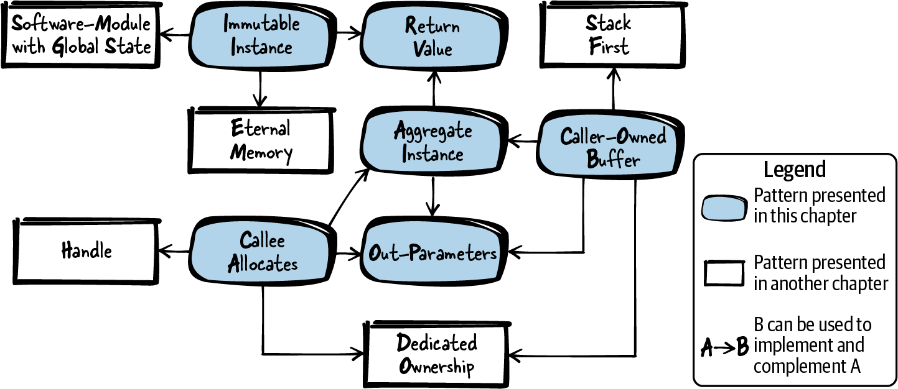
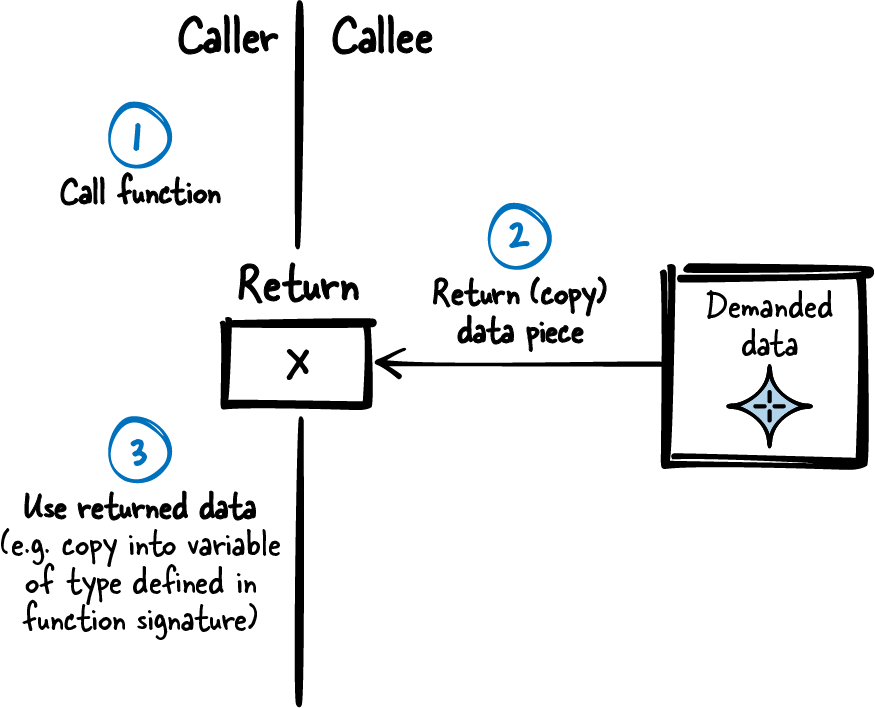
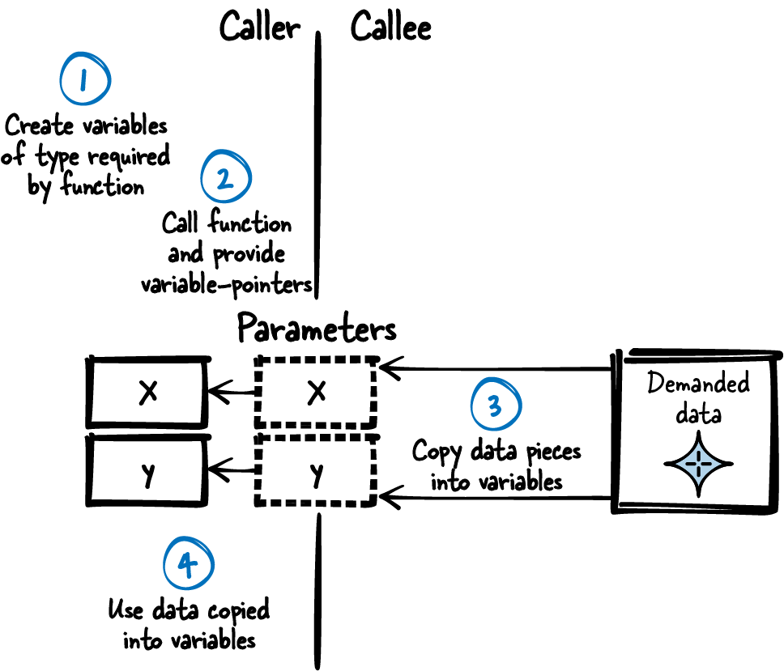
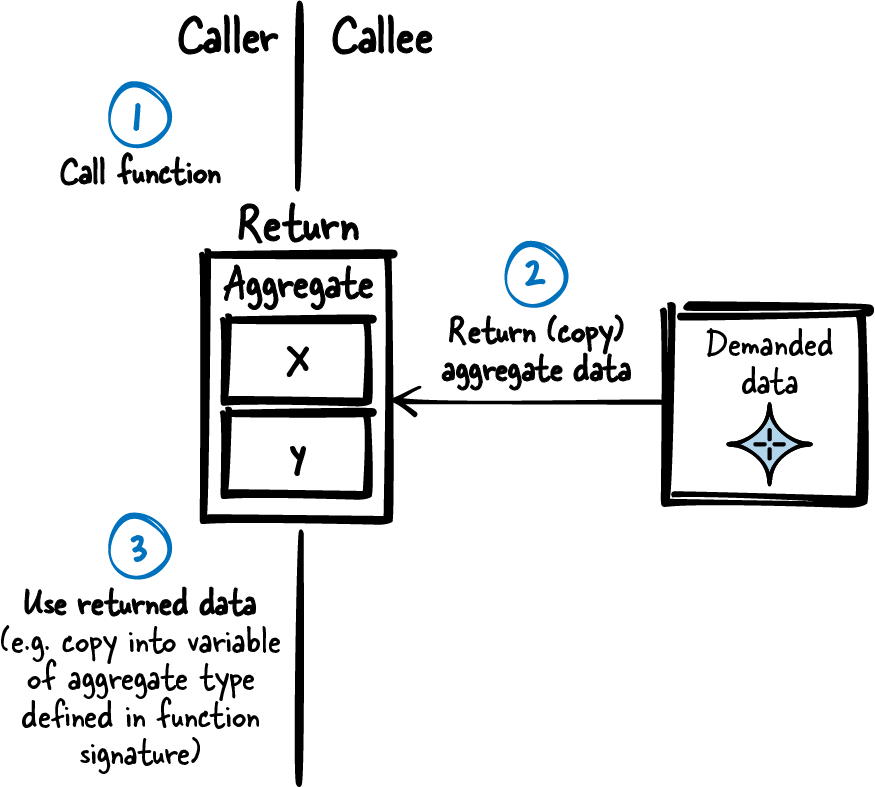

# 第 4 章  从 C 函数返回数据

从函数调用返回数据，是你在写任何超过十行、还想让人维护的代码时都躲不开的任务。返回数据本该简单——无非是把想共享的数据在两个函数之间传一下——而且在 C 里，你要么直接返回一个值，要么用模拟的"按引用"参数返回数据。选择不多、指导也有限——对吗？错！即便是"从 C 函数返回数据"这么简单的事，也暗藏玄机：组织程序和函数参数的路数多得很。

在 C 里尤其如此：内存的分配和释放全靠自己，函数之间传递复杂数据就变得棘手——没有析构函数、没有垃圾回收器帮你收拾数据。你得自问：数据该放栈上，还是该分配？该谁分配——调用方，还是被调方？

本章给出在函数之间共享数据的最佳实践。这些模式能帮 C 语言初学者理解返回数据的各种技术，也能帮进阶 C 程序员想明白这些技术各自为何存在。

[图 4-1](#fig_returning_data) 给出了本章所有模式及其相互关系的总览，[表 4-1](#tab_returning_data) 则是各模式的一句话摘要。



###### 图 4-1  返回信息模式总览

|  | 模式名 | 摘要 |
|----|----|----|
|  | 返回值（Return Value） | 你要拆分的函数各部分并非彼此独立。过程式编程的常态是：一部分产出结果，另一部分接着用。想拆开的函数各部分需要共享一些数据。因此，直接使用 C 中专为获取函数调用结果而生的那个机制——返回值。C 的返回值机制会复制函数结果，把这份副本交给调用方。 |
|  | 输出参数（Out-Parameters） | C 的函数调用只支持返回单一类型，要返回多条信息就麻烦了。因此，用指针模拟按引用传参，一次函数调用返回全部数据。 |
|  | 聚合实例（Aggregate Instance） | C 的函数调用只支持返回单一类型，要返回多条信息就麻烦了。因此，把彼此相关的数据统统放进一个新定义的类型。定义这个聚合实例来承载要共享的全部相关数据，并把它定义在组件接口里，让调用方直接访问实例中的全部数据。 |
|  | 不可变实例（Immutable Instance） | 你想把组件中以大块不可变形式持有的信息提供给调用方。因此，把含待共享数据的实例（例如 `struct`）放进静态内存；把它提供给想访问的用户，并确保他们改不了它。 |
|  | 调用方拥有的缓冲区（Caller-Owned Buffer） | 你想把大小已知、并非不可变（运行期会变）的复杂数据或大数据提供给调用方。因此，要求调用方向返回这些数据的函数提供缓冲区及其大小；函数实现中，缓冲区够大就把所需数据拷贝进去。 |
|  | 被调方分配（Callee Allocates） | 你想把大小未知、并非不可变（运行期会变）的复杂数据或大数据提供给调用方。因此，在提供这些数据的函数内部分配所需大小的缓冲区，把数据拷贝进去，返回指向该缓冲区的指针。 |

表 4-1  返回信息模式

# 运行示例

你要实现一个功能：向用户显示以太网驱动的诊断信息。起初，你直接把这个功能塞进以太网驱动实现的文件里，直接访问含有相关信息的变量：

```
void ethShow()
{
  printf("%i packets received\n", driver.internal_data.rec);
  printf("%i packets sent\n", driver.internal_data.snd);
}
```

后来你意识到，以太网驱动诊断信息的显示功能八成还会膨胀，为了保持代码整洁，你决定把它放进单独的实现文件。现在你需要一个简单的方式，把信息从以太网驱动组件传到诊断组件。

用全局变量传递是一种办法，但用了全局变量，拆分实现文件的力气就白费了——你拆文件，正是为了表明这两块代码耦合不紧；全局变量一进来，紧密耦合又给带回来了。

好得多的办法也很简单：让以太网组件提供一组 getter 函数，把所需信息作为返回值（Return Value）交出来。

# 返回值

## 上下文

你想把代码拆成独立的函数——把所有东西塞进一个函数、一个实现文件是坏习惯，代码会变得难读难调。

## 问题

**你要拆分的函数各部分并非彼此独立。过程式编程的常态是：一部分产出结果，另一部分接着用。想拆开的函数各部分需要共享一些数据。**

你想要一种让代码好懂的共享数据机制：函数之间共享数据这件事要在代码里看得见、摸得着，绝不允许函数经由代码里看不清的旁门暗道通信。用全局变量向调用方返回信息因此不合你的意：全局变量谁都能访问、谁都能改；而且光看函数签名，根本看不出用的是哪个全局变量。

全局变量还有个毛病：它可以存状态信息，导致同样的函数调用得到不同的结果，代码因此更难理解。此外，用全局变量返回信息的代码不可重入，在多线程环境里不安全。

## 方案

**直接使用 C 中专为获取函数调用结果而生的那个机制——返回值。C 的返回值机制会复制函数结果，把这份副本交给调用方。**

[图 4-2](#fig_return_value) 和下面的代码演示了返回值的实现。



###### 图 4-2  返回值

*调用方代码*

```
int my_data = getData();
/* use my_data */
```

\
*被调方代码*

```
int getData()
{
  int requested_data;
  /* .... */
  return requested_data;
}
```

## 后果

返回值让调用方拿到函数结果的一份副本。除了函数实现本身，没有别的代码能改这个值；又因为它是副本，只有调用函数在使用它。与全局变量相比，哪些代码能影响从函数调用取回的数据，一目了然。

不用全局变量、改用函数结果的副本，函数还可以做到可重入，在多线程环境中安全使用。

不过，对 C 内建类型而言，函数只能返回签名所规定类型的一个对象，没法定义多返回类型的函数——比如不能让函数返回三个不同的 `int`。想返回的信息若超出一个简单标量类型所能承载，就得动用聚合实例（Aggregate Instance）或输出参数（Out-Parameters）。

想从数组返回数据，返回值也帮不上忙：它复制的不是数组内容，而是指向数组的指针——调用方可能落得一个指向早已出作用域数据的指针。返回数组得用别的机制，比如调用方拥有的缓冲区（Caller-Owned Buffer），或者被调方分配（Callee Allocates）。

记住：只要简单的返回值机制够用，就永远选这个最简单的选项。别去碰那些更强但更复杂的模式——输出参数、聚合实例、调用方拥有的缓冲区、被调方分配。

## 已知应用

下面是一些应用该模式的实例：

- 这个模式无处不在。任何非 `void` 函数都在以这种方式返回数据。

- 每个 C 程序的 `main` 函数都在向它的调用方（比如操作系统）提供返回值。

## 应用于运行示例

应用返回值轻而易举。现在你有了独立于以太网驱动实现文件的诊断组件，它通过下面的代码从以太网驱动获取诊断信息：

*以太网驱动 API*

```
/* Returns the number of total received packets*/
int ethernetDriverGetTotalReceivedPackets();

/* Returns the number of total sent packets*/
int ethernetDriverGetTotalSentPackets();
```

\
*调用方代码*

```
void ethShow()
{
  int received_packets = ethernetDriverGetTotalReceivedPackets();
  int sent_packets = ethernetDriverGetTotalSentPackets();
  printf("%i packets received\n", received_packets);
  printf("%i packets sent\n", sent_packets);
}
```

这段代码好读，想添新信息，加几个函数就行。你接下来正想这么干：显示已发包的更多信息——成功发出多少、失败多少。你的第一版尝试如下：

```
void ethShow()
{
  int received_packets = ethernetDriverGetTotalReceivedPackets();
  int total_sent_packets = ethernetDriverGetTotalSentPackets();
  int successfully_sent_packets = ethernetDriverGetSuccesscullySentPackets();
  int failed_sent_packets = ethernetDriverGetFailedPackets();
  printf("%i packets received\n", received_packets);
  printf("%i packets sent\n", total_sent_packets);
  printf("%i packets successfully sent\n", successfully_sent_packets);
  printf("%i packets failed to send\n", failed_sent_packets);
}
```

有了这段代码你却发现：有时 `successfully_sent_packets` 加 `failed_sent_packets` 会超过 `total_sent_packets`，与预期不符。原因在于：以太网驱动跑在单独的线程里，在你调用函数取信息的间隙，它还在继续工作、更新包统计。比如以太网驱动恰好在 `ethernetDriverGetTotalSentPackets` 调用之后、`ethernetDriverGetSuccesscullySentPackets` 调用之前成功发出一个包，你显示给用户的信息就不自洽了。

一个办法是：调用函数取包统计时，确保以太网驱动歇着。用互斥量或信号量可以做到，但取个包统计这种小事，还得你来操心同步，未免说不过去。

轻松得多的替代方案是用输出参数（Out-Parameters）：一次函数调用，返回多条信息。

# 输出参数

## 上下文

你想把组件中若干彼此相关的信息提供给调用方，而这些信息在多次函数调用之间可能发生变化。

## 问题

**C 的函数调用只支持返回单一类型，要返回多条信息就麻烦了。**

用全局变量传递这些信息不是好办法：用全局变量返回信息的代码不可重入，多线程环境不安全；全局变量谁都能访问、谁都能改，而且光看函数签名看不出用的是哪个全局变量。全局变量会让代码难懂难维护。用多个函数的返回值也不是好选项：数据彼此相关，拆到多次函数调用里，代码可读性反被拉低。

正因为数据相关，调用方想要的是一份自洽的快照。在多线程环境里用多个返回值，这就成了麻烦：数据运行期会变，你得保证调用方的多次函数调用之间数据不变。可你无法知道调用方是不是读完了全部数据、会不会再调一个函数来取另一条信息。所以你无法保证数据在调用方的函数调用之间不被修改。用多个函数提供相关信息，你根本不知道数据必须保持不变的时间窗有多长——也就无法向调用方保证拿到的是自洽的快照。

如果计算这些相关数据需要大量准备工作，多个返回值函数同样不划算。比如要从通讯录返回某人的座机和手机号，却用两个函数分别取：每次函数调用都得把这个人的通讯录条目翻个遍，白白浪费计算时间和资源。

## 方案

**用指针模拟按引用传参，一次函数调用返回全部数据。**

C 不支持用返回值返回多个类型，也没有原生的按引用传参，但按引用传参可以模拟，如图 4-3 和下面的代码所示。



###### 图 4-3  输出参数

*调用方代码*

```
int x,y;
getData(&x,&y);
/* use x,y */
```

\
*被调方代码*

```
void getData(int* x, int* y)
{
  *x = 42;
  *y = 78;
}
```

写一个带多个指针参数的函数。函数实现里解引用这些指针，把要返回给调用方的数据拷贝进被指向的实例。拷贝期间务必保证数据不变——可以用互斥实现。

##### 多线程环境

现代系统里多线程环境是常态。想在这种环境中避开同步问题，最好的办法要么数据不可变，要么数据和函数干脆不共享（见 Kevlin Henney 的视频[《Thinking Outside the Synchronisation Quadrant》](https://oreil.ly/SI1ta)）。但这并非总能做到，于是麻烦来了：函数必须写成允许多个线程以任意顺序、甚至同时调用的样子。

这要求函数可重入——任何时刻被打断、稍后续上，依然工作正常。操作全局变量这类共享资源时，必须保护它们不被其他线程同时访问，互斥量、信号量等同步原语可以胜任。

本书不展开讲这些同步原语及其用法，但 Bruce P. Douglass 的《Real-Time Design Patterns: Robust Scalable Architecture for Real-Time Systems》（Addison-Wesley，2002）讲了，还提供了并发和资源管理方面的 C 模式。

## 后果

现在，代表相关信息的全部数据在单次函数调用中返回，且能做到自洽（比如在互斥量或信号量保护下拷贝数据）。函数可重入，多线程环境可安全使用。

每多一项数据，就多传一个指针。缺点也随之而来：要返回的数据一多，参数列表就越拉越长。一个函数一大堆参数是代码坏味道——代码没法看了。正因为如此，很少有人在函数上挂一串输出参数；为了让代码清爽，相关信息改用聚合实例返回。

而且每条数据调用方都得传一个指针，即每条数据都要往栈上多压一个指针。调用方栈内存很紧的话，这可能成为问题。

输出参数还有个劣势：光看函数签名，认不出谁是被模拟的输出参数。调用方看到指针，只能猜它可能是输出参数——但它也可能是函数的输入。所以 API 文档必须写清楚：哪些参数是输入，哪些是输出。

对简单的 C 标量类型，调用方直接把变量指针当参数传即可；指针类型已经写明，函数实现解释指针所需的信息一应俱全。要返回数组这类复杂类型，要么提供调用方拥有的缓冲区，要么被调方分配，数据的大小等附加信息也得一并交代。

## 已知应用

下面是一些应用该模式的实例：

- Windows 的 `RegQueryInfoKey` 函数通过输出参数返回注册表键的信息。调用方提供 `unsigned long` 指针，函数把子键数量、键值大小等信息写进被指向的 `unsigned long` 变量。

- Apple 面向 C 程序的 Cocoa API 用一个额外的 `NSError` 参数存放函数调用期间发生的错误。

- 实时操作系统 VxWorks 的 `userAuthenticate` 函数用返回值返回信息——此处是"给定登录名的密码是否正确"；同时用输出参数返回与该登录名关联的用户 ID。

## 应用于运行示例

应用输出参数后，代码如下：

*以太网驱动 API*

```
/* Returns driver status information via out-parameters.
   total_sent_packets   --> number of packets tried to send (success and fail)
   successfully_sent_packets --> number of packets successfully sent
   failed_sent_packets  --> number of packets failed to send */
void ethernetDriverGetStatistics(int* total_sent_packets,
      int* successfully_sent_packets, int* failed_sent_packets); 
```

[](#co_returning_data_from_c_functions_CO1-1)  
取已发包信息只需对以太网驱动发起一次函数调用，驱动也能保证这次调用交付的数据自洽。

*调用方代码*

```
void ethShow()
{
  int total_sent_packets, successfully_sent_packets, failed_sent_packets;
  ethernetDriverGetStatistics(&total_sent_packets, &successfully_sent_packets,
                              &failed_sent_packets);
  printf("%i packets sent\n", total_sent_packets);
  printf("%i packets successfully sent\n", successfully_sent_packets);
  printf("%i packets failed to send\n", failed_sent_packets);

  int received_packets = ethernetDriverGetTotalReceivedPackets();
  printf("%i packets received\n", received_packets);
}
```

你考虑过把 `received_packets` 也并进同一次函数调用，但随即意识到：这一次函数调用正变得越来越复杂。三个输出参数已经够写也够读了，调用时参数顺序一不小心就串了，再加第四个只会更糟。

要让代码更好读，可以用聚合实例（Aggregate Instance）。

# 聚合实例

## 上下文

你想把组件中若干彼此相关的信息提供给调用方，而这些信息在多次函数调用之间可能发生变化。

## 问题

**C 的函数调用只支持返回单一类型，要返回多条信息就麻烦了。**

用全局变量传递这些信息不是好办法：用全局变量返回信息的代码不可重入，多线程环境不安全；全局变量谁都能访问、谁都能改，而且光看函数签名看不出用的是哪个全局变量。全局变量会让代码难懂难维护。用多个函数的返回值也不是好选项：数据彼此相关，拆到多次函数调用里，代码可读性反被拉低。

带一串输出参数的单个函数同样不是好主意：输出参数一多就容易张冠李戴，代码没法读。何况你本就想表明这些参数密切相关，甚至同一组参数还要提供给别的函数、或由别的函数返回——用函数参数硬表达这种关系，日后参数一增，每个这样的函数都得跟着改。

正因为数据相关，调用方想要的是一份自洽的快照。在多线程环境里用多个返回值，这就成了麻烦：数据运行期会变，你得保证调用方的多次函数调用之间数据不变。可你无法知道调用方是不是读完了全部数据、会不会再调一个函数来取另一条信息。所以你无法保证数据在调用方的函数调用之间不被修改。用多个函数提供相关信息，你根本不知道数据必须保持不变的时间窗有多长——也就无法向调用方保证拿到的是自洽的快照。

如果计算这些相关数据需要大量准备工作，多个返回值函数同样不划算。比如要从通讯录返回某人的座机和手机号，却用两个函数分别取：每次函数调用都得把这个人的通讯录条目翻个遍，白白浪费计算时间和资源。

## 方案

**把彼此相关的数据统统放进一个新定义的类型。定义这个聚合实例来承载要共享的全部相关数据，并把它定义在组件接口里，让调用方直接访问实例中的全部数据。**

具体做法：在头文件里定义一个 `struct`，把要从被调函数返回的所有类型定义为这个 `struct` 的成员。函数实现里，把待返回数据拷进 `struct` 成员，如图 4-4 所示。拷贝期间务必保证数据不变——用互斥量或信号量互斥即可。



###### 图 4-4  聚合实例

要把 `struct` 真正交给调用方，主要有两个选项：

- 把整个 `struct` 当作返回值传递。C 允许函数返回值不只限于内建类型，`struct` 这类用户自定义类型同样可以。

- 用输出参数传递指向 `struct` 的指针。不过只传指针的话，"谁提供、谁拥有被指向的内存"的问题就冒出来了——调用方拥有的缓冲区和被调方分配两节会处理它。除了传指针让调用方直接访问聚合实例，也可以考虑用句柄（Handle）把 `struct` 对调用方藏起来。

下面的代码演示了传整个 `struct` 的变体：

*调用方代码*

```
struct AggregateInstance my_instance;
my_instance = getData();
/* use my_instance.x
   use my_instance.y, ... */
```

\
*被调方代码*

```
struct AggregateInstance
{
  int x;
  int y;
};

struct AggregateInstance getData()
{
  struct AggregateInstance inst;
  /* fill inst.x and inst.y */
  return inst; 
}
```

[](#co_returning_data_from_c_functions_CO2-1)  
返回时，`inst` 的内容会被拷贝（尽管它是个 `struct`），`inst` 出作用域之后，调用方照样能访问这份副本。

## 后果

现在调用方通过聚合实例，一次函数调用即可取回多条相关信息。函数可重入，多线程环境可安全使用。

这样一来，调用方拿到的相关信息系统是一份自洽的快照。调用方代码也干净：既不用连着调好几个函数，也不用伺候一个挂满输出参数的函数。

用返回值在函数之间传数据（不经指针）时，这些数据统统压在栈上。一个 `struct` 传给 10 层嵌套函数，它就在栈上出现 10 次。有时无所谓，有时就是问题——`struct` 太大、又不想每次都把整个 `struct` 拷上栈白白浪费栈内存时尤其如此。正因如此，人们常常不直接传、返回 `struct`，而是传、返回指向它的指针。

传指向 `struct` 的指针，或者 `struct` 里含指针时，记住：C 不会替你做深拷贝。C 只拷贝指针的值，不拷贝被指向的实例。这可能不是你想要的——所以只要指针登场，你就得操心被指向内存的提供和清理。这个问题在调用方拥有的缓冲区和被调方分配两节有解。

## 已知应用

下面是一些应用该模式的实例：

- Uwe Zdun 的文章[《Patterns of Argument Passing》](https://oreil.ly/VlCgm)把这个模式（含 C++ 示例）称为上下文对象（Context Object）；Martin Fowler 的《Refactoring: Improving the Design of Existing Code》（Addison-Wesley，1999，中译《重构》）称之为参数对象（Parameter Object）。

- NetHack 游戏的代码把怪物属性存在聚合实例里，并提供函数供取用。

- 文本编辑器 sam 的实现在把 `struct` 传给函数、从函数返回时都按值拷贝，图的就是代码简单。

## 应用于运行示例

用上聚合实例，代码如下：

*以太网驱动 API*

```
struct EthernetDriverStat{
  int received_packets;         /* Number of received packets */
  int total_sent_packets;       /* Number of sent packets (success and fail)*/
  int successfully_sent_packets;/* Number of successfully sent packets */
  int failed_sent_packets;      /* Number of packets failed to send */
};

/* Returns statistics information of the Ethernet driver */
struct EthernetDriverStat ethernetDriverGetStatistics();
```

\
*调用方代码*

```
void ethShow()
{
  struct EthernetDriverStat eth_stat = ethernetDriverGetStatistics();
  printf("%i packets received\n", eth_stat.received_packets);
  printf("%i packets sent\n", eth_stat.total_sent_packets);
  printf("%i packets successfully sent\n",eth_stat.successfully_sent_packets);
  printf("%i packets failed to send\n", eth_stat.failed_sent_packets);
}
```

现在对以太网驱动只有一次调用，驱动足以保证这次调用交付的数据自洽。代码也清爽了：属于一家的数据收进了一个 `struct`。

接下来你想向用户展示更多驱动信息：这些包统计属于哪个以太网接口——也就是驱动的名字和文字描述。两者都存在以太网驱动组件的一个字符串里。字符串挺长、确切长度不详。所幸字符串运行期不变，可以访问不可变实例（Immutable Instance）。

# 不可变实例

## 上下文

你的组件里有大量数据，另一个组件想访问这些数据。

## 问题

**你想把组件中以大块不可变形式持有的信息提供给调用方。**

为每个调用方拷贝一份数据是对内存的浪费；由于栈内存的限制，用聚合实例返回全部数据、或把数据全拷进输出参数，都行不通。

通常，返回指向这类数据的指针也很棘手：有了指针，数据就可能被改；而一旦多个调用方同读同写一份数据，你就得设计机制保证要访问的数据自洽且最新。所幸在你的场景里，要提供给调用方的数据在编译期或启动期就已固定，运行期不再变化。

## 方案

**把含待共享数据的实例（例如 `struct`）放进静态内存；把它提供给想访问的用户，并确保他们改不了它。**

实例中的数据在编译期或启动期写入，运行期不再改动。可以把数据直接硬编码进程序，也可以在程序启动时初始化（初始化的变体见[《带全局状态的软件模块》](Chapter_05_数据生命周期与所有权.md)，存储的变体见[《永久内存》](Chapter_03_内存管理.md)）。如图 4-5 所示，多个调用方（乃至多个线程）同时访问这个实例也互不妨碍——实例不变，因此永远自洽、永远装着所需信息。

实现一个返回指向该数据指针的函数。既然数据运行期不变，你甚至可以直接把存数据的变量设为全局、放进 API。但 getter 函数仍是更好的选择：与全局变量相比，它让单元测试更好写；日后代码行为变了（数据不再不可变），接口也不必跟着改。


###### 图 4-5  不可变实例

为确保调用方改不了数据，返回指向数据的指针时，把被指向的数据设为 `const`，如下面的代码所示：

*调用方代码*

```
const struct ImmutableInstance* my_instance;
my_instance = getData(); 
/* use my_instance->x,
   use my_instance->y, ... */
```

[](#co_returning_data_from_c_functions_CO3-1)  
调用方拿到的是引用，而不是内存的所有权。

\
*被调方 API*

```
struct ImmutableInstance
{
  int x;
  int y;
};
```

\
*被调方实现*

```
static struct ImmutableInstance inst = {12, 42};
const struct ImmutableInstance* getData()
{
   return &inst;
}
```

## 后果

调用方调一个简单的函数就能拿到哪怕再复杂再大的数据，不必操心数据存在哪里：不必提供存放数据的缓冲区，不必清理内存，也不必关心数据的生命周期——它一直在那儿。

调用方可以通过拿到的指针读取全部数据。取指针的简单函数可重入，多线程环境安全。数据的访问同样安全：它运行期不变，多个线程只读不写，相安无事。

不过，不采取额外措施，数据在运行期就改不了。如果调用方必须能改数据，可以实现写时复制（copy-on-write）之类的机制。如果数据总体上运行期会变，不可变实例就出局了——共享复杂数据、大数据，得用调用方拥有的缓冲区，或者被调方分配。

## 已知应用

下面是一些应用该模式的实例：

- Kevlin Henney 在文章[《Patterns in Java: Patterns of Value》](https://oreil.ly/cVY9N)中详细描述了类似的不可变对象（Immutable Object）模式，并给出 C++ 代码示例。

- NetHack 游戏的代码把不可变的怪物属性存在不可变实例中，并提供函数供取用。

## 应用于运行示例

一般来说，返回指针访问组件内部存储的数据是件棘手的事：多个调用方访问（乃至写入）这份数据时，裸指针绝非答案——你永远不知道手里的指针是否仍然有效、它指向的数据是否自洽。但这次我们运气好：我们有一个不可变实例。驱动名和描述都是编译期确定、此后不变的信息。于是，取一个指向这份数据的常量指针即可：

*以太网驱动 API*

```
struct EthernetDriverInfo{
  char name[64];
  char description[1024];
};

/* Returns the driver name and description */
const struct EthernetDriverInfo* ethernetDriverGetInfo();
```

\
*调用方代码*

```
void ethShow()
{
  struct EthernetDriverStat eth_stat = ethernetDriverGetStatistics();
  printf("%i packets received\n", eth_stat.received_packets);
  printf("%i packets sent\n", eth_stat.total_sent_packets);
  printf("%i packets successfully sent\n",eth_stat.successfully_sent_packets);
  printf("%i packets failed to send\n", eth_stat.failed_sent_packets);

  const struct EthernetDriverInfo* eth_info = ethernetDriverGetInfo();
  printf("Driver name: %s\n", eth_info->name);
  printf("Driver description: %s\n", eth_info->description);
}
```

下一步，除了以太网接口的名字和描述，你还想向用户显示当前配置的 IP 地址和子网掩码。地址以字符串形式存在以太网驱动里，而且运行期可能变化——不可变实例的指针是别想直接返回了。

让以太网驱动把这些字符串打包进聚合实例、直接返回整个实例（返回 `struct` 时其中的数组会被拷贝）倒也可行，但对大数据来说这法子少见——太耗栈内存。通常还是用指针。

用指针——这正是你要找的答案：调用方拥有的缓冲区（Caller-Owned Buffer）。

# 调用方拥有的缓冲区

## 上下文

你有一块大数据，想在不同的组件之间共享。

## 问题

**你想把大小已知、并非不可变（运行期会变）的复杂数据或大数据提供给调用方。**

数据运行期会变（也许因为你还向调用方提供了写数据的函数），所以不能像不可变实例那样直接给调用方一个指向静态数据的指针。真这么干，麻烦就来了：多线程环境里，另一个调用方可能正在写这份数据，一个调用方读到的数据可能不自洽（被改了一半）。

把全部数据拷进聚合实例、经返回值传给调用方也不行：数据太大，栈上那点内存装不下。

只返回指向聚合实例的指针倒是绕开了栈内存限制，但记住：C 不替你做深拷贝——它只返回指针。你得保证被指向的数据（存在聚合实例或数组里）在函数调用之后仍然有效。比如不能把数据存在函数内的自动变量里再把指针给出去——函数一返回，变量就出作用域了。

于是问题来了：数据该存在哪里？调用方和被调方，该由谁来提供所需内存、由谁负责管理和清理？

## 方案

**要求调用方向返回大数据、复杂数据的函数提供缓冲区及其大小；函数实现中，缓冲区够大就把所需数据拷贝进去。**

拷贝期间保证数据不变——用互斥量或信号量互斥即可。调用方于是在缓冲区里得到一份数据快照，且是这份数据的唯一所有者；哪怕原本的数据此后又变了，调用方访问自己的快照依然自洽。

缓冲区及其大小可以作为两个独立的函数参数传入，也可以打包进聚合实例、以指针传给函数。

调用方既然要向函数提供缓冲区及其大小，就得事先知道大小。要让调用方知道缓冲区该多大，大小要求必须体现在 API 里：可以用宏定义大小，也可以在 API 里定义一个含所需大小缓冲区的 `struct`。

[图 4-6](#fig_caller_buffer) 和下面的代码展示了调用方拥有的缓冲区的概念。


###### 图 4-6  调用方拥有的缓冲区

*调用方代码*

```
struct Buffer buffer;

getData(&buffer);
/* use buffer.data */
```

\
*被调方 API*

```
#define BUFFER_SIZE 256
struct Buffer
{
  char data[BUFFER_SIZE];
};

void getData(struct Buffer* buffer);
```

\
*被调方实现*

```
void getData(struct Buffer* buffer)
{
  memcpy(buffer->data, some_data, BUFFER_SIZE);
}
```

## 后果

大数据、复杂数据可以在单次函数调用中自洽地交付给调用方。函数可重入，多线程环境安全；调用方访问数据也安全——它是缓冲区的唯一所有者。

调用方提供预期大小的缓冲区，甚至可以自己决定缓冲区用哪种内存：放栈上（见[《栈优先》](Chapter_03_内存管理.md)），坐享变量出作用域后栈内存自动清理；放堆上，自行掌控变量生命周期、不浪费栈内存。调用函数手里也可能只有它的调用方给的缓冲区引用——直接传下去就是，不必层层配缓冲区。

耗时的内存分配和释放不发生在函数调用期间。何时进行这些操作由调用方定夺，函数调用因此更快、更确定。

API 一眼看去就知道：缓冲区的专属所有权（Dedicated Ownership）在调用方手里。调用方提供缓冲区、事后清理它；缓冲区若是调用方分配的，负责释放的自然也是它。

调用方必须事先知道缓冲区大小——正因为大小已知，函数才能在缓冲区内安全操作。但有些时候调用方恰恰不知道确切大小，那就轮到被调方分配（Callee Allocates）出场了。

## 已知应用

下面是一些应用该模式的实例：

- NetHack 代码用这个模式把存档信息提供给真正把游戏进度写入磁盘的组件。

- B&R Automation Runtime 操作系统用一个取 IP 地址的函数应用了该模式。

- C 标准库函数 `fgets` 从流读输入，存进调用方提供的缓冲区。

## 应用于运行示例

你现在向以太网驱动函数提供一个调用方拥有的缓冲区，函数把数据拷进去。你得事先知道缓冲区该多大——取 IP 地址字符串不在话下，字符串大小固定。缓冲区直接放栈上，把这个栈变量交给以太网驱动即可。放堆上当然也行，但这里没必要：IP 地址大小已知、数据也小，栈装得下：

*以太网驱动 API*

```
struct IpAddress{
  char address[16];
  char subnet[16];
};

/* Stores the IP information into 'ip', which has to be provided
   by the caller*/
void ethernetDriverGetIp(struct IpAddress* ip);
```

\
*调用方代码*

```
void ethShow()
{
  struct EthernetDriverStat eth_stat = ethernetDriverGetStatistics();
  printf("%i packets received\n", eth_stat.received_packets);
  printf("%i packets sent\n", eth_stat.total_sent_packets);
  printf("%i packets successfully sent\n",eth_stat.successfully_sent_packets);
  printf("%i packets failed to send\n", eth_stat.failed_sent_packets);

  const struct EthernetDriverInfo* eth_info = ethernetDriverGetInfo();
  printf("Driver name: %s\n", eth_info->name);
  printf("Driver description: %s\n", eth_info->description);

  struct IpAddress ip;
  ethernetDriverGetIp(&ip);
  printf("IP address: %s\n", ip.address);
}
```

接下来，你想扩展诊断组件，再打印一份最近收到数据包的十六进制转储。这条信息大到栈放不下，而且以太网包大小不定，缓冲区该多大事先无从知晓——调用方拥有的缓冲区出局。

当然，你可以做两个函数 `EthernetDriverGetPacketSize()` 和 `EthernetDriverGetPacket(buffer)`，但老毛病又犯了：得调两次函数。两次调用之间以太网驱动可能又收到一个包，数据又不自洽了。而且为达一个目的调两个不同的函数，本就不优雅。让被调方分配，事情简单得多。

# 被调方分配

## 上下文

你有一块大数据，想在不同的组件之间共享。

## 问题

**你想把大小未知、并非不可变（运行期会变）的复杂数据或大数据提供给调用方。**

数据运行期会变（也许因为你还向调用方提供了写数据的函数），所以不能像不可变实例那样直接给调用方一个指向静态数据的指针。真这么干，麻烦就来了：多线程环境里，另一个调用方可能正在写这份数据，一个调用方读到的数据可能不自洽（被改了一半）。

把全部数据拷进聚合实例、经返回值传给调用方也不行：返回值只能传大小已知的数据；何况数据太大，栈上那点内存也装不下。

只返回指向聚合实例的指针倒是绕开了栈内存限制，但记住：C 不替你做深拷贝——它只返回指针。你得保证被指向的数据（存在聚合实例或数组里）在函数调用之后仍然有效。比如不能把数据存在函数内的自动变量里再把指针给出去——函数一返回，变量就出作用域、被清理了。

于是问题来了：数据该存在哪里？调用方和被调方，该由谁来提供所需内存、由谁负责管理和清理？

你要提供的数据量在编译期并不固定——比如要返回一个大小事先未知的字符串。这让调用方拥有的缓冲区变得不实用：调用方事先不知道缓冲区该多大。它可以先问一声所需的缓冲区大小（比如调个 `getRequiredBufferSize()` 函数），但同样不实用：为取一份数据要发起多次函数调用；而且两次调用之间数据还可能变，调用方到头来还是给了一个尺寸不对的缓冲区。

## 方案

**在提供大数据、复杂数据的函数内部分配所需大小的缓冲区，把所需数据拷贝进去，返回指向该缓冲区的指针。**

把缓冲区指针及其大小作为输出参数交给调用方。函数调用之后，调用方可以在缓冲区上操作、知道它的大小、独享它的所有权，还决定它的生命周期——自然也负责清理，如图 4-7 和下面的代码所示。


###### 图 4-7  被调方分配

*调用方代码*

```
char* buffer;
int size;
getData(&buffer, &size);
/* use buffer */
free(buffer);
```

*被调方代码*

```
void getData(char** buffer, int* size)
{
  *size = data_size;
  *buffer = malloc(data_size);
  /* write data to buffer */ 
}
```

[](#co_returning_data_from_c_functions_CO4-1)  
往缓冲区拷数据时，确保期间数据不变——用互斥量或信号量互斥即可。

或者，缓冲区指针和大小可以放进聚合实例、作为返回值交付。为了让调用方更清楚聚合实例里有个需要释放的指针，API 还可以额外提供一个清理函数。连清理函数都提供时，这套 API 已经非常像带句柄（Handle）的 API 了——还能在保持 API 兼容的同时换来灵活性。

无论被调函数通过聚合实例还是输出参数交付缓冲区，都必须让调用方明白：缓冲区归它所有、由它释放。这份专属所有权必须在 API 里写清楚。

## 后果

调用方一次函数调用就能拿到大小事先未知的缓冲区。函数可重入，多线程环境安全，还能向调用方提供关于缓冲区及其大小的自洽信息。知道大小，调用方就能安全操作数据——甚至能处理经这种缓冲区传递的、没有结尾符的字符串。

缓冲区归调用方所有，生命周期由它定，释放也归它管（跟用句柄的情形一样）。这一点在接口上必须交代得明明白白：一种办法是写进 API 文档；另一种是提供显式的清理函数，让"有东西要清理"更加醒目。清理函数还有个额外好处：分配内存的组件同时负责释放。两个组件用不同编译器编译、或跑在不同平台上时，这一点很重要——各组件分配、释放内存的函数可能不同，谁分配、谁释放必须绑死在同一组件内。

调用方无法决定缓冲区用哪种内存——用调用方拥有的缓冲区时它原本可以说了算。现在，它只能用函数调用内部分配的那种。

分配需要时间：与调用方拥有的缓冲区相比，函数调用更慢、确定性更差。

## 已知应用

下面是一些应用该模式的实例：

- `malloc` 函数干的就是这个：分配一块内存，交给调用方。

- `strdup` 函数接收一个字符串，分配复制出的字符串并返回。

- Linux 的 `getifaddrs` 函数提供已配置 IP 地址的信息。承载这些信息的数据就存在该函数分配的缓冲区里。

- NetHack 代码用这个模式获取缓冲区。

## 应用于运行示例

你的诊断组件最终代码如下，由被调方分配缓冲区来取包数据：

*以太网驱动 API*

```
struct Packet
{
  char data[1500]; /* maximum 1500 byte per packet */
  int size;        /* actual size of data in the packet */
};

/* Returns a pointer to a packet that has to be freed by the caller */
struct Packet* ethernetDriverGetPacket();
```

\
*调用方代码*

```
void ethShow()
{
  struct EthernetDriverStat eth_stat = ethernetDriverGetStatistics();
  printf("%i packets received\n", eth_stat.received_packets);
  printf("%i packets sent\n", eth_stat.total_sent_packets);
  printf("%i packets successfully sent\n",eth_stat.successfully_sent_packets);
  printf("%i packets failed to send\n", eth_stat.failed_sent_packets);

  const struct EthernetDriverInfo* eth_info = ethernetDriverGetInfo();
  printf("Driver name: %s\n", eth_info->name);
  printf("Driver description: %s\n", eth_info->description);

  struct IpAddress ip;
  ethernetDriverGetIp(&ip);
  printf("IP address: %s\n", ip.address);

  struct Packet* packet = ethernetDriverGetPacket();
  printf("Packet Dump:");
  fwrite(packet->data, 1, packet->size, stdout);
  free(packet);
}
```

在这版最终的诊断组件里，我们见识了从另一个函数获取信息的全部姿势。把这么多种方式混进同一段代码，未必是你真想干的：一份数据在栈上、另一份数据在堆上，多少有点乱。既然要分配缓冲区，就别混着来——同一个函数里既用调用方拥有的缓冲区、又用被调方分配，多半不是好主意。不如挑一种能满足全部需求的方式，在一个函数或组件内从一而终。代码更整齐，也更好懂。

不过，如果只是从别的组件取一条数据，又有本章前面那些更省事的姿势可选，那就永远选省事的，保持代码简单。比如缓冲区能放栈上就放栈上——省得再费功夫去释放。

# 小结

本章展示了从函数返回数据、在 C 中处理缓冲区的各种方式。最简单的是用返回值（Return Value）返回单条数据；要返回多条相关数据，改用输出参数（Out-Parameters），更好的是聚合实例（Aggregate Instance）。要返回的数据运行期不变？不可变实例（Immutable Instance）可用。用缓冲区返回数据时：大小事先已知，用调用方拥有的缓冲区（Caller-Owned Buffer）；大小未知，用被调方分配（Callee Allocates）。

有了本章的模式，C 程序员手里就有了在函数之间搬运数据、应对缓冲区返回、分配和释放的基本工具和指引。

# 展望

下一章讲更大的程序如何组织成软件模块，以及这些软件模块如何打理数据的生命周期和所有权。这些模式给出了搭建大型 C 代码的积木总览。
