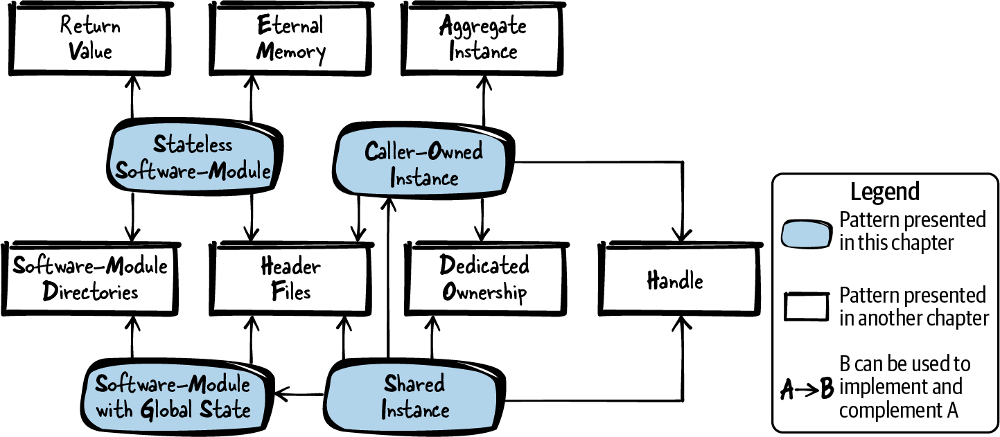
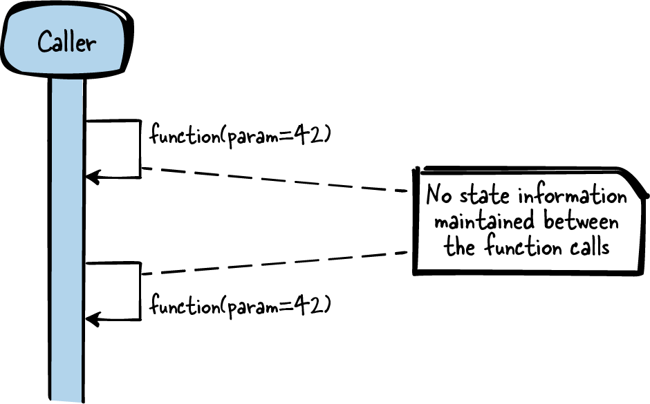
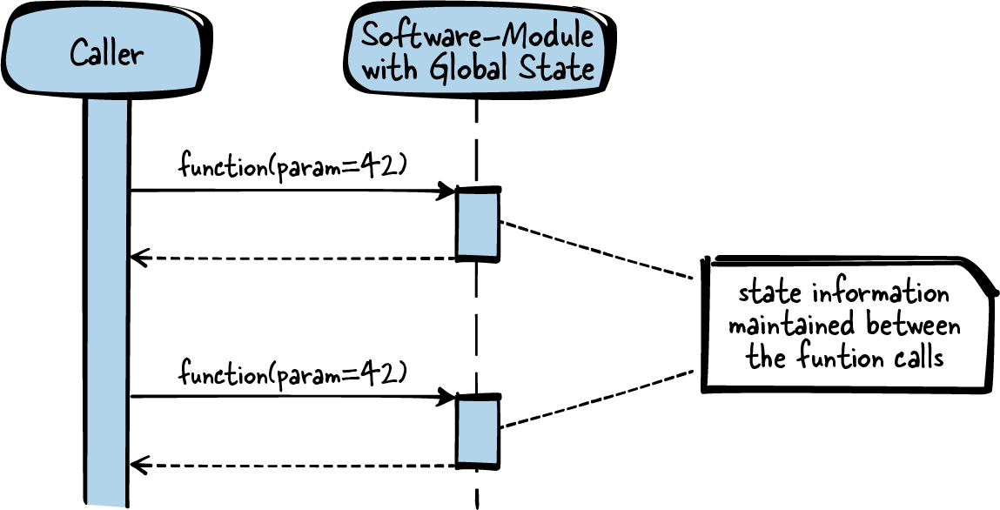
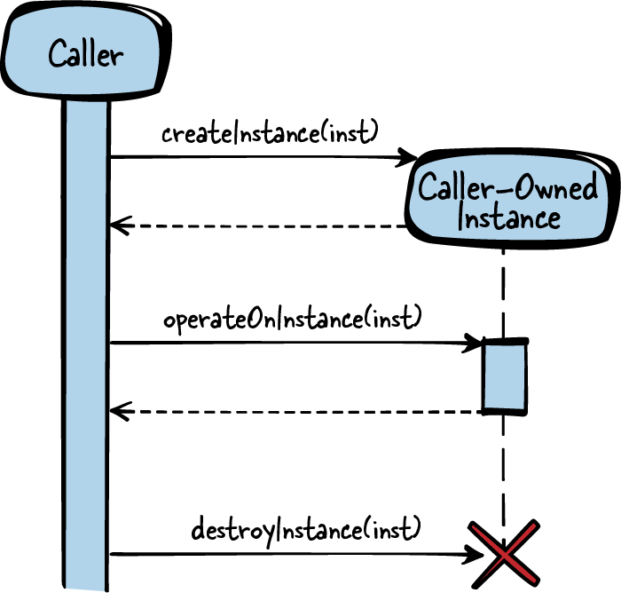
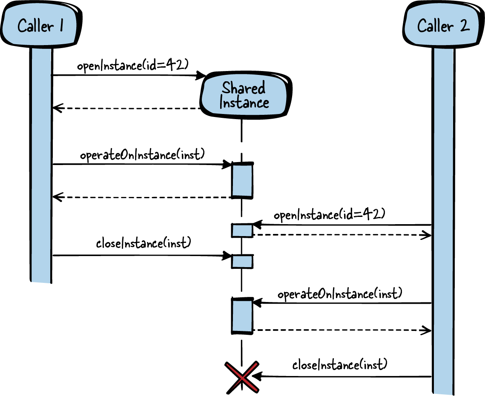

# 第 5 章  数据生命周期与所有权

像 C 这样的过程式语言没有原生的面向对象机制。这在一定程度上让日子更难过：大多数设计指导（比如"四人帮"设计模式）都是为面向对象软件量身定制的。

本章讨论如何用"类对象元素"来组织 C 程序的模式。针对这些类对象元素，模式特别关注：谁负责创建、谁负责销毁——换句话说，特别关注生命周期与所有权。这个话题对 C 尤其重要：C 没有自动析构函数、没有垃圾回收，资源的清理必须格外上心。

不过，什么是"类对象元素"？它对 C 又意味着什么？*对象*一词在面向对象语言里有明确定义，在非面向对象语言里却含义模糊。对 C 来说，对象有一个简单的定义：

> "对象是一块有名的存储区域。"
>
> Kernighan 和 Ritchie

这样的对象通常描述一组相关的数据：有标识、有属性，用来存放现实世界事物在程序中的表示。在面向对象编程中，对象还具备多态和继承的能力。本书讨论的类对象元素不涉及多态和继承，因此我们不再使用"对象"这个词，而是把类对象元素看作数据结构的一个实例，简称*实例*。

这样的实例不是孤立存在的，它们通常伴随一组相关代码，使操作实例成为可能。这组代码通常打包成一组头文件（接口）和一组实现文件（实现）。本章把所有这些相关代码的总和称为*软件模块*——它们类似面向对象的类，往往定义了可以在实例上执行的操作。

用 C 编程时，上述数据实例通常实现为抽象数据类型（例如用一个 `struct` 实例配合访问 `struct` 成员的函数）。这类实例的一个例子是 C 标准库的 `FILE` `struct`，它存储文件指针、文件位置等信息；相应的软件模块则是 *stdio.h* API 及 `fopen`、`fclose` 等函数的实现——正是它们提供对 `FILE` 实例的访问。

[图 5-1](#fig_lifetime) 给出了本章所有模式及其相互关系的总览，[表 5-1](#tab_lifetime) 则是各模式的一句话摘要。



###### 图 5-1  生命周期与所有权模式总览

|  | 模式名 | 摘要 |
|----|----|----|
|  | 无状态软件模块（Stateless Software-Module） | 你想向调用方提供逻辑相关的功能，并让它用起来尽可能省事。因此，保持函数简单，实现中不积累状态信息。把相关函数统统放进一个头文件，把这个接口作为软件模块提供给调用方。 |
|  | 带全局状态的软件模块（Software-Module with Global State） | 你想组织需要共享状态信息的逻辑相关代码，并让这些功能对调用方尽可能省事。因此，用一个全局实例让相关函数共享公共资源。把操作该实例的所有函数放进一个头文件，把这个接口作为软件模块提供给调用方。 |
|  | 调用方拥有的实例（Caller-Owned Instance） | 你想让多个调用方或线程访问一组彼此依赖的函数，而调用方与这些函数的交互会积累状态信息。因此，要求调用方把一个存储资源和状态信息的实例传给你的函数。为创建和销毁这些实例提供显式函数，让调用方决定它们的生命周期。 |
|  | 共享实例（Shared Instance） | 你想让多个调用方或线程访问一组彼此依赖的函数，调用方与这些函数的交互会积累状态信息，且各调用方想共享这些信息。因此，要求调用方把一个存储资源和状态信息的实例传给你的函数。让多个调用方使用同一个实例，并把实例的所有权留在你的软件模块手里。 |

表 5-1  生命周期与所有权模式

本章的运行示例：你要为自己的以太网卡实现一个设备驱动。网卡装在软件所运行的操作系统上，所以你可以用 POSIX 的 socket 函数收发网络数据。你想为用户做一层抽象：比 socket 函数更简单的收发数据的方式，外加给以太网驱动添些额外功能。也就是说，你要实现一个把 socket 细节统统封装起来的东西。为此，先从一个简单的无状态软件模块（Stateless Software-Module）开始。

# 无状态软件模块

## 上下文

你想向调用方提供一组功能相关的函数。这些函数不操作彼此共享的公共数据，也不需要预先准备资源（比如要在函数调用前初始化的内存）。

## 问题

**你想向调用方提供逻辑相关的功能，并让它用起来尽可能省事。**

调用方访问你的功能应该轻而易举：不必应付所提供函数的初始化和清理，也不必直面实现细节。

你不一定需要函数在保持向后兼容的同时对未来变化非常灵活——它们更应该为访问已实现的功能提供一个易用的抽象。

头文件和实现文件的组织方式有很多种，若每实现一个功能都要把所有选项掂量一遍，精力就全耗在这上面了。

## 方案

**保持函数简单，实现中不积累状态信息。把相关函数统统放进一个头文件，把这个接口作为软件模块提供给调用方。**

函数之间不交流、不共享内部或外部的状态信息，函数调用之间也不保存状态。也就是说，每个函数计算结果或执行动作，都不依赖 API（头文件）中的其他函数或以前的调用。唯一的交流发生在调用方与被调函数之间（比如以返回值的形式）。

如果函数需要资源（比如堆内存），资源的处理必须对调用方透明：在函数调用内获取、使用前隐式初始化、并在调用内释放。这样，各函数就可以完全独立地调用。

话虽如此，这些函数毕竟是相关的，因此它们被打包进同一个 API。"相关"意味着：调用方通常把它们搭配着用（接口隔离原则），而且它们要变就为同一个原因一起变（共同封闭原则）。这两个原则出自 Robert C. Martin 的《Clean Architecture》（Prentice Hall，2018，中译《架构整洁之道》）。

把相关函数的声明放进一个头文件（Header Files），把函数实现放进一个或多个实现文件，但都放在同一个软件模块目录（Software-Module Directories）里。函数相关是因为逻辑上属于一伙，但它们不共享公共状态、也不互相影响状态，所以不必用全局变量在函数间传信息，也不必靠在函数间传实例来封装信息。正因为如此，每个函数的实现都可以放进单独的实现文件。

下面的代码展示了一个简单的无状态软件模块：

*调用方代码*

```
int result = sum(10, 20);
```

\
*API（头文件）*

```
/* Returns the sum of the two parameters */
int sum(int summand1, int summand2);
```

\
*实现*

```
int sum(int summand1, int summand2)
{
  /* calculate result only depending on parameters and
     not requiring any state information */
  return summand1 + summand2;
}
```

调用方调用 `sum`，拿到函数结果的一份副本。同样的输入参数调两遍，结果分毫不差——因为无状态软件模块不维护任何状态信息。在这个特例里，也没有任何持有状态信息的其他函数被调用。

[图 5-2](#fig_stateless) 是无状态软件模块的总览。



###### 图 5-2  无状态软件模块

## 后果

接口非常简单，调用方不必为你的软件模块初始化或清理任何东西。函数想调就调，跟前一次调用无关，跟程序的其他部分（比如并发访问该模块的其他线程）也无关。没有状态信息，"函数到底干什么"一下子就看清了。

调用方不必操心所有权问题——没什么可拥有的，函数没有状态。函数所需的资源在函数调用内分配、清理，对调用方完全透明。

但并非所有功能都能用这么简单的接口提供。如果 API 内的函数要共享状态或数据（比如一个函数要分配另一个函数所需的资源），就得换路子——比如带全局状态的软件模块（Software-Module with Global State）或调用方拥有的实例（Caller-Owned Instance）——来共享这些信息。

## 已知应用

只要 API 内的函数不需要共享信息或状态信息，就会见到这种"相关函数打包成一个 API"的形态。下面是一些应用该模式的实例：

- *math.h* 的 `sin` 和 `cos` 函数放在同一个头文件里，结果完全由输入算出。它们不维护状态信息，同样的输入每次都产出同样的输出。

- *string.h* 的 `strcpy`、`strcat` 函数互不依赖：不共享信息，但彼此相关，因此同属一个 API。

- Windows 头文件 *VersionHelpers.h* 提供当前运行的是哪个 Microsoft Windows 版本的信息。`IsWindows7OrGreater`、`IsWindowsServer` 等函数提供相关信息，但它们依然不共享信息、彼此独立。

- Linux 头文件 *parser.h* 提供 `match_int`、`match_hex` 等函数，尝试从子串解析出整数或十六进制值。这些函数彼此独立，但同属一个 API。

- NetHack 游戏源码里这个模式也随处可见。例如 *vision.h* 头文件包含计算玩家能否看见游戏地图上特定物品的函数：`couldsee(x,y)` 和 `cansee(x,y)` 分别计算玩家到物品有没有无遮挡视线、以及玩家是否还面朝着该物品。两个函数相互独立，不共享状态信息。

- 头文件模式（Header Files）给出了该模式的一个变体，更侧重 API 的灵活性。

- Markus Voelter 等人的《Remoting Patterns》（Wiley，2007）中的"按请求实例"（Per-Request Instance）模式解释说：分布式对象中间件的服务器应当为每次调用激活一个新的仆役（servant），仆役处理完请求后返回结果并被去激活。这种对服务器的调用不维护状态信息，与无状态软件模块中的调用相似，区别在于无状态软件模块不涉及远程实体。

## 应用于运行示例

你的第一版设备驱动代码如下：

*API（头文件）*

```
void sendByte(char data, char* destination_ip);
char receiveByte();
```

\
*实现*

```
void sendByte(char data, char* destination_ip)
{
  /* open socket to destination_ip, send data via this socket and close
     the socket */
}

char receiveByte()
{
  /* open socket for receiving data, wait some time and return
     the received data */
}
```

以太网驱动的用户不必应付如何访问 socket 之类的实现细节，直接用 API 即可。这个 API 里的两个函数随时可调、互不依赖，调用方获取函数提供的数据也不必操心所有权和资源释放。这个 API 简单，但也非常有限。

接下来你想给驱动加功能：让用户能看到以太网通信是否正常——也就是提供已发/已收字节数的统计。简单的无状态软件模块做不到这一点：函数调用之间没有留存的内存来存放状态信息。

要做到这一点，你需要一个带全局状态的软件模块（Software-Module with Global State）。

# 带全局状态的软件模块

## 上下文

你想向调用方提供一组功能相关的函数。这些函数操作彼此共享的公共数据，可能需要预先准备资源（比如使用功能前要先初始化的内存），但不需要任何依赖调用方的状态信息。

## 问题

**你想组织需要公共状态信息的逻辑相关代码，并让这些功能对调用方尽可能省事。**

调用方访问你的功能应该轻而易举：不必应付函数的初始化和清理，也不必直面实现细节，甚至不必意识到函数在访问公共数据。

你不一定需要函数在保持向后兼容的同时对未来变化非常灵活——它们更应该为访问已实现的功能提供一个易用的抽象。

## 方案

**用一个全局实例让相关函数的实现共享公共资源。把操作该实例的所有函数放进一个头文件，把这个接口作为软件模块提供给调用方。**

把函数声明放进一个头文件，把软件模块的所有实现放进软件模块目录下的一个实现文件。在实现文件里放一个全局实例（一个文件级静态 `struct`，或若干文件级静态变量——见永久内存），承载函数实现共享的公共资源。你的函数实现访问这些共享资源的方式，类似面向对象语言里访问私有变量。

资源的初始化和生命周期由软件模块透明管理，与调用方的生命周期无关。资源若需初始化，可以在启动时完成，也可以用惰性获取，在需要前夕初始化。

从函数调用语法上看不出函数在操作公共资源，所以应当向调用方说明。软件模块内部对这些文件级全局资源的访问可能要用互斥量等同步原语保护，以支持来自不同线程的多个调用方。同步要做在函数实现内部，别让调用方操心同步的事。

下面的代码展示了一个简单的带全局状态的软件模块：

*调用方代码*

```
int result;
result = addNext(10);
result = addNext(20);
```

\
*API（头文件）*

```
/* Adds the parameter 'value' to the values accumulated
   with previous calls of this function. */
int addNext(int value);
```

\
*实现*

```
static int sum = 0;

int addNext(int value)
{
  /* calculation of the result depending on the parameter
     and on state information from previous function calls */
  sum = sum + value;
  return sum;
}
```

调用方调用 `addNext`，拿到结果的一份副本。同样的输入调两遍，结果可能不同——因为函数维护着状态信息。

[图 5-3](#fig_global) 是带全局状态的软件模块的总览。



###### 图 5-3  带全局状态的软件模块

## 后果

现在你的函数可以共享信息或资源了，调用方既不必传含共享信息的参数，也不必负责资源的分配和清理。为了实现这种共享，你实际上写出了 C 版的单例（Singleton）。当心单例——它的种种缺点已被众人评说，常常干脆被称为反模式。

话虽如此，C 里带全局状态的软件模块仍然遍地都是：在变量前敲一个 `static` 太容易了，敲下去单例就成了。有些场合这没问题：实现文件不长时，文件级全局变量与面向对象里的私有变量颇有几分神似；函数不需要状态信息、或不在多线程环境里跑，也相安无事。可一旦多线程和状态信息成了问题、实现文件越写越长，你就麻烦了——带全局状态的软件模块不再是好方案。

如果你的带全局状态的软件模块需要初始化，要么在初始化阶段（比如系统启动时）完成，要么用惰性获取，在资源首次使用前夕初始化。后者有个缺点：函数调用的耗时会波动，因为第一次调用会隐式执行额外的初始化代码。无论哪种方式，资源获取对调用方都是透明的。资源归你的软件模块所有，调用方不必背负资源的所有权，也不必显式获取或释放资源。

不过，并非所有功能都能用这么简单的接口提供。如果 API 内的函数要共享依赖调用方的状态信息，就得换路子——比如调用方拥有的实例（Caller-Owned Instance）。

## 已知应用

下面是一些应用该模式的实例：

- *string.h* 的 `strtok` 函数把字符串切成一个个 token。每调用一次，交出下一个 token。为了记住"该交哪个 token 了"，函数用了静态变量。

- 用可信平台模块（TPM）可以累积已加载软件的哈希值。TPM-Emulator v0.7 代码中相应的函数用静态变量存储这个累积哈希值。

- `math` 库的随机数生成带状态。每次调用 `rand`，都基于上一次 `rand` 算出的数算出一个新伪随机数。得先调用 `srand` 设置种子（初始的静态信息），供 `rand` 调用的伪随机数发生器才有起点。

- 不可变实例（Immutable Instance）可以看作带全局状态的软件模块的一个特例：实例在运行期不被修改。

- NetHack 游戏源码把物品信息（剑、盾）存在编译期定义的静态列表里，并提供访问这份共享信息的函数。

- Markus Voelter 等人的《Remoting Patterns》（Wiley，2007）中的"静态实例"（Static Instance）模式建议：远程对象的生命周期与调用方解耦，比如启动时初始化，被请求时交给调用方。带全局状态的软件模块表达的是同样的静态数据思想，只是并不打算为不同调用方提供多个实例。

## 应用于运行示例

现在你的以太网驱动代码如下：

*API（头文件）*

```
void sendByte(char data, char* destination_ip);
char receiveByte();
int getNumberOfSentBytes();
int getNumberOfReceivedBytes();
```

\
*实现*

```
static int number_of_sent_bytes = 0;
static int number_of_received_bytes = 0;

void sendByte(char data, char* destination_ip)
{
  number_of_sent_bytes++;
  /* socket stuff */
}

char receiveByte()
{
  number_of_received_bytes++;
  /* socket stuff */
}

int getNumberOfSentBytes()
{
  return number_of_sent_bytes;
}

int getNumberOfReceivedBytes()
{
  return number_of_received_bytes;
}
```

这个 API 看着跟无状态软件模块的 API 很像，但背后已经有了在函数调用之间留存信息的能力——发/收字节计数正需要它。只要只有一个用户（一个线程）在用这个 API，一切安好。可一旦多线程登场，静态变量的老毛病就犯了：不给出对静态变量的访问实现互斥，竞争条件随时爆发。

好——现在你想让以太网驱动更高效，想发更多数据。频繁调用 `sendByte` 当然可以，但在你的实现里，那意味着每调用一次就建立一次 socket 连接、发数据、再关掉连接。通信时间的大头全耗在建连和断连上了。

这太低效。你更愿意把 socket 连接打开一次，然后多次调用 `sendByte` 把数据统统发出去，最后再关闭连接。可这样一来，`sendByte` 函数就需要一个准备阶段和一个收尾阶段。这个状态没法存在带全局状态的软件模块里：一旦调用方多于一个（也就是线程多于一个），麻烦就来了——多个调用方想同时发数据，没准儿还是发往不同目的地。

要做到这一点，给每个调用方配一个调用方拥有的实例（Caller-Owned Instance）。

# 调用方拥有的实例

## 上下文

你想向调用方提供一组功能相关的函数。这些函数操作彼此共享的公共数据，可能需要预先准备资源（比如使用功能前要先初始化的内存），而且它们彼此共享依赖调用方的状态信息。

## 问题

**你想让多个调用方或线程访问一组彼此依赖的函数，而调用方与这些函数的交互会积累状态信息。**

也许必须先调用一个函数、再调用另一个：前者影响软件模块中存储的状态，后者要用到它。带全局状态的软件模块可以做到，但前提是调用方只有一个。多线程环境下调用方一多，就没法用一个中央软件模块攥着所有依赖调用方的状态信息了。

同时，你仍想对调用方隐藏实现细节，仍想让调用方尽可能省事地访问你的功能。调用方是否负责资源的分配和清理，必须界定清楚。

## 方案

**要求调用方把一个存储资源和状态信息的实例传给你的函数。为创建和销毁这些实例提供显式函数，让调用方决定它们的生命周期。**

要实现这种能被多个函数访问的实例，就把一个 `struct` 指针传给所有需要共享资源或状态信息的函数。函数于是可以使用 `struct` 成员（类似面向对象语言中的私有变量）来存取资源和状态信息。

`struct` 可以声明在 API 里，让调用方方便地直接访问其成员；也可以声明在实现里，API 中只出现指向 `struct` 的指针（正如句柄模式所建议的）。调用方不知道 `struct` 的成员（它们如同私有变量），只能通过函数操作 `struct`。

实例要被多个函数操纵，而你不知道调用方何时调完函数，因此实例的生命周期必须由调用方决定。所以，把专属所有权（Dedicated Ownership）交给调用方，为创建和销毁实例提供显式函数。调用方与实例之间是聚合关系。

# 聚合与关联

如果一个实例与另一个实例在语义上相关，它们就是关联（association）关系。更强的一种关联是聚合（aggregation）：一个实例拥有另一个实例。

下面的代码展示了一个简单的调用方拥有的实例：

*调用方代码*

```
struct INSTANCE* inst;
inst = createInstance();
operateOnInstance(inst);
/* access inst->x or inst->y */
destroyInstance(inst);
```

*API（头文件）*

```
struct INSTANCE
{
  int x;
  int y;
};

/* Creates an instance which is required for working
   with the function 'operateOnInstance' */
struct INSTANCE* createInstance();

/* Operates on the data stored in the instance */
void operateOnInstance(struct INSTANCE* inst);

/* Cleans up an instance created with 'createInstance' */
void destroyInstance(struct INSTANCE* inst);
```

\
*实现*

```
struct INSTANCE* createInstance()
{
  struct INSTANCE* inst;
  inst = malloc(sizeof(struct INSTANCE));
  return inst;
}

void operateOnInstance(struct INSTANCE* inst)
{
  /* work with inst->x and inst->y */
}

void destroyInstance(struct INSTANCE* inst)
{
  free(inst);
}
```

`operateOnInstance` 函数操作的是上一次 `createInstance` 调用创建的资源。两次调用之间的资源或状态信息由调用方搬运：它得为每次函数调用递上 `INSTANCE`，最后还得调用 `destroyInstance` 把资源清理干净。

[图 5-4](#fig_caller) 是调用方拥有的实例的总览。



###### 图 5-4  调用方拥有的实例

## 后果

API 里的函数如今更强大了：既能共享状态信息、操作共享数据，又能同时服务多个调用方（即多个线程）。每个创建出来的调用方拥有的实例都有自己的一份私有变量，哪怕创建了很多个（比如多线程环境里多个调用方各建一个），也不是问题。

不过为此 API 变复杂了。管理实例的生命周期，得显式调用 `create()` 和 `destroy()`——C 不支持构造函数和析构函数。这让实例的处理难了不少：调用方拿到所有权，就得负责清理实例。这件事要靠 `destroy()` 手动完成，没有面向对象语言那种自动析构，因此是内存泄漏的常见坑。基于对象的错误处理（Object-Based Error Handling）可以救场：它建议调用方也配一个专属的清理函数，把这件事做得更显眼。

另外，与无状态软件模块相比，每个函数的调用都繁琐了一点：函数都多了一个引用实例的参数，而且函数不能乱序调用——调用方得知道先调哪个。函数签名把这一点写得明明白白。

## 已知应用

下面是一些应用该模式的实例：

- `glibc` 库提供的双向链表就是调用方拥有的实例。调用方用 `g_list_alloc` 创建链表，用 `g_list_insert` 插入元素，用完之后用 `g_list_free` 清理——清理责任在调用方。

- Robert Strandh 在文章[《Modular C》](https://oreil.ly/UVodl)中描述了这个模式，讲如何编写模块化的 C 程序。文章强调：要在应用中识别出能用函数操纵、访问的抽象数据类型。

- Windows 创建菜单栏菜单的 API 有创建菜单实例的函数（`CreateMenu`）、操作菜单的函数（如 `InsertMenuItem`）、销毁菜单实例的函数（`DestroyMenu`）。这些函数都有一个传递菜单实例句柄的参数。

- Apache 处理 HTTP 请求的软件模块提供一组函数：创建全部所需请求信息（`ap_sub_req_lookup_uri`）、处理它（`ap_run_sub_req`）、销毁它（`ap_destroy_sub_req`）。这些函数接收指向请求实例的 `struct` 指针，借以共享请求信息。

- NetHack 游戏源码用 `struct` 实例表示怪物，并提供创建、销毁怪物的函数，还提供从怪物获取信息的函数（`is_starting_pet`、`is_vampshifter`）。

- Markus Voelter 等人的《Remoting Patterns》（Wiley，2007）中的"客户依赖实例"（Client-Dependent Instance）模式建议：分布式对象中间件提供生命周期由客户控制的远程对象。服务器为客户创建新实例，客户可以使用、传递或销毁这些实例。

## 应用于运行示例

现在你的以太网驱动代码如下：

*API（头文件）*

```
  struct Sender
  {
    char destination_ip[16];
    int socket;
  };

  struct Sender* createSender(char* destination_ip);
  void sendByte(struct Sender* s, char data);
  void destroySender(struct Sender* s);
```

\
*实现*

```
struct Sender* createSender(char* destination_ip)
{
  struct Sender* s = malloc(sizeof(struct Sender));
  /* create socket to destination_ip and store it in Sender s*/
  return s;
}

void sendByte(struct Sender* s, char data)
{
  number_of_sent_bytes++;
  /* send data via socket stored in Sender s */
}

void destroySender(struct Sender* s)
{
  /* close socket stored in Sender s */
  free(s);
}
```

调用方可以先创建一个 sender，把数据统统发完，再销毁 sender。这样，每次调 `sendByte()` 都不必重新建立 socket 连接。创建出来的 sender 归调用方所有：sender 活多久它说了算，清理也归它管：

*调用方代码*

```
struct Sender* s = createSender("192.168.0.1");
char* dataToSend = "Hello World!";
char* pointer = dataToSend;
while(*pointer != '\0')
{
  sendByte(s, *pointer);
  pointer++;
}
destroySender(s);
```

接下来，假设你不是这个 API 的唯一用户，可能有多个线程在用。只要一个线程建 sender 发往 IP 地址 X、另一个线程建 sender 发往 Y，一切照旧——以太网驱动为两个线程各开各的 socket。

但如果两个线程想发给同一个目的地呢？以太网驱动麻烦了：一个特定端口上，每个目的地 IP 只能开一个 socket。一个办法是禁止两个线程发往同一目的地——后建 sender 的线程吃一个错误了事。但让两个线程用同一个 sender 发数据，也是一条路。

要做到这一点，构造一个共享实例（Shared Instance）即可。

# 共享实例

## 上下文

你想向调用方提供一组功能相关的函数。这些函数操作共享的公共数据，可能需要预先准备资源（比如使用功能前要先初始化的内存）。功能会在多个上下文中被调用，而这些上下文为各调用方共享。

## 问题

**你想让多个调用方或线程访问一组彼此依赖的函数，调用方与这些函数的交互会积累状态信息，且各调用方想共享这些信息。**

把状态信息存在带全局状态的软件模块里行不通：多个调用方要积累的是各不相同的状态。给每个调用方存一份（调用方拥有的实例）也行不通：要么某些调用方就是要访问、操作同一个实例，要么你不想为每个调用方都新建实例——资源开销吃不消。

同时，你仍想对调用方隐藏实现细节，仍想让调用方尽可能省事地访问你的功能。调用方是否负责资源的分配和清理，必须界定清楚。

## 方案

**要求调用方把一个存储资源和状态信息的实例传给你的函数。让多个调用方使用同一个实例，并把实例的所有权留在你的软件模块手里。**

跟调用方拥有的实例一样，提供一个 `struct` 指针或句柄，由调用方随函数调用传递。创建实例时，调用方还要提供一个标识符（比如唯一的名字）来指定要创建哪种实例。凭这个标识符，你可以知道这种实例是否已经存在：存在，就不新建，而是把已经创建、已经交给其他调用方的那个实例的 `struct` 指针或句柄递过去。

要知道实例是否已存在，软件模块里得有一张已创建实例的列表——可以用一个带全局状态的软件模块来保管。除了"创建没创建"，还可以记录谁正在访问哪个实例、或至少有几个调用方正在访问。这份信息必不可少：等到所有人都用完了，清理就是你的义务——拥有专属所有权的人正是你。

你还得检查：多个调用方在同一个实例上同时调用你的函数行不行。简单情形下，可能没有需要互斥的数据——都是只读的。这种情况下可以实现一个不可变实例，不让调用方改动实例。但另一些情形下，你就得在函数里为经实例共享的资源实现互斥。

下面的代码展示了一个简单的共享实例：

*调用方 1 的代码*

```
struct INSTANCE* inst = openInstance(INSTANCE_TYPE_B);
/* operate on the same instance as caller2 */
operateOnInstance(inst);
closeInstance(inst);
```

\
*调用方 2 的代码*

```
struct INSTANCE* inst = openInstance(INSTANCE_TYPE_B);
/* operate on the same instance as caller1 */
operateOnInstance(inst);
closeInstance(inst);
```

\
*API（头文件）*

```
struct INSTANCE
{
  int x;
  int y;
};

/* to be used as IDs for the function openInstance */
#define INSTANCE_TYPE_A 1
#define INSTANCE_TYPE_B 2
#define INSTANCE_TYPE_C 3

/* Retrieve an instance identified by the parameter 'id'. That instance is
   created if no instance of that 'id' was yet retrieved from any
   other caller. */
struct INSTANCE* openInstance(int id);

/* Operates on the data stored in the instance. */
void operateOnInstance(struct INSTANCE* inst);

/* Releases an instance which was retrieved with 'openInstance'.
   If all callers release an instance, it gets destroyed. */
void closeInstance(struct INSTANCE* inst);
```

\
*实现*

```
#define MAX_INSTANCES 4

struct INSTANCELIST
{
  struct INSTANCE* inst;
  int count;
};

static struct INSTANCELIST list[MAX_INSTANCES];

struct INSTANCE* openInstance(int id)
{
  if(list[id].count == 0)
  {
    list[id].inst =  malloc(sizeof(struct INSTANCE));
  }
  list[id].count++;
  return list[id].inst;
}

void operateOnInstance(struct INSTANCE* inst)
{
  /* work with inst->x and inst->y */
}

static int getInstanceId(struct INSTANCE* inst)
{
  int i;
  for(i=0; i<MAX_INSTANCES; i++)
  {
    if(inst == list[i].inst)
    {
      break;
    }
  }
  return i;
}

void closeInstance(struct INSTANCE* inst)
{
  int id = getInstanceId(inst);
  list[id].count--;
  if(list[id].count == 0)
  {
    free(inst);
  }
}
```

调用方调用 `openInstance` 取得一个 `INSTANCE`：它可能是这次调用现场创建的，也可能是早先的调用创建、还被别的调用方用着的。调用方随后把 `INSTANCE` 传给各次 `operateOnInstance` 调用，为函数提供所需的资源或状态信息。用完之后，调用方必须调用 `closeInstance`，好让资源在没有其他调用方继续使用时得到清理。

[图 5-5](#fig_shared) 是共享实例的总览。



###### 图 5-5  共享实例

## 后果

多个调用方现在可以同时访问一个实例。这通常意味着：实现内部要处理好互斥，别让用户操心这些。也意味着函数调用的耗时会波动——调用方永远不知道是否有别的调用方正占着同一份资源。

实例的所有权在软件模块手里，不在调用方手里；清理资源的责任也在软件模块。调用方仍要负责"释放"资源，好让软件模块知道何时可以大扫除——跟调用方拥有的实例一样，这也是内存泄漏的一个坑。

正因为实例归软件模块所有，它无须调用方发起，也可以自行清理实例。比如收到操作系统的关机信号时，软件模块可以把所有实例统统清理掉——它有这个所有权。

## 已知应用

下面是一些应用该模式的实例：

- *stdio.h* 的文件函数是共享实例的一个例子。多个调用方可以通过 `fopen` 打开同一个文件，取回文件的句柄，对文件读写（`fread`、`fprintf`）。文件是共享资源——比如所有调用方共用一个全局的文件光标位置。调用方用完文件后，必须 `fclose` 关闭。

- Kevlin Henney 的文章[《C++ Patterns: Reference Accounting》](https://oreil.ly/inThj)以"计数句柄"（Counting Handle）之名给出了这个模式及其在面向对象语言中的实现细节，描述了如何访问堆上的共享对象、如何透明地管理其生命周期。

- 多个线程可以用 `RegCreateKey`（键已存在时打开它）同时访问 Windows 注册表。函数交付一个句柄，供其他函数操作注册表键。注册表操作完毕后，谁打开的键谁调用 `RegCloseKey` 关闭。

- Windows 访问互斥量的功能（`CreateMutex`）可以让多个线程访问共享资源（互斥量），借此实现进程间同步。用完互斥量后，每个调用方都得用 `CloseHandle` 关闭它。

- B&R Automation Runtime 操作系统允许多个调用方同时访问设备驱动。调用方用 `DmDeviceOpen` 选中一个可用设备，设备驱动框架检查所选驱动是否可用，然后交付一个句柄。多个调用方操作同一个驱动时，他们共享这个句柄，可以同时与驱动交互（收发数据、通过 IO 控制交互等）；交互结束后，各自调用 `DmDeviceClose` 告诉框架自己用完了。

## 应用于运行示例

驱动现在额外实现了以下函数：

*API（头文件）*

```
struct Sender* openSender(char* destination_ip);
void sendByte(struct Sender* s, char data);
void closeSender(struct Sender* s);
```

\
*实现*

```
struct Sender* openSender(char* destination_ip)
{
  struct Sender* s;
  if(isInSenderList(destination_ip))
  {
    s = getSenderFromList(destination_ip);
  }
  else
  {
    s = createSender(destination_ip);
  }
  increaseNumberOfCallers(s);
  return s;
}

void sendByte(struct Sender* s, char data)
{
  number_of_sent_bytes++;
  /* send data via socket stored in Sender s */
}

void closeSender(struct Sender* s)
{
  decreaseNumberOfCallers(s);
  if(numberOfCallers(s) == 0)
  {
    /* close socket stored in Sender s */
    free(s);
  }
}
```

运行示例的 API 变化不大——create/destroy 函数换成了 open/close 函数。调用这么一个函数，调用方就拿到 sender 的句柄、并向驱动表明"这个调用方现在用着一个 sender"，但驱动不一定在那一刻创建它：可能早先的调用（也许是另一个线程发出的）已经建好了。同样，close 调用也未必真的销毁 sender。sender 的所有权始终留在驱动实现手里，何时销毁由它定夺（比如所有调用方都关闭时，或收到终止信号时）。

从调用方的角度看，手里是共享实例还是调用方拥有的实例，几乎察觉不到差别。但驱动实现变了：它得记得某个 sender 是否已经创建，提供这个共享的现成品，而不是再造一个新的。打开 sender 时，调用方并不知道这个 sender 是要现场新建、还是取用现成的——函数调用的耗时会因此有所不同。

这个一路演进的驱动运行示例，在同一个例子中展示了各种所有权和数据生命周期。我们看到了一个简单的以太网驱动如何随功能追加而成长：起初无状态软件模块就够用——驱动不需要任何状态信息；接着需要状态信息了，驱动里用带全局状态的软件模块实现；再接着，高性能发送函数和多个调用方同时发送的需求出现，先用调用方拥有的实例解决，又进一步用共享实例解决。

# 小结

本章的模式展示了组织 C 程序的多种方式，以及程序中各种实例各自的寿命。[表 5-2](#lifetime_comparison) 给出了各模式的总览并比较了它们的效果。

|  | 无状态软件模块 | 带全局状态的软件模块 | 调用方拥有的实例 | 共享实例 |
|----|----|----|----|----|
| 函数间资源共享 | 不可能 | 单一一套资源 | 每实例一套资源（= 每调用方一套） | 每实例一套资源（多调用方共享） |
| 资源所有权 | 无所有物 | 软件模块拥有静态数据 | 调用方拥有实例 | 软件模块拥有实例并提供引用 |
| 资源生命周期 | 没有资源活得比函数调用长 | 静态数据在软件模块中永生 | 实例活到调用方销毁它为止 | 实例活到软件模块销毁它为止 |
| 资源初始化 | 无需初始化 | 编译期或启动时 | 调用方创建实例时 | 第一个调用方打开实例时由软件模块 |

表 5-2  生命周期与所有权模式比较

有了这些模式，C 程序员对"如何把程序组织成软件模块"、"构建实例时所有权和生命周期有哪些设计选项"，就有了基本的指引。

# 延伸阅读

本章的模式讲的是如何提供对实例的访问、实例归谁所有。Markus Voelter 等人的《Remoting Patterns》（Wiley，2007）中有一组模式覆盖了非常相似的主题。那本书讲构建分布式对象中间件的模式，其中三个聚焦远程服务器所创建对象的生命周期和所有权。相比之下，本章的模式的语境不同：它们不是远程系统的模式，而是本地过程式程序的模式；它们聚焦 C 编程，但也适用于其他过程式语言。不过，两边的底层思想确有相通之处。

# 展望

下一章展示软件模块的各种接口，重点关注如何让接口灵活。这一章的模式将细细拆解简单与灵活之间的取舍。
