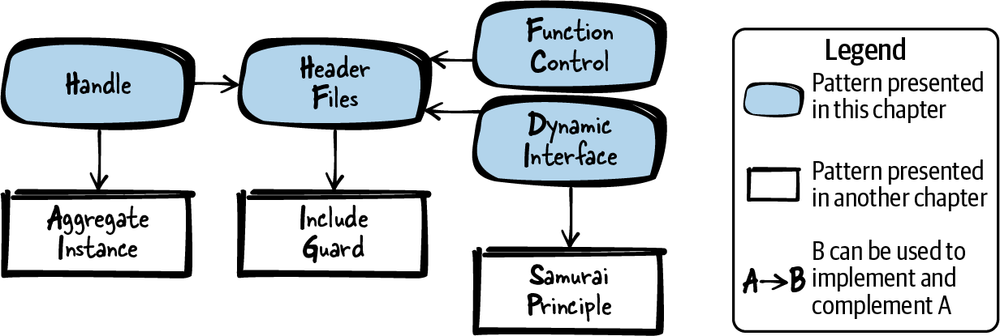
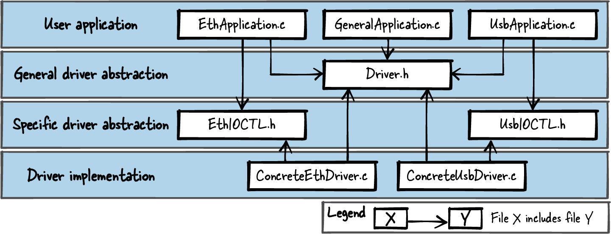

# 第 6 章  灵活的 API

设计接口时拿捏好灵活度与抽象度，是写软件最重要的事情之一：接口是一份契约，系统一旦投入运行，契约往往就改不动了。因此，把稳定的声明放进接口、把实现细节抽象起来，让细节保留日后变化的余地，就格外重要。

面向对象语言的设计指导（比如各种设计模式）汗牛充栋，而 C 这类过程式语言的同类指导却寥寥无几。SOLID 设计原则（见旁边栏）笼统地告诉你怎么设计好软件，但针对 C 语言的接口设计细节指导依然难寻——这正是本章模式的用武之地。

##### SOLID

SOLID 原则告诉我们如何实现优秀、灵活、可维护的软件。

**单**一职责原则（**S**ingle-responsibility principle）  
代码只有一个职责、只有一个将来要改变它的理由。

**开**闭原则（**O**pen-closed principle）  
代码应对行为变化开放，而无需修改既有代码。

**里**氏替换原则（**L**iskov substitution principle）  
实现同一接口的代码，对调用方应当可以互换。

**接**口隔离原则（**I**nterface segregation principle）  
接口应当精瘦，为调用方的需求量身定制。

**依**赖倒置原则（**D**ependency inversion principle）  
高层模块不应依赖于低层模块。

James Grenning 的文章[《SOLID Design for Embedded C》](https://oreil.ly/xrCtb)详细讲解了如何在 C 中落实 SOLID 原则。

[图 6-1](#overview_flexible_api) 给出了本章的四个模式及相关模式，[表 6-1](#tab_flexible_api) 是四个模式的一句话简介。记住：并非所有模式都该在所有场合套用。总的原则是：系统的复杂度不该超过必要的程度。也就是说，某些模式只有当你的 API 已经需要、或未来大概率需要那份灵活性时才值得用；若大概率用不上，就别用，让 API 保持尽可能简单。



###### 图 6-1  灵活 API 模式总览

|  | 模式名 | 摘要 |
|----|----|----|
|  | 头文件模式（Header Files） | 你想让自己实现的功能能被其他实现文件的代码访问，又想对调用方隐藏实现细节。因此，把想提供给用户的每个功能的函数声明放进 API；把所有内部函数、内部数据和函数定义（实现）藏进实现文件，且不把实现文件交给用户。 |
|  | 句柄（Handle） | 你的函数实现必须共享状态信息或操作共享资源，但又不想让调用方看到、更不想让它访问这些状态信息和共享资源。因此，提供一个创建上下文的函数，向调用方返回指向内部数据的抽象指针；要求调用方把这个指针传给你的所有函数，函数便可使用内部数据来存储状态信息和资源。 |
|  | 动态接口（Dynamic Interface） | 应当可以调用行为略有差异的实现，又不该复制任何代码——连控制逻辑实现和接口声明也不复制。因此，在 API 中为这些有差异的功能定义一个公共接口，要求调用方为该功能提供一个回调函数，你在函数实现中调用它。 |
|  | 函数控制（Function Control） | 你想调用行为略有差异的实现，又不想复制任何代码——连控制逻辑实现和接口声明也不复制。因此，给函数加一个传递函数调用元信息的参数，用它指定实际要执行的功能。 |

表 6-1  灵活 API 模式

本章的运行示例：你要为自己的以太网卡实现设备驱动。网卡固件提供若干寄存器，供你收发数据、配置网卡。你想给这些硬件细节做一层抽象，并确保实现改动时 API 的用户不受牵连。为此，你用头文件（Header Files）搭起一套 API。

# 头文件模式

## 上下文

你在用 C 写一个较大的软件。你把它拆成若干函数、放进若干文件实现，因为你想让程序模块化、好维护。

## 问题

**你想让自己实现的功能能被其他实现文件的代码访问，又想对调用方隐藏实现细节。**

与许多面向对象语言不同，C 没有内建的支持来定义 API、抽象功能、或强制调用方只能访问这层抽象。C 只提供了一个机制：把文件包含进其他文件。

你的代码的调用方大可以用这个机制直接包含你的实现文件。但这样一来，文件里的内部数据——那些你只打算内部使用的文件作用域变量和函数——调用方就全摸得着了。一旦调用方用上了这些内部功能，日后想改就不容易了：代码在你本不希望紧耦合的地方紧耦合了。而且包含实现文件后，内部变量和函数的名字还可能跟调用方的名字撞车。

## 方案

**把想提供给用户的每个功能的函数声明放进 API；把所有内部函数、内部数据和函数定义（实现）藏进实现文件，且不把实现文件交给用户。**

C 的通行惯例是：使用你软件的人只用你头文件（*\*.h* 文件）里定义的函数，不碰实现（*\*.c* 文件）里的其他函数。某些情况下这种抽象可以部分强制（比如别的文件用不了 `static` 函数），但 C 语言不能完全强制。因此，"不访问他人实现文件"的惯例比强制机制更加重要。

头文件里，务必把函数所需的全部相关物件都包含齐全：调用方不该为了用你头文件里的功能再去包含别的头文件。如果有多个头文件都要用的公共声明（如数据类型或 `#define`），就把它们放进单独的头文件，再由需要的头文件包含。为确保头文件不在一个编译单元中被包含多次，用包含保护（Include Guard）把它们护起来。

只有相关的函数才放进同一个头文件。函数操作同一个句柄（Handle）、或在同一领域干活（比如数学计算），就是同放一个头文件的信号。总的来说，只要你能想出一个需要用到全部这些函数的合理场景，就该把它们放进同一个头文件。

在头文件里把 API 的行为写清楚。用户不该为了搞懂 API 中函数怎么工作而翻看实现。

下面的代码展示了一个头文件：

*API（h 文件）*

```
/* Sorts the numbers of the 'array' in ascending order.
   'length' defines the number of elements in the 'array'. */
void sort(int* array, int length);
```

\
*实现（c 文件）*

```
void sort(int* array, int length)
{
  /* here goes the implementation*/
}
```

## 后果

与调用方相关的东西（*\*.h* 文件）和调用方无需操心的实现细节（*\*.c* 文件）泾渭分明。你为调用方抽象出了一层功能。

头文件一多，会影响构建时间。一方面，实现拆成了独立文件，工具链可以做增量构建——只重编改过的文件；另一方面，完整重建会比把代码全放一个文件略慢——构建得把所有文件都打开读一遍。

如果你发现函数之间需要更多交互、或要在需要不同内部状态信息的多个上下文中被调用，就得想想 API 该怎么应对。这种场合，句柄能帮上忙。

函数的调用方如今依赖这层抽象，还可能依赖"这些函数的行为不变"这个事实——API 可能必须保持稳定。加新功能，尽管往 API 里加新函数。但有时你想扩展既有函数；要应对这种未来变化，就得考虑如何让函数既灵活又稳定。这种场合，句柄、动态接口（Dynamic Interface）或函数控制（Function Control）能帮上忙。

## 已知应用

下面是一些应用该模式的实例：

- 几乎每个比"Hello World"大的 C 程序都有头文件。

- C 里用头文件，类似于 Java 里用接口、C++ 里用抽象类。

- Pimpl 惯用法描述了如何把私有实现细节藏起来、不进头文件。Portland Pattern Repository 里有这个惯用法的条目。

## 应用于运行示例

你的第一版设备驱动 API 长这样：

```
void sendByte(char byte);
char receiveByte();
void setIpAddress(char* ip);
void setMacAddress(char* mac);
```

API 的用户不必应付"怎么访问以太网寄存器"之类的实现细节，你也能随意改这些细节而不惊动用户。

现在需求变了：系统添了一块一模一样的以太网卡，两块卡都要能工作。有两个直截了当的选项：

- 把代码复制一份，一块网卡一套代码，拷贝时只改要访问的那块接口卡的地址。可这种代码重复从来不是好主意，维护难度直线上升。

- 给每个函数加一个指明网卡的参数（比如设备名字符串）。但函数间要共享的多半不止一个参数，每个函数都挨个传一遍，API 用起来就遭罪了。

支持多块以太网卡的更好办法，是给 API 引入句柄。

# 句柄

## 上下文

你想向调用方提供一组函数，这些函数操作共享资源或共享状态信息。

## 问题

**你的函数实现必须共享状态信息或操作共享资源，但又不想让调用方看到、更不想让它访问这些状态信息和共享资源。**

这些状态信息和共享资源应当对调用方隐身，这样日后你想改它、加它，都不必动调用方的代码。

在面向对象语言里，函数操作的这类数据由类成员变量实现；调用方不该访问的，可以设为私有。可 C 原生没有类和私有成员变量。

在实现文件里放一个带全局状态的软件模块、用静态全局变量存函数间的共享数据？也不行：你的函数要能在多个上下文中调用，每个调用方的函数调用都要能积累自己的状态信息。这些信息虽对调用方隐身，但你得有办法分辨哪份信息属于哪个调用方、并在函数实现中访问它。

## 方案

**提供一个创建上下文的函数，向调用方返回指向内部数据的抽象指针；要求调用方把这个指针传给你的所有函数，函数便可使用内部数据来存储状态信息和资源。**

你的函数知道怎么解释这个抽象指针——它是一种不透明数据类型，也称句柄。但被指向的数据结构不该出现在 API 里：API 只提供把隐藏数据递交给函数的能力。

句柄可以实现为指向聚合实例（如 `struct`）的指针。`struct` 应包含全部所需的状态信息和其他变量——通常就是你在面向对象编程中会声明为对象成员变量的那些。`struct` 藏在你的实现里，API 中只有一个指向 `struct` 的指针定义，如下面的代码所示：

*API*

```
typedef struct SORT_STRUCT* SORT_HANDLE;

SORT_HANDLE prepareSort(int* array, int length);
void sort(SORT_HANDLE context);
```

\
*实现*

```
struct SORT_STRUCT
{
  int* array;
  int length;
  /* other parameters like sort order */
};

SORT_HANDLE prepareSort(int* array, int length)
{
  struct SORT_STRUCT* context = malloc(sizeof(struct SORT_STRUCT));
  context->array = array;
  context->length = length;

  /* fill context with required data or state information */

  return context;
}

void sort(SORT_HANDLE context)
{
  /* operate on context data */
}
```

API 里放一个创建句柄的函数，由它把句柄交给调用方。调用方随后就可以调用 API 中其他需要句柄的函数。多数情况下，你还需要一个删除句柄的函数，负责清理分配的全部资源。

## 后果

函数之间现在可以共享状态信息和资源，调用方既不必操心，也没有机会让代码依赖这些内部细节。

支持多份数据实例：创建句柄的函数可以调用多次，取得多个上下文，各上下文彼此独立、互不干扰。

操作句柄的函数日后若要共享不同或更多的数据，改改 `struct` 的成员即可，调用方代码一行不动。

函数声明明明白白地显示它们紧耦合——全都离不开同一个句柄。这既让你一眼看出哪些函数该进同一个头文件，也让调用方一眼看出哪些函数该搭配使用。

代价是：调用方现在要为每次函数调用多递一个参数，参数越多，代码越难读。

## 已知应用

下面是一些应用该模式的实例：

- C 标准库在 *stdio.h* 中定义了 `FILE`。多数实现把它定义成指向 `struct` 的指针，而 `struct` 本身不在头文件里。`FILE` 句柄由 `fopen` 创建，之后可以对打开的文件调用一系列函数（`fwrite`、`fread` 等）。

- OpenSSL 代码中的 `struct` `AES_KEY` 用于在 AES 加密相关的几个函数之间（`AES_set_decrypt_key`、`AES_set_encrypt_key`）传递上下文。这个 `struct` 及其成员没有藏进实现，而是放在了头文件里——因为 OpenSSL 其他部分的代码需要知道它的大小。

- Subversion 项目的日志功能代码操作一个句柄：`struct` `logger_t` 定义在日志功能的实现文件中，指向它的指针则定义在相应的头文件里。

- 该模式在 David R. Hanson 的《C Interfaces and Implementations》（Addison-Wesley，1996）中叫不透明指针类型（Opaque Pointer Type），在 Adam Tornhill 的《Patterns in C》（Leanpub，2014）中叫"一等抽象数据类型模式"（First Class Abstract Data Type Pattern）。

## 应用于运行示例

现在你想支持几块以太网卡都行。驱动创建的每个实例都有自己的数据上下文，经句柄传给各函数。你的设备驱动 API 如下：

```
/* the INTERNAL_DRIVER_STRUCT contains data shared by the functions (like
   how to select the interface card the driver is responsible for) */
typedef struct INTERNAL_DRIVER_STRUCT* DRIVER_HANDLE;

/* 'initArg' contains information for the implementation to identify
   the exact interface for the driver instance */
DRIVER_HANDLE driverCreate(void* initArg);
void driverDestroy(DRIVER_HANDLE h);
void sendByte(DRIVER_HANDLE h, char byte);
char receiveByte(DRIVER_HANDLE h);
void setIpAddress(DRIVER_HANDLE h, char* ip);
void setMacAddress(DRIVER_HANDLE h, char* mac);
```

需求又变了：现在要支持多种不同的以太网卡，比如来自不同厂商的。卡的功能相近，寄存器的访问细节却各有千秋，驱动也就需要不同的实现。两个直截了当的选项：

- 上两套各自独立的驱动 API。坏处：用户要自己搭运行时选择驱动的机制，麻烦；而且两套 API 有代码重复——两个设备驱动至少共享一套公共控制流（比如驱动的创建和销毁）。

- 在 API 里加 `sendByteDriverA`、`sendByteDriverB` 这样的函数。可你通常希望 API 尽量精简：一个 API 塞进所有驱动函数会把用户绕晕。何况用户的代码依赖 API 引入的每一个函数签名——代码依赖什么，什么就该尽量少（接口隔离原则）。

支持不同以太网卡的更好办法，是提供动态接口（Dynamic Interface）。

# 动态接口

## 上下文

你或你的调用方想实现多个控制逻辑相似、行为有差异的功能。

## 问题

**应当可以调用行为略有差异的实现，又不该复制任何代码——连控制逻辑实现和接口声明也不复制。**

你希望日后能向已声明的接口追加新的实现行为，而使用既有实现行为的调用方一行代码都不用改。

也许你不只想在不复制自己代码的前提下向调用方提供不同行为，还想给调用方一个机制，让他们带入自己的实现行为。

## 方案

**在 API 中为这些有差异的功能定义一个公共接口，要求调用方为该功能提供一个回调函数，你在函数实现中调用它。**

在 C 里实现这种接口，就是在 API 中定义函数签名。调用方按签名实现函数，经函数指针挂接上来：既可以永久地挂接、存进你的软件模块，也可以随每次函数调用传入，如下面的代码所示：

*API*

```
/* The compare function should return true if x is smaller than y, else false */
typedef bool (*COMPARE_FP)(int x, int y);

void sort(COMPARE_FP compare, int* array, int length);
```

\
*实现*

```
void sort(COMPARE_FP compare, int* array, int length)
{
  int i, j;
  for(i=0; i<length; i++)
  {
    for(j=i; j<length; j++)
    {
      /* call provided user function */
      if(compare(array[i], array[j]))
      {
        swap(&array[i], &array[j]);
      }
    }
  }
}
```

*调用方*

```
#define ARRAY_SIZE 4

bool compareFunction(int x, int y)
{
  return x<y;
}

void sortData()
{
  int array[ARRAY_SIZE] = {3, 5, 6, 1};
  sort(compareFunction, array, ARRAY_SIZE);
}
```

务必在函数签名定义旁边写清楚：函数实现应当有什么行为。还要写清楚：函数调用没挂接任何实现时会怎样——也许终止程序（武士道原则），也许提供一个默认功能兜底。

## 后果

调用方可以用不同的实现，且没有代码重复：控制逻辑、接口、接口文档，一概不重复。

调用方日后可以追加实现而无需改 API。这意味着 API 设计者和实现提供者两个角色可以彻底分离。

你的代码现在执行的是调用方的代码，你得信任调用方知道函数该干什么。调用方代码有 bug 时，你的代码可能先被怀疑——毕竟错误行为是在你的代码上下文里冒出来的。

使用函数指针意味着你拿到的是一个与平台、与编程语言绑定的接口：只有调用方代码也是 C 时才能用这个模式。你没法给这个接口加上编组（marshaling）能力，再提供给用 Java 写应用的调用方。

## 已知应用

下面是一些应用该模式的实例：

- James Grenning 在文章[《SOLID Design for Embedded C》](https://oreil.ly/kGZVG)中把这个模式及一个变体描述为动态接口（Dynamic Interface）和按类型动态接口（Per-Type Dynamic Interface）。

- 上述方案是策略（Strategy）设计模式的 C 版本。该模式的其他 C 实现可见 Adam Tornhill 的《Patterns in C》（Leanpub，2014）和 David R. Hanson 的《C Interfaces and Implementations》（Addison-Wesley，1996）。

- 设备驱动框架常用函数指针，驱动在启动时把自己的函数插进去。Linux 内核的设备驱动多半就是这么干的。

- Subversion 项目源码的 `svn_sort__hash` 函数按键值排序列表，它接收函数指针 `comparison_func` 作参数——后者必须返回两个给定键值谁大谁小。

- OpenSSL 的 `OPENSSL_LH_new` 函数创建哈希表，调用方必须提供指向哈希函数的指针，作为操作哈希表时的回调。

- Wireshark 代码中的函数指针 `proto_tree_foreach_func` 在遍历树结构时作为函数参数传入，用来决定对树元素执行哪些动作。

## 应用于运行示例

你的驱动 API 现在支持多种不同的以太网卡了。各卡的具体驱动要实现收发函数，并把它们放进单独的头文件；API 用户再包含这些头文件，把具体的收发函数挂接到 API 上。

好处是：API 的用户可以带入自己的驱动实现，你作为 API 设计者就此独立于驱动实现的提供者。集成新驱动不需要改 API——也就是说，不需要你这位 API 设计者动一根手指。以下 API 即可实现这一切：

```
typedef struct INTERNAL_DRIVER_STRUCT* DRIVER_HANDLE;
typedef void (*DriverSend_FP)(char byte);      /* this is the           */
typedef char (*DriverReceive_FP)();            /* interface definition */

struct DriverFunctions
{
  DriverSend_FP fpSend;
  DriverReceive_FP fpReceive;
};

DRIVER_HANDLE driverCreate(void* initArg, struct DriverFunctions f);
void driverDestroy(DRIVER_HANDLE h);
void sendByte(DRIVER_HANDLE h, char byte);   /* internally calls fpSend    */
char receiveByte(DRIVER_HANDLE h);           /* internally calls fpReceive */
void setIpAddress(DRIVER_HANDLE h, char* ip);
void setMacAddress(DRIVER_HANDLE h, char* mac);
```

需求再次变化：现在不止要支持以太网卡，还要支持其他接口卡（比如 USB 接口卡）。从 API 的视角看，这些接口有些功能相似（收发数据的函数），有些功能迥异（比如 USB 接口没有 IP 地址可设，却可能需要别的配置）。

直接的方案是给不同驱动类型各配一套 API。但收发和创建/销毁函数的代码就重复了。

在单一抽象 API 中支持多种设备驱动的更好方案，是引入函数控制（Function Control）。

# 函数控制

## 上下文

你想实现多个控制逻辑相似、行为有差异的功能。

## 问题

**你想调用行为略有差异的实现，又不想复制任何代码——连控制逻辑实现和接口声明也不复制。**

调用方应当能用上你实现的既有行为；你日后还应当能加新行为，既不动既有实现，也不要求既有调用方改代码。

动态接口不适合你：你不想给调用方挂接自己实现的灵活性。也许是因为接口应该更好用，也许是因为调用方的实现没法轻易挂接上来——比如调用方用别的编程语言访问你的功能。

## 方案

**给函数加一个传递函数调用元信息的参数，用它指定实际要执行的功能。**

与动态接口相比，你不要求调用方提供实现，而是让调用方从既有实现中挑选。

实现这个模式用的是基于数据的抽象：加一个额外参数（比如 `enum` 或 `#define` 整数值）指定函数行为；实现中评估该参数，按取值调用不同的实现：

*API*

```
#define QUICK_SORT 1
#define MERGE_SORT 2
#define RADIX_SORT 3

void sort(int algo, int* array, int length);
```

\
*实现*

```
void sort(int algo, int* array, int length)
{
  switch(algo)
  {
    case QUICK_SORT: 
      quicksort(array, length);
    break;
    case MERGE_SORT:
      mergesort(array, length);
    break;
    case RADIX_SORT:
      radixsort(array, length);
    break;
  }
}
```

[](#co_flexible_apis_CO1-1)  
日后加新功能时，只需新增一个 `enum` 或 `#define` 值，并选中对应的新实现。

## 后果

调用方可以用不同的实现，且没有代码重复：控制逻辑、接口、接口文档，一概不重复。

日后加新功能容易：既不必动既有实现，既有调用方的代码也不受影响。

与动态接口相比，这个模式更便于跨程序、跨平台选择功能（比如远程过程调用），因为 API 不传递程序专属的指针。

把多种实现行为的选择集中到一个函数里，你可能经不住诱惑，把几个并不紧密相关的功能硬塞进同一个函数——这违背单一职责原则。

## 已知应用

下面是一些应用该模式的实例：

- 设备驱动常用函数控制来传递塞不进常规 init/read/write 函数的特定功能。在设备驱动领域，这个模式广为人知的名字是 I/O 控制（I/O-Control）。这个概念见 Elecia White 的《Making Embedded Systems: Design Patterns for Great Software》（O'Reilly，2011，中译《嵌入式系统软件设计》）。

- 一些 Linux 系统调用通过追加标志位扩展功能：标志取值不同，行为不同，而老代码毫发无伤。

- 数据驱动 API 的一般概念见 Martin Reddy 的《API Design for C++》（Morgan Kaufmann，2011）。

- OpenSSL 代码用 `CTerr` 函数记录错误。它接收一个 `enum` 参数，指定错误记在哪里、怎么记。

- POSIX socket 函数 `ioctl` 接收数字参数 `cmd`，决定对 socket 执行哪个动作。参数的合法取值在一个头文件中定义和记录；自该头文件首次发布以来，取值和相应的函数行为已增加了许多。

- Subversion 项目的 `svn_fs_ioctl` 函数执行文件系统特定的输入/输出操作，接收 `struct` `svn_fs_ioctl_code_t` 作参数，其中包含一个决定执行哪种操作的数值。

## 应用于运行示例

下面的代码是设备驱动 API 的最终版本：

*Driver.h*

```
typedef struct INTERNAL_DRIVER_STRUCT* DRIVER_HANDLE;
typedef void (*DriverSend_FP)(char byte);
typedef char (*DriverReceive_FP)();
typedef void (*DriverIOCTL_FP)(int ioctl, void* context);

struct DriverFunctions
{
  DriverSend_FP fpSend;
  DriverReceive_FP fpReceive;
  DriverIOCTL_FP fpIOCTL;
};

DRIVER_HANDLE driverCreate(void* initArg, struct DriverFunctions f);
void driverDestroy(DRIVER_HANDLE h);
void sendByte(DRIVER_HANDLE h, char byte);
char receiveByte(DRIVER_HANDLE h);
void driverIOCTL(DRIVER_HANDLE h, int ioctl, void* context);
/* the parameter "context" is required to pass information like the
   value of the IP address to configure to the implementation */
```

\
*EthIOCTL.h*

```
#define SET_IP_ADDRESS  1
#define SET_MAC_ADDRESS 2
```

\
*UsbIOCTL.h*

```
#define SET_USB_PROTOCOL_TYPE   3
```

想用以太网或 USB 专属功能的用户（比如实际经接口收发数据的应用），得知道自己操作的是哪种驱动类型，才能调对 I/O 控制码，也得包含 *EthIOCTL.h* 或 *UsbIOCTL.h* 文件。

[图 6-2](#fig_func_ctl) 展示了这版最终设备驱动 API 的源码文件包含关系。注意 *EthApplication.c* 代码并不依赖 USB 专属头文件：比如再新增一个 USB-IOCTL，图中所示的 *EthApplication.c* 甚至不必重新编译——它依赖的文件一个都没变。



###### 图 6-2  函数控制的文件关系

记住：本章展示的所有代码片段中，这最后一个最灵活的设备驱动版本未必总是你要的。接口的灵活性是拿复杂度换来的；代码必须做到所需的灵活，但同时要始终力求简单。

# 小结

本章讨论了四个 C 的 API 模式，并用设计设备驱动的运行示例演示了它们的应用。头文件模式讲的是基本套路：实现细节藏进 c 文件，h 文件提供定义良好的接口。句柄模式讲的是人尽皆知的套路：在函数之间传递不透明数据类型来共享状态信息。动态接口通过回调函数注入调用方专属代码，避免复制程序逻辑。函数控制用一个额外的函数参数指定函数调用实际执行的动作。这些模式展示了让接口通过引入抽象而变得更灵活的基本 C 设计选项。

# 延伸阅读

如果你想更进一步，下面这些资料可以帮你深化 API 设计的功力。

- James Grenning 的文章[《SOLID Design for Embedded C》](https://oreil.ly/07SUX)总体覆盖 SOLID 五大设计原则，并给出让 C 接口变灵活的多种实现办法。它的独特之处在于：这是唯一一篇专门针对 C 讲接口、还附详细代码片段的文章。

- Adam Tornhill 的《Patterns in C》（Leanpub，2014）给出多个附 C 代码片段的模式：既有策略、观察者这类"四人帮"模式的 C 版本，也有 C 特有的模式和惯用法。该书并非专门讲接口，但若干模式描述了接口层面的交互。

- Martin Reddy 的《API Design for C++》（Morgan Kaufmann，2011）覆盖接口的设计原则、带 C++ 示例的面向对象接口模式，以及测试、文档等接口质量问题。它讲的是 C++ 设计，但部分内容对 C 同样适用。

- David R. Hanson 的《C Interfaces and Implementations》（Addison-Wesley，1996）展示接口设计，附多个 C 组件的 C 代码实现。

# 展望

下一章将深入讨论一类非常具体的应用如何找到合适的抽象层级和接口：如何设计和实现迭代器。
