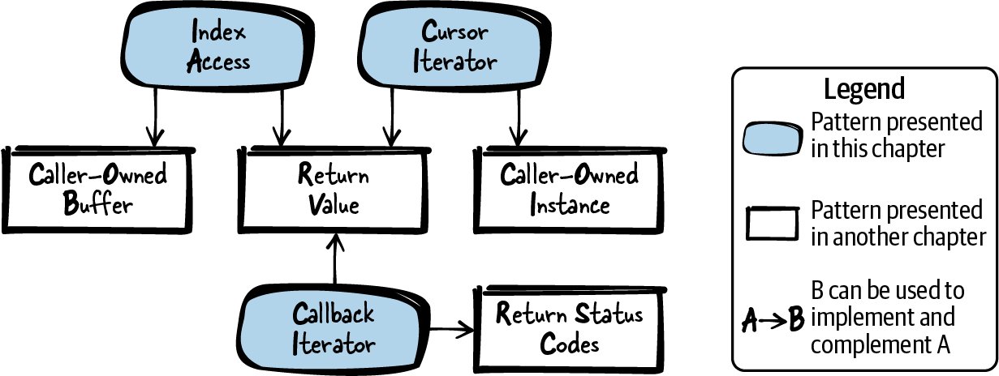
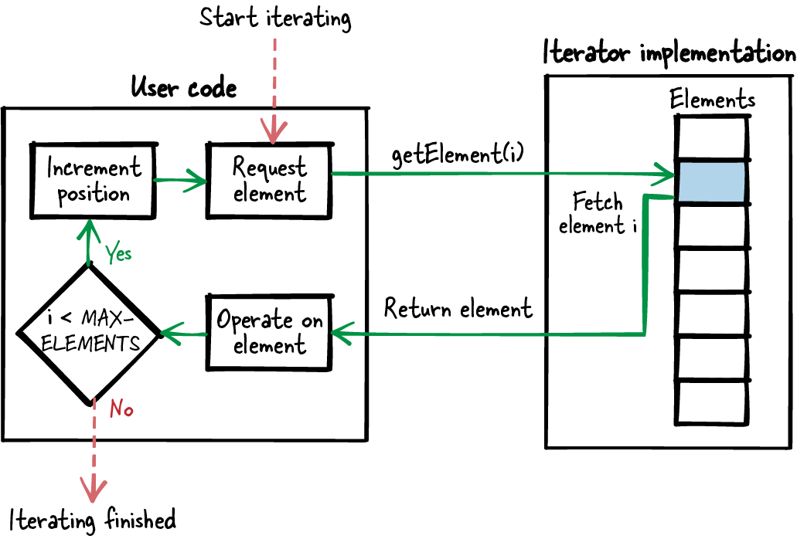
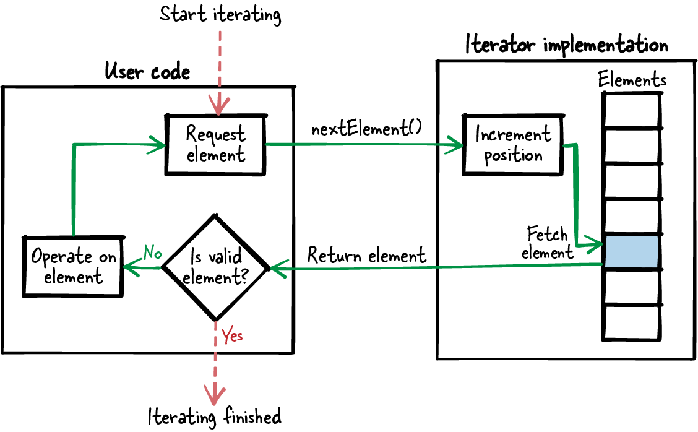
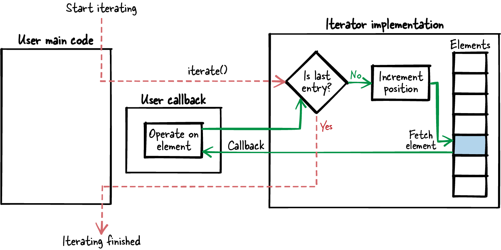

# 第 7 章  灵活的迭代器接口

遍历一组元素是任何程序中的常见操作。有些编程语言为元素遍历提供原生构造，面向对象语言也有设计模式形态的指导来讲如何实现通用的迭代功能。而 C 这类过程式语言，这方面的指导少得可怜。

动词"迭代"（iterate）意为把同一件事做很多遍。在编程中，它通常指对多个数据元素运行同一段程序代码。这种操作太常用了，所以 C 对数组原生支持，如下面的代码所示：

```
for (i=0; i<MAX_ARRAY_SIZE; i++)
{
  doSomethingWith(my_array[i]);
}
```

想遍历别的数据结构——比如红黑树——就得自己实现迭代函数了。你还可以给函数配上数据结构专属的迭代选项，比如按深度优先还是广度优先遍历。如何实现这些特定数据结构、它们的迭代接口长什么样，文献不少。可如果你用了这种与数据结构绑定的迭代接口，而底层数据结构又变了，你的迭代函数和所有调用它的代码都得跟着改。有些场合这无伤大雅、甚至必要——你要执行的正是底层结构特有的某种特殊迭代（比如为了优化性能）。

另一些场合，你要跨组件边界提供迭代接口，这种漏出实现细节的抽象就行不通了：日后接口可能被迫变更。举例来说，你卖给客户一个提供迭代功能的组件，客户拿这些函数写了代码，那么当你交付使用不同数据结构的新版组件时，客户自然指望代码一行不改照样能跑。这种情况下，你甚至要额外花力气确保对客户的接口保持兼容——他们不必改代码，甚至不必重新编译。

这正是本章的起点。我将给你三个模式，讲你——迭代器的实现者——如何向用户（客户）提供稳定的迭代器接口。这些模式不讲特定数据结构的特定迭代器，而是假定你的实现里已经有了从底层数据结构取元素的函数。模式展示的是：如何抽象这些函数，从而提供稳定的迭代接口。

[图 7-1](#fig_iterator) 给出了本章所有模式及其相互关系的总览，[表 7-1](#tab_iterator) 则是各模式的一句话摘要。



###### 图 7-1  迭代器接口模式总览

|  | 模式名 | 摘要 |
|----|----|----|
|  | 下标访问（Index Access） | 你想让用户便捷地遍历你数据结构中的元素，且数据结构内部的变化不牵连用户代码。因此，提供一个接收下标、寻址底层数据结构中元素并返回其内容的函数；用户在循环里调用它即可遍历全部元素。 |
|  | 游标迭代器（Cursor Iterator） | 你想向用户提供一个迭代接口：元素在迭代期间变化也稳如泰山，底层数据结构日后更换也不要求用户改一行代码。因此，创建一个指向底层数据结构中某元素的迭代器实例；迭代函数以该实例为参数，取出迭代器当前指向的元素，并把实例改为指向下一个元素。用户循环调用这个函数，一次取一个元素。 |
|  | 回调迭代器（Callback Iterator） | 你想提供一个稳健的迭代接口：用户不必在代码里写循环来遍历全部元素，底层数据结构日后更换也不要求用户改一行代码。因此，在实现内部用你既有的数据结构专属操作遍历所有元素，并在遍历中对每个元素调用用户提供的外部函数。该函数以元素内容为参数，对元素执行操作。用户只需调用一个函数触发迭代，整个遍历都发生在你的实现内部。 |

表 7-1  迭代器接口模式

# 运行示例

你为自己的应用实现了一个访问控制组件，底层数据结构支持随机访问任意元素。更具体地说，下面的代码用一个 `struct` 数组存放账户信息（登录名、密码等）：

```
struct ACCOUNT
{
  char loginname[MAX_NAME_LENGTH];
  char password[MAX_PWD_LENGTH];
};
struct ACCOUNT accountData[MAX_USERS];
```

下面的代码展示用户如何访问这个 struct 来读取登录名之类的特定信息：

```
void accessData()
{
  char* loginname;

  loginname = accountData[0].loginname;
  /* do something with loginname */

  loginname = accountData[1].loginname;
  /* do something with loginname */
}
```

当然，你也可以干脆不为数据结构的访问做抽象，让其他程序员直接拿到指向这个 `struct` 的指针，自己循环遍历、想访问什么访问什么。但这是个坏主意：数据结构里也许有你不愿提供给客户的信息。何况接口要对客户长期稳定，一旦泄露过什么信息，以后就删不掉了——客户可能在用，你不想弄坏客户的代码。

避开这个麻烦的好得多的办法：只让用户访问必要的信息。一个简单的方案是提供下标访问（Index Access）。

# 下标访问

## 上下文

你有一组元素存在一个可随机访问的数据结构里，比如数组或带随机取元素函数的数据库。用户想遍历这些元素。

## 问题

**你想让用户便捷地遍历你数据结构中的元素，且数据结构内部的变化不牵连用户代码。**

用户写的代码可能不随你的代码库一起版本化和发布，所以你必须确保：实现的未来版本与用户基于当前版本写的代码依然合拍。因此，用户不该摸到任何内部实现细节——比如承载元素的底层数据结构——因为你日后可能要改它。

## 方案

**提供一个接收下标、寻址底层数据结构中元素并返回其内容的函数。用户在循环里调用它即可遍历全部元素，如图 7-2 所示。**



###### 图 7-2  按下标访问的迭代

这种做法等价于：在数组里，用户直接用下标取某个元素的值、或遍历所有元素。但有了接收下标的函数，更复杂的底层数据结构也能照样遍历，用户无需知情。

为此，只把用户感兴趣的数据交给他们，别把底层数据结构的元素整个亮出来。比如别返回指向整个 `struct` 元素的指针，只返回指向用户感兴趣的那个 `struct` 成员的指针：

*调用方代码*

```
void* element;

element = getElement(1);
/* operate on element 1 */

element = getElement(2);
/* operate on element 2 */
```

\
*迭代器 API*

```
#define MAX_ELEMENTS 42

/* Retrieve one single element identified by the provided 'index' */
void* getElement(int index);
```

## 后果

用户用下标在代码里轻松循环取元素，不必应付数据来源的内部数据结构。实现有变（比如被取的 `struct` 成员改了名），用户连重新编译都不用。

底层数据结构的其他变化就可能难办了。比如底层数据结构从数组（可随机访问）换成链表（只能顺序访问），每次都得从头把链表走到请求的下标处，效率惨不忍睹。要确保底层数据结构怎么换都行，用游标迭代器（Cursor Iterator）或回调迭代器（Callback Iterator）更好。

用户取的若是能作为 C 函数返回值的基本数据类型，那拿到的隐式就是该元素的一份副本：底层元素这期间变了，也不影响用户。取的若是更复杂的类型（比如字符串），下标访问比直接开放底层数据结构多出一个优势：你可以线程安全地拷贝当前数据元素再交给用户——比如用调用方拥有的缓冲区（Caller-Owned Buffer）。不在多线程环境的话，复杂类型直接返回指针也未尝不可。

访问一组元素时，用户常要遍历全部。若这期间别人往底层数据里增删了元素，用户对下标的理解就可能失效，遍历中没准儿会把同一个元素取两遍。一个直接的办法：把用户感兴趣的全部元素拷进一个数组，把这个专属数组交给用户，让它随便循环——用户对这份副本拥有专属所有权，甚至可以改元素。但若无明确需要，全部拷一遍未必值得。更省心的方案——让用户根本不必担心迭代期间底层数据顺序变化——是提供回调迭代器。

## 已知应用

下面是一些应用该模式的实例：

- James Noble 在文章[《Iterators and Encapsulation》](https://oreil.ly/fganK)中描述了外部迭代器（External Iterator）模式，是该模式概念的面向对象版本。

- Mark Allen Weiss 的《Data Structures and Problem Solving Using Java》（Addison-Wesley，2006）描述了这种做法，称之为类数组接口的访问。

- Wireshark 代码的 `service_response_time_get_column_name` 函数返回统计表的列名。要返回哪个名字，由用户提供的下标参数寻址。列名运行期不变，因此哪怕在多线程环境里，这种访问数据、遍历列名的方式也是安全的。

- Subversion 项目有一段构建字符串表的代码，字符串可用 `svn_fs_x__string_table_get` 函数访问。该函数接收下标作参数，用来寻址要取的字符串，取到的字符串拷进调用方提供的缓冲区。

- OpenSSL 的 `TXT_DB_get_by_index` 函数从文本数据库取出按下标选中的字符串，存进调用方提供的缓冲区。

## 应用于运行示例

现在你有了读取登录名的干净抽象，也不向用户泄露内部实现细节：

```
char* getLoginName(int index)
{
  return accountData[index].loginname;
}
```

用户不必应付底层 `struct` 数组的访问。好处有二：取所需数据更轻松；他们也没法使用任何不该给他们看的信息。比如，`struct` 里那些你日后想改的子元素他们碰不到——而只有没人访问的数据，你才敢改，因为你不想弄坏用户的代码。

用这个接口的人，比如想写个"有没有登录名以字母 X 开头"的检查函数的人，代码这么写：

```
bool anyoneWithX()
{
  int i;
  for(i=0; i<MAX_USERS; i++)
  {
    char* loginName = getLoginName(i);
    if(loginName[0] == 'X')
    {
      return true;
    }
  }
  return false;
}
```

你本对这个实现颇为满意，直到存放登录名的数据结构变了：你需要更方便地插入、删除账户数据，而纯数组干这个太费劲。于是登录名不再存于单个纯数组，而是存于一个底层数据结构——它提供"从当前元素走到下一个"的操作，却不提供随机访问。具体地说，你有了一个可以遍历的链表，如下面的代码所示：

```
struct ACCOUNT_NODE
{
  char loginname[MAX_NAME_LENGTH];
  char password[MAX_PWD_LENGTH];
  struct ACCOUNT_NODE* next;
};

struct ACCOUNT_NODE* accountList;

struct ACCOUNT_NODE* getFirst()
{
  return accountList;
}

struct ACCOUNT_NODE* getNext(struct ACCOUNT_NODE* current)
{
  return current->next;
}

void accessData()
{
  struct ACCOUNT_NODE* account = getFirst();
  char* loginname = account->loginname;
  account = getNext(account);
  loginname = account->loginname;
  ...
}
```

这下你现有的接口难办了：它一次交出一个按下标随机访问的登录名。要继续撑下去，你只能靠反复调用 `getNext` 数数，数到下标所指的元素为止——效率低得可怜。这一切折腾，都只怪接口当初设计得不够灵活。

想让日子好过，就提供一个游标迭代器（Cursor Iterator）来访问登录名。

# 游标迭代器

## 上下文

你有一组元素存在可随机或顺序访问的数据结构里，比如数组、链表、哈希表或树。用户想遍历这些元素。

## 问题

**你想向用户提供一个迭代接口：元素在迭代期间变化也稳如泰山，底层数据结构日后更换也不要求用户改一行代码。**

用户写的代码可能不随你的代码库一起版本化和发布，所以你必须确保：实现的未来版本与用户基于当前版本写的代码依然合拍。因此，用户不该摸到任何内部实现细节——比如承载元素的底层数据结构——因为你日后可能要改它。

此外，多线程环境下，若用户遍历元素期间元素内容变了，你要给用户提供稳健、明确的行为。哪怕数据像字符串这么复杂，用户也不必提心吊胆地担心别的线程在自己读的时候改数据。

为此多花点实现功夫你并不在乎：用你代码的人很多，你把实现功夫揽到自己代码里、从用户肩上卸下来，总账是省的。

## 方案

**创建一个指向底层数据结构中某元素的迭代器实例。迭代函数以该实例为参数，取出迭代器当前指向的元素，并把实例改为指向下一个元素。用户循环调用这个函数，一次取一个元素，如图 7-3 所示。**



###### 图 7-3  用游标迭代器遍历

迭代器接口需要两个函数创建和销毁迭代器实例，再要一个函数执行实际迭代、取回当前元素。有了显式的创建/销毁函数，你就有了一个可以存放内部迭代数据（位置、当前元素数据）的实例。用户把这个实例传给你所有的迭代函数调用，如下面的代码所示：

*调用方代码*

```
void* element;
ITERATOR* it = createIterator();

while(element = getNext(it))
{
  /* operate on element */
}

destroyIterator(it);
```

\
*迭代器 API*

```
/* Creates an iterator and moves it to the first element */
ITERATOR* createIterator();

/* Returns the element currently pointed to and sets the iterator to the
   next element. Returns NULL if the element does not exist. */
void* getNext(ITERATOR* iterator);

/* Cleans up an iterator created with the function createIterator() */
void destroyIterator(ITERATOR* iterator),
```

若不想让用户摸到这些内部数据，可以把它藏起来，只给用户一个句柄（Handle）。这样，迭代实例内部数据怎么变都伤不到用户。

取当前元素时，基本数据类型可以直接作为返回值交付；复杂类型要么按引用返回，要么拷进迭代器实例。拷进实例的好处是数据自洽——哪怕底层数据结构这期间变了（比如多线程环境里被别人改了）。

## 后果

用户只要不停调用 `getNext`、有有效元素拿，遍历就一路顺遂：不必应付数据来源的内部结构，不必操心元素下标和元素总数上限。但没法按下标寻址也意味着用户无法随机访问元素（下标访问可以）。

底层数据结构变了——比如从链表换成数组这类可随机访问的结构——变化也藏在迭代器实现里，用户既不用改代码，也不用重新编译。

无论取的是简单还是复杂的数据类型，用户都不必担心拿到的元素因为底层元素这期间被改动或删除而失效。作为代价，用户现在要显式调用创建和销毁迭代器实例的函数——比起下标访问，函数调用更多了。

访问一组元素时，用户常要遍历全部。若这期间别人往底层数据里加了元素，用户遍历时可能错过它。若这对你是个问题、你想确保迭代期间元素绝不变动，用回调迭代器更省事。

## 已知应用

下面是一些应用该模式的实例：

- James Noble 在文章[《Iterators and Encapsulation》](https://oreil.ly/NVnbw)中把这个迭代器的面向对象版本描述为魔法曲奇（Magic Cookie）模式。

- Jed Liu 等人的文章[《Interruptible Iterators》](https://oreil.ly/BzFJJ)把这里讲的概念称为*游标对象*（cursor object）。

- 文件访问用的就是这种迭代。例如 C 函数 `getline` 遍历文件中的行，迭代位置就存在 `FILE` 指针里。

- OpenSSL 代码提供 `ENGINE_get_first` 和 `ENGINE_get_next` 函数遍历加密引擎列表。每次调用都接收指向 `ENGINE struct` 的指针作参数，该 `struct` 存着迭代当前位置。

- Wireshark 代码有 `proto_get_first_protocol` 和 `proto_get_next_protocol` 函数，让用户遍历网络协议列表。这两个函数用一个 `void` 指针作输出参数，存取并传递状态信息。

- Subversion 项目生成文件差异的代码中有 `datasource_get_next_token` 函数，把它放进循环里调用，即可从存有迭代位置的数据源对象中一个个取出差异 token。

## 应用于运行示例

你现在用下面的函数取登录名：

```
struct ITERATOR
{
  char buffer[MAX_NAME_LENGTH];
  struct ACCOUNT_NODE* element;
};

struct ITERATOR* createIterator()
{
  struct ITERATOR* iterator = malloc(sizeof(struct ITERATOR));
  iterator->element = getFirst();
  return iterator;
}

char* getNextLoginName(struct ITERATOR* iterator)
{
  if(iterator->element != NULL)
  {
    strcpy(iterator->buffer, iterator->element->loginname);
    iterator->element = getNext(iterator->element);
    return iterator->buffer;
  }
  else
  {
    return NULL;
  }
}

void destroyIterator(struct ITERATOR* iterator)
{
  free(iterator);
}
```

下面的代码展示了这个接口的用法：

```
bool anyoneWithX()
{
  char* loginName;
  struct ITERATOR* iterator = createIterator();
  while(loginName = getNextLoginName(iterator)) 
  {
    if(loginName[0] == 'X')
    {
      destroyIterator(iterator); 
      return true;
    }
  }
  destroyIterator(iterator); 
  return false;
}
```

[](#co_flexible_iterator_interfaces_CO1-1)  
应用程序再也不必应付下标和元素总数上限。

[](#co_flexible_iterator_interfaces_CO1-2)  
这里，销毁迭代器所需的清理代码造成了代码重复。

接下来你不只想实现 `anyoneWithX` 函数，还想再实现一个函数，比如统计有多少登录名以字母"Y"开头。直接拷代码、改 `while` 循环体、数"Y"的出现次数当然可以，但这样一来代码就重复了：两个函数都包含创建和销毁迭代器、执行循环操作的同一套代码。要避免重复，改用回调迭代器（Callback Iterator）。

# 回调迭代器

## 上下文

你有一组元素存在可随机或顺序访问的数据结构里，比如数组、链表、哈希表或树。用户想遍历这些元素。

## 问题

**你想提供一个稳健的迭代接口：用户不必在代码里写循环来遍历全部元素，底层数据结构日后更换也不要求用户改一行代码。**

用户写的代码可能不随你的代码库一起版本化和发布，所以你必须确保：实现的未来版本与用户基于当前版本写的代码依然合拍。因此，用户不该摸到任何内部实现细节——比如承载元素的底层数据结构——因为你日后可能要改它。

此外，多线程环境下，若用户遍历元素期间元素内容变了，你要给用户提供稳健、明确的行为。哪怕数据像字符串这么复杂，用户也不必提心吊胆地担心别的线程在自己读的时候改数据。你还要确保用户对每个元素恰好遍历一次——哪怕迭代期间其他线程试图新建或删除元素。

为此多花点实现功夫你并不在乎：用你代码的人很多，你把实现功夫揽到自己代码里、从用户肩上卸下来，总账是省的。

你要让元素访问尽可能轻松：用户不该应付下标与元素的映射、可用元素个数这类迭代细节，也不该在代码里自己写循环——那会在用户代码里造成重复。因此，下标访问和游标迭代器都不合你的意。

## 方案

**在实现内部用你既有的数据结构专属操作遍历所有元素，并在遍历中对每个元素调用用户提供的外部函数。该函数以元素内容为参数，对元素执行操作。用户只需调用一个函数触发迭代，整个遍历都发生在你的实现内部，如图 7-4 所示。**



###### 图 7-4  用回调迭代器遍历

要实现它，你得在接口里声明一个函数指针：所声明的函数以一个待遍历元素为参数。用户实现这样的函数，传给你的迭代函数。你的实现遍历所有元素，对每个元素以当前元素为参数调用用户的函数。

你还可以给迭代函数和函数指针声明各加一个 `void*` 参数：迭代函数的实现里把它原样递给用户的函数即可。这样，用户就能向函数传递上下文信息：

*调用方代码*

```
void myCallback(void* element, void* arg)
{
  /* operate on element */
}

void doIteration()
{
  iterate(myCallback, NULL);
}
```

\
*迭代器 API*

```
/* Callback for the iteration to be implemented by the caller. */
typedef void (*FP_CALLBACK)(void* element, void* arg);

/* Iterates over all elements and calls callback(element, arg)
   on each element. */
void iterate(FP_CALLBACK callback, void* arg);
```

有时用户并不想遍历全部元素，只想找某个特定元素。为了让这种场景更高效，可以给迭代函数加一个终止条件。比如把操作元素的函数指针声明为返回 `bool`：用户函数返回 `true`，迭代即止。这样，用户一找到想要的元素就能发信号，省下遍历剩余元素的时间。

为多线程环境实现迭代函数时，务必覆盖迭代期间当前元素被修改、新元素被添加、元素被其他线程删除的情形。遇到这类变化，可以向正在迭代的用户返回状态码（Return Status Codes），也可以在迭代期间锁住元素的写访问、防止变化。

正因为实现可以确保迭代期间数据不变，用户操作的那些元素就不必拷贝——用户直接拿到指向数据的指针，与原始数据打交道。

## 后果

用户遍历全部元素的代码现在只剩一行。元素下标、元素总数这些实现细节统统藏在迭代器实现里。用户连循环都不用写，不必创建、销毁迭代器实例，也不必应付元素来源的内部数据结构。哪怕你更换实现中底层数据结构的类型，用户连重新编译都不用。

底层元素在迭代期间变了，迭代器实现可以从容应对，确保用户遍历的是一套自洽的数据，而用户代码里一点锁都不用碰。这一切都归功于控制流不再在用户代码与迭代器代码之间跳来跳去：控制流始终待在迭代器实现内部，迭代器实现因此能察觉迭代期间元素的变化并从容应对。

用户可以遍历所有元素，但循环体在迭代器实现内部，所以用户无法像下标访问那样随机访问元素。

回调意味着你的实现会在每个元素上运行用户代码。某种意义上，你得信任用户的代码会做正确的事。比如你的迭代器实现在迭代期间锁住了全部元素，你就指望用户代码拿元素速战速决、别干什么耗时的大活——迭代期间，其他访问这份数据的调用全都被锁着。

使用回调意味着你拿到的是一个与平台、与编程语言绑定的接口：你要调用调用方实现的代码，而只有双方使用相同的调用约定（传参和返回数据的同一套方式）时才行得通。也就是说，用 C 实现迭代器时，只有用户代码也用 C 写，才能用这个模式。你没法把 C 的回调迭代器提供给用 Java 写代码的用户（其他两个迭代器模式费点劲倒是都能做到）。

读代码时，带回调的程序流程更难跟。比起代码里一个简单的 `while` 循环，只看用户代码里带回调参数的一行，更难一眼看出"这是在遍历元素"。所以，给迭代函数起一个明示"这函数干的是迭代"的名字，至关重要。

## 已知应用

下面是一些应用该模式的实例：

- James Noble 在文章[《Iterators and Encapsulation》](https://oreil.ly/u8B7I)中把这个迭代器的面向对象版本描述为内部迭代器（Internal Iterator）模式。

- Subversion 项目的 `svn_iter_apr_hash` 函数遍历作为参数传入的哈希表中的所有元素。对哈希表的每个元素，调用一个必须由调用方提供的函数指针；该调用返回 `SVN_ERR_ITER_BREAK` 时，迭代终止。

- OpenSSL 的 `ossl_provider_forall_loaded` 函数遍历一组 OpenSSL 提供者（provider）对象。它接收函数指针作参数，对每个提供者对象调用一次。迭代调用时可以提供一个 `void*` 参数，迭代中的每次调用都会带上它，供用户传递自己的上下文。

- Wireshark 的 `conversation_table_iterate_tables` 函数遍历"会话"（conversation）对象列表，每个对象存储嗅探到的网络数据信息。它接收函数指针和 `void*` 作参数，对每个会话对象以 `void*` 为上下文调用函数指针。

## 应用于运行示例

你现在提供以下函数访问登录名：

```
typedef void (*FP_CALLBACK)(char* loginName, void* arg);

void iterateLoginNames(FP_CALLBACK callback, void* arg)
{
  struct ACCOUNT_NODE* account = getFirst(accountList);
  while(account != NULL)
  {
    callback(account->loginname, arg);
    account = getNext(account);
  }
}
```

下面的代码展示了这个接口的用法：

```
void findX(char* loginName, void* arg)
{
  bool* found = (bool*) arg;
  if(loginName[0] == 'X')
  {
    *found = true;
  }
}

void countY(char* loginName, void* arg)
{
  int* count = (int*) arg;
  if(loginName[0] == 'Y')
  {
    (*count)++;
  }
}

bool anyoneWithX()
{
  bool found=false;
  iterateLoginNames(findX, &found); 
  return found;
}

int numberOfUsersWithY()
{
  int count=0;
  iterateLoginNames(countY, &count); 
  return count;
}
```

[](#co_flexible_iterator_interfaces_CO2-1)  
应用程序里不再有显式的循环语句。

一个可能的增强：让回调函数带一个决定迭代继续还是停止的返回值。有了它，比如 `findX` 函数遍历到第一个以"X"开头的用户时，迭代就可以立即收兵。

# 小结

本章展示了实现迭代功能接口的三种不同方式。[表 7-2](#iterator_comparison) 给出了三个模式的总览并比较了它们的效果。

|  | 下标访问 | 游标迭代器 | 回调迭代器 |
|----|----|----|----|
| 元素访问 | 支持随机访问 | 只能顺序访问 | 只能顺序访问 |
| 数据结构变更 | 底层数据结构只能轻松换成另一种随机访问结构 | 底层数据结构可轻松更换 | 底层数据结构可轻松更换 |
| 接口泄露的信息 | 元素数量；使用了随机访问结构 | 迭代位置（用户可暂停并在稍后继续迭代） | 无 |
| 代码重复 | 用户代码中有循环、下标递增 | 用户代码中有循环 | 无 |
| 稳健性 | 难以实现稳健的迭代行为 | 难以实现稳健的迭代行为 | 容易实现稳健的迭代行为：控制流始终在迭代代码内部，迭代期间锁住插入/删除/修改操作即可（但在此期间会阻塞其他迭代） |
| 平台 | 接口可跨语言、跨平台使用 | 接口可跨语言、跨平台使用 | 只能用于与实现相同的语言和平台（相同的调用约定） |

表 7-2  迭代器模式比较

# 延伸阅读

如果你想更进一步，下面这些资料可以帮你深化迭代器接口设计的功力。

- 与 C 迭代器最相关的工作，是 James Aspnes 的[大学课程讲义](https://oreil.ly/2fuPK)在线版。讲义描述了多种 C 迭代器设计，讨论其利弊，并附源码示例。

- 面向其他语言的迭代器指导更多，其中许多概念同样适用于 C。例如 James Noble 的文章[《Iterators and Encapsulation》](https://oreil.ly/GWR0F)给出了八个面向对象迭代器的设计模式；Mark Allen Weiss 的《Data Structures and Problem Solving Using Java》（Addison-Wesley，2006）描述了 Java 的多种迭代器设计；Mark Jason Dominus 的《Higher-Order Perl》（Morgan Kaufmann，2005）描述了 Perl 的多种迭代器设计。

- Owen Astrachan 与 Eugene Wallingford 的文章[《Loop Patterns》](https://oreil.ly/JsEKb)给出一组描述循环实现最佳实践的模式，附 C++ 和 Java 代码片段。其中大部分思想对 C 同样适用。

- David R. Hanson 的《C Interfaces and Implementations》（Addison-Wesley，1996）描述了链表、哈希表等多种常用数据结构的 C 实现及其接口。这些接口当然也包含遍历这些数据结构的函数。

# 展望

下一章聚焦大型程序中代码文件如何组织。当你用前面各章的模式定义接口、编写实现之后，手里已经有了一大堆文件——要实现模块化的大规模程序，文件组织这道题必须解开。
