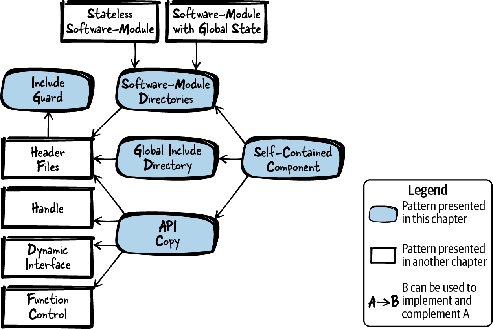
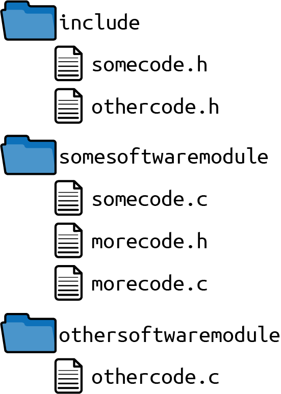
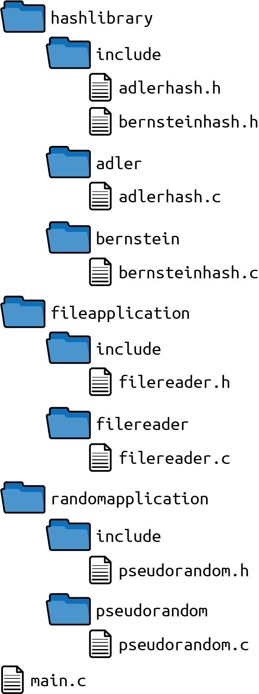
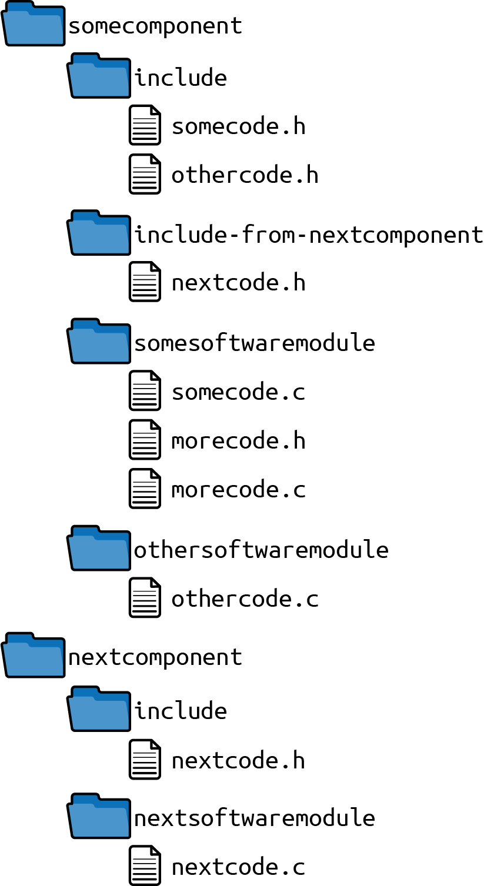
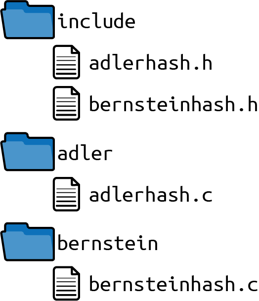

# 第 8 章  模块化程序中的文件组织

任何实现较大软件、又想让软件可维护的程序员，都逃不开"如何让软件模块化"这个问题。其中与软件模块间依赖关系最相关的部分，答案早已有之——比如 Robert C. Martin《Clean Code: A Handbook of Agile Software Craftsmanship》（Prentice Hall，2008，中译《代码整洁之道》）中的 SOLID 设计原则，或"四人帮"《Design Patterns: Elements of Reusable Object-Oriented Software》（Prentice Hall，1997，中译《设计模式》）中的设计模式。

然而，软件模块化还引出另一个问题：源文件该怎么组织，才能让人把软件做模块化？这个问题至今没有很好的答案，于是代码库里的文件结构一团糟。这种代码库日后想模块化很难：你不知道哪些文件该拆进不同的软件模块、甚至不同的代码库。作为程序员，你也很难找到"该用"的那些 API 所在的文件，于是可能引入了"不该用"的 API 依赖。这对 C 尤其是个问题：C 没有任何机制把 API 标记为"仅限内部使用"并限制访问。

别的语言有这类机制，也有文件组织的建议。比如 Java 有*包*（package）的概念，为开发者组织包中的类、进而组织包内的文件提供了默认方式。而 C 这类语言没有这类建议，开发者得自己想出路：装 C 函数声明的头文件、装 C 函数定义的实现文件，到底怎么摆。

本章就来解决它：为 C 程序员提供实现文件组织的指引，特别是头文件（API）的组织方式，让大型、模块化的 C 程序成为可能。

[图 8-1](#overview_directory) 给出了本章所有模式的总览，[表 8-1](#tab_directory) 则是各模式的一句话简介。



###### 图 8-1  代码文件组织模式总览

|  | 模式名 | 摘要 |
|----|----|----|
|  | 包含保护（Include Guard） | 头文件很容易被包含多次；同一头文件包含多次，若其中有类型或某些宏，编译时就会因重复定义而报错。因此，保护头文件内容不被重复包含，让使用头文件的开发者不必操心"它是不是被包含了多次"。用一个互锁的 `#ifdef` 语句或 `#pragma once` 语句实现。 |
|  | 软件模块目录（Software-Module Directories） | 代码拆成多个文件后，代码库里的文件越来越多。全部挤在一个目录里，文件总览就难了——大代码库尤其如此。因此，把属于紧耦合功能的头文件和实现文件放进同一个目录，并以头文件所提供的功能为目录命名。 |
|  | 全局头文件目录（Global Include Directory） | 要包含其他软件模块的文件，就得用 *../othersoftwaremodule/file.h* 这样的相对路径，还得知道对方头文件的确切位置。因此，在代码库里设一个包含所有软件模块 API 的全局目录，并把它加进工具链的全局包含路径。 |
|  | 自包含组件（Self-Contained Component） | 从目录结构看不出代码里的依赖：任何软件模块都能随手包含任何其他软件模块的头文件，因此无法通过编译器检查代码依赖。因此，识别出功能相近、应一起部署的软件模块，把它们放进公共目录，并为调用方相关的头文件设一个专门的子目录。 |
|  | API 拷贝（API Copy） | 你想让代码库的各部分独立开发、独立版本化、独立部署。为此，各代码块之间需要定义清晰的接口，并能拆分进不同的仓库。因此，要用另一个组件的功能时，拷贝它的 API：单独构建那个组件，把构建产物和它的公共头文件拷过来，放进你组件内的一个目录，并把这个目录配置为全局包含路径。 |

表 8-1  代码文件组织模式

# 运行示例

假设你要实现一个软件：打印某段文件内容的哈希值。你先为一个简单的哈希函数写下如下代码：

*main.c*

```
#include <stdio.h>

static unsigned int adler32hash(const char* buffer, int length)
{
  unsigned int s1=1;
  unsigned int s2=0;
  int i=0;

  for(i=0; i<length; i++)
  {
    s1=(s1+buffer[i]) % 65521;
    s2=(s1+s2) % 65521;
  }
  return (s2<<16) | s1;
}

int main(int argc, char* argv[])
{
  char* buffer = "Some Text";
  unsigned int hash = adler32hash(buffer, 100);
  printf("Hash value: %u", hash);
  return 0;
}
```

上面的代码只是把一个固定字符串的哈希输出打印到控制台。接下来你要扩展：读文件内容、打印文件内容的哈希。把这些代码统统塞进 *main.c* 当然可以，但文件会变得很长，而且越膨胀越难维护。

好得多的做法是：独立的实现文件，配头文件（Header Files）访问它们的功能。现在你有如下读文件内容、打印哈希的代码。为了更容易看清哪些部分变了，没有变化的实现被省略了：

*main.c*

```
#include <stdio.h>
#include <stdlib.h>
#include "hash.h"
#include "filereader.h"

int main(int argc, char* argv[])
{
  char* buffer = malloc(100);
  getFileContent(buffer, 100);
  unsigned int hash = adler32hash(buffer, 100);
  printf("Hash value: %u", hash);
  return 0;
}
```

\
*hash.h*

```
/* Returns the hash value of the provided "buffer" of size "length".
   The hash is calculated according to the Adler32 algorithm. */
unsigned int adler32hash(const char* buffer, int length);
```

\
*hash.c*

```
#include "hash.h"

unsigned int adler32hash(const char* buffer,  int length)
{
  /* no changes here */
}
```

\
*filereader.h*

```
/* Reads the content of a file and stores it in the  provided "buffer"
   if is is long enough according to its provided "length" */
void getFileContent(char* buffer, int length);
```

\
*filereader.c*

```
#include <stdio.h>
#include "filereader.h"

void getFileContent(char* buffer, int length)
{
  FILE* file = fopen("SomeFile", "rb");
  fread(buffer, length, 1, file);
  fclose(file);
}
```

代码拆进独立文件之后更模块化了：相关功能聚在同一文件里，代码依赖得以显式表达。你代码库的文件目前都存在同一个目录下，如图 8-2 所示。


###### 图 8-2  文件总览

有了独立的头文件，你就可以在实现文件里包含它们。但问题很快就来：头文件被包含多次就会构建报错。为了解决它，装上包含保护（Include Guard）。

# 包含保护

## 上下文

你把实现拆成了多个文件。实现内部包含头文件，以获得想要调用或使用的其他代码的前置声明。

## 问题

**头文件很容易被包含多次；同一头文件包含多次，若其中有类型或某些宏，编译时就会因重复定义而报错。**

C 编译期间，`#include` 指令让预处理器把被包含文件整个拷进你的编译单元。比如头文件里定义了一个 `struct`，这个头文件被包含两次，`struct` 定义就被拷两遍、在编译单元里出现两次——编译错误随之而来。

为了避免它，你可以尽量不重复包含文件。但包含一个头文件时，你通常并不清楚它里面又包含了哪些别的头文件——所以重复包含太容易发生了。

## 方案

**保护头文件内容不被重复包含，让使用头文件的开发者不必操心"它是不是被包含了多次"。用一个互锁的 `#ifdef` 语句或 `#pragma once` 语句实现。**

下面的代码展示了包含保护的用法：

*somecode.h*

```
#ifndef SOMECODE_H
#define SOMECODE_H
 /* put the content of your headerfile here */
#endif
```

\
*othercode.h*

```
#pragma once
 /* put the content of your headerfile here */
```

构建过程中，互锁的 `#ifdef` 语句或 `#pragma once` 语句保护头文件内容，使其不会在编译单元中被编译多次。

`#pragma once` 不是 C 标准定义的，但大多数 C 预处理器都支持。不过要留心：换用带不同 C 预处理器的工具链时，这条语句可能出问题。

互锁的 `#ifdef` 语句与所有 C 预处理器兼容，但难点在于：定义的宏必须用唯一的名字。通常采用与头文件名相关的命名方案，可一旦重命名文件忘了改包含保护，名字就过时了。使用第三方代码时也可能撞名——你的包含保护名跟人家的一样。避开这些麻烦的办法：不用头文件名，改用其他唯一名字，比如当前时间戳或 UUID。

## 后果

作为包含头文件的开发者，你如今不必操心它会不会被包含多次。日子轻松多了——`#include` 嵌套一深尤其如此：谁还记得清哪些文件已经包含过了。

你要么接受非标准的 `#pragma once`，要么为互锁的 `#ifdef` 设计一套唯一命名方案。文件名大多数时候够唯一，但用到第三方代码时仍可能撞上相似的名字。自己重命名文件时 `#define` 的名字也可能改得不一致——好在有些 IDE 会帮忙：新建头文件时自动生成包含保护，重命名头文件时自动改 `#define` 的名字。

互锁的 `#ifdef` 语句防止了重复包含导致的编译错误，但不能阻止被包含文件被多次打开、多次拷进编译单元。这是编译时间中白白浪费的一块，可以优化。一种办法是在每个 `#include` 语句外面再套一层包含保护，但这样包含文件就繁琐了。何况对大多数现代编译器这是多余的：它们自己会优化编译（比如缓存头文件内容、记住哪些文件已包含过）。

## 已知应用

下面是一些应用该模式的实例：

- 几乎所有多于一个文件的 C 代码都在应用这个模式。

- John Lakos 的《Large-Scale C++ Software Design》（Addison-Wesley，1996）描述了在每个 `#include` 语句外面再套一层保护来优化包含保护性能的做法。

- Portland Pattern Repository 描述了包含保护模式，也描述了在每个 `#include` 语句外加一层保护来优化编译时间的模式。

## 应用于运行示例

下面代码中的包含保护确保：头文件哪怕被包含多次，也不会构建报错：

*hash.h*

```
#ifndef HASH_H
#define HASH_H
/* Returns the hash value of the provided "buffer" of size "length".
   The hash is calculated according to the Adler32 algorithm. */
unsigned int adler32hash(const char* buffer, int length);
#endif
```

\
*filereader.h*

```
#ifndef FILEREADER_H
#define FILEREADER_H
/* Reads the content of a file and stores it in the provided "buffer"
   if is is long enough according to its provided "length" */
void getFileContent(char* buffer, int length);
#endif
```

下一个功能：你还想打印另一种哈希函数算出的哈希值。直接再加一个 *hash.c* 文件放新哈希函数可不行——文件名必须唯一。给新文件起个别的名字当然是一种选择。但即便如此你仍不满意：一个目录里的文件越来越多，总览文件、看清哪些文件相关，都变难了。要改善局面，可以用软件模块目录（Software-Module Directories）。

# 软件模块目录

## 上下文

你把源代码拆进了不同的实现文件，并用头文件使用其他实现文件的功能。代码库里的文件越积越多。

## 问题

**代码拆成不同文件后，代码库里的文件越来越多。全部挤在一个目录里，文件总览就难了——大代码库尤其如此。**

把文件放进不同目录，又引出问题：哪些文件放哪个目录？找到同属一伙的文件应该轻松；日后要加新文件时，该往哪儿放也应该一目了然。

## 方案

**把属于紧耦合功能的头文件和实现文件放进同一个目录，并以头文件所提供的功能为目录命名。**

这样的目录及其内容称为*软件模块*。软件模块往往收录操作某个以句柄（Handle）寻址的实例的全部代码——此时，软件模块就是面向对象类的非面向对象等价物：一个软件模块的全部文件放一个目录，等价于一个类的全部文件放一个目录。

软件模块可以含一对头文件加实现文件，也可以含多对。把文件放进同一目录的主要判据是：目录内文件高内聚，与其他软件模块目录低耦合。

如果有的头文件只在软件模块内部使用、有的供外部使用，就给文件起个能分辨的名字，让人一眼看出哪些头文件不得在模块外使用（比如加 *internal* 后缀，如图 8-3 和下面的代码所示）：


###### 图 8-3  文件总览

*somecode.c*

```
#include "somecode.h"
#include "morecode.h"
#include "../othersoftwaremodule/othercode.h"
...
```

\
*morecode.c*

```
#include "morecode.h"
...
```

\
*othercode.c*

```
#include "othercode.h"
...
```

上面的代码片段展示了文件如何被包含，但未展示实现。注意：同一软件模块的文件随手就能包含；要包含其他软件模块的头文件，就必须知道那些软件模块的路径。

文件分散在不同目录后，你得确保工具链配置成能编译所有这些文件。也许你的 IDE 会自动编译代码库子目录里的所有文件，但你也可能得改构建设置、动 Makefile，才能编译新目录里的文件。

# 配置包含目录与待编译文件

现代 C 编程 IDE 通常提供一个省心环境：C 程序员可以专注于编程，不必跟构建过程打交道。这些 IDE 的构建设置让你轻松配置哪些目录装着待构建的实现文件、哪些目录装着包含文件。C 程序员因此得以专注写代码，而不是写 Makefile 和编译器命令。本章假设你手边就有这样的 IDE，不展开讲 Makefile 及其语法。

## 后果

代码文件拆进不同目录后，不同目录里可以有同名文件。用第三方代码时这很顺手——否则那些文件名可能跟你自己的撞车。

不过，即便分处不同目录，文件名相似也不推荐。头文件尤其建议全库唯一，确保包含进来的是哪个文件不依赖包含路径的搜索顺序。要文件名唯一，可以给你的软件模块所有文件配一个简短、唯一的前缀。

一个软件模块的相关文件全放一个目录，找相关文件就容易了：只要知道软件模块的名字。软件模块内的文件数通常不多，扫一眼目录就能定位。

大部分代码依赖都是软件模块内部的，高度相依的文件如今都在同一目录里。想读懂某块代码的程序员，要看还有哪些文件相关，容易多了；软件模块目录之外的实现文件，通常与理解该模块的功能无关。

## 已知应用

下面是一些应用该模式的实例：

- Git 源码把一部分代码按目录组织，其他代码再用相对路径包含这些头文件。例如 *kwset.c* 包含 *compat/obstack.h*。

- Netdata 实时性能监控与可视化系统把代码文件组织进 *database*、*registry* 等目录，每个目录各装几个文件。要包含别的目录的文件，就用相对包含路径。

- 网络映射器 Nmap 把软件模块组织进 *ncat*、*ndiff* 等目录。包含其他软件模块的头文件用的是相对路径。

## 应用于运行示例

代码几乎没变，只是为新哈希函数加了一对头文件和实现文件。文件的位置变了——从包含路径就能看出来。除了把文件分进不同目录，文件名也改了，以保持唯一：

*main.c*

```
#include <stdio.h>
#include <stdlib.h>
#include "adler/adlerhash.h"
#include "bernstein/bernsteinhash.h"
#include "filereader/filereader.h"

int main(int argc, char* argv[])
{
  char* buffer = malloc(100);
  getFileContent(buffer, 100);

  unsigned int hash = adler32hash(buffer, 100);
  printf("Adler32 hash value: %u", hash);

  unsigned int hash = bernsteinHash(buffer, 100);
  printf("Bernstein hash value: %u", hash);

  return 0;
}
```

\
*bernstein/bernsteinhash.h*

```
#ifndef BERNSTEINHASH_H
#define BERNSTEINHASH_H
/* Returns the hash value of the provided "buffer" of size "length".
   The hash is calculated according to the D.J. Bernstein algorithm. */
unsigned int bernsteinHash(const char* buffer, int length);
#endif
#endif
```

\
*bernstein/bernsteinhash.c*

```
#include "bernsteinhash.h"

unsigned int bernsteinHash(const char* buffer, int length)
{
  unsigned int hash = 5381;
  int i;
  for(i=0; i<length; i++)
  {
    hash = 33 * hash ^ buffer[i];
  }
  return hash;
}
```

把代码文件拆进独立目录是很常见的做法：找文件更容易，同名文件也容得下。不过与其用相似文件名，不如干脆全库唯一——比如给每个软件模块配一个唯一的文件名前缀。不加前缀，你就会得到图 8-4 那样的目录结构和文件名。


###### 图 8-4  文件总览

同属一伙的文件如今都在同一目录里。文件按目录组织得井井有条，其他目录的头文件用相对路径就能访问。

但相对路径有个毛病：想重命名某个目录，就得动别的源文件、修它们的包含路径。这种依赖你不想要——用全局头文件目录（Global Include Directory）就能甩掉它。

# 全局头文件目录

## 上下文

你有了头文件，也把代码组织进了软件模块目录。

## 问题

**要包含其他软件模块的文件，就得用 *../othersoftwaremodule/file.h* 这样的相对路径，还得知道对方头文件的确切位置。**

对方头文件的路径一变，包含它的代码就得跟着改。比如对方软件模块改了名，你就得改代码——你依赖了对方的名字和位置。

作为开发者，你还想一眼看清：哪些头文件属于你该用的软件模块 API，哪些是外部谁都不该碰的内部头文件。

## 方案

**在代码库里设一个包含所有软件模块 API 的全局目录，并把它加进工具链的全局包含路径。**

实现文件和仅单个软件模块使用的头文件，留在该软件模块的目录里；若某个头文件还要被其他代码使用，就放进全局目录——它通常叫 */include*，如图 8-5 和下面的代码所示。



###### 图 8-5  文件总览

配置的全局包含路径是 */include*。

\
*somecode.c*

```
#include <somecode.h>
#include <othercode.h>
#include "morecode.h"
...
```

\
*morecode.c*

```
#include "morecode.h"
...
```

\
*othercode.c*

```
#include <othercode.h>
...
```

上面的代码片段展示了文件如何被包含。注意：相对路径没有了。为了在代码里更清楚地看出哪些文件来自全局包含路径，这些文件在 `#include` 语句里一律用尖括号包含。

# #include 语法

对所有被包含的文件，其实都可以用引号语法（`#include "stdio.h"`）。大多数 C 预处理器会先按相对路径找这些包含文件，找不到，再到系统配置、工具链使用的全局目录里找。C 里包含代码库之外的文件时，通常用尖括号语法（`#include <stdio.h>`）——只搜全局目录。这个语法同样可以用于你自己代码库里的文件，只要它们不是按相对路径包含的。

全局包含路径要在工具链的构建设置里配置；如果你手写 Makefile 和编译器命令，就得把包含路径加在那里。

如果这个目录里的头文件越来越多，或者有些很特定的头文件只有寥寥几个软件模块在用，你就该考虑把代码库拆成自包含组件（Self-Contained Component）了。

## 后果

哪些头文件供其他软件模块使用、哪些是仅限本模块内部使用的内部头文件，一清二楚。

现在包含其他软件模块的文件不必再用相对路径了。但其他软件模块的代码不再聚在一个目录里，而是散落在代码库各处。

把所有 API 塞进一个目录，这个目录可能文件成山，找同属一伙的文件反而变难。要小心别落得整个代码库的头文件全挤进这一个包含目录——那会抵消软件模块目录的好处。再说：如果只有软件模块 A 需要软件模块 B 的接口呢？按上面的方案，B 的接口要进全局头文件目录；可如果没别人需要这些接口，你未必想让全代码库的人都够得着。要避开这个问题，用自包含组件。

## 已知应用

下面是一些应用该模式的实例：

- OpenSSL 代码有一个 */include* 目录，装着被多个软件模块使用的全部头文件。

- NetHack 游戏的所有头文件都在 */include* 目录里。实现没有按软件模块组织，而是全在一个 */src* 目录里。

- OpenZFS 的 Linux 代码有一个叫 */include* 的全局目录，装着全部头文件。该目录被配置为包含路径，写进了实现文件所在目录的 Makefile 里。

## 应用于运行示例

代码库里头文件的位置变了：你把它们挪进了全局头文件目录，并在工具链里配置好。现在包含文件不必再翻相对路径。注意：正因如此，`#include` 语句现在用尖括号而不是引号：

*main.c*

```
#include <stdio.h>
#include <stdlib.h>
#include <adlerhash.h>
#include <bernsteinhash.h>
#include <filereader.h>

int main(int argc, char* argv[])
{
  char* buffer = malloc(100);
  getFileContent(buffer, 100);

  unsigned int hash = adler32hash(buffer, 100);
  printf("Adler32 hash value: %u", hash);

  hash = bernsteinHash(buffer, 100);
  printf("Bernstein hash value: %u", hash);

  return 0;
}
```

现在你的代码有了图 8-6 所示的文件组织和配置在工具链里的全局包含路径 */include*。


###### 图 8-6  文件总览

现在哪怕重命名某个目录，也不必动实现文件了——实现之间的耦合又松了一分。

接下来你要扩展代码：哈希函数不止用来算文件内容的哈希，还要用进另一个应用场景——基于哈希函数计算伪随机数。你想让这两个都用哈希函数的应用彼此独立地开发，没准儿还是不同的开发团队各干各的。

跟另一个开发团队共用一个全局包含目录？免谈——你不想把各团队的代码文件搅在一起。你要让两个应用尽可能分离。为此，把它们组织成自包含组件。

# 自包含组件

## 上下文

你有了软件模块目录，可能还有全局头文件目录。软件模块越来越多，代码越来越大。

## 问题

**从目录结构看不出代码里的依赖：任何软件模块都能随手包含任何其他软件模块的头文件，因此无法通过编译器检查代码依赖。**

包含头文件可以用相对路径，意味着任何软件模块都能包含任何其他软件模块的头文件。

软件模块一多，总览就难了。就像你当年一个目录文件太多、于是用了软件模块目录一样，现在你的软件模块目录太多了。

依赖看不出来，代码职责同样从代码结构里看不出来。多个团队共同开发代码时，你大概想定清楚谁负责哪些软件模块。

## 方案

**识别出功能相近、应一起部署的软件模块，把它们放进公共目录，并为调用方相关的头文件设一个专门的子目录。**

这样一组软件模块连同它们的全部头文件，以下称为*组件*（component）。与软件模块相比，组件通常更大，可以独立于代码库其余部分部署。

给软件模块分组时，看看代码的哪一部分可以独立于其余部分部署；看看哪一部分由独立团队开发、因而本就应当与代码库其余部分保持松耦合。这样的软件模块组就是组件的候选者。

如果你有全局头文件目录，把你组件的头文件从那里搬出来，放进组件内的专设目录（比如 *myComponent/include*）。使用组件的开发者可以把这个路径加进工具链的全局包含路径，或者相应地修改 Makefile 和编译器命令。

你可以用工具链检查某个组件的代码是否只用了它被允许使用的功能。比如你有一个抽象操作系统的组件，你希望其余代码都用这层抽象、不碰操作系统专属函数。你可以这样配置工具链：操作系统专属函数的包含路径，只为抽象操作系统的那个组件设置；对其余代码，只把操作系统抽象接口所在的目录配置为包含路径。这样一来，不明就里的新手开发者不知道有操作系统抽象、想直接用操作系统专属函数，就得用相对包含路径才能把代码编过——但愿这能让他知难而退。

[图 8-7](#fig_dir7) 和下面的代码展示了文件结构和包含路径。


###### 图 8-7  文件总览

配置的全局包含路径：

- */somecomponent/include*

- */nextcomponent/include*

*somecode.c*

```
#include <somecode.h>
#include <othercode.h>
#include "morecode.h"
...
```

\

*morecode.c*

```
#include "morecode.h"
...
```

\
*othercode.c*

```
#include <othercode.h>
...
```

\
*nextcode.c*

```
#include <nextcode.h>
#include <othercode.h> // use API of other component
...
```

## 后果

软件模块组织有序，找同属一伙的软件模块更容易。组件切分得当，新代码该进哪个组件也一目了然。

属于一伙的东西全在一个目录里，为该组件在工具链里做专项配置就更轻松。比如，你可以给代码库里新建的组件开更严格的编译器警告，也可以自动检查组件之间的代码依赖。

多团队开发时，组件目录让团队间的职责划分更容易——组件之间通常耦合极低，甚至整个产品的功能都可能不依赖这些组件。在组件层面切分职责，比在软件模块层面容易。

## 已知应用

下面是一些应用该模式的实例：

- GCC 代码有各自独立目录收集头文件的组件，例如 */libffi/include*、*libcpp/include*。

- 操作系统 RIOT 把驱动组织进界限分明的目录。例如 */drivers/xbee* 和 */drivers/soft_spi* 目录各含一个 *include* 子目录，装着该软件模块的全部接口。

- Radare 逆向工程框架有界限分明的组件，每个组件都有自己的 *include* 目录，装着它的全部接口。

## 应用于运行示例

你添加了使用某个哈希函数的伪随机数实现。此外，你把代码隔离成了三个不同部分：

- 哈希函数

- 文件内容的哈希计算

- 伪随机数计算

这三部分代码如今分得清清楚楚，不同团队可以轻松并行开发，甚至可以彼此独立部署：

*main.c*

```
#include <stdio.h>
#include <stdlib.h>
#include <adlerhash.h>
#include <bernsteinhash.h>
#include <filereader.h>
#include <pseudorandom.h>

int main(int argc, char* argv[])
{
  char* buffer = malloc(100);
  getFileContent(buffer, 100);

  unsigned int hash = adler32hash(buffer, 100);
  printf("Adler32 hash value: %u", hash);

  hash = bernsteinHash(buffer, 100);
  printf("Bernstein hash value: %u", hash);

  unsigned int random = getRandomNumber(50);
  printf("Random value: %u", random);

  return 0;
}
```

\
*randrandomapplication/include/pseudorandom.h*

```
#ifndef PSEUDORANDOM_H
#define PSEUDORANDOM_H
/* Returns a pseudo random number lower than the
   provided maximum number (parameter `max')*/
unsigned int getRandomNumber(int max);
#endif
```

\
*randomapplication/pseudorandom/pseudorandom.c*

```
#include <pseudorandom.h>
#include <adlerhash.h>

unsigned int getRandomNumber(int max)
{
  char* seed = "seed-text";
  unsigned int random = adler32hash(seed, 10);
  return random % max;
}
```

你的代码现在的目录结构如下。注意代码文件的每个部分都与其他部分分得清清楚楚：比如所有与哈希相关的代码都在一个目录里。使用这些函数的开发者很容易找到这些函数的 API——就在 *include* 目录里，如图 8-8 所示。



###### 图 8-8  文件总览

对这份代码，工具链里配置了以下全局包含目录：

- */hashlibrary/include*

- */fileapplication/include*

- */randomapplication/include*

现在代码分进了不同目录，但还有些依赖可以再摘掉。看看包含路径：你只有一个代码库，所有包含路径对所有代码生效。可对哈希函数的代码来说，文件处理的包含路径根本用不着。

而且，你把所有代码统统编译、把所有目标文件链进一个可执行文件。你也许想拆开这份代码、独立部署：一个应用打印哈希输出，一个应用打印伪随机数。两个应用要独立开发，却都要用（比如）同一份哈希函数代码——而你不想复制它。

要解耦应用、又要有一条规规矩矩的路子访问其他部分的功能、还不必共享包含路径之类的私密信息，你该用 API 拷贝（API Copy）。

# API 拷贝

## 上下文

你有一个大型代码库，由不同团队开发。代码库中，功能经由头文件抽象，头文件按软件模块目录组织。最理想的情形是：你已经有组织良好的自包含组件，接口存在了一段时间，你相当确信它们是稳定的。

## 问题

**你想让代码库的各部分独立开发、独立版本化、独立部署。为此，各代码块之间需要定义清晰的接口，并能拆分进不同的仓库。**

有了自包含组件，你离目标就差一步：接口定义清晰，组件的全部代码已在独立目录里，随时可以提交进各自的仓库。

但组件之间还剩一个目录结构上的依赖：配置的包含路径。这个路径仍指向对方组件代码的完整路径——对方组件一改名，你就得改配置的包含路径。这种依赖你不想要。

## 方案

**要用另一个组件的功能，就拷贝它的 API：单独构建那个组件，把构建产物和它的公共头文件拷过来，放进你组件内的一个目录，并把这个目录配置为全局包含路径。**

拷贝代码听着像个坏主意——通常确实是。但这里拷的只是另一个组件的接口：头文件里的函数声明，并不存在多份实现。想想你安装第三方库时干的事：你手里也有一份它接口的拷贝，靠它访问功能。

除了拷来的头文件，构建你的组件时还要用其他构建产物。你可以把对方组件当作独立的库来版本化和部署，构建时链接进来即可。[图 8-9](#fig_dir9) 和下面的代码展示了相关文件的总览。



###### 图 8-9  文件总览

`somecomponent` 配置的全局包含路径：

- */include*

- */include-from-nextcomponent*

*somecode.c*

```
#include <somecode.h>
#include <othercode.h>
#include "morecode.h"
...
```

\
*morecode.c*

```
#include "morecode.h"
...
```

\
*othercode.c*

```
#include <othercode.h>
...
```

\
`nextcomponent` 配置的全局包含路径：

- */include*

*nextcode.c*

```
#include <nextcode.h>
...
```

注意：上面的代码如今拆成了两个不同的代码块。代码可以拆分、放进各自的仓库了——换句话说，可以有各自的代码库。组件之间不再有任何目录结构上的依赖。不过，你现在要面对新局面：组件的不同版本必须确保接口在实现变化时依然兼容。按你的部署策略，你得定清楚要提供哪种接口兼容（API 兼容还是 ABI 兼容）。要让接口既兼容又灵活，可以用句柄、动态接口或函数控制。

# 接口兼容性

*应用程序接口*（API）兼容，指调用方代码无须任何改动。给既有函数加参数、改返回值或参数的类型，都会破坏 API 兼容。

*应用二进制接口*（ABI）兼容，指调用方代码无须重新编译。改变编译目标平台，或升级编译器到一个函数调用约定与旧版不同的新版本，都会破坏 ABI 兼容。

## 后果

组件之间不再有任何目录结构上的依赖。重命名某个组件，不必再改其他组件（如今可以叫它们其他代码库了）代码里的包含指令。

代码可以提交进不同的仓库，包含对方头文件完全不需要知道对方的路径——要拿到对方头文件，拷就是了。所以初次你得知道去哪儿拿头文件和构建产物：也许对方组件提供某种安装器，也许只提供一份带版本号的所需文件清单。

要用拆分代码库的最大红利——独立开发和版本化——你得约定组件接口保持兼容。兼容接口的要求约束着提供接口的组件的开发：一个函数一旦被人用了，就不能随便改了。连兼容的改动（往既有头文件里加个新函数）都可能变麻烦——不同版本的头文件提供不同的功能集合，调用方更难知道该用哪个版本，也更难写出对任何版本都管用的代码。

拆分代码库的灵活性，是用额外的复杂度换来的：既要应付 API 兼容性要求，构建过程也更复杂（拷头文件、保持同步、链接对方组件、给接口定版本）。

# 版本号

接口的版本管理方式应当说明：新版本是否带来不兼容变更。通行做法是[语义化版本](https://semver.org)：版本号本身就标示有没有重大变更。语义化版本用三位版本号（比如 1.0.7），只有第一位数字变化才意味着不兼容变更。

## 已知应用

下面是一些应用该模式的实例：

- Wireshark 拷贝了独立部署的 Kazlib 的 API，以使用它的异常模拟功能。

- B&R Visual Components 软件访问底层 Automation Runtime 操作系统的功能。Visual Components 与 Automation Runtime 独立部署、独立版本化；为访问后者的功能，它的公共头文件被拷进了 Visual Components 的代码库。

- Education First 公司开发数字学习产品。他们的 C 代码在构建软件时把包含文件拷进全局包含目录，借此解耦代码库中的组件。

## 应用于运行示例

现在代码的各部分分得清清楚楚：哈希实现对"打印文件哈希"的代码和"生成伪随机数"的代码都有定义清晰的接口；各部分代码分进各自目录；连其他组件的 API 都是拷贝来的——一个组件要访问的全部代码都在自己的目录里。每个组件的代码都可以存进自己的仓库，独立于其他组件部署和版本化。

实现一行没改，只拷贝了其他组件的 API、改了各代码库的包含路径。哈希代码如今连主应用都隔离出来了：它被当作独立部署的组件，只与应用的其余部分相链接。[示例 8-1](#dir_rex_7_1) 展示了你主应用的代码，它已与哈希库分离。

##### 示例 8-1  主应用代码

*main.c*

```
#include <stdio.h>
#include <stdlib.h>
#include <adlerhash.h>
#include <bernsteinhash.h>
#include <filereader.h>
#include <pseudorandom.h>

int main(int argc, char* argv[])
{
  char* buffer = malloc(100);
  getFileContent(buffer, 100);

  unsigned int hash = adler32hash(buffer, 100);
  printf("Adler32 hash value: %u\n", hash);

  hash = bernsteinHash(buffer, 100);
  printf("Bernstein hash value: %u\n", hash);

  unsigned int random = getRandomNumber(50);
  printf("Random value: %u\n", random);

  return 0;
}
```

\
*randomapplication/include/pseudorandom.h*

```
#ifndef PSEUDORANDOM_H
#define PSEUDORANDOM_H
/* Returns a pseudorandom number lower than the provided maximum number
   (parameter `max')*/
unsigned int getRandomNumber(int max);
#endif
```

\
*randomapplication/pseudorandom/pseudorandom.c*

```
#include <pseudorandom.h>
#include <adlerhash.h>

unsigned int getRandomNumber(int max)
{
  char* seed = "seed-text";
  unsigned int random = adler32hash(seed, 10);
  return random % max;
}
```

\

*fileapplication/include/filereader.h*

```
#ifndef FILEREADER_H
#define FILEREADER_H
/* Reads the content of a file and stores it in the provided "buffer"
   if is is long enough according to its provided "length" */
void getFileContent(char* buffer, int length);
#endif
```

    _fileapplication/filereader/filereader.c_

```
#include <stdio.h>
#include "filereader.h"

void getFileContent(char* buffer, int length)
{
  FILE* file = fopen("SomeFile", "rb");
  fread(buffer, length, 1, file);
  fclose(file);
}
```

这份代码的目录结构和包含路径见图 8-10 和下面的代码示例。注意：哈希实现的源代码已不在这个代码库里。哈希功能通过包含拷来的头文件访问，构建时再把 *.a* 文件链接进来即可。


###### 图 8-10  文件总览

配置的包含路径：

- */hashlibrary*

- */fileapplication/include*

- */randomapplication/include*

[示例 8-2](#dir_rex_7_2) 的哈希实现如今由自己的仓库管理。代码每次变更，都可以发布新版的哈希库：把为该库编译的目标文件拷进对方代码即可——只要哈希库的 API 不变，就再无别的事。

##### 示例 8-2  哈希库代码

*inc/adlerhash.h*

```
#ifndef ADLERHASH_H
#define ADLERHASH_H
/* Returns the hash value of the provided "buffer" of size "length".
   The hash is calculated according to the Adler32 algorithm. */
unsigned int adler32hash(const char* buffer, int length);
#endif
```

\
*adler/adlerhash.c*

```
#include "adlerhash.h"

unsigned int adler32hash(const char* buffer, int length)
{
  unsigned int s1=1;
  unsigned int s2=0;
  int i=0;

  for(i=0; i<length; i++)
  {
    s1=(s1+buffer[i]) % 65521;
    s2=(s1+s2) % 65521;
  }
  return (s2<<16) | s1;
}
```

\
*inc/bernsteinhash.h*

```
#ifndef BERSTEINHASH_H
#define BERNSTEINHASH_H
/* Returns the hash value of the provided "buffer" of size "length".
   The hash is calculated according to the D.J. Bernstein algorithm. */
unsigned int bernsteinHash(const char* buffer, int length);
#endif
```

\
*bernstein/bernsteinhash.c*

```
#include "bernsteinhash.h"

unsigned int bernsteinHash(const char* buffer, int length)
{
  unsigned int hash = 5381;
  int i;
  for(i=0; i<length; i++)
  {
    hash = 33 * hash ^ buffer[i];
  }
  return hash;
}
```

这份代码的目录结构和包含路径见图 8-11。注意：文件处理和伪随机数计算的源代码已不在这个代码库里。这里的代码库是通用的，同样可以用在其他场景。



###### 图 8-11  文件总览

配置的包含路径：

- */include*

从一个简单的哈希应用出发，我们最终得到了这份代码：哈希代码的开发和部署都与它的应用分开。再往前一步，两个应用甚至可以再拆成独立部署的部分。

按本示例的方式组织目录结构，并不是让代码模块化最重要的议题。还有许多更重要的议题没有在本章和本运行示例中展开——比如代码依赖，那是 SOLID 原则的地盘。不过，一旦依赖已经安排得让代码模块化，本示例所示的目录结构就让代码的职责切分、以及独立于代码库其他部分进行版本化和部署，都变得更轻松。

# 小结

本章给出了组织源文件和头文件的一组模式，用于构建大型模块化 C 程序。

包含保护（Include Guard）模式确保头文件不被重复包含。软件模块目录主张把一个软件模块的全部文件放进一个目录。全局头文件目录主张把被多个软件模块使用的头文件集中到一个全局目录。程序更大时，自包含组件转而主张每个组件各配一个全局头文件目录。要解耦这些组件，API 拷贝主张把要使用的其他组件的头文件和构建产物拷贝过来。

这些模式在一定程度上层层递进：先应用前面的模式，后面的模式应用起来就更容易。全部应用之后，代码库就达到了相当高的灵活性——各部分可以分开开发、分开部署。但灵活性不是总需要，更不是白来的：每用一个模式，你就给代码库添一分复杂度。尤其对很小的代码库，根本不需要分开部署各部分，多半用不着 API 拷贝；甚至用完头文件和包含保护就可以收手了。别盲目地把模式堆满。只有当你正面临模式所描述的问题、且解决它值得那份额外复杂度时，才用它们。

有了这些模式装进编程词汇表，C 程序员手里就有了一个工具箱和一条循序渐进的路：如何构建模块化 C 程序、组织它们的文件。

# 展望

下一章讲许多大规模程序都绕不开的一面：多平台代码的处理。那一章的模式讲述如何实现代码，让一个代码库轻松支持多种处理器架构或多个操作系统。
