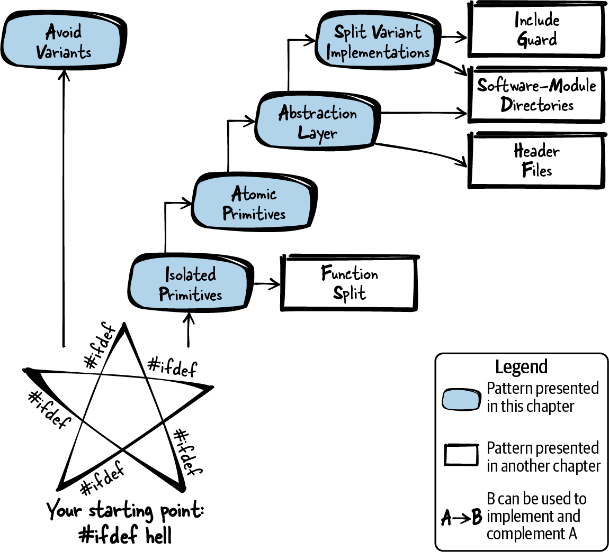

# 第 9 章  逃离 #ifdef 地狱

C 无处不在，尤其是在需要高性能或贴近硬件编程的系统上。贴近硬件，就意味着要对付硬件变体；除了硬件变体，有些系统还要支持多个操作系统，或在代码中应付多个产品变体。对付这些问题的一个常用手段，就是用 C 预处理器的 `#ifdef` 语句在代码中区分变体。C 预处理器有这个能力，但能力越大，越要有结构地用它——这份责任在你。

而这正是 C 预处理器和它的 `#ifdef` 语句暴露软肋的地方：预处理器不支持任何强制使用规则的机制。这很遗憾，因为它太容易被滥用了。加一个硬件变体、加一个可选功能，随手再来一个 `#ifdef` 就行；打个只影响单个变体的快速补丁，`#ifdef` 也信手拈来。于是不同变体的代码渐行渐远，修 bug 也越来越得按变体逐个来。

这样毫无章法地使用 `#ifdef`，是一条通往地狱的直通车：代码变得没法读、没法维护，所有开发者都该绕着走。本章给出的方法，要么让你逃出这种境地，要么让你从一开始就避开它。

本章详细指导如何在 C 代码中实现变体（操作系统变体、硬件变体等），讨论五个模式：如何应对代码变体，如何组织、乃至消灭 `#ifdef` 语句。你可以把这些模式当作组织此类代码的入门，也可以当作重构无结构 `#ifdef` 代码的指南。

[图 9-1](#fig_ifdef) 指出了逃离 `#ifdef` 噩梦的路径，[表 9-1](#tab_ifdef) 是本章各模式的一句话简介。



###### 图 9-1  逃离 `#ifdef` 地狱之路

|  | 模式名 | 摘要 |
|----|----|----|
|  | 避免变体（Avoid Variants） | 每个平台用一套不同的函数，代码就越写越难、越读越难。程序员得先理解、正确使用并测试这多套函数，才能在各平台上实现同一个功能。因此，使用所有平台都有的标准化函数；没有标准化函数，就考虑别实现这个功能。 |
|  | 隔离原语（Isolated Primitives） | 用 `#ifdef` 组织代码变体会让代码没法读：程序流程为多个平台实现了多遍，极难跟进。因此，隔离你的代码变体——在实现文件中，把处理变体的代码放进独立的函数，由主程序逻辑调用它们；主程序逻辑里就只剩平台无关代码。 |
|  | 原子原语（Atomic Primitives） | 那个装着变体、被主程序调用的函数依然难懂——复杂的 `#ifdef` 代码只是从主程序挪进了它。因此，让原语原子化：每个函数只处理恰好一种变体。若要处理多种变体（比如操作系统变体加硬件变体），就为每种各写一个函数。 |
|  | 抽象层（Abstraction Layer） | 你想在代码库的多处使用处理平台变体的功能，又不想复制这段功能的代码。因此，为每个需要平台专属代码的功能提供一个 API：头文件里只定义平台无关的函数，平台专属的 `#ifdef` 代码全部放进实现文件。函数的调用方只包含你的头文件，不必包含任何平台专属文件。 |
|  | 拆分变体实现（Split Variant Implementations） | 平台专属的实现里仍用 `#ifdef` 区分代码变体，看不清、也选不准哪部分代码该为哪个平台构建。因此，把每种变体实现放进单独的实现文件，按文件为单位选择为哪个平台编译什么。 |

表 9-1  逃离 `#ifdef` 地狱的模式

# 运行示例

假设你要实现一个功能：往一个文件里写些文本，文件放在新建的目录里；目录建在当前目录还是用户主目录，取决于一个配置开关。更麻烦的是，代码既要跑在 Windows 上，也要跑在 Linux 上。

你的第一次尝试：一个实现文件装下所有配置、所有操作系统的全部代码。为此，文件里塞满了区分代码变体的 `#ifdef` 语句：

```
#include <string.h>
#include <stdio.h>
#include <stdlib.h>
#ifdef __unix__
  #include <sys/stat.h>
  #include <fcntl.h>
  #include <unistd.h>
#elif defined _WIN32
  #include <windows.h>
#endif

int main()
{
  char dirname[50];
  char filename[60];
  char* my_data = "Write this data to the file";
  #ifdef __unix__
    #ifdef STORE_IN_HOME_DIR
      sprintf(dirname, "%s%s", getenv("HOME"), "/newdir/");
      sprintf(filename, "%s%s", dirname, "newfile");
    #elif defined STORE_IN_CWD
      strcpy(dirname, "newdir");
      strcpy(filename, "newdir/newfile");
    #endif
    mkdir(dirname,S_IRWXU);
    int fd = open (filename, O_RDWR | O_CREAT, 0666);
    write(fd, my_data, strlen(my_data));
    close(fd);
  #elif defined _WIN32
    #ifdef STORE_IN_HOME_DIR
      sprintf(dirname, "%s%s%s", getenv("HOMEDRIVE"), getenv("HOMEPATH"),
              "\\newdir\\");
      sprintf(filename, "%s%s", dirname, "newfile");
    #elif defined STORE_IN_CWD
      strcpy(dirname, "newdir");
      strcpy(filename, "newdir\\newfile");
    #endif
    CreateDirectory (dirname, NULL);
    HANDLE hFile = CreateFile(filename, GENERIC_WRITE, 0, NULL,
                              CREATE_NEW, FILE_ATTRIBUTE_NORMAL, NULL);
    WriteFile(hFile, my_data, strlen(my_data), NULL, NULL);
    CloseHandle(hFile);
  #endif
  return 0;
}
```

这代码就是一团乱麻。程序逻辑完完全全重复了一遍——这根本不是操作系统无关的代码，只是两套操作系统专属的实现塞进了同一个文件。尤其是"不同操作系统"和"目录建在不同位置"这两组正交的代码变体，让代码丑陋不堪：它们造成嵌套的 `#ifdef`，极难理解。读代码时你得不停地在行间跳跃，跳过别的 `#ifdef` 分支才能跟上程序逻辑。这样重复的程序逻辑还会诱使程序员只在当前正在改的那个变体里修 bug、加功能——各变体的代码和行为就此渐行渐远，代码越来越难维护。

从哪儿下手？怎么收拾这堆烂摊子？第一步：如果可能，用标准化函数来避免变体（Avoid Variants）。

# 避免变体

## 上下文

你写的可移植代码要在多个操作系统平台或多个硬件平台上使用。代码里调用的某些函数，这个平台上有，那个平台上没有——语法和语义都对不上。于是你实现了代码变体：一个平台一份，用 `#ifdef` 语句区分。

## 问题

**每个平台用一套不同的函数，代码就越写越难、越读越难。程序员得先理解、正确使用并测试这多套函数，才能在各平台上实现同一个功能。**

通常你的目标是让功能在所有平台上行为完全一致；用了平台相关的函数，这个目标就难实现多了，还可能要写额外的代码——因为平台之间不同的不只是语法，函数的语义也可能略有差异。

多平台多函数，代码更难写、更难读、更难懂。用 `#ifdef` 区分这些函数让代码更长，读者还得在行间跳来跳去，才能拼出单个 `#ifdef` 分支到底干了什么。

对每段要写的代码，你都可以问问自己：值不值得？如果所需的功能不重要，而平台专属函数又让它极难实现和维护，那么干脆不提供这个功能，也是一个选项。

## 方案

**使用所有平台都有的标准化函数；没有标准化函数，就考虑别实现这个功能。**

可用的标准化函数，好例子有 C 标准库函数和 POSIX 函数。想清楚要支持哪些平台，确认这些标准化函数在每个平台上都有。可能的话，用它们替代更具体的平台相关函数，如下面的代码所示：

*调用方代码*

```
#include <standardizedApi.h>

int main()
{
  /* just a single function is called instead of multiple via
     ifdef distinguished functions */
  somePosixFunction();
  return 0;
}
```

\

*标准化 API*

```
  /* this function is available on all operating systems
     that adhere to the POSIX standard */
  somePosixFunction();
```

再强调一次：你要的东西若没有标准化函数，多半就不该实现。如果只有平台相关函数可用，那份实现、测试和维护的功夫可能不值。

不过有些时候，产品必须提供某功能，哪怕没有标准化函数。那你就得跨平台使用不同函数，甚至在某个平台上实现别的平台已有的功能。要有条不紊地做这件事，请为代码变体准备隔离原语（Isolated Primitives），并把它们藏在抽象层（Abstraction Layer）后面。

举些避免变体的例子：文件访问用 C 标准库的 `fopen`，别用 Linux 的 `open` 或 Windows 的 `CreateFile` 这类操作系统专属函数；时间函数用 C 标准库的，别用 Windows 的 `GetLocalTime` 和 Linux 的 `localtime_r`，用 *time.h* 的标准化 `localtime`。

## 后果

一段代码走遍多平台，代码好写好读。写代码不必理解各平台的不同函数，读代码不必在 `#ifdef` 分支间跳来跳去。

所有平台跑的是同一段代码，功能自然没有分叉。但标准化函数未必是每个平台上实现该功能最高效、最高性能的路子：有些平台提供别的平台专属函数（比如用上该平台的专用硬件来提速），标准化函数占不到这些便宜。

## 已知应用

下面是一些应用该模式的实例：

- VIM 文本编辑器的代码用操作系统无关的 `fopen`、`fwrite`、`fread`、`fclose` 访问文件。

- OpenSSL 代码往日志消息里写当前本地时间，用的是操作系统无关的 `localtime` 把当前 UTC 时间转换为本地时间。

- OpenSSL 的 `BIO_lookup_ex` 函数查找要连接的节点和服务。它在 Windows 和 Linux 上都能编译，用操作系统无关的 `htons` 把数值转换为网络字节序。

## 应用于运行示例

你的文件访问功能运气不错：操作系统无关的函数是有的。你的代码现在如下：

```
#include <string.h>
#include <stdio.h>
#include <stdlib.h>
#ifdef __unix__
  #include <sys/stat.h>
#elif defined _WIN32
  #include <windows.h>
#endif

int main()
{
  char dirname[50];
  char filename[60];
  char* my_data = "Write this data to the file";
  #ifdef __unix__
    #ifdef STORE_IN_HOME_DIR
      sprintf(dirname, "%s%s", getenv("HOME"), "/newdir/");
      sprintf(filename, "%s%s", dirname, "newfile");
    #elif defined STORE_IN_CWD
      strcpy(dirname, "newdir");
      strcpy(filename, "newdir/newfile");
    #endif
    mkdir(dirname,S_IRWXU);
  #elif defined _WIN32
    #ifdef STORE_IN_HOME_DIR
      sprintf(dirname, "%s%s%s", getenv("HOMEDRIVE"), getenv("HOMEPATH"),
              "\\newdir\\");
      sprintf(filename, "%s%s", dirname, "newfile");
    #elif defined STORE_IN_CWD
      strcpy(dirname, "newdir");
      strcpy(filename, "newdir\\newfile");
    #endif
    CreateDirectory(dirname, NULL);
  #endif
  FILE* f = fopen(filename, "w+"); 
  fwrite(my_data, 1, strlen(my_data), f);
  fclose(f);
  return 0;
}
```

[](#co_escaping__ifdef_hell_CO1-1)  
`fopen`、`fwrite`、`fclose` 属于 C 标准库，Windows、Linux 上都有。

标准化的文件相关函数调用已经让代码简单了一大截：Windows 和 Linux 各一套的文件访问调用合成了公共代码。公共代码保证两个操作系统上的调用行为一致，也不怕两套实现在修 bug、加功能之后分道扬镳。

不过代码仍被 `#ifdef` 主宰，还是难读。所以，务必别让代码变体把主程序逻辑搅浑：用隔离原语把代码变体从主程序逻辑中分离出去。

# 隔离原语

## 上下文

你的代码调用平台专属函数，不同平台有不同的代码，用 `#ifdef` 语句区分变体。你没法简单地避免变体——没有标准化函数能在所有平台上统一提供你需要的特性。

## 问题

**用 `#ifdef` 组织代码变体会让代码没法读：程序流程为多个平台实现了多遍，极难跟进。**

理解代码时，你通常一次只关注一个平台，可 `#ifdef` 逼着你在代码行间跳来跳去找你关心的那个变体。

`#ifdef` 语句还让代码难以维护：它诱使程序员只修自己关心的那个平台的代码，别的代码一概不碰——怕弄坏。可只为一个平台修 bug、加功能，意味着其他平台上代码的行为渐行渐远；反过来，为所有平台各自修同一个 bug，又要求在所有平台上测试。

带大量代码变体的代码很难测试。每新增一种 `#ifdef`，测试工作量翻倍——所有组合都得测。更糟的是，每种 `#ifdef` 都让可构建、须测试的二进制数量翻倍。这还带来物流问题：构建时间变长，交付测试部门和客户的二进制也越来越多。

## 方案

**隔离你的代码变体——在实现文件中，把处理变体的代码放进独立的函数，由主程序逻辑调用它们；主程序逻辑里就只剩平台无关代码。**

每个函数要么只含程序逻辑，要么只处理变体，绝不兼营。也就是说：一个函数要么完全没有 `#ifdef`，要么有 `#ifdef` 但每个分支只有一次依赖变体的函数调用。变体可以是由构建配置开关的软件功能，也可以是平台变体，如下面的代码所示：

```
void handlePlatformVariants()
{
  #ifdef PLATFORM_A
    /* call function of platform A */
  #elif defined PLATFORM_B 
    /* call function of platform B */
  #endif
}

int main()
{
  /* program logic goes here */
  handlePlatformVariants();
  /* program logic continues */
}
```

[](#co_escaping__ifdef_hell_CO2-1)  
与 `else if` 类似，互斥的变体用 `#elif` 表达最漂亮。

每个 `#ifdef` 分支只放一次函数调用，这让你能为处理变体的函数找到合适的抽象粒度。通常，粒度正好落在待包装的平台专属或功能专属函数的层级上。

如果处理变体的函数依然复杂、仍有 `#ifdef` 瀑布（嵌套的 `#ifdef`），那就确保只用原子变体——见下一节。

## 后果

主程序逻辑如今一目了然——代码变体已从其中分离。读主代码时，不必再行间跳跃去拼凑"代码在某个特定平台上干什么"。

想知道代码在特定平台上的行为，去看实现该变体的被调函数即可。这段代码待在独立函数里还有个好处：文件里其他地方也能调用，避免重复。若其他实现文件也需要这个功能，就得实现抽象层（Abstraction Layer）了。

处理变体的函数里不该掺入程序逻辑，于是"只在某些平台出现的 bug"更容易定位：平台行为有差异的代码位置一眼可辨。

主程序逻辑与变体实现分离得当，代码重复也就不成问题了：程序逻辑没有再被复制的诱惑，自然也没有"改了这份忘了那份"的隐患。

## 已知应用

下面是一些应用该模式的实例：

- VIM 文本编辑器的代码隔离了 `htonl2` 函数（把数据转换为网络字节序）。VIM 的程序逻辑在实现文件里把 `htonl2` 定义为宏，宏按平台字节序编译成不同的样子。

- OpenSSL 的 `BIO_ADDR_make` 函数把 socket 信息拷进内部 `struct`。它用 `#ifdef` 处理操作系统专属和功能专属的变体（Linux/Windows 与 IPv4/IPv6），把这些变体从主程序逻辑中隔离出去。

- GNUplot 的 `load_rcfile` 函数从初始化文件读数据，把操作系统专属的文件访问操作与其余代码隔离。

## 应用于运行示例

有了隔离原语，你的主程序逻辑好读多了，读者不必再行间跳跃区分变体：

```
void getDirectoryName(char* dirname)
{
  #ifdef __unix__
    #ifdef STORE_IN_HOME_DIR
      sprintf(dirname, "%s%s", getenv("HOME"), "/newdir/");
    #elif defined STORE_IN_CWD
      strcpy(dirname, "newdir/");
    #endif
  #elif defined _WIN32
    #ifdef STORE_IN_HOME_DIR
      sprintf(dirname, "%s%s%s", getenv("HOMEDRIVE"), getenv("HOMEPATH"),
              "\\newdir\\");
    #elif defined STORE_IN_CWD
      strcpy(dirname, "newdir\\");
    #endif
  #endif
}

void createNewDirectory(char* dirname)
{
  #ifdef __unix__
    mkdir(dirname,S_IRWXU);
  #elif defined _WIN32
    CreateDirectory (dirname, NULL);
  #endif
}

int main()
{
  char dirname[50];
  char filename[60];
  char* my_data = "Write this data to the file";
  getDirectoryName(dirname);
  createNewDirectory(dirname);
  sprintf(filename, "%s%s", dirname, "newfile");
  FILE* f = fopen(filename, "w+");
  fwrite(my_data, 1, strlen(my_data), f);
  fclose(f);
  return 0;
}
```

代码变体如今隔离得不错。`main` 函数的程序逻辑不带变体，好读好懂。可新函数 `getDirectoryName` 仍被 `#ifdef` 主宰，不好理解。只保留原子原语（Atomic Primitives）或许能帮上忙。

# 原子原语

## 上下文

你用 `#ifdef` 在代码里实现了变体，并把这些变体放进了独立的函数——隔离原语替你打理这些变体。原语把变体从主程序流程中分离出去，主程序结构清晰、易于理解。

## 问题

**那个装着变体、被主程序调用的函数依然难懂——复杂的 `#ifdef` 代码只是从主程序挪进了它。**

变体一多，在一个函数里处理所有变体就吃不消了。比如单个函数用 `#ifdef` 同时区分硬件类型和操作系统：再加一种操作系统，就得为所有硬件变体各加一遍——变体不再能在一处搞定，工作量随变体种数成倍增长。这是个问题：新增变体，本该在代码的一处轻松搞定。

## 方案

**让原语原子化：每个函数只处理恰好一种变体。若要处理多种变体（比如操作系统变体加硬件变体），就为每种各写一个函数。**

让其中一个函数调用另一个已经抽象了某种变体的函数。如果你同时要抽象平台依赖和功能依赖，就让功能依赖的函数去调用平台依赖的函数——因为你通常要在所有平台上提供功能，所以平台依赖的函数应该是最原子、最底层的那批，如下面的代码所示：

```
void handleHardwareOfFeatureX()
{
  #ifdef HARDWARE_A
   /* call function for feature X on hardware A */
  #elif defined HARDWARE_B || defined HARDWARE_C
   /* call function for feature X on hardware B and C */
  #endif
}

void handleHardwareOfFeatureY()
{
  #ifdef HARDWARE_A
   /* call function for feature Y on hardware A */
  #elif defined HARDWARE_B
   /* call function for feature Y on hardware B */
  #elif defined HARDWARE_C
   /* call function for feature Y on hardware C */
  #endif
}

void callFeature()
{
  #ifdef FEATURE_X
    handleHardwareOfFeatureX();
  #elif defined FEATURE_Y
    handleHardwareOfFeatureY();
  #endif
}
```

如果确实有一个函数既要跨多种变体提供功能、又要处理所有这些变体，那它的职责范围多半定错了：也许太宽泛，也许干了不止一件事。按函数拆分（Function Split）模式的建议把它拆开。

在含程序逻辑的主代码里调用原子原语。若想通过定义良好的接口在其他实现文件中使用原子原语，就用抽象层。

## 后果

每个函数现在只处理一种变体，理解起来轻松了——`#ifdef` 瀑布没有了。每个函数只抽象一种变体、只干这一件事：函数遵循了单一职责原则。

没有 `#ifdef` 瀑布，程序员往一个函数里顺手再塞一种变体的诱惑也小了——新开一个瀑布，总比往现有瀑布里续一节难下手。

函数各司其职，每种变体要扩一个新变体就容易了：在一个函数里加一个 `#ifdef` 分支即可，处理其他变体的函数一概不动。

## 已知应用

下面是一些应用该模式的实例：

- OpenSSL 的实现文件 *threads_pthread.c* 包含线程处理函数：抽象操作系统的函数和抽象"有没有 pthread"的函数是分开的。

- SQLite 的代码包含抽象操作系统专属文件访问的函数（如 `fileStat`），文件访问相关的编译期特性又由另外的函数抽象。

- Linux 的 `boot_jump_linux` 函数先调用一个按 CPU 架构（在该函数内用 `#ifdef` 区分）执行不同启动动作的函数，再调用另一个用 `#ifdef` 选择要清理哪些已配置资源（USB、网络等）的函数。

## 应用于运行示例

有了原子原语，你确定目录路径的函数如下：

```
void getHomeDirectory(char* dirname)
{
  #ifdef __unix__
    sprintf(dirname, "%s%s", getenv("HOME"), "/newdir/");
  #elif defined _WIN32
    sprintf(dirname, "%s%s%s", getenv("HOMEDRIVE"), getenv("HOMEPATH"),
            "\\newdir\\");
  #endif
}

void getWorkingDirectory(char* dirname)
{
  #ifdef __unix__
    strcpy(dirname, "newdir/");
  #elif defined _WIN32
    strcpy(dirname, "newdir\\");
  #endif
}

void getDirectoryName(char* dirname)
{
  #ifdef STORE_IN_HOME_DIR
    getHomeDirectory(dirname);
  #elif defined STORE_IN_CWD
    getWorkingDirectory(dirname);
  #endif
}
```

代码变体如今隔离得非常干净。取目录名这件事，从一个满是 `#ifdef` 的复杂函数，变成了一组各只含一个 `#ifdef` 的函数。每个函数只做一件事，不再用 `#ifdef` 瀑布区分多种变体，代码好懂多了。

函数现在简单好读，但实现文件还是很长；而且主程序逻辑和区分变体的代码同处一个文件，变体代码想并行开发、单独测试，几乎没门。

要改善，就把实现文件拆成依赖变体的和无关变体的。为此，创建抽象层。

# 抽象层

## 上下文

你的代码里有用 `#ifdef` 区分的平台变体。你可能已经用隔离原语把变体从程序逻辑中分离，也可能已确保用的是原子原语。

## 问题

**你想在代码库的多处使用处理平台变体的功能，又不想复制这段功能的代码。**

你的调用方也许习惯了直接用平台专属函数，但你不想再这样下去：每个调用方都得自己实现一遍平台变体。总的来说，调用方不该应付平台变体：调用方代码不该知道不同平台实现细节的任何事，不该写任何 `#ifdef`，也不该包含任何平台专属头文件。

你甚至考虑让另外一批程序员（不是负责平台无关代码的那批）来分开开发、测试平台相关代码。

你还想日后能改平台专属代码，而不劳调用方操心：平台相关代码的程序员为某个平台修了 bug、或新增了一个平台，都不该要求调用方改代码。

## 方案

**为每个需要平台专属代码的功能提供一个 API：头文件里只定义平台无关的函数，平台专属的 `#ifdef` 代码全部放进实现文件。函数的调用方只包含你的头文件，不必包含任何平台专属文件。**

尽量为抽象层设计一个稳定的 API——日后改 API 就得改调用方的代码，而那有时是不可能的。设计稳定的 API 很难。做平台抽象时，多四处看看别的平台，哪怕是你还不支持的：摸清它们的工作方式和差异之后，再创建覆盖这些平台的特性抽象 API。这样，日后新增平台支持也不必改 API。

务必把 API 文档写透：每个函数加注释说明它干什么；如果整个代码库没有别处统一说明，还要写清函数支持哪些平台。

下面的代码展示了一个简单的抽象层：

*caller.c*

```
#include "someFeature.h"

int main()
{
  someFeature();
  return 0;
}
```

\
*someFeature.h*

```
/* Provides generic access to someFeature.
   Supported on platform A and platform B. */
void someFeature();
```

\
*someFeature.c*

```
void someFeature()
{
  #ifdef PLATFORM_A
    performFeaturePlatformA();
  #elif defined PLATFORM_B
    performFeaturePlatformB();
  #endif
}
```

## 后果

抽象出的特性可以在代码的任何地方使用，不再限于单个实现文件。换句话说，调用方和被调方的角色分明了：被调方应付平台变体，调用方与平台无关。

好处是调用方不必应付平台专属代码：包含提供的头文件即可，不必包含任何平台专属头文件。坏处是调用方再也不能直接用那些平台专属函数了——用惯了它们的人，可能觉得抽象后的功能不顺手，或者功能上差点意思。

平台专属代码现在可以和其他代码分开开发、甚至分开测试。平台再多，测试工作量也可控——平台无关代码的测试可以 mock 掉硬件相关代码，写得轻巧。

为所有平台专属函数搭好这样的 API 之后，这些函数和 API 的总和就构成了代码库的平台抽象层。有了它，哪些代码依赖平台、哪些不依赖，一目了然；要支持新平台得动哪些代码，也一目了然。

## 已知应用

下面是一些应用该模式的实例：

- 多平台运行的大规模代码大多有硬件抽象层。例如 Nokia 的 Maemo 平台就有一个抽象层，抽象"实际加载哪些设备驱动"。

- lighttpd Web 服务器的 `sock_addr_inet_pton` 函数把 IP 地址从文本转换为二进制形式，实现用 `#ifdef` 区分 IPv4 和 IPv6 的代码变体——API 的调用方看不到这个区分。

- gzip 数据压缩程序的 `getprogname` 函数返回调用者程序的名字。怎么拿这个名字取决于操作系统，实现在 `#ifdef` 里区分；调用方不必关心函数跑在哪个操作系统上。

- Flemming Bunzel 的学士论文[《Hardware-Abstraction of an Open Source Real-Time Ethernet Stack—Design, Realisation and Evaluation》](https://oreil.ly/hs0Jh)描述的时间触发以太网协议用了硬件抽象：抽象层包含访问中断和定时器的函数，函数标记为 `inline` 以免损失性能。

## 应用于运行示例

现在你的代码利落多了。每个函数只做一个动作，变体的实现细节藏在 API 背后：

*directoryNames.h*

```
/* Copies the path to a new directory with name "newdir"
   located in the user's home directory into "dirname".
   Works on Linux and Windows. */
void getHomeDirectory(char* dirname);


/* Copies the path to a new directory with name "newdir"
   located in the current working directory into "dirname".
   Works on Linux and Windows. */
void getWorkingDirectory(char* dirname);
```

\
*directoryNames.c*

```
#include "directoryNames.h"
#include <stdio.h>
#include <stdlib.h>
#include <string.h>

void getHomeDirectory(char* dirname)
{
  #ifdef __unix__
    sprintf(dirname, "%s%s", getenv("HOME"), "/newdir/");
  #elif defined _WIN32
    sprintf(dirname, "%s%s%s", getenv("HOMEDRIVE"), getenv("HOMEPATH"),
            "\\newdir\\");
  #endif
}

void getWorkingDirectory(char* dirname)
{
  #ifdef __unix__
    strcpy(dirname, "newdir/");
  #elif defined _WIN32
    strcpy(dirname, "newdir\\");
  #endif
}
```

\
*directorySelection.h*

```
/* Copies the path to a new directory with name "newdir" into "dirname".
   The directory is located in the user's home directory, if STORE_IN_HOME_DIR
   is set or it is located in the current working directory, if STORE_IN_CWD
   is set. */
void getDirectoryName(char* dirname);
```

\
*directorySelection.c*

```
#include "directorySelection.h"
#include "directoryNames.h"

void getDirectoryName(char* dirname)
{
  #ifdef STORE_IN_HOME_DIR
    getHomeDirectory(dirname);
  #elif defined STORE_IN_CWD
    getWorkingDirectory(dirname);
  #endif
}
```

\
*directoryHandling.h*

```
/* Creates a new directory of the provided name ("dirname").
   Works on Linux and Windows. */
void createNewDirectory(char* dirname);
```

\
*directoryHandling.c*

```
#include "directoryHandling.h"
#ifdef __unix__
  #include <sys/stat.h>
#elif defined _WIN32
  #include <windows.h>
#endif

void createNewDirectory(char* dirname)
{
  #ifdef __unix__
    mkdir(dirname,S_IRWXU);
  #elif defined _WIN32
    CreateDirectory (dirname, NULL);
  #endif
}
```

\
*main.c*

```
#include <stdio.h>
#include <string.h>
#include "directorySelection.h"
#include "directoryHandling.h"

int main()
{
  char dirname[50];
  char filename[60];
  char* my_data = "Write this data to the file";
  getDirectoryName(dirname);
  createNewDirectory(dirname);
  sprintf(filename, "%s%s", dirname, "newfile");
  FILE* f = fopen(filename, "w+");
  fwrite(my_data, 1, strlen(my_data), f);
  fclose(f);
  return 0;
}
```

装着主程序逻辑的文件终于与操作系统彻底无关——连操作系统专属的头文件都没包含。用抽象层分离实现文件，文件更好懂了，函数在代码的其他部分也能复用了。平台相关代码与平台无关代码的开发、维护和测试也可以分开进行。

把隔离原语放进抽象层背后、再按所抽象的变体种类组织，你就得到了硬件抽象层或操作系统抽象层。如今你的代码文件比先前多了不少——尤其是处理不同变体的那些——可以考虑用软件模块目录来组织它们了。

使用抽象层 API 的代码已经非常干净，但 API 底下的实现里仍有区分变体的 `#ifdef` 代码。坏处是：比如要支持更多操作系统时，这些实现都得动、都会长。想在新加变体时不动既有实现文件，可以拆分变体实现（Split Variant Implementations）。

# 拆分变体实现

## 上下文

你已有藏在抽象层背后的平台变体。平台专属实现里，用 `#ifdef` 语句区分代码变体。

## 问题

**平台专属的实现里仍用 `#ifdef` 区分代码变体，看不清、也选不准哪部分代码该为哪个平台构建。**

不同平台的代码装在同一个文件里，就没法按文件为单位挑选平台专属代码。而 Make 这类工具恰恰按文件挑选——它们通常负责通过 Makefile 选择编译哪些文件、生成不同平台的变体。

从高处俯瞰代码，看不出哪些部分平台专属、哪些不是。可移植代码到新平台时，这恰恰最要紧——得快速看到哪些代码要动。

开闭原则说：引入新功能（或移植到新平台）不该动既有代码，代码应对这类修改开放。然而用 `#ifdef` 分隔平台变体，恰恰要求引入新平台时动既有实现——又得往现有函数里塞一个 `#ifdef` 分支。

## 方案

**把每种变体实现放进单独的实现文件，按文件为单位选择为哪个平台编译什么。**

同一平台的相关函数仍可放进同一个文件。比如可以有一个文件汇集 Windows 的所有 socket 处理函数，再有一个文件为 Linux 做同样的事。

每个平台各一份文件之后，用 `#ifdef` 语句决定某段代码是否在特定平台上编译就没问题了。比如 *someFeatureWindows.c* 文件可以像包含保护那样，整文件套一个 `#ifdef _WIN32`：

*someFeature.h*

```
/* Provides generic access to someFeature.
   Supported on platform A and platform B. */
  someFeature();
```

\
*someFeatureWindows.c*

```
#ifdef _WIN32
  someFeature()
  {
    performWindowsFeature();
  }
#endif
```

\
*someFeatureLinux.c*

```
#ifdef __unix__
  someFeature()
  {
    performLinuxFeature();
  }
#endif
```

除了整文件套 `#ifdef`，也可以用 Make 这类平台无关机制按文件决定哪个平台编译哪些代码。如果你的 IDE 能帮忙生成 Makefile，这个替代方案可能更舒服；但要记得：换了 IDE，就得在新 IDE 里重新配置哪些文件为哪个平台编译。

每个平台各一份文件之后，问题来了：这些文件放哪儿、叫什么名？

- 一种选择：平台专属文件按软件模块就近摆放，命名上让人一眼看出覆盖哪个平台（比如 *fileHandlingWindows.c*）。这样的软件模块目录的好处是：软件模块的实现都在一处。

- 另一种选择：代码库所有平台专属文件集中到一个目录，每个平台一个子目录。好处是：一个平台的文件全在一处，在 IDE 里配置"哪些文件为哪个平台编译"更轻松。

## 后果

现在代码里可以完全没有 `#ifdef` 语句，改用 Make 等工具按文件区分变体。

每个实现文件里只剩一种代码变体，读代码不必再行间跳跃去找你关心的 `#ifdef` 分支。代码的阅读和理解容易多了。

为一个平台修 bug，其他平台的文件一概不用碰。移植到新平台，只需新增文件，既有文件、既有代码一概不动。

哪些代码依赖平台、移植新平台要加哪些代码，一眼可辨：要么平台专属文件全在一个目录，要么文件名本身就标明了平台。

不过，每种变体一个文件会凭空多出许多文件。文件越多，构建越复杂，编译时间越长。你得考虑组织它们，比如用软件模块目录。

## 已知应用

下面是一些应用该模式的实例：

- Brian Hook《Write Portable Code: An Introduction to Developing Software for Multiple Platforms》（No Starch Press，2005，中译《编写可移植代码》）中的简单音频库用独立的实现文件为 Linux 和 OS X 提供线程与互斥量的访问，文件内用 `#ifdef` 确保只编译该平台的正确代码。

- Apache Web 服务器负责处理访问的多处理模块（Multi-Processing-Module），Windows 和 Linux 各有独立的实现文件，文件内用 `#ifdef` 确保只编译该平台的正确代码。

- U-Boot 引导加载程序的代码把它支持的每种硬件平台的源代码放进独立目录，每个目录都含一个 *cpu.c* 文件，其中有一个复位 CPU 的函数。由 Makefile 决定编译哪个目录（哪个 *cpu.c*），这些文件里没有 `#ifdef` 语句。U-Boot 的主程序逻辑调用复位 CPU 的函数，完全不必关心硬件平台细节。

## 应用于运行示例

拆分变体实现之后，你的"建目录、写文件"功能最终代码如下：

*directoryNames.h*

```
/* Copies the path to a new directory with name "newdir"
   located in the user's home directory into "dirname".
   Works on Linux and Windows. */
void getHomeDirectory(char* dirname);

/* Copies the path to a new directory with name "newdir"
   located in the current working directory into "dirname".
   Works on Linux and Windows. */
void getWorkingDirectory(char* dirname);
```

\
*directoryNamesLinux.c*

```
#ifdef __unix__
  #include "directoryNames.h"
  #include <string.h>
  #include <stdio.h>
  #include <stdlib.h>

  void getHomeDirectory(char* dirname)
  {
    sprintf(dirname, "%s%s", getenv("HOME"), "/newdir/");
  }

  void getWorkingDirectory(char* dirname)
  {
    strcpy(dirname, "newdir/");
  }
#endif
```

\
*directoryNamesWindows.c*

```
#ifdef _WIN32
  #include "directoryNames.h"
  #include <string.h>
  #include <stdio.h>
  #include <windows.h>

  void getHomeDirectory(char* dirname)
  {
    sprintf(dirname, "%s%s%s", getenv("HOMEDRIVE"), getenv("HOMEPATH"),
            "\\newdir\\");
  }

  void getWorkingDirectory(char* dirname)
  {
    strcpy(dirname, "newdir\\");
  }
#endif
```

*directorySelection.h*

```
/* Copies the path to a new directory with name "newdir" into "dirname".
   The directory is located in the user's home directory, if STORE_IN_HOME_DIR
   is set or it is located in the current working directory, if STORE_IN_CWD
   is set. */
void getDirectoryName(char* dirname);
```

*directorySelectionHomeDir.c*

```
#ifdef STORE_IN_HOME_DIR
  #include "directorySelection.h"
  #include "directoryNames.h"

  void getDirectoryName(char* dirname)
  {
    getHomeDirectory(dirname);
  }
#endif
```

*directorySelectionWorkingDir.c*

```
#ifdef STORE_IN_CWD
  #include "directorySelection.h"
  #include "directoryNames.h"

  void getDirectoryName(char* dirname)
  {
    return getWorkingDirectory(dirname);
  }
#endif
```

\
*directoryHandling.h*

```
/* Creates a new directory of the provided name ("dirname").
   Works on Linux and Windows. */
void createNewDirectory(char* dirname);
```

\
*directoryHandlingLinux.c*

```
#ifdef __unix__
  #include <sys/stat.h>

  void createNewDirectory(char* dirname)
  {
    mkdir(dirname,S_IRWXU);
  }
#endif
```

\
*directoryHandlingWindows.c*

```
#ifdef _WIN32
  #include <windows.h>

  void createNewDirectory(char* dirname)
  {
    CreateDirectory(dirname, NULL);
  }
#endif
```

\
*main.c*

```
#include "directorySelection.h"
#include "directoryHandling.h"
#include <string.h>
#include <stdio.h>

int main()
{
  char dirname[50];
  char filename[60];
  char* my_data = "Write this data to the file";
  getDirectoryName(dirname);
  createNewDirectory(dirname);
  sprintf(filename, "%s%s", dirname, "newfile");
  FILE* f = fopen(filename, "w+");
  fwrite(my_data, 1, strlen(my_data), f);
  fclose(f);
  return 0;
}
```

代码里仍有 `#ifdef` 语句：每个实现文件套着一个巨大的 `#ifdef`，确保每个平台、每种变体编译的都是正确代码。也可以把"编译哪些文件"的决定放进 Makefile，`#ifdef` 就没了——但你只是换了个机制在变体间做选择。用哪种机制并不那么重要；本章一以贯之的重点是：隔离变体、抽象变体。

用别的机制处理变体，代码文件会更干净，但复杂度不会消失，只是搬了家。把复杂度搬进 Makefile 可以是个好主意——Makefile 的本职就是决定构建哪些文件。另一些情形则更适合 `#ifdef`：比如构建操作系统专属代码时，可能 Windows 用一个专有 IDE、Linux 用另一个 IDE 来决定构建哪些文件。这种情况下，用代码里的 `#ifdef` 反而更干净："哪些代码为哪个操作系统构建"由 `#ifdef` 一次性定好，换 IDE 也不必再碰。

运行示例的最终代码清清楚楚地展示了：带操作系统变体或其他变体的代码，如何一步步改进。与第一段示例代码相比，这版最终代码可读性好，加新功能、移植新操作系统都轻松——既有代码一行不动。

# 小结

本章给出了在 C 代码中处理变体（硬件变体、操作系统变体等）以及组织、消灭 `#ifdef` 语句的模式。

避免变体模式主张用标准化函数取代自己实现的变体。只要适用就该应用它——它一出手，代码变体的问题连根拔起。可惜标准化函数并非总有；那种时候，程序员就得自己写函数来抽象变体。作为起步，隔离原语主张把变体放进独立的函数；原子原语主张这类函数只处理一种变体。抽象层更进一步，把原语的实现藏到 API 背后。拆分变体实现主张把每种变体放进单独的实现文件。

有了这些模式装进编程词汇表，C 程序员手里就有了一个工具箱和一条循序渐进的路：如何整治 C 代码变体、组织代码、逃出 `#ifdef` 地狱。

对老手来说，有些模式看上去是不言自明的——这是好事。模式的任务之一就是教人做对的事；一旦人们知道怎么做对的事，模式就不再必需——他们自然而然就会照着模式建议的方式做。

# 延伸阅读

如果你想更进一步，下面这些资料可以帮你深化平台与变体抽象的功力。

- Brian Hook 的《Write Portable Code: An Introduction to Developing Software for Multiple Platforms》（No Starch Press，2005，中译《编写可移植代码》）讲如何用 C 写可移植代码，覆盖操作系统变体和硬件变体，针对具体场景给出建议：字节序、数据类型大小、行分隔符等。

- Henry Spencer 与 Geoff Collyer 的文章[《#ifdef Considered Harmful》](https://oreil.ly/eZ2CW)是最早对 `#ifdef` 语句提出质疑的文章之一，细数了无结构使用它们带来的问题，并给出替代方案。

- Didier Malenfant 的文章[《Writing Portable Code》](https://oreil.ly/XkTbj)讲如何组织可移植代码、哪些功能应该放到抽象层之下。

# 展望

你手里的模式又多了几个。接下来，你将学习如何应用这些模式以及前面各章的模式。后面几章是更大的代码示例，展示所有这些模式的实际应用。
