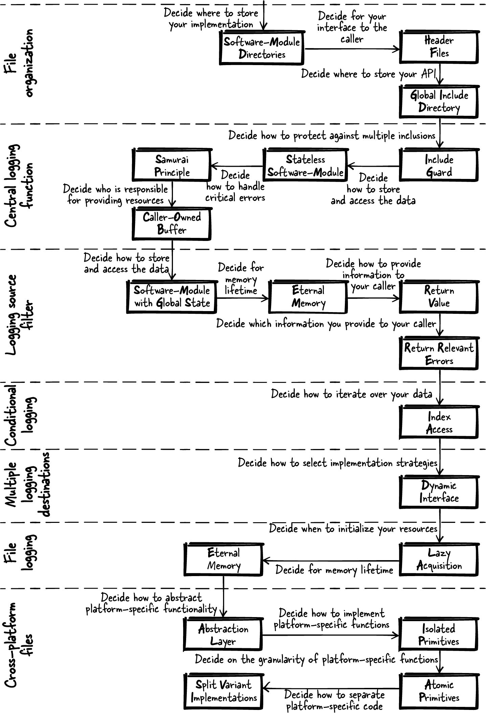

# 第 10 章  实现日志功能

在合适的场合选用合适的模式，对软件设计帮助极大。但有时要找到合适的模式、决定何时应用它，并不容易。[第一部分](Part_01_C模式.md)各模式的上下文和问题小节里有这方面的指引；不过通常，看一个具体的例子来理解"怎么做"，要容易得多。

本章讲一个故事：把本书[第一部分](Part_01_C模式.md)的模式应用到一个运行示例上——它抽象自一个工业级的日志系统实现。为了让示例代码好懂，原工业级代码的方方面面并不求全覆盖：比如代码设计就不侧重性能和可测试性。尽管如此，这个示例还是漂亮地演示了如何借助模式一步步搭起一个日志系统。

# 模式故事

想象你有一个部署在客户现场的 C 程序要维护。出了错，你就钻进汽车、开到客户那儿、调试程序。日子本来过得去——直到客户搬去了另一座城市：车程动辄几个小时，实在没法忍。

你更愿意坐在自己的办公桌前解决问题，省时省心。有些情况下可以用远程调试；另一些情况下，你需要出错时软件确切状态的详细数据——靠远程连接很难拿到，偶发性错误尤其如此。

怎么免去漫长的车程？你八成已经猜到答案了：实现日志功能，出错时请客户把含调试信息的日志文件发给你。换句话说，你要实现记录错误日志（Log Errors）模式，好在 bug 发生之后分析它们——不必重现，也能更轻松地修复。说来简单，但实现日志功能有一大堆关键的设计决定等着你做。

## 文件组织

先动手把可能用到的头文件和实现文件组织起来。你已有一个大型代码库，这些文件得跟其余代码分清楚。文件怎么组织？日志相关的文件全放同一个目录？还是所有头文件集中放进一个目录？

要回答这些问题，你去找文件组织的模式，在第 [6](Chapter_06_灵活的API.md)、[8](Chapter_08_模块化程序中的文件组织.md) 章里找到了。你通读这些模式的问题陈述，信任所述方案中的知识。最后选中正好对症的三个模式：

| 模式名 | 摘要 |
|----|----|
| 软件模块目录（Software-Module Directories） | 把属于紧耦合功能的头文件和实现文件放进同一个目录，并以头文件所提供的功能为目录命名。 |
| 头文件模式（Header Files） | 把想提供给用户的每个功能的函数声明放进 API；把所有内部函数、内部数据和函数定义（实现）藏进实现文件，且不把实现文件交给用户。 |
| 全局头文件目录（Global Include Directory） | 在代码库里设一个包含所有软件模块 API 的全局目录，并把它加进工具链的全局包含路径。 |

为你的实现文件建一个软件模块目录，把日志软件模块的头文件放进代码库既有的全局头文件目录。头文件进了全局目录，好处是：你的代码的调用方一定会知道该用哪个头文件。

文件结构应如图 10-1 所示。


###### 图 10-1  文件结构

有了这个文件结构，只关乎日志软件模块的实现文件尽可放进 *logger* 目录；可供程序其他部分使用的接口，则放进 *inc* 目录。

## 中央日志函数

起步先实现一个中央错误日志函数：接收自定义的错误文本，加上当前时间戳，打印到标准输出。时间戳信息会让你日后分析错误文本时事半功倍。

函数声明放进 *logger.h* 文件。为防头文件被重复包含，加上包含保护（Include Guard）。这段代码无需存储任何信息、无需初始化——直接实现一个无状态软件模块（Stateless Software-Module）。无状态的日志器好处多多：日志代码保持简单，多线程环境里调用也省心。

| 模式名 | 摘要 |
|----|----|
| 包含保护（Include Guard） | 保护头文件内容不被重复包含，让使用头文件的开发者不必操心"它是不是被包含了多次"。用互锁的 `#ifdef` 语句或 `#pragma once` 语句实现。 |
| 无状态软件模块（Stateless Software-Module） | 保持函数简单，实现中不积累状态信息。把相关函数统统放进一个头文件，把这个接口作为软件模块提供给调用方。 |

*logger.h*

```
#ifndef LOGGER_H
#define LOGGER_H
void logging(const char* text);
#endif
```

\
*调用方代码*

```
logging("Some text to log");
```

在 *logger.c* 文件里实现这个函数：调用 `printf`，把时间戳和文本写到 `stdout`。可要是函数的调用方传来了非法输入（比如 `NULL` 指针）呢？要不要检查这种非法输入、向调用方返回错误信息？遵循武士道原则（Samurai Principle）吧——编程错误不该以错误信息的形式返回。

| 模式名 | 摘要 |
|----|----|
| 武士道原则（Samurai Principle） | 函数要么凯旋而归，要么根本不返回。如果遇到你明知无法处理的错误，就直接终止程序。 |

把收到的文本直接递给 `printf`；输入非法，程序干脆崩溃——调用方反倒容易发现与非法输入相关的编程错误：

*logger.c*

```
void logging(const char* text)
{
  time_t mytime = time(NULL);
  printf("%s %s\n", ctime(&mytime), text);
}
```

那要是这段代码在多线程程序里被调用呢？传给函数的字符串会不会被别的线程改动？要不要要求字符串在日志函数完成之前保持不变？在上面的代码里，调用方向 `logging` 函数提供 `text` 作为输入，并负责保证字符串在函数返回前有效——这是一个调用方拥有的缓冲区（Caller-Owned Buffer）。这一行为必须写进函数的接口文档。

| 模式名 | 摘要 |
|----|----|
| 调用方拥有的缓冲区（Caller-Owned Buffer） | 要求调用方向返回大数据、复杂数据的函数提供缓冲区及其大小；函数实现中，缓冲区够大就把所需数据拷贝进去。 |

*logger.h*

```
/* Prints the current timestamp followed by the provided string to stdout.
   The string must be valid until this function returns. */
void logging(const char* text);
```

## 日志来源过滤

现在想象每个软件模块都调用日志函数来记录信息。输出会变得相当杂乱——多线程程序尤其如此。

为了更容易找到你要的信息，你想让代码可配置：只打印已配置的软件模块的日志信息。为此，给函数加一个标识当前软件模块的参数，再加一个启用某软件模块打印输出的函数。这个函数一调用，该软件模块今后的所有日志输出都会打印：

*logger.h*

```
/* Prints the current timestamp followed by the provided string to stdout.
   The string must be valid until this function returns. The provided module
   identifies the software-module that calles this function. */
void logging(const char* module, const char* text);

/* Enables printing output for the provided module. */
bool enableModule(const char* module);
```

\
*调用方代码*

```
logging("MY-SOFTWARE-MODULE", "Some text to log");
```

"哪些软件模块的日志该打印"这件事怎么记？把状态信息存进全局变量？可全局变量不就是代码坏味道吗？那为了避开全局变量，给所有函数都加一个存这份状态的参数？所需内存要在程序整个生命周期占用吗？这些问题的答案是：用永久内存（Eternal Memory）实现一个带全局状态的软件模块（Software-Module with Global State）。

| 模式名 | 摘要 |
|----|----|
| 带全局状态的软件模块（Software-Module with Global State） | 用一个全局实例让相关函数共享公共资源。把操作该实例的所有函数放进一个头文件，把这个接口作为软件模块提供给调用方。 |
| 永久内存（Eternal Memory） | 把数据放进程序整个生命周期内都可用的内存里。 |

*logger.c*

```
#define MODULE_SIZE 20
#define LIST_SIZE 10
typedef struct
{
  char module[MODULE_SIZE];
}LIST;
static LIST list[LIST_SIZE];
```

上面代码中的列表由下面这个函数填充，启用软件模块：

*logger.c*

```
bool enableModule(const char* module)
{
  for(int i=0; i<LIST_SIZE; i++)
  {
    if(strcmp(list[i].module, "") == 0)
    {
      strcpy(list[i].module, module);
      return true;
    }
    if(strcmp(list[i].module, module) == 0)
    {
      return false;
    }
  }
  return false;
}
```

上面的代码在列表有空槽、且该名字不在列表里时，把软件模块名加进列表。调用方通过返回值（Return Value）看得出有没有出错，但看不出出的具体是哪个错。你不返回状态码（Return Status Codes），只返回相关错误（Return Relevant Errors）：对这些错误情形，调用方没有任何可以区别对待的合理场景。这一行为也应写进函数定义的文档。

| 模式名 | 摘要 |
|----|----|
| 返回值（Return Value） | 直接使用 C 中专为获取函数调用结果而生的那个机制——返回值。C 的返回值机制会复制函数结果，把这份副本交给调用方。 |
| 返回相关错误（Return Relevant Errors） | 只把对调用方有用的错误信息返回给它：调用方能据之采取行动的信息，才是有用的信息。 |

*logger.h*

```
/* Enables printing output for the provided module. Returns true on success
   and false on error (no more modules can be enabled or module was already
   enabled). */
bool enableModule(const char* module);
```

## 条件日志

现在，列表里有了已激活的软件模块，你可以按激活情况有条件地记录信息了，如下面的代码所示：

*logger.c*

```
void logging(const char* module, const char* text)
{
  time_t mytime = time(NULL);
  if(isInList(module))
  {
    printf("%s %s\n", ctime(&mytime), text);
  }
}
```

可 `isInList` 函数怎么实现？遍历列表有好几种办法。可以用游标迭代器（Cursor Iterator）提供 `getNext` 方法来抽象底层数据结构——但这里有必要吗？毕竟你只是在自己软件模块里走一遍数组。被遍历的数据并不跨越可能需要保持兼容的 API 边界，用个简单得多的方案就够了：下标访问（Index Access）直接用下标访问要遍历的元素：

| 模式名 | 摘要 |
|----|----|
| 下标访问（Index Access） | 提供一个接收下标、寻址底层数据结构中元素并返回其内容的函数。用户在循环里调用它即可遍历全部元素。 |

*logger.c*

```
bool isInList(const char* module)
{
  for(int i=0; i<LIST_SIZE; i++)
  {
    if(strcmp(list[i].module, module) == 0)
    {
      return true;
    }
  }
  return false;
}
```

软件模块专属日志的代码至此写完。这段代码只是递增下标遍历数据结构——`enableModule` 函数里用的就是同一种遍历。

## 多日志目的地

接下来，你想为日志条目提供不同的目的地。到目前为止，所有输出都记到 `stdout`；你想让调用方能配置你的代码，直接把日志写进文件。这种配置通常在待记录的动作开始之前完成。先来一对函数，配置今后所有日志的目的地：

*logger.h*

```
/* All future log messages will be logged to stdout */
void logToStdout();

/* All future log messages will be logged to a file */
void logToFile();
```

实现日志目的地的选择，可以直接用 `if` 或 `switch` 语句按配置调用相应函数。可每加一个日志目的地，就得动这段代码——按开闭原则衡量，这不是好方案。好得多的方案是实现动态接口（Dynamic Interface）。

| 模式名 | 摘要 |
|----|----|
| 动态接口（Dynamic Interface） | 在 API 中为这些有差异的功能定义一个公共接口，要求调用方为该功能提供一个回调函数，你在函数实现中调用它。 |

*logger.c*

```
typedef void (*logDestination)(const char*);
static logDestination fp = stdoutLogging;

void stdoutLogging(const char* buffer)
{
  printf("%s", buffer);
}

void fileLogging(const char* buffer)
{
  /* not yet implemented */
}

void logToStdout()
{
  fp = stdoutLogging;
}

void logToFile()
{
  fp = fileLogging;
}

#define BUFFER_SIZE 100
void logging(const char* module, const char* text)
{
  char buffer[BUFFER_SIZE];
  time_t mytime = time(NULL);
  if(isInList(module))
  {
    sprintf(buffer, "%s %s\n", ctime(&mytime), text);
    fp(buffer);
  }
}
```

既有代码改动不小，但现在新增日志目的地完全不必碰 `logging` 函数。上面的代码里 `stdoutLogging` 已经实现，`fileLogging` 还欠着。

## 文件日志

要写文件，最省事的是每次记日志都打开、关闭一次文件。但那效率太低：要记的信息一多，时间全耗在开关文件上。有什么替代方案？可以只打开一次文件，然后一直开着。可你怎么知道什么时候该打开？又什么时候关闭？

翻遍本书的模式，找不到能解决你这个问题的。不过谷歌一把，你就找到了对症的模式：惰性获取（Lazy Acquisition）。在 `fileLogging` 函数的第一次调用里打开文件，之后一直开着。文件描述符可以存进永久内存。

| 模式名 | 摘要 |
|----|----|
| 惰性获取（Lazy Acquisition） | 对象或数据在第一次被使用时隐式初始化（见 Michael Kirchner 与 Prashant Jain《Pattern-Oriented Software Architecture: Volume 3: Patterns for Resource Management》\[Wiley，2004\]）。 |
| 永久内存（Eternal Memory） | 把数据放进程序整个生命周期内都可用的内存里。 |

*logger.c*

```
void fileLogging(const char* buffer)
{
  static int fd = 0; 
  if(fd == 0)
  {
    fd = open("log.txt", O_RDWR | O_CREAT, 0666);
    fd = open("log.txt", O_RDWR | O_CREAT, 0666);
  }
  write(fd, buffer, strlen(buffer));
}
```

[](#co_implementing_logging_functionality_CO1-1)  
这样的 `static` 变量只初始化一次，而不是每次调用函数都初始化。

为了让示例简单，这段代码不追求线程安全。要线程安全，就得用互斥量保护惰性获取，确保获取只发生一次。

文件关闭的问题呢？对某些应用（比如本章这个），不关闭文件是完全正当的选项：你要在应用运行的整个过程中记日志，应用关掉时，靠操作系统收拾这个你留着的打开的文件。要是担心系统崩溃时信息没落盘，还可以时不时把文件内容刷出去。

## 跨平台文件

上面的代码实现了在 Linux 系统上写日志文件，但你还想让代码用在 Windows 平台上——现在的代码在那儿还跑不起来。

要支持多平台，首先考虑避免变体（Avoid Variants）：所有平台只用一份公共代码。写文件是做得到的——直接用 `fopen`、`fwrite`、`fclose`，Linux 和 Windows 上都有。

| 模式名 | 摘要 |
|----|----|
| 避免变体（Avoid Variants） | 使用所有平台都有的标准化函数；没有标准化函数，就考虑别实现这个功能。 |

可你想让文件日志代码尽量高效，而访问文件的平台专属函数效率更高。那平台专属代码怎么实现？把代码库复制一份、Windows 一套全本、Linux 一套全本？想都别想——重复代码的后续变更和维护会变成噩梦。

你决定在代码里用 `#ifdef` 语句区分平台。可这难道不也是代码重复吗？代码里满是巨大的 `#ifdef` 块时，块里的程序逻辑可都是重复的。既要支持多平台、又要避免代码重复，怎么办？

模式又指了路。首先，为需要平台相关函数的功能定义平台无关的接口——换句话说，定义抽象层（Abstraction Layer）。

| 模式名 | 摘要 |
|----|----|
| 抽象层（Abstraction Layer） | 为每个需要平台专属代码的功能提供一个 API：头文件里只定义平台无关的函数，平台专属的 `#ifdef` 代码全部放进实现文件。函数的调用方只包含你的头文件，不必包含任何平台专属文件。 |

*logger.c*

```
void fileLogging(const char* buffer)
{
  void* fileDescriptor = initiallyOpenLogFile();
  writeLogFile(fileDescriptor, buffer);
}

/* Opens the logfile at the first call.
   Works on Linux and on Windows systems */
void* initiallyOpenLogFile()
{
  ...
}

/* Writes the provided buffer to the logfile.
   Works on Linux and on Windows systems */
void writeLogFile(void* fileDescriptor, const char* buffer)
{
  ...
}
```

抽象层背后，你放的是代码变体的隔离原语（Isolated Primitives）：`#ifdef` 语句不跨多个函数，一个函数只守一个 `#ifdef`。那么 `#ifdef` 该罩住整个函数实现，还是只罩平台专属的那部分？

答案是两个都要——你应该用原子原语（Atomic Primitives）。函数的粒度应当精确到只含平台专属代码；若不是，就继续拆。这是让平台相关代码保持可控的最佳方式。

| 模式名 | 摘要 |
|----|----|
| 隔离原语（Isolated Primitives） | 隔离你的代码变体——在实现文件中，把处理变体的代码放进独立的函数，由主程序逻辑调用它们；主程序逻辑里就只剩平台无关代码。 |
| 原子原语（Atomic Primitives） | 让原语原子化：每个函数只处理恰好一种变体。若要处理多种变体（比如操作系统变体加硬件变体），就为每种各写一个函数。 |

下面的代码展示了原子原语的实现：

*logger.c*

```
void* initiallyOpenLogFile()
{
#ifdef __unix__
  static int fd = 0;
  if(fd == 0)
  {
    fd = open("log.txt", O_RDWR | O_CREAT, 0666);
  }
  return fd;
#elif defined _WIN32
  static HANDLE hFile = NULL;
  if(hFile == NULL)
  {
    hFile = CreateFile("log.txt", GENERIC_WRITE, 0, NULL,
                       CREATE_NEW, FILE_ATTRIBUTE_NORMAL, NULL);
  }
  return hFile;
#endif
}

void writeLogFile(void* fileDescriptor, const char* buffer)
{
#ifdef __unix__
  write((int)fileDescriptor, buffer, strlen(buffer));
#elif defined _WIN32
  WriteFile((HANDLE)fileDescriptor, buffer, strlen(buffer), NULL, NULL);
#endif
}
```

上面的代码看着不怎么样。话说回来，平台相关的代码本来就少见漂亮的。还能做点什么让它更好读、更好维护？一个改进思路是拆分变体实现（Split Variant Implementations），各进各的文件。

| 模式名 | 摘要 |
|----|----|
| 拆分变体实现（Split Variant Implementations） | 把每种变体实现放进单独的实现文件，按文件为单位选择为哪个平台编译什么。 |

*fileLinux.c*

```
#ifdef __unix__
void* initiallyOpenLogFile()
{
  static int fd = 0;
  if(fd == 0)
  {
    fd = open("log.txt", O_RDWR | O_CREAT, 0666);
  }
  return fd;
}

void writeLogFile(void* fileDescriptor, const char* buffer)
{
  write((int)fileDescriptor, buffer, strlen(buffer));
}
#endif
```

\
*fileWindows.c*

```
#ifdef _WIN32
void* initiallyOpenLogFile()
{
  static HANDLE hFile = NULL;
  if(hFile == NULL)
  {
    hFile = CreateFile("log.txt", GENERIC_WRITE, 0, NULL,
                       CREATE_NEW, FILE_ATTRIBUTE_NORMAL, NULL);
  }
  return hFile;
}

void writeLogFile(void* fileDescriptor, const char* buffer)
{
  WriteFile((HANDLE)fileDescriptor, buffer, strlen(buffer), NULL, NULL);
}
#endif
```

比起 Linux 和 Windows 代码混在同一个函数里的版本，这两个代码文件都好读多了。而且现在还可以干脆去掉所有 `#ifdef` 语句，改用 Makefile 选择编译哪些文件——不必再用 `#ifdef` 按平台条件编译。

## 使用日志器

日志功能的最终改动落定，你的代码现在可以把已配置软件模块的日志消息记到 `stdout`，也可以记到跨平台文件。下面的代码展示了日志功能的用法：

```
enableModule("MYMODULE");
logging("MYMODULE", "Log to stdout");
logToFile();
logging("MYMODULE", "Log to file");
logging("MYMODULE", "Log to file some more");
```

做完所有这些编码决定并实现之后，你长舒一口气。双手离开键盘，欣赏地看着代码。你惊讶地发现：一些起初看似棘手的问题，竟被模式轻轻松松化解了。使用模式的好处就在于：它们卸下了你独自做上百个决定的担子。

漫长的现场修 bug 车程成为过去。如今你需要的调试信息，从日志文件里信手拈来。客户高兴了——bug 修得更快了；更重要的是，你自己的日子好过了：软件更专业，你也有了早点下班回家的时间。

# 小结

你应用[第一部分](Part_01_C模式.md)的模式，一个问题接一个问题地解决，一步步搭起了这套日志功能的代码。起初你有一堆疑问：文件怎么组织、错误处理怎么办……模式指了路：它们给你指引，让这段代码的构建轻松了许多；它们也让你明白，这段代码为什么长这样、行为为什么是这样。[图 10-2](#fig_story1_patterns) 概览了模式帮你做下的这些决定。

当然，这段代码还有很多可以改进的功能。比如：它不处理文件大小上限和日志轮转，也不支持配置日志级别来跳过过于详细的日志。为了让事情简单好懂，这些功能没有涵盖，但都可以补进示例代码。

下一章讲另一个故事：如何应用模式构建又一段较大的工业级代码。



###### 图 10-2  贯穿本章故事应用的模式
