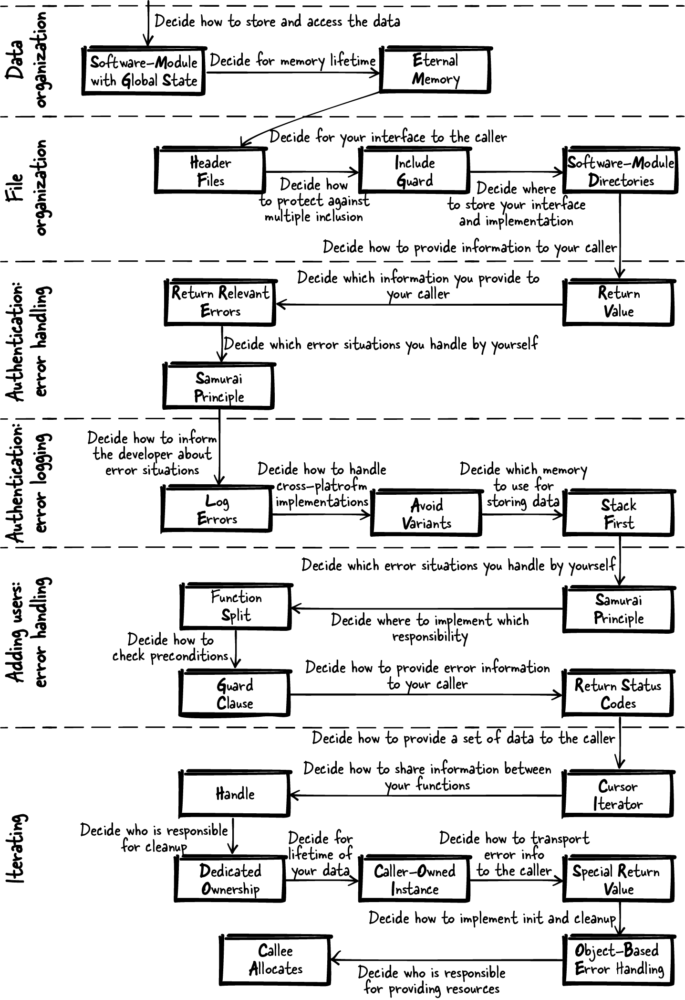

# 第 11 章  构建用户管理系统

本章讲一个故事：把本书[第一部分](Part_01_C模式.md)的模式应用到一个运行示例上，并借此说明：借助模式做出的设计选择，如何为程序员带来好处和支持。本章的运行示例抽象自一个工业级的用户管理系统实现。

# 模式故事

想象你刚出校门，进了一家软件开发公司。老板递给你一份产品规格说明书——一个存储用户名和密码的软件——让你实现它。软件要提供这些功能：检查为某用户提供的密码是否正确；创建、删除、查看既有用户。

你急于向老板证明自己是个好程序员，可还没动手，脑子里就挤满了问题：所有代码写进一个文件？上学时就知道这是坏习惯——那多少个文件算合适？代码的哪些部分放进相同文件？每个函数的输入参数都要检查吗？函数要返回详细的错误信息吗？大学教了你怎样做出一个能跑的软件，却没教你怎样写出可维护的好代码。怎么办？从哪儿下手？

## 数据组织

要回答这些问题，先翻翻本书的模式，找找构建优秀 C 程序的指引。从存储用户名和密码这部分开始。现在你的问题聚焦在：数据在程序里怎么存？存进全局变量？放进函数内的局部变量？还是分配动态内存？

先想清楚你要解决的确切问题：你不确定用户名数据怎么存。目前不需要把数据持久化，只想在运行期能建立并访问它；你也不想让自己的函数的调用方应付显式的分配和初始化。

接下来找对症的模式。翻看[第 5 章](Chapter_05_数据生命周期与所有权.md)关于数据生命周期和所有权的 C 模式——那正是"谁负责持有哪份数据"这个议题。通读各模式的问题小节，找到一个与你问题高度契合、后果又能接受的：带全局状态的软件模块（Software-Module with Global State）。它建议用永久内存（Eternal Memory）——作用域限于文件的全局变量——让数据在文件内随处可访问。

| 模式名 | 摘要 |
|----|----|
| 带全局状态的软件模块（Software-Module with Global State） | 用一个全局实例让相关函数共享公共资源。把操作该实例的所有函数放进一个头文件，把这个接口作为软件模块提供给调用方。 |
| 永久内存（Eternal Memory） | 把数据放进程序整个生命周期内都可用的内存里。 |

```
#define MAX_SIZE 50
#define MAX_USERS 50

typedef struct
{
  char name[MAX_SIZE];
  char pwd[MAX_SIZE];
}USER;

static USER userList[MAX_USERS]; 
```

[](#co_building_a_user_management_system_CO1-1)  
`userList` 存放你的用户数据，在实现文件内随处可访问。它待在静态内存里，无需手动分配——手动分配会让代码更灵活，但也会更复杂。

# 存储密码

在这个简化示例里，密码以明文保存。真实应用中绝对、绝对不要这样做：存密码时，应存明文密码的[加盐哈希值](https://oreil.ly/5y7yO)。

## 文件组织

接下来为你的调用方定义接口。要确保日后改实现时，调用方一行代码都不用改。现在你要决定：程序的哪部分定义在接口里，哪部分定义在实现文件里。

用头文件模式（Header Files）解决这个问题。接口（*.h* 文件）里的东西越少越好——只放与调用方相关的；其余统统进实现文件（*.c* 文件）。再实现包含保护（Include Guard），防头文件被重复包含。

| 模式名 | 摘要 |
|----|----|
| 头文件模式（Header Files） | 把想提供给用户的每个功能的函数声明放进 API；把所有内部函数、内部数据和函数定义（实现）藏进实现文件，且不把实现文件交给用户。 |
| 包含保护（Include Guard） | 保护头文件内容不被重复包含，让使用头文件的开发者不必操心"它是不是被包含了多次"。用互锁的 `#ifdef` 语句或 `#pragma once` 语句实现。 |

*user.h*

```
#ifndef USER_H
#define USER_H

#define MAX_SIZE 50

#endif
```

\
*user.c*

```
#include "user.h"

#define MAX_USERS 50

typedef struct
{
  char name[MAX_SIZE];
  char pwd[MAX_SIZE];
}USER;

static USER userList[MAX_USERS];
```

现在调用方可以用定义好的 `MAX_SIZE` 知道传给软件模块的字符串最长多少。按惯例，调用方知道：*.h* 文件里的东西都能用，*.c* 文件里的东西都不能碰。

接下来，确保你的代码文件与调用方的代码分得清楚，避免撞名。你的所有文件放一个目录？还是把整个代码库的 *.h* 文件都集中到一个目录、方便包含？

建一个软件模块目录（Software-Module Directories），把你软件模块的所有文件——接口和实现——放进同一个目录。

| 模式名 | 摘要 |
|----|----|
| 软件模块目录（Software-Module Directories） | 把属于紧耦合功能的头文件和实现文件放进同一个目录，并以头文件所提供的功能为目录命名。 |

有了图 11-1 所示的目录结构，与你代码相关的所有文件一眼可见，你也不必担心实现文件的名字会跟别的文件撞车。


###### 图 11-1  文件结构

## 认证：错误处理

现在实现第一个访问数据的功能。先写一个函数：检查为某用户提供的密码，与先前为该用户保存的密码是否一致。在头文件里声明函数、在声明旁用代码注释写明行为，以此定义函数的行为。

函数应当让调用方知道：为某用户提供的密码对不对。用函数的返回值（Return Value）告诉它。可该返回什么信息？出现的任何错误信息都要给调用方吗？

只返回相关错误（Return Relevant Errors）：任何与安全相关的功能，通行做法都是只提供必须提供的信息，绝不多给。别让调用方知道是用户不存在还是密码错误——只告诉它认证成没成。

| 模式名 | 摘要 |
|----|----|
| 返回值（Return Value） | 直接使用 C 中专为获取函数调用结果而生的那个机制——返回值。C 的返回值机制会复制函数结果，把这份副本交给调用方。 |
| 返回相关错误（Return Relevant Errors） | 只把对调用方有用的错误信息返回给它：调用方能据之采取行动的信息，才是有用的信息。 |

*user.h*

```
/* Returns true if the provided username exists and
   if the provided password is correct for that user. */
bool authenticateUser(char* username, char* pwd);
```

这段代码把函数返回哪个值定义得很清楚，但没规定非法输入时的行为。`NULL` 指针这类非法输入怎么处理？要检查吗？还是干脆无视？

要求你的用户提供合法输入——非法输入是用户的编程错误，这种错误不该无声无息。按武士道原则（Samurai Principle）：输入非法就终止程序，并把这一行为写进头文件。

| 模式名 | 摘要 |
|----|----|
| 武士道原则（Samurai Principle） | 函数要么凯旋而归，要么根本不返回。如果遇到你明知无法处理的错误，就直接终止程序。 |

*user.h*

```
/* Returns true if the provided username exists and
   if the provided password is correct for that user,
   returns false otherwise. Asserts in case of invalid
   input (NULL string) */
bool authenticateUser(char* username, char* pwd);
```

\
*user.c*

```
bool authenticateUser(char* username, char* pwd)
{
  assert(username);
  assert(pwd);

  for(int i=0; i<MAX_USERS; i++)
  {
    if(strcmp(username, userList[i].name) == 0 &&
       strcmp(pwd, userList[i].pwd) == 0)
    {
      return true;
    }
  }
  return false;
}
```

武士道原则替调用方卸下了"检查表示非法输入的特定返回值"的担子：输入非法，程序直接崩。你选择显式的 `assert` 语句，而不是放任程序失控地崩（比如把非法输入递给 `strcmp`）——在安全攸关的应用里，哪怕出错的情形，程序的行为也必须是明确的。

乍一看，让程序崩溃像个简单粗暴的方案，但正是这个行为让带非法参数的调用无所遁形。长期看，这个策略让代码更可靠：非法参数这类隐蔽的 bug 不会潜伏下来、日后在调用方代码的别处冒头。

## 认证：错误日志

接下来，把送错密码来的调用方记录在案。`authenticateUser` 函数失败时记录错误日志（Log Errors），这些信息留待日后的安全审计使用。日志嘛，要么直接拿[第 10 章](Chapter_10_实现日志功能.md)的代码，要么实现个简化版，如下所示。

| 模式名 | 摘要 |
|----|----|
| 记录错误日志（Log Errors） | 把两类错误信息分走不同通道：对调用代码有用的错误信息正常返回；对开发者有用的错误信息（如调试细节）写进日志文件，不返回给调用方。 |

这套日志机制很难同时在多个平台上提供——Linux 一个样、Windows 一个样——因为不同操作系统访问文件的函数不同；多平台代码本来就难写难维护。那怎么把日志功能实现得尽量简单？确保避免变体（Avoid Variants），用所有平台都有的标准化函数。

| 模式名 | 摘要 |
|----|----|
| 避免变体（Avoid Variants） | 使用所有平台都有的标准化函数；没有标准化函数，就考虑别实现这个功能。 |

所幸 C 标准定义了文件访问函数，Windows 和 Linux 都能用。操作系统专属的文件访问函数也许更快、也许带平台特性，但这里用不着。直接用 C 标准定义的文件访问函数。

收到错误密码时调用下面这个函数，实现日志功能：

*user.c*

```
static void logError(char* username)
{
  char logString[200];
  sprintf(logString, "Failed login. User:%s\n", username);
  FILE* f = fopen("logfile", "a+"); 
  fwrite(logString, 1, strlen(logString), f);
  fclose(f);
}
```

[](#co_building_a_user_management_system_CO2-1)  
用的是平台无关的 `fopen`、`fwrite`、`fclose`。这段代码在 Windows 和 Linux 上都能跑，也不见处理平台变体的讨厌的 `#ifdef` 语句。

存放日志信息时，代码用的是栈优先（Stack First）——日志消息够小，栈装得下。这对你也最省事：不必管内存清理。

| 模式名 | 摘要 |
|----|----|
| 栈优先（Stack First） | 默认把变量放栈上，坐享栈变量自动清理的好处。 |

## 添加用户：错误处理

纵览全部代码：你已经有了一个检查密码对不对的函数，可用户列表还空着。要把列表填起来，得实现一个让调用方添加新用户的函数。

确保用户名唯一，并让调用方知道添加成没成——没成是因为用户名已存在，还是因为列表满了。

现在你得决定怎么把错误情形告知调用方。用返回值传这个信息，还是设置 `errno` 变量？另外，给调用方哪种信息、用什么数据类型返回？

这次用返回状态码（Return Status Codes）：错误情形不止一种，你要让调用方分得清。同时，参数非法就终止程序（武士道原则）。错误码定义在接口里，让你和调用方对"错误码如何对应错误情形"有共识，调用方才能正确应对。

| 模式名 | 摘要 |
|----|----|
| 返回状态码（Return Status Codes） | 用函数的返回值承载状态信息，返回一个代表特定状态的值——被调方和调用方对这个值的含义必须有共识。 |

*user.h*

```
typedef enum{
  USER_SUCCESSFULLY_ADDED,
  USER_ALREADY_EXISTS,
  USER_ADMINISTRATION_FULL
}USER_ERROR_CODE;

/* Adds a new user with the provided `username' and the provided password
   `pwd' (asserts on NULL). Returns USER_SUCCESSFULLY_ADDED on success,
   USER_ALREADY_EXISTS if a user with the provided username already exists
   and USER_ADMINISTRATION_FULL if no more users can be added. */
USER_ERROR_CODE addUser(char* username, char* pwd);
```

接下来实现 `addUser` 函数：先检查用户是否已存在，再添加。要分开这些任务，先来一次函数拆分（Function Split），把不同的任务和职责拆进不同的函数。先实现检查用户是否存在的函数。

| 模式名 | 摘要 |
|----|----|
| 函数拆分（Function Split） | 把函数拆开：把函数中一段看起来能独立成篇的部分拿出来，新建一个函数放进去，再调用这个新函数。 |

*user.c*

```
static bool userExists(char* username)
{
  for(int i=0; i<MAX_USERS; i++)
  {
    if(strcmp(username, userList[i].name) == 0)
    {
      return true;
    }
  }
  return false;
}
```

添加用户的函数内部现在可以调用它，用户不存在才添加。那么，检查既有用户放在函数开头，还是紧挨着添加之前？哪种选择让函数更好读好维护？

在函数开头实现卫语句（Guard Clause）：因用户已存在而无法执行动作时，立即返回。检查放在函数一进门，程序流程最清晰。

| 模式名 | 摘要 |
|----|----|
| 卫语句（Guard Clause） | 梳理出必须满足的前置条件，一旦条件不满足就立即从函数返回。 |

*user.c*

```
USER_ERROR_CODE addUser(char* username, char* pwd)
{
  assert(username);
  assert(pwd);

  if(userExists(username))
  {
    return USER_ALREADY_EXISTS;
  }

  for(int i=0; i<MAX_USERS; i++)
  {
    if(strcmp(userList[i].name, "") == 0)
    {
      strcpy(userList[i].name, username);
      strcpy(userList[i].pwd, pwd);
      return USER_SUCCESSFULLY_ADDED;
    }
  }

  return USER_ADMINISTRATION_FULL;
}
```

有了目前实现的这些代码片段，你可以往用户管理里填用户，也能检查为这些用户提供的密码对不对了。

## 迭代

接下来提供读出所有用户名的功能：实现一个迭代器。直接给一个让调用方按下标访问 `userList` 数组的接口当然省事，可底层数据结构一旦变化（比如换成链表），或者一个调用方想访问数组时另一个调用方正在改它，你就麻烦了。

要提供一个能解决上述问题的迭代器接口，实现游标迭代器（Cursor Iterator），并用句柄（Handle）把底层数据结构对调用方藏起来。

| 模式名 | 摘要 |
|----|----|
| 游标迭代器（Cursor Iterator） | 创建一个指向底层数据结构中某元素的迭代器实例；迭代函数以该实例为参数，取出迭代器当前指向的元素，并把实例改为指向下一个元素。用户循环调用这个函数，一次取一个元素。 |
| 句柄（Handle） | 提供一个创建上下文的函数，向调用方返回指向内部数据的抽象指针；要求调用方把这个指针传给你的所有函数，函数便可使用内部数据来存储状态信息和资源。 |

*user.h*

```
typedef struct ITERATOR* ITERATOR;

/* Create an iterator instance. Returns NULL on error. */
ITERATOR createIterator();

/* Retrieves the next element from an iterator instance. */
char* getNextElement(ITERATOR iterator);

/* Destroys an iterator instance. */
void destroyIterator(ITERATOR iterator);
```

何时创建、何时销毁迭代器，调用方全权做主——这正是调用方拥有的实例（Caller-Owned Instance）带来的专属所有权（Dedicated Ownership）。调用方创建迭代器句柄，用它访问用户名列表即可。创建失败？特殊返回值（Special Return Values）`NULL` 自会表明。用特殊返回值而不是显式错误码，函数用起来更轻松：不必为错误信息增加额外的函数参数。遍历完毕，调用方销毁句柄。

| 模式名 | 摘要 |
|----|----|
| 专属所有权（Dedicated Ownership） | 就在实现内存分配的那一刻，明确并记录：这块内存将在哪里清理、由谁清理。 |
| 调用方拥有的实例（Caller-Owned Instance） | 要求调用方把一个存储资源和状态信息的实例传给你的函数。为创建和销毁这些实例提供显式函数，让调用方决定它们的生命周期。 |
| 特殊返回值（Special Return Values） | 用函数返回值承载函数计算出的数据，另外保留一个或多个特殊值专用于表示出错。 |

接口既然向调用方提供了创建和销毁迭代器的显式函数，实现中自然就把迭代器资源的初始化和清理分进了各自的函数。这种基于对象的错误处理（Object-Based Error Handling）带来函数职责的漂亮分离——日后要扩展也容易。下面的代码里可以看到这种分离：全部初始化代码在一个函数，全部清理代码在另一个函数。

| 模式名 | 摘要 |
|----|----|
| 基于对象的错误处理（Object-Based Error Handling） | 把初始化和清理放进独立的函数——类似面向对象编程中构造函数与析构函数的概念。 |

*user.c*

```
struct ITERATOR
{
  int currentPosition;
  char currentElement[MAX_SIZE];
};

ITERATOR createIterator()
{
  ITERATOR iterator = (ITERATOR) calloc(sizeof(struct ITERATOR),1);
  return iterator;
}

char* getNextElement(ITERATOR iterator)
{
  if(iterator->currentPosition < MAX_USERS)
  {
    strcpy(iterator->currentElement,userList[iterator->currentPosition].name);
    iterator->currentPosition++;
  }
  else
  {
    strcpy(iterator->currentElement, "");
  }
  return iterator->currentElement;
}

void destroyIterator(ITERATOR iterator)
{
  free(iterator);
}
```

实现上面的代码时，用户名数据怎么交给调用方？直接给一个指向数据的指针？要是把数据拷进缓冲区，该谁来分配？

这个情形里，被调方分配（Callee Allocates）字符串缓冲区。调用方因此既能完全访问这个字符串，又改不了 `userList` 里的数据；还避开了访问可能同时被其他调用方修改的数据。

| 模式名 | 摘要 |
|----|----|
| 被调方分配（Callee Allocates） | 在提供大数据、复杂数据的函数内部分配所需大小的缓冲区，把所需数据拷贝进去，返回指向该缓冲区的指针。 |

## 使用用户管理系统

你的用户管理代码至此完工。下面的代码展示了这个用户管理系统的用法：

```
char* element;
addUser("A", "pass");
addUser("B", "pass");
addUser("C", "pass");

ITERATOR it = createIterator();

while(true)
{
  element = getNextElement(it);
  if(strcmp(element, "") == 0)
  {
    break;
  }

  printf("User: %s ", element);
  printf("Authentication success? %d\n", authenticateUser(element, "pass"));
}

destroyIterator(it);
```

在本章一路走来的过程中，模式帮你设计出了这份最终代码。现在你可以告诉老板：存储用户名和密码的系统做完了。用基于模式的设计来构建这个系统，你倚仗的是有文档可查、经使用检验的方案。

# 小结

你应用[第一部分](Part_01_C模式.md)的模式，一个问题接一个问题地解决，一步步搭起了本章的代码。起初你有一堆疑问：文件怎么组织、错误处理怎么办……模式指了路：它们给你指引，让这段代码的构建轻松了许多；它们也让你明白，这段代码为什么长这样、行为为什么是这样。本章你应用的模式见图 11-2——从图中可以看到你做了多少决定、其中多少决定有模式护航。

搭建起来的用户管理系统包含添加、查找、认证用户的基本功能。当然还有很多功能可以再加：改密码、不存明文密码、检查密码是否满足安全条件……为了让模式的应用更好懂，这些进阶功能本章没有展开。



###### 图 11-2  贯穿本章故事应用的模式
