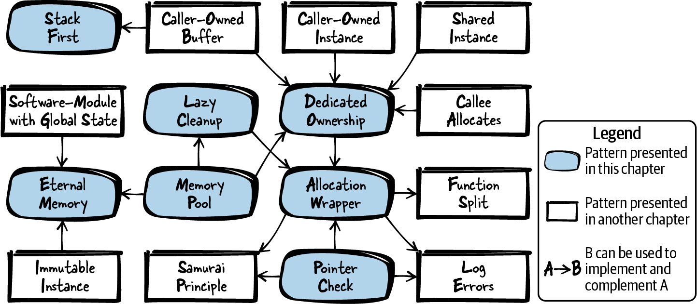

# Chapter 3. Memory Management

Each program stores some values in memory to use them later on in the program. This functionality is so common for programs that modern programming languages make doing it as easy as possible. The C++ programming language, as well as other object-oriented programming languages, provides constructors and destructors, which make it very easy to have a defined place and time to allocate and clean up memory. The Java programming language even comes with a garbage collector, which makes sure that memory that is not used anymore by the program is made available to others.

Compared to that, programming in C is special in the way that the programmer has to manually manage the memory. The programmer has to decide whether to put variables on the stack, on the heap, or in static memory. Also, the programmer has to make sure that heap variables are manually cleaned up afterwards, and there is no mechanism like a destructor or a native garbage collector, which would make some of these tasks much easier.

Guidance on how to perform such tasks is well scattered over the internet, which makes it quite hard to answer questions like the following: “Should that variable go on the stack or on the heap?” To answer that as well as other questions, this chapter presents patterns on how to handle memory in C programs. The patterns provide guidance on when to use the stack, when to use the heap, and when and how to clean up heap memory. To make the core idea of the patterns easier to grasp, the patterns are applied to a running code example throughout the chapter.

[Figure 3-1](#fig_memory) shows an overview of the patterns discussed in this chapter and their relationships, and [Table 3-1](#tab_memory) provides a summary of the patterns.



###### Figure 3-1. Overview of patterns for memory management

|  | Pattern name | Summary |
|----|----|----|
|  | Stack First | Deciding the storage class and memory section (stack, heap, …) for variables is a decision every programmer has to make often. It gets exhausting if for each and every variable, the pros and cons of all possible alternatives have to be considered in detail. Therefore, simply put your variables on the stack by default to profit from automatic cleanup of stack variables. |
|  | Eternal Memory | Holding large amounts of data and transporting it between function calls is difficult because you have to make sure that the memory for the data is large enough and that the lifetime extends across your function calls. Therefore, put your data into memory that is available throughout the whole lifetime of your program. |
|  | Lazy Cleanup | Having dynamic memory is required if you need large amounts of memory and memory where you don’t know the required size beforehand. However, handling cleanup of dynamic memory is a hassle and is the source of many programming errors. Therefore, allocate dynamic memory and let the operating system cope with deallocation by the end of your program. |
|  | Dedicated Ownership | The great power of using dynamic memory comes with the great responsibility of having to properly clean that memory up. In larger programs, it becomes difficult to make sure that all dynamic memory is cleaned up properly. Therefore, right at the time when you implement memory allocation, clearly define and document where it’s going to be cleaned up and who is going to do that. |
|  | Allocation Wrapper | Each allocation of dynamic memory might fail, so you should check allocations in your code to react accordingly. This is cumbersome because you have many places for such checks in your code. Therefore, wrap the allocation and deallocation calls, and implement error handling or additional memory management organization in these wrapper functions. |
|  | Pointer Check | Programming errors that lead to accessing an invalid pointer cause uncontrolled program behavior, and such errors are difficult to debug. However, because your code works with pointers frequently, there is a good chance that you have introduced such programming errors. Therefore, explicitly invalidate uninitialized or freed pointers and always check pointers for validity before accessing them. |
|  | Memory Pool | Frequently allocating and deallocating objects from the heap leads to memory fragmentation. Therefore, hold a large piece of memory throughout the whole lifetime of your program. At runtime, retrieve fixed-size chunks of that memory pool instead of directly allocating new memory from the heap. |

Table 3-1. Patterns for memory management

# Data Storage and Problems with Dynamic Memory

In C you have several options for where to put your data:

- You can put the data on the stack. The stack is a fixed-size memory reserved for each thread (allocated when creating the thread). When calling a function in such a thread, a block on the top of the stack is reserved for the function parameters and automatic variables used by that function. After the function call, that memory is automatically cleaned up. To put data on the stack, simply declare variables in the functions where they are used. These variables can be accessed as long as they don’t run out of scope (when the function block ends):

  ``` less-space-2
  void main()
  {
    int my_data;
  }
  ```

- You can put data into static memory. The static memory is a fixed-size memory in which the allocation logic is fixed at compile time. To use the static memory, simply place the `static` keyword in front of your variable declaration. Such variables are available throughout the whole lifetime of your program. The same holds true for global variables, even without the `static` keyword:

  ``` less-space-2
  int my_global_data;
  static int my_fileglobal_data;
  void main()
  {
    static int my_local_data;
  }
  ```

- If your data is of fixed size and immutable, you can simply store it directly in the static memory where the code is stored. Quite often, fixed string values are stored this way. Such data is available throughout the whole lifetime of your program (even though, in the example below, the pointer to that data runs out of scope):

  ``` less-space-2
  void main()
  {
    char* my_string = "Hello World";
  }
  ```

- You can allocate dynamic memory on the heap to store the data. The heap is a global memory pool available for all processes on the system, and it is up to the programmer to allocate and deallocate from that pool at any time:

  ``` less-space-2
  void main()
  {
    void* my_data = malloc(1000);
    /* work with the allocated 1000 byte memory */
    free(my_data);
  }
  ```

Allocating dynamic memory is the starting point where things can easily go wrong, and tackling the problems that can arise is the focus of this chapter. Using dynamic memory in C programs comes with many problems that have to be solved or at least considered. The following outlines the major problems with dynamic memory:

- Memory that is allocated has to be freed at some point later on. When not doing so for all memory you allocated, you’ll consume more memory than you need and have a so-called memory leak. If that happens frequently and your applications runs for a long time, you’ll end up having no additional memory.

- Freeing memory more than once is a problem and can lead to undefined program behavior, which is really bad. Worst case, nothing goes wrong in the actual code line where you made the mistake, but at some random point later in time, your program might crash. Such errors are a hassle to debug.

- Trying to access freed memory is a problem as well. It is easy to free some memory and then later on make a mistake and dereference a pointer to that memory (a so-called dangling pointer). Again, this leads to error situations that are a hassle to debug. Best case, the program would simply crash. Worst case, it would not crash and the memory already belongs to somebody else. Errors related to using that memory are a security risk and might show up as some kind of hard-to-understand error later during program execution.

- You have to cope with lifetime and ownership of allocated data. You have to know who cleans up which data when, and that can be particularly tricky in C. In C++ it would be possible to simply allocate data for objects in the constructor and free them in the destructor. In combination with C++ *smart pointers*, you even have the option to automatically clean up an object if it runs out of scope. However, that is not possible in C because we don’t have destructors. We are not notified when a pointer runs out of scope and the memory should be cleaned up.

- Working with heap memory takes more time compared to working with memory from the stack or with static memory. The allocation of heap memory has to be protected against race conditions because other processes use the same pool of memory. This makes allocation slower. Accessing the heap memory is also slower because, in comparison, the stack memory is accessed more often and thus more likely already resides in the cache or in CPU registers.

- A huge issue with heap memory is that it becomes fragmented, which is depicted in [Figure 3-2](#fig_fragmentation). If you allocate memory blocks A, B, and C and later on free memory block B, your overall free heap memory is no longer consecutive. If you want to allocate a large memory block D, you won’t get that memory, although there is enough total memory available. However, as that available memory is not consecutive, your `malloc` call will fail. Fragmentation is a huge issue in memory-constrained systems that run for a long time (like embedded real-time systems).


###### Figure 3-2. Memory fragmentation

Tackling these issues is not easy. The patterns in the following sections describe bit by bit how to either avoid dynamic allocation or live with it in an acceptable way.

# Running Example

You want to implement a simple program that encrypts some text with the Caesar cipher. The Caesar cipher replaces each letter with another letter that is some fixed number of positions down the alphabet. For example, if the fixed number of positions is 3, then the letter A would be replaced by letter D. You start to implement a function that performs the Caesar encryption:

```
/* Performs a Caesar encryption with the fixed key 3.
   The parameter 'text' must contain a text with only capital letters.
   The parameter 'length' must contain the length of the text excluding
   NULL termination. */
void caesar(char* text, int length)
{
  for(int i=0; i<length; i++)
  {
    text[i] = text[i]+3; 
    if(text[i] > 'Z')
    {
      text[i] = text[i] - 'Z' + 'A' - 1; 
    }
  }
}
```

[](#co_memory_management_CO1-1)  
Characters in C are stored as numeric values, and you can shift the character down the alphabet by adding a numeric value to a character.

[](#co_memory_management_CO1-2)  
If we shift beyond the letter *Z*, we restart at the beginning of the alphabet.

Now you simply want to check if your function works, and you need to feed it some text in order to do that. Your function takes a pointer to a string. But where should you store that string? Should you allocate it dynamically or should you work with memory from the stack? You realize the simplest solution is to use the Stack First to store the string.

# Stack First

## Context

You want to store data and access it at a later point in your program. You know its maximum size beforehand, and the data is not very large in size (just a few bytes).

## Problem

**Deciding the storage class and memory section (stack, heap, …) for variables is a decision every programmer has to make often. It gets exhausting if for each and every variable, the pros and cons of all possible alternatives have to be considered in detail.**

For storing data in your C program, you have a myriad of possibilities, of which the most common ones are storage on the stack, in static memory, or in dynamic memory. Each of these possibilities has its own specific benefits and drawbacks, and the decision of where to store the variable is very important. It affects the lifetime of the variable and determines whether the variable is cleaned up automatically or whether you have to manually clean it up.

This decision also affects the required effort and discipline for you as a programmer. You want to make your life as easy as possible, so if you have no special requirements for storing the data, you want to use the kind of memory that requires the least possible effort with allocation, deallocation, and bug fixes due to potential programming errors.

## Solution

**Simply put your variables on the stack by default to profit from automatic cleanup of stack variables.**

All variables declared inside a code block are by default so-called *automatic variables* that are put on the stack and automatically cleaned up once the code block ends (when the variable runs out of scope). It could be made explicit that a variable is declared as an automatic variable by putting the `auto` storage-class specifier before it, but this is rarely done because it is the default anyway.

You can pass the memory from the stack along to other functions (for example, Caller-Owned Buffer), but make sure not to return the address of such a variable. The variable runs out of scope at the end of the function and is automatically cleaned up. Returning the address of such a variable would lead to a dangling pointer, and accessing it results in undefined program behavior and possibly a crash of the program.

The following code shows a very simple example with variables on the stack:

```
void someCode()
{
  /* This variable is an automatic variable that is put on the stack and
     that will run out of scope at the end of the function */
  int my_variable;

  {
    /* This variable is an automatic variable that is put on the stack and
       that will run out of scope right after this code block, which is
       after the first '}' */
    int my_array[10];
  }
}
```

# Variable Length Arrays

The array in the preceding code is of fixed size. It is very common to put only data of fixed size known at compile time on the stack, but it is also possible to decide the size of stack variables during runtime. This is done using functions like `alloca()` (which is not part of the C standard and which causes stack overflows if you allocate too much) or using variable length arrays (regular arrays whose size is specified by a variable), which are introduced with the C99 standard.

## Consequences

Storing the data on the stack makes it easy to access that data. Compared to dynamically allocated memory, there is no need to work with pointers. This makes it possible to eliminate the risk of programming errors related to dangling pointers. Also, there is no heap fragmentation and memory cleanup is easier. The variables are automatic variables, which means they are automatically cleaned up. There is no need to manually free the memory, and that eliminates the risk of memory leaks or accidentally freeing memory multiple times. In general, most of the hard-to-debug errors related to incorrect memory usage can be eliminated by simply putting variables on the stack.

The data on the stack can be allocated and accessed very quickly compared to dynamic memory. For the allocation there is no need to go through complex data structures that manage the available memory. There is also no need to ensure mutual exclusion from other threads because each thread has its own stack. Also, the stack data can usually be accessed quickly because that memory is used often and you usually have it in the cache memory.

However, a drawback of using the stack is that it is limited. Compared to the heap memory, it is very small (depending on your build settings regarding stack size, maybe just a few KB). If you put too much data on the stack, you cause a stack overflow, which usually results in a crashing program. The problem is that you don’t know how much stack memory you have left. Depending on how much stack memory is already used by the functions that you called, you might have only a little left. You have to make sure that the data you put on the stack is not too large, and you have to know its size in advance.

Programming errors related to buffers on the stack can be major security issues. If you produce a buffer overflow on the stack, then attackers can easily exploit that to overwrite some other data on the stack. If attackers manage to overwrite the address your code returns to after processing the function, then the attackers can execute any code they want.

Also, having the data on the stack will not suit all your needs. If you have to return large data like the content of a file or the buffer to some network message to the caller, then you cannot simply return the address of some array on the stack because that variable will be cleaned up once you return from your function. For returning large data, other approaches have to be used.

## Known Uses

The following examples show applications of this pattern:

- Nearly every C program stores something on the stack. In most programs, you’ll find storage on the stack as default because it is the easiest solution.

- The `auto` storage-class specifier of C, which specifies that the variable is an automatic variable and that it goes on the stack, is the default storage-class specifier (and is usually omitted in the code because it is the default anyway).

- The book *Small Memory Software: Patterns for Systems with Limited Memory* by James Noble and Charles Weir (Addison-Wesley, 2000) describes in its Memory Allocation pattern that among the choices of where to put the memory, you should go for the simplest one, which is the stack for C programmers.

## Applied to Running Example

Well, that was simple. You now put the memory that you need for storing the text on the stack and provide that memory to your Caesar cipher function:

```
#define MAX_TEXT_SIZE 64

void encryptCaesarText()
{
  char text[MAX_TEXT_SIZE];
  strlcpy(text, "PLAINTEXT", MAX_TEXT_SIZE);
  caesar(text, strnlen(text, MAX_TEXT_SIZE));
  printf("Encrypted text: %s\n", text);
}
```

This was a very easy solution. You did not have to cope with dynamic memory allocation. There is no need to clean up the memory because once the `text` runs out of scope, it is automatically cleaned up.

Next, you want to encrypt a larger text. That’s not easy with your current solution because the memory resides on the stack and you usually don’t have a lot of stack memory. Depending on your platform, it could be just a few KB. Still, you want to make it possible to also encrypt larger texts. To avoid coping with dynamic memory, you decide to give Eternal Memory a try.

# Eternal Memory

## Context

You have large amounts of data with fixed size that you need for a longer time in your program.

## Problem

**Holding large amounts of data and transporting it between function calls is difficult because you have to make sure that the memory for the data is large enough and that the lifetime extends across your function calls.**

Using the stack would be handy because it would do all the memory cleanup work for you. But putting the data on the stack is not a solution for you because it does not allow you to pass large data between functions. It would also be an inefficient way because passing data to a function means copying that data. The alternative of manually allocating the memory at each place in the program where you need it and deallocating it as soon as it is not required anymore would work, but it is cumbersome and error prone. In particular, keeping an overview of the lifetime of all data and knowing where and when the data is being freed is a complicated task.

If you operate in an environment like safety-critical applications, where you must be sure that there is memory available, then neither using memory from the stack nor using dynamic memory is a good option because both could run out of memory and you cannot easily know beforehand. But in other applications there might also be parts of your code for which you want to make sure to not run out of memory. For example, for your error logging code you definitely want to be sure that the required memory is available because otherwise you cannot rely on your logging information, which makes pinpointing bugs difficult.

## Solution

**Put your data into memory that is available throughout the whole lifetime of your program.**

The most common way to do this is to use the static memory. Either mark your variable with the `static` storage-class specifier, or if you want the variable to have larger scope, declare it outside any function (but only do that if you really need the larger scope). Static memory is allocated at startup of your program and is available all through your program’s lifetime. The following code gives an example of this:

```
#define ARRAY_SIZE 1024

int global_array[ARRAY_SIZE]; /* variable in static memory, global scope */
static int file_global_array[ARRAY_SIZE]; /* variable in static memory with
                                             scope limited to this file */

void someCode()
{
  static int local_array[ARRAY_SIZE]; /* variable in static memory with
                                         scope limited to this function */
}
```

As an alternative to using static variables, on program startup you could call an initialization function that allocates the memory and by the end of your program call a deinitialization function that deallocates that memory. That way you’d also have the memory available all through the lifetime of your program, but you’d have to cope with allocation and deallocation yourself.

No matter whether you allocate the memory at program startup on your own or whether you use static memory, you have to be careful when accessing this memory. As it is not on the stack, you don’t have a separate copy of that memory per thread. In the case of multithreading, you have to use synchronization mechanisms when accessing that memory.

Your data has fixed size. Compared to memory dynamically allocated at runtime, the size of your Eternal Memory cannot be changed at runtime.

## Consequences

You don’t have to worry about lifetime and the right place for manually deallocating memory. The rules are simple: let the memory live throughout your whole program lifetime. Using static memory even takes the whole burden of allocation and deallocation from you.

You can now store large amounts of data in that memory and even pass it along to other functions. Compared to using Stack First, you can now even provide data to the callers of your function.

However, you have to know at compile time, or startup time at the latest, how much memory you need because you allocate it at program startup. For memory of unknown size or for memory that will be expanded during runtime, Eternal Memory is not the best choice and heap memory should be used instead.

With Eternal Memory, starting the program will take longer because all the memory has to be allocated at that time. But this pays off once you have that memory because there is no allocation necessary during runtime anymore.

Allocating and accessing static memory do not need any complex data structures maintained by your operating system or runtime environment for managing the heap. Thus, the memory is used more efficiently. Another huge advantage of Eternal Memory is that you don’t fragment the heap because you don’t allocate and deallocate memory all the time. But not doing that has the drawback of blocking memory that you, depending on your application, might not need all the time. A more flexible solution that helps avoid memory fragmentation would be to use a Memory Pool.

One issue with Eternal Memory is that you don’t have a copy of it for each of your threads (if you use static variables). So you have to make sure that the memory is not accessed by multiple threads at the same time. Although, in the special case of an Immutable Instance this would not be much of an issue.

## Known Uses

The following examples show applications of this pattern:

- The game NetHack uses static variables to store data that is required during the whole lifetime of the game. For example, the information about artifacts found in the game is stored in the static array `artifact_names`.

- The code of the Wireshark network sniffer uses a static buffer in its function `cf_open_error_message` for storing error message information. In general, many programs use static memory or memory allocated at program startup for their error-logging functionality. This is because in case of errors, you want to be sure that at least that part works and does not run out of memory.

- The OpenSSL code uses the static array `OSSL_STORE_str_reasons` to hold error information about error situations that can occur when working with certificates.

## Applied to Running Example

Your code pretty much stayed the same. The only thing that changed is that you added the `static` keyword before the variable declaration of `text` and you increased the size of the text:

```
#define MAX_TEXT_SIZE 1024

void encryptCaesarText()
{
  static char text[MAX_TEXT_SIZE];
  strlcpy(text, "LARGETEXTTHATCOULDBETHOUSANDCHARACTERSLONG", MAX_TEXT_SIZE);
  caesar(text, strnlen(text, MAX_TEXT_SIZE));
  printf("Encrypted text: %s\n", text);
}
```

Now your text is not stored on the stack, but instead it resides in the static memory. When doing this you should remember that it also means the variable only exists once and remains its value (even when entering the function multiple times). That could be an issue for multithreaded systems because then you’d have to ensure mutual exclusion when accessing the variable.

You currently don’t have a multithreaded system. However, the requirements for your system change: now you want to make it possible to read the text from a file, encrypt it, and show the encrypted text. You don’t know how long the text will be, and it could be quite long. So you decide to use dynamic allocation:

```
void encryptCaesarText()
{
  /* open file (omit error handling to keep the code simple) */
  FILE* f = fopen("my-file.txt", "r");

  /* get file length */
  fseek(f, 0, SEEK_END);
  int size = ftell(f);

  /* allocate buffer */
  char* text = malloc(size);

  ...
}
```

But how should that code continue? You allocated the text on the heap. But how would you clean that memory up? As a very first step, you realize that cleaning up that memory could be done by somebody else completely: the operating system. So you go for Lazy Cleanup.

# Lazy Cleanup

## Context

You want to store some data in your program, and that data is large (and maybe you don’t even know its size beforehand). The size of the data does not change often during runtime, and the data is needed throughout almost the whole lifetime of the program. Your program is short-lived (does not run for many days without restart).

## Problem

**Having dynamic memory is required if you need large amounts of memory and memory where you don’t know the required size beforehand. However, handling cleanup of dynamic memory is a hassle and is the source of many programming errors.**

In many situations—for example, if you have large data of unknown size—you cannot put the data on the stack or in static memory. So you have to use dynamic memory and cope with allocating it. Now the question arises of how to clean that data up. Cleaning it up is a major source of programming errors. You could accidentally free the memory too early, causing a dangling pointer. You could accidentally free the same memory twice. Both of these programming errors can lead to undefined program behavior, for example, a program crash at some later point in time. Such errors are very difficult to debug, and C programmers spend way too much of their time troubleshooting such situations.

Luckily, most kinds of memory come with some kind of automatic cleanup. The stack memory is automatically cleaned up when returning from a function. The static memory and the heap memory are automatically cleaned up on program termination.

## Solution

**Allocate dynamic memory and let the operating system cope with deallocation by the end of your program.**

When your program ends and the operating system cleans up your process, most modern operating systems also clean up any memory that you allocated and didn’t deallocate. Take advantage of that and let the operating system do the entire job of keeping track of which memory still needs cleanup and then actually cleaning it up, as done in the following code:

```
void someCode()
{
  char* memory = malloc(size);
  ...
  /* do something with the memory */
  ...
  /* don't care about freeing the memory */
}
```

This approach looks very brutal at first sight. You deliberately create memory leaks. However, that’s the style of coding you’d also use in other programming languages that have a garbage collector. You could even include some garbage collector library in C to use that style of coding with the benefit of automatic memory cleanup (and the drawback of less predictable timing behavior).

Deliberately having memory leaks might be an option for some applications, particularly those that don’t run for a very long time and that don’t allocate very often. But for other applications it will not be an option and you’ll need Dedicated Ownership of memory and also to cope with its deallocation. An easy way to clean the memory up if you previously had Lazy Cleanup is to use an Allocation Wrapper and to then have one function that by the end of your program cleans up all the allocated memory.

## Consequences

The obvious advantage here is that you can benefit from using dynamic memory without having to cope with freeing the memory. That makes life a lot easier for a programmer. Also, you don’t waste any processing time on freeing memory and that can speed up the shutdown procedure of your program.

However, this comes at the cost of other running processes that might need the memory that you do not release. Maybe you cannot even allocate any new memory yourself because there is not much left and you didn’t free the memory that you could have freed. In particular, if you allocate very often, this becomes a major issue and not cleaning up the memory will not be a good solution for you. Instead, you should Dedicate Ownership and also free the memory.

With this pattern, you accept that you are deliberately creating memory leaks and you do accept it. While that might be OK with you, it might not be OK with other people calling your functions. If you write a library that can be used by others, having memory leaks in that code will not be an option. Also, if you yourself want to stay very clean in some other part of the code and, for example, use a memory debugging tool like *valgrind* to detect memory leaks, you’d have problems with interpreting the results of the tool if some other part of your program is messy and does not free its memory.

This pattern can easily be used as an excuse for not implementing proper memory cleanup, even in cases where you should do that. So you should double check whether you are really in a context where you deliberately do not need to free your memory. If it is likely that in the future your program code evolves and will have to clean up the memory, then it is best not to start with Lazy Cleanup, but instead have Dedicated Ownership for cleaning up the memory properly right from the start.

## Known Uses

The following examples show applications of this pattern:

- The Wireshark function `pcap_free_datalinks` does under certain circumstances deliberately not free all memory. The reason is that part of the Wireshark code might have been built with a different compiler and different C runtime libraries. Freeing memory that was allocated by such code might result in a crash. Therefore, the memory is explicitly not freed at all.

- The device drivers of the company B&R’s Automation Runtime operating system usually don’t have any functionality for deinitializing. All memory they allocate is never freed because these drivers are never unloaded at runtime. If a different driver should be used, the whole system reboots. That makes explicitly freeing the memory unnecessary.

- The code of the NetDRMS data management system, which is used to store images of the sun for scientific processing, does not explicitly free all memory in error situations. For example, if an error occurs, the function `EmptyDir` does not clean up all memory or other resources related to accessing files because such an error would lead to a more severe error and program abort anyway.

- Any C code that uses garbage collection library applies this pattern and conquers its drawbacks of memory leaks with explicit garbage collection.

## Applied to Running Example

In your code, you simply omit using any `free` function call. Also, you restructured the code to have the file access functionality in separate functions:

```
/* Returns the length of the file with the provided 'filename' */
int getFileLength(char* filename)
{
  FILE* f = fopen(filename, "r");
  fseek(f, 0, SEEK_END);
  int file_length = ftell(f);
  fclose(f);
  return file_length;
}

/* Stores the content of the file with the provided 'filename' into the
   provided  'buffer' (which has to be least of size 'file_length'). The
   file must only contain capital letters with no newline in between
   (that's what our caesar function accepts as input). */
void readFileContent(char* filename, char* buffer, int file_length)
{
  FILE* f = fopen(filename, "r");
  fseek(f, 0, SEEK_SET);
  int read_elements = fread(buffer, 1, file_length, f);
  buffer[read_elements] = '\0';
  fclose(f);
}

void encryptCaesarFile()
{
  char* text;
  int size = getFileLength("my-file.txt");
  if(size>0)
  {
    text = malloc(size);
    readFileContent("my-file.txt", text, size);
    caesar(text, strnlen(text, size));
    printf("Encrypted text: %s\n", text);
    /* you don't free the memory here */
  }
}
```

You do allocate the memory, but you don’t call `free` to deallocate it. Instead, you let the pointers to the memory run out of scope and have a memory leak. However, it’s not a problem because your program ends right afterwards anyway, and the operating system cleans up the memory.

That approach seems quite unrefined, but in a few cases it is completely acceptable. If you need the memory throughout the lifetime of your program, or if your program is short-lived and you are sure that your code is not going to evolve or be reused somewhere else, then simply not having to cope with cleaning the memory up can be a solution that makes life very simple for you. Still, you have to be very careful that your program does not evolve and become long-lived. In that case, you’d definitely have to find another approach.

And that is exactly what you’ll do next. You want to encrypt more than one file. You want to encrypt all files from the current directory. You quickly realize that you have to allocate more often and that not deallocating any of the memory in the meantime is not an option anymore because you’d use up a lot of memory. This could be a problem for your program or other programs.

The question comes up of where in the code your memory should be deallocated. Who is responsible for doing that? You definitely need Dedicated Ownership.

# Dedicated Ownership

## Context

You have large data of previously unknown size in your program and you use dynamic memory to store it. You don’t need that memory for the whole lifetime of the program and you have to allocate memory of different size often, so you cannot afford to use Lazy Cleanup.

## Problem

**The great power of using dynamic memory comes with the great responsibility of having to properly clean that memory up. In larger programs, it becomes difficult to make sure that all dynamic memory is cleaned up properly.**

There are many pitfalls when cleaning up dynamic memory. You might clean it up too soon and somebody else afterwards still wants to access that memory (dangling pointer). Or you might accidentally free the memory too often. Both of these programming errors lead to unexpected program behavior, like a crash of the program at some later point in time, and such errors are security issues and could be exploited by an attacker. Also, such errors are extremely difficult to debug.

Yet you do have to clean up the memory, because over time, you’d use up too much memory if you allocate new memory without freeing it. Then your program or other processes would run out of memory.

## Solution

**Right at the time when you implement memory allocation, clearly define and document where it’s going to be cleaned up and who is going to do that.**

It should be clearly documented in the code who owns the memory and how long it’s going to be valid. Best case, even before writing your first `malloc`, you should have asked yourself where that memory will be freed. You should have also written some comments in the function declarations to make clear if memory buffers are passed along by that function and if so, who is responsible for cleaning it up.

In other programming languages, like C++, you have the option to use code constructs for documenting this. Pointer constructs like `unique_ptr` or `shared_ptr` make it possible to see from the function declarations who is responsible for cleaning the memory up. As there are no such constructs in C, extra care has to be taken to document this responsibility in the form of code comments.

If possible, make the same function responsible for allocation and deallocation, just as it is with Object-Based Error Handling in which you have exactly one point in the code for calling constructor- and destructor-like functions for allocation and deallocation:

```
#define DATA_SIZE 1024
void function()
{
  char* memory = malloc(DATA_SIZE);
  /* work with memory */
  free(memory);
}
```

If the responsibility for allocation and deallocation is spread across the code and if ownership of memory is transferred, it gets complicated. In some cases, this will be necessary, for example, if only the allocating function knows the size of the data and that data is needed in other functions:

```
/* Allocates and returns a buffer that has to be freed by the caller */
char* functionA()
{
  char* memory = malloc(data_size); 
  /* fill memory */
  return memory;
}

void functionB()
{
  char* memory = functionA();
  /* work with the memory */
  free(memory); 
}
```

[](#co_memory_management_CO2-1)  
The callee allocates some memory.

[](#co_memory_management_CO2-2)  
The caller is responsible for cleaning up the memory.

If possible, avoid putting the responsibility for allocation and deallocation in different functions. But in any case, document who is responsible for cleanup to make that clear.

Other patterns that describe more specific situations related to memory ownership are the Caller-Owned Buffer or the Caller-Owned Instance in which the caller is responsible for allocating and deallocating memory.

## Consequences

Finally, you can allocate memory and properly handle its cleanup. That gives you flexibility. You can temporarily use large amounts of memory from the heap and at a later point in time let others use that memory.

But of course that benefit comes at some additional cost. You have to cope with cleaning up the memory and that makes your programming work harder. Even when having Dedicated Ownership, memory-related programming errors can occur and lead to hard-to-debug situations. Also, it takes some time to free the memory. Explicitly documenting where memory will be cleaned helps to prevent some of these errors and in general makes the code easier to understand and maintain. To further avoid memory-related programming errors, you can also use an Allocation Wrapper and Pointer Check.

With the allocation and deallocation of dynamic memory, the problems of heap fragmentation and increased time for allocating and accessing the memory come up. For some applications that might not be an issue at all, but for other applications these topics are very serious. In that case, a Memory Pool can help.

## Known Uses

The following examples show applications of this pattern:

- The book *Extreme C* by Kamran Amini (Packt, 2019) suggests that the function that allocated memory should also be responsible for freeing it and that the function or object that owns the memory should be documented as comments. Of course that concept also holds true if you have wrapper functions. Then the function that calls the allocation wrapper should be the one that calls the cleanup wrapper.

- The implementation of the function `mexFunction` of the numeric computing environment MATLAB clearly documents which memory it owns and will free.

- The NetHack game explicitly documents for the callers of the functions if they have to free some memory. For example, the function `nh_compose_ascii_screenshot` allocates and returns a string that has to be freed by the caller.

- The Wireshark dissector for “Community ID flow hashes” clearly documents for its functions who is responsible for freeing memory. For example, the function `communityid_calc` allocates some memory and requires the caller to free it.

## Applied to Running Example

The functionality of `encryptCaesarFile` did not change. The only thing you changed is that you now also call `free` to deallocate the memory, and you now clearly document in the code comments who is responsible for cleaning up which memory. Also, you implemented the function `encryptDirectoryContent` that encrypts all files in the current working directory:

```
/* For the provided 'filename', this function reads text from the file and
   prints the Caesar-encrypted text. This function is responsible for
   allocating and deallocating the required buffers for storing the
   file content */
void encryptCaesarFile(char* filename)
{
  char* text;
  int size = getFileLength(filename);
  if(size>0)
  {
    text = malloc(size);
    readFileContent(filename, text, size);
    caesar(text, strnlen(text, size));
    printf("Encrypted text: %s\n", text);
    free(text);
  }
}

/* For all files in the current directory, this function reads text
   from the file and prints the Caesar-encrypted text. */
void encryptDirectoryContent()
{
  struct dirent *directory_entry;
  DIR *directory = opendir(".");
  while ((directory_entry = readdir(directory)) != NULL)
  {
    encryptCaesarFile(directory_entry->d_name);
  }
  closedir(directory);
}
```

This code prints the Caesar-encrypted content of all files of the current directory. Note that the code only works on UNIX systems and that for reasons of simplicity, no specific error handling is implemented if the files in the directory don’t have the expected content.

The memory is now also cleaned up when it is not required anymore. Note that not all the memory that the program requires during its runtime is allocated at the same time. The most memory allocated at any time throughout the program is the memory required for one of the files. That makes the memory footprint of the program significantly smaller, particularly if the directory contains many files.

The preceding code does not cope with error handling. For example, what happens if no more memory is available? The code would simply crash. You want to have some kind of error handling for such situations, but checking the pointers returned from `malloc` at each and every point where you allocate memory can be cumbersome. What you need is an Allocation Wrapper.

# Allocation Wrapper

## Context

You allocate dynamic memory at several places in your code, and you want to react to error situations such as running out of memory.

## Problem

**Each allocation of dynamic memory might fail, so you should check allocations in your code to react accordingly. This is cumbersome because you have many places for such checks in your code.**

The `malloc` function returns `NULL` if the requested memory is not available. On the one hand, not checking the return value of `malloc` would cause your program to crash if no memory is available and you access a `NULL` pointer. On the other hand, checking the return value at each and every place where you allocate makes your code more complicated and thus harder to read and maintain.

If you distribute such checks across your codebase and later on want to change your behavior in case of allocation errors, then you’d have to touch code at many different places. Also, simply adding an error check to existing functions violates the single-responsibility principle, which says that one function should be responsible for only one thing (and not for multiple things like allocation and program logic).

Also, if you want to change the method of allocation later on, maybe to explicitly initialize all allocated memory, then having many calls to allocation functions distributed all over your code makes that very hard.

## Solution

**Wrap the allocation and deallocation calls, and implement error handling or additional memory management organization in these wrapper functions.**

Implement a wrapper function for the `malloc` and `free` calls, and for memory allocation and deallocation only call these wrapper functions. In the wrapper function, you can implement error handling at one central point. For example, you can check the allocated pointer (see Pointer Check) and in case of error abort the program as shown in the following code:

```
void* checkedMalloc(size_t size)
{
  void* pointer = malloc(size);
  assert(pointer);
  return pointer;
}

#define DATA_SIZE 1024
void someFunction()
{
  char* memory = checkedMalloc(DATA_SIZE);
  /* work with the memory */
  free(memory);
}
```

As an alternative to aborting the program, you can Log Errors. For logging the debug information, using a macro instead of a wrapper function can make life even easier. You could then without any effort for the caller log the filename, the function name, or the code line number where the error occurred. With that information, it is very easy for the programmer to pinpoint the part of the code where the error occurred. Also, having a macro instead of a wrapper function saves you the additional function call of the wrapper function (but in most cases that doesn’t matter, or the compiler would inline the function anyway). With macros for allocation and deallocation you could even build a constructor-like syntax:

```
#define NEW(object, type)                   \
do {                                        \
  object = malloc(sizeof(type));            \
  if(!object)                               \
  {                                         \
    printf("Malloc Error: %s\n", __func__); \
    assert(false);                          \
  }                                         \
} while (0)

#define DELETE(object) free(object)


typedef struct{
  int x;
  int y;
}MyStruct;

void someFunction()
{
  MyStruct* myObject;
  NEW(myObject, MyStruct);
  /* work with the object */
  DELETE(myObject);
}
```

In addition to handling error situations in the wrapper functions, you could also do other things. For example, you could keep track of which memory your program allocated and store that information along with the code file and code line number in a list (for that you’d also need a wrapper for `free`, like in the preceding example). That way you can easily print debug information if you want to see which memory is currently allocated (and which of it you might have forgotten to free). But if you are looking for such information, you could also simply use a memory debugging tool like valgrind. Furthermore, by keeping track of which memory you allocated, you could implement a function to free all your memory—this might be an option to make your program cleaner if you previously used Lazy Cleanup.

Having everything in one place will not always be a solution for you. Maybe there are noncritical parts of your application for which you do not want the whole application to abort if an allocation error occurs there. In that case, having multiple Allocation Wrappers could work for you. One wrapper could still assert on error and could be used for the critical allocations that are mandatory for your application to work. Another wrapper for the noncritical part of your application could Return Status Codes on error to make it possible to gracefully handle that error situation.

## Consequences

Error handling and other memory handling are now in one central place. At the places in the code where you need to allocate memory, you now simply call the wrapper and there is no need to explicitly handle errors at that point in the code. But that only works for some kinds of error handling. It works very well if you abort the program in case of errors, but if you react to errors by continuing the program with some degraded functionality, then you still have to return some error information from the wrapper and react to it. For that, the Allocation Wrapper does not make life easier. However, in such a scenario, there could still be some logging functionality implemented in the wrapper to improve the situation for you.

The wrapper function brings advantages for testing because you have one central point for changing the behavior of your memory allocation function. In addition, you can mock the wrapper (replace the wrapper calls with some other test function) while still leaving other calls to `malloc` (maybe from third-party code) untouched.

Separating the error-handling part from the calling code with a wrapper function is good practice because then the caller is not tempted to implement error handling directly inside the code that handles other programing logic. Having several things done in one function (program logic and extensive error handling) would violate the single-responsibility principle.

Having an Allocation Wrapper allows you to consistently handle allocation errors and makes it easier for you if you want to change the error-handling behavior or memory allocation behavior later on. If you decide that you want to log additional information, there is just one place in the code that you’d have to touch. If you decide to later on not directly call `malloc` but to use a Memory Pool instead, this is a lot easier when having the wrapper.

## Known Uses

The following examples show applications of this pattern:

- The book *C Interfaces and Implementations* by David R. Hanson (Addison-Wesley, 1996) uses a wrapper function for allocating memory in an implementation for a Memory Pool. The wrappers simply call `assert` to abort the program in case of errors.

- GLib provides the functions `g_malloc` and `g_free` among other memory-related functions. The benefit of using `g_malloc` is that in case of error, it aborts the program (Samurai Principle). Because of that, there is no need for the caller to check the return value of each and every function call for allocating memory.

- The GoAccess real-time web log analyzer implements the function `xmalloc` to wrap `malloc` calls with some error handling.

- The Allocation Wrapper is an application of the Decorator pattern, which is described in the book *Design Patterns: Elements of Reusable Object-Oriented Software* by Erich Gamma, Richard Helm, Ralph Johnson, and John Vlissides (Prentice Hall, 1997).

## Applied to Running Example

Now, instead of directly calling `malloc` and `free` everywhere in your code, you use wrapper functions:

```
/* Allocates memory and asserts if no memory is available */
void* safeMalloc(size_t size)
{
  void* pointer = malloc(size);
  assert(pointer); 
  return pointer;
}

/* Deallocates the memory of the provided 'pointer' */
void safeFree(void *pointer)
{
  free(pointer);
}

/* For the provided file 'filename', this function reads text from the file
   and prints the Caesar-encrypted text. This function is responsible for
   allocating and deallocating the required buffers for storing the
   file content */
void encryptCaesarFile(char* filename)
{
  char* text;
  int size = getFileLength(filename);
  if(size>0)
  {
    text = safeMalloc(size);
    readFileContent(filename, text, size);
    caesar(text, strnlen(text, size));
    printf("Encrypted text: %s\n", text);
    safeFree(text);
  }
}
```

[](#co_memory_management_CO3-1)  
If the allocation fails, you adhere to the Samurai Principle and abort the program. For applications like yours, this is a valid option. If there is no way for you to gracefully handle the error, then directly aborting the program is the right and proper choice.

With the Allocation Wrapper you have the advantage that you now have a central point for handling allocation errors. There is no need to write lines of code for checking the pointer after each allocation in your code. You also have a wrapper for freeing the code, which might come in handy in the future if you, for example, decide to keep track of which memory is currently allocated by your application.

After the allocation you now check if the retrieved pointer is valid. After that, you don’t check the pointer for validity anymore, and you also trust that the pointers you receive across function boundaries are valid. This is fine as long as no programming errors sneak in, but if you accidentally access invalid pointers, the situation becomes difficult to debug. To improve your code and to be on the safe side, you decide to use a Pointer Check.

# Pointer Check

## Context

Your program contains many places where you allocate and deallocate memory and many places where you access that memory or other resources with pointers.

## Problem

**Programming errors that lead to accessing an invalid pointer cause uncontrolled program behavior, and such errors are difficult to debug. However, because your code works with pointers frequently, there is a good chance that you have introduced such programming errors.**

C programming requires a lot of struggling with pointers, and the more places you have in the code that work with pointers, the more places you have in the code where you could introduce programming errors. Using a pointer that was already freed or using an uninitialized pointer would lead to error situations that are hard to debug.

Any such error situation is very severe. It leads to uncontrolled program behavior and (if you are lucky) to a program crash. If you are not as lucky, you end up with an error that occurs at a later point in time during program execution and that takes you a week to pinpoint and debug. You want your program to be more robust against such errors. You want to make such errors less severe, and you want to make it easier to find the cause of such error situations if they occur in your running program.

## Solution

**Explicitly invalidate uninitialized or freed pointers and always check pointers for validity before accessing them.**

Right at the variable declaration, set pointer variables explicitly to `NULL`. Also, right after calling `free`, set them explicitly to `NULL`. If you use an Allocation Wrapper that uses a macro for wrapping the `free` function, you could directly set the pointer to `NULL` inside the macro to avoid having additional lines of code for invalidating the pointer at each deallocation.

Have a wrapper function or a macro that checks a pointer for `NULL` and in case of a `NULL` pointer aborts the program and Logs Errors to have some debug information. If aborting the program is not an option for you, then in case of `NULL` pointers you could instead not perform the pointer access and try to handle the error gracefully. This will allow your program to continue with reduced functionality as shown in the following code:

```
void someFunction()
{
  char* pointer = NULL; /* explicitly invalidate the uninitialized pointer */
  pointer = malloc(1024);

  if (pointer != NULL) /* check pointer validity before accessing it */
  {
    /* work with pointer*/
  }

  free(pointer);
  pointer = NULL; /* explicitly invalidate the pointer to freed memory */
}
```

## Consequences

Your code is a bit more protected against pointer-related programming errors. Each such error that can be identified and does not lead to undefined program behavior might save you hours and days of debugging effort.

However, this does not come for free. Your code becomes longer and more complicated. The strategy you apply here is like having a belt and suspenders. You do some extra work to be safer. You have additional checks for each pointer access. This makes the code harder to read. For checking the pointer validity before accessing it, you’ll have at least one additional line of code. If you do not abort the program but instead continue with degraded functionality, then your program becomes much more difficult to read, maintain, and test.

If you accidentally call `free` on a pointer multiple times, then your second call would not lead to an error situation because after the first call you invalidated the pointer, and subsequently calling `free` on a `NULL` pointer does no harm. Still, you could Log Errors like this to make it possible to pinpoint the root cause for the error.

But even after all that, you are not fully protected against every kind of pointer-related error. For example, you could forget to free some memory and produce a memory leak. Or you could access a pointer that you did not properly initialize, but at least you’d detect that and could react accordingly. A possible drawback here is that if you decide to gracefully degrade your program and continue, you might obscure error situations that are then hard to find later on.

## Known Uses

The following examples show applications of this pattern:

- The implementation for C++ smart pointers invalidates the wrapped raw pointer when releasing the smart pointer.

- Cloudy is a program for physical calculations (spectral synthesis). It contains some code for interpolation of data (Gaunt factor). This program checks pointers for validity before accessing them and explicitly sets the pointers to `NULL` after calling `free`.

- The libcpp of the GNU Compiler Collection (GCC) invalidates the pointers after freeing them. For example, the pointers in the implementation file *macro.c* do this.

- The function `HB_GARBAGE_FUNC` of the MySQL database management system sets the pointer `ph` to `NULL` to avoid accidentally accessing it or freeing it multiple times later on.

## Applied to Running Example

You now have the following code:

```
/* For the provided file 'filename', this function reads text from the file
   and prints the Caesar-encrypted text. This function is responsible for
   allocating and deallocating the required buffers for storing the
   file content */
void encryptCaesarFile(char* filename)
{
  char* text = NULL; 
  int size = getFileLength(filename);
  if(size>0)
  {
    text = safeMalloc(size);
    if(text != NULL) 
    {
      readFileContent(filename, text, size);
      caesar(text, strnlen(text, size));
      printf("Encrypted text: %s\n", text);
    }
    safeFree(text);
    text = NULL; 
  }
}
```

[](#co_memory_management_CO4-1)  
At places where the pointer is not valid, you explicitly set it to `NULL`—just to be on the safe side.

[](#co_memory_management_CO4-2)  
Before accessing the pointer `text`, you check whether it is valid. If it is not valid, you don’t use the pointer (you don’t dereference it).

# Linux Overcommit

Beware that having a valid memory pointer does not always mean that you can safely access that memory. Modern Linux systems work with the *overcommit* principle. This principle provides virtual memory to the program that allocates, but this virtual memory has no direct correspondence to physical memory. Whether the required physical memory is available is checked once you access that memory. If not enough physical memory is available, the Linux kernel shuts down applications that consume a lot of memory (and that might be your application). Overcommit brings the advantage that it becomes less important to check if allocation worked (because it usually does not fail), and you can allocate a lot of memory to be on the safe side, even if you only need a little. But overcommit also comes with the big disadvantage that even with a valid pointer, you can never be sure that your memory access works and will not lead to a crash. Another disadvantage is that you might become lazy with checking allocation return values and with figuring out and allocating only the amount of memory that you actually need.

Next, you also want to show the Caesar-encrypted filename along with the encrypted text. You decide against directly allocating the required memory from the heap because you are afraid of memory fragmentation when repeatedly allocating small memory chunks (for the filenames) and large memory chunks (for the file content). Instead of directly allocating dynamic memory, you implement a Memory Pool.

# Memory Pool

## Context

You frequently allocate and deallocate dynamic memory from the heap in your program for elements of roughly the same size. You don’t know at compile time or startup time exactly where and when in your program these elements are needed.

## Problem

**Frequently allocating and deallocating objects from the heap leads to memory fragmentation.**

When allocating objects, in particular those of strongly varying size, while also deallocating some of them, the heap memory becomes fragmented. Even if the allocations from your code are roughly the same size, they might be mixed with allocations from other programs running in parallel, and you’d end up with allocations of greatly varying size and fragmentation.

The `malloc` function can only succeed if there is enough free consecutive memory available. That means that even if there is enough free memory available, the `malloc` function might fail if the memory is fragmented and no consecutive chunk of memory of the required size is available. Memory fragmentation means that the memory is not being utilized very well.

Fragmentation is a serious issue for long-running systems, like most embedded systems. If a system runs for some years and allocates and deallocates many small chunks, then it will no longer be possible to allocate a larger chunk of memory. This means that you definitely have to tackle the fragmentation issue for such systems if you don’t accept that the system has to be rebooted from time to time.

Another issue when using dynamic memory, particularly in combination with embedded systems, is that the allocation of memory from the heap takes some time. Other processes try to use the same heap, and thus the allocation has to be interlocked and its required time becomes very hard to predict.

## Solution

**Hold a large piece of memory throughout the whole lifetime of your program. At runtime, retrieve fixed-size chunks of that memory pool instead of directly allocating new memory from the heap.**

The memory pool can either be placed in static memory or it can be allocated from the heap at program startup and freed at the end of the program. Allocation from the heap has the advantage that, if needed, additional memory can be allocated to increase the size of the memory pool.

Implement functions for retrieving and releasing memory chunks of pre-configured fixed size from that pool. All of your code that needs memory of that size can use these functions (instead of `malloc` and `free`) for acquiring and releasing dynamic memory:

``` less-space
#define MAX_ELEMENTS 20;
#define ELEMENT_SIZE 255;

typedef struct
{
  bool occupied;
  char memory[ELEMENT_SIZE];
}PoolElement;

static PoolElement memory_pool[MAX_ELEMENTS];

/* Returns memory of at least the provided 'size' or NULL
   if no memory chunk from the pool is available */
void* poolTake(size_t size)
{
  if(size <= ELEMENT_SIZE)
  {
    for(int i=0; i<MAX_ELEMENTS; i++)
    {
      if(memory_pool[i].occupied == false)
      {
        memory_pool[i].occupied = true;
        return &(memory_pool[i].memory);
      }
    }
  }
  return NULL;
}

/* Gives the memory chunk ('pointer') back to the pool */
void poolRelease(void* pointer)
{
  for(int i=0; i<MAX_ELEMENTS; i++)
  {
    if(&(memory_pool[i].memory) == pointer)
    {
      memory_pool[i].occupied = false;
      return;
    }
  }
}
```

The preceding code shows a simple implementation of a Memory Pool, and there would be many ways to improve that implementation. For example, free memory slots could be stored in a list to speed up taking such a slot. Also, Mutex or Semaphores could be used to make sure that it works in multithreaded environments.

For the Memory Pool, you have to know which kind of data will be stored because you have to know the size of the memory chunks before runtime. You could also use these chunks to store smaller data, but then you’d waste some of the memory.

As an alternative to having fixed-size memory chunks, you could even implement a Memory Pool that allows retrieving variable-size memory chunks. With that alternative solution, while you’d better utilize your memory, you’d still end up with the same fragmentation problem that you have with the heap memory.

## Consequences

You tackled fragmentation. With the pool of fixed-size memory chunks, you can be sure that as soon as you release one chunk, another one will be available. However, you have to know which kinds of elements to store in the pool and their size beforehand. If you decide to also store smaller elements in the pool, you waste memory.

When using a pool of variable size, you don’t waste memory for smaller elements, but your memory in the pool gets fragmented. This fragmentation situation is still a bit better compared to directly using the heap because you are the only user of that memory (other processes don’t use the same memory). Also, you don’t fragment the memory used by other processes. However, the fragmentation problem is still there.

No matter whether you use variable-sized or fixed-sized chunks in your pool, you have performance benefits. Getting memory from the pool is faster compared to allocating it from the heap because no mutual exclusion from other processes trying to get memory is required. Also, accessing the memory from the pool might be a bit faster because all the memory in the pool that your program uses lies closely together, which minimizes time overhead due to paging mechanisms from the operating system. However, initially creating the pool takes some time and will increase the startup time for your program.

Within your pool, you release the memory in order to reuse it somewhere else in your program. However, your program holds the total pool memory the entire time, and that memory will not be available to others. If you don’t need all of that memory, you waste it from an overall system perspective.

If the pool is of initially fixed size, then you might have no more pool memory chunks available at runtime, even if there would be enough memory available in the heap. If the pool can increase its size at runtime, then you have the drawback that the time for retrieving memory from the pool can be increased unexpectedly if the pool size has to be increased to retrieve a memory chunk.

Beware of Memory Pools in security- or safety-critical domains. The pool makes your code more difficult to test, and it makes it more difficult for code analysis tools to find bugs related to accessing that memory. For example, it is difficult for tools to detect if by mistake you access memory outside the boundaries of an acquired memory chunk of that pool. Your process also owns the other memory chunks of the pool that are located directly before and after the chunk you intend to access, and that makes it hard for code analysis tools to realize that accessing data across the boundary of a Memory Pool chunk is unintentional. Actually, the OpenSSL Heartbleed bug could have been prevented by code analysis if the affected code was not using a Memory Pool (see David A. Wheeler, “How to Prevent the Next Heartbleed,” July 18, 2020 \[originally published April 29, 2014\], [*https://dwheeler.com/essays/heartbleed.html*](https://dwheeler.com/essays/heartbleed.html)).

## Known Uses

The following examples show applications of this pattern:

- UNIX systems use a pool of fixed size for their process objects.

- The book *C Interfaces and Implementations* by David R. Hanson (Addison-Wesley, 1996) shows an example of a memory pool implementation.

- The Memory Pool pattern is also described in the books *Real-Time Design Patterns: Robust Scalable Architecture for Real-Time Systems* by Bruce P. Douglass (Addison-Wesley, 2002) and *Small Memory Software: Patterns for Systems With Limited Memory* by James Noble and Charles Weir (Addison-Wesley, 2000).

- The Android ION memory manager implements memory pools in its file *ion_system_heap.c*. On release of memory parts, the caller has the option to actually free that part of the memory if it is security-critical.

- The smpl discrete event simulation system described in the book *Simulating Computer Systems: Techniques and Tools* by H. M. MacDougall (MIT Press, 1987) uses a memory pool for events. This is more efficient than allocating and deallocating memory for each event, as processing each event takes only a short time and there is a large number of events in a simulation.

## Applied to Running Example

To keep things easy, you decide to implement a Memory Pool with fixed maximum memory chunk size. You do not have to cope with multithreading and simultaneous access to that pool from multiple threads, so you can simply use the exact implementation from the Memory Pool pattern.

You end up with the following final code for your Caesar encryption:

```
#define ELEMENT_SIZE 255
#define MAX_ELEMENTS 10

typedef struct
{
  bool occupied;
  char memory[ELEMENT_SIZE];
}PoolElement;

static PoolElement memory_pool[MAX_ELEMENTS];

void* poolTake(size_t size)
{
  if(size <= ELEMENT_SIZE)
  {
    for(int i=0; i<MAX_ELEMENTS; i++)
    {
      if(memory_pool[i].occupied == false)
      {
        memory_pool[i].occupied = true;
        return &(memory_pool[i].memory);
      }
    }
  }
  return NULL;
}

void poolRelease(void* pointer)
{
  for(int i=0; i<MAX_ELEMENTS; i++)
  {
    if(&(memory_pool[i].memory) == pointer)
    {
      memory_pool[i].occupied = false;
      return;
    }
  }
}

#define MAX_FILENAME_SIZE ELEMENT_SIZE

/* Prints the Caesar-encrypted 'filename'.This function is responsible for
   allocating and deallocating the required buffers for storing the
   file content.
   Notes: The filename must be all capital letters and we accept that the
   '.' of the filename will also be shifted by the Caesar encryption. */
void encryptCaesarFilename(char* filename)
{
  char* buffer = poolTake(MAX_FILENAME_SIZE);
  if(buffer != NULL)
  {
    strlcpy(buffer, filename, MAX_FILENAME_SIZE);
    caesar(buffer, strnlen(buffer, MAX_FILENAME_SIZE));
    printf("\nEncrypted filename: %s ", buffer);
    poolRelease(buffer);
  }
}

/* For all files in the current directory, this function reads text from the
   file and prints the Caesar-encrypted text. */
void encryptDirectoryContent()
{
  struct dirent *directory_entry;
  DIR *directory = opendir(".");
  while((directory_entry = readdir(directory)) != NULL)
  {
    encryptCaesarFilename(directory_entry->d_name);
    encryptCaesarFile(directory_entry->d_name);
  }
  closedir(directory);
}
```

With this final version of your code, you can now perform your Caesar encryption without stumbling across the common pitfalls of dynamic memory handling in C. You make sure that the memory pointers you use are valid, you assert if no memory is available, and you even avoid fragmentation outside of your predefined memory area.

Looking at the code, you realize that it has become very complicated. You simply want to work with some dynamic memory, and you had to implement dozens of lines of code to do that. Keep in mind that most of that code can be reused for any other allocation in your codebase. Still, applying one pattern after another did not come for free. With each pattern you added some additional complexity. However, it is not the aim to apply as many patterns as possible. It is the aim to apply only those patterns that solve your problems. If, for example, fragmentation is not a big issue for you, then please don’t use a custom Memory Pool. If you can keep things simpler, then do so and, for example, directly allocate and deallocate the memory using `malloc` or `free`. Or even better, if you have the option, don’t use dynamic memory at all.

# Summary

This chapter presented patterns on handling memory in C programs. The Stack First pattern tells you to put variables on the stack if possible. Eternal Memory is about using memory that has the same lifetime as your program in order to avoid complicated dynamic allocation and freeing. Lazy Cleanup also makes freeing the memory easier for the programmer by suggesting that you simply not cope with it. Dedicated Ownership, on the other hand, defines where memory is freed and by whom. The Allocation Wrapper provides a central point for handling allocation errors and invalidating pointers, and that makes it possible to implement a Pointer Check when dereferencing variables. If fragmentation or long allocation times become an issue, a Memory Pool helps out.

With these patterns, the burden of making a lot of detailed design decisions on which memory to use and when to clean it up is taken from the programmer. Instead, the programmer can simply rely on the guidance from these patterns and can easily tackle memory management in C programs.

# Further Reading

Compared to other advanced C programming topics, there is a lot of literature out there on the topic of memory management. Most of that literature focuses on the basis of the syntax for allocating and freeing memory, but the following books also provide some advanced guidance:

- The book *Small Memory Software: Patterns for Systems With Limited Memory* by James Noble and Charles Weir (Addison-Wesley, 2000) contains a lot of well-elaborated patterns on memory management. For example, the patterns describe the different strategies for allocating memory (at startup or during runtime) and also describe strategies such as memory pools or garbage collectors. All patterns also provide code examples for multiple programming languages.

- The book *Hands-on Design Patterns with *C++** by Fedor G. Pikus (Packt, 2019) is as its name says not tailored for C, but the memory management concepts used by C and C++ are similar, so there is also relevant guidance on how to manage memory in C. It contains a chapter that focuses on memory ownership and explains how to use C++ mechanisms (like smart pointers) to make very clear who owns which memory.

- The book *Extreme C* by Kamran Amini (Packt, 2019) covers many C programming topics, like the compilation process, toolchains, unit-testing, concurrency, intra-process communication, and also the basic C syntax. There is also a chapter on heap and stack memory, and it describes platform-specific details on how these memories are represented in the code-, data-, stack-, or heap-segment.

- The book *Real-Time Design Patterns: Robust Scalable Architecture for Real-Time Systems* by Bruce P. Douglass (Addison-Wesley, 2002) contains patterns for real-time systems. Some of the patterns address allocation and cleanup of memory.

# Outlook

The next chapter gives guidance on how to transport information in general across interface boundaries. The chapter presents patterns that elaborate on the kinds of mechanisms that C provides for transporting information between functions and which of these mechnisms should be used.

