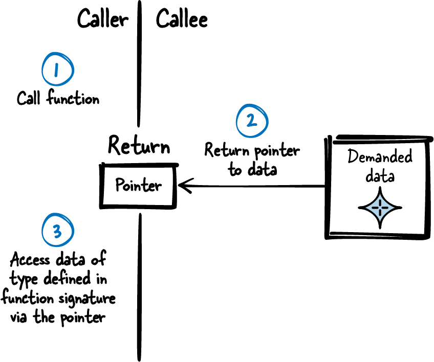
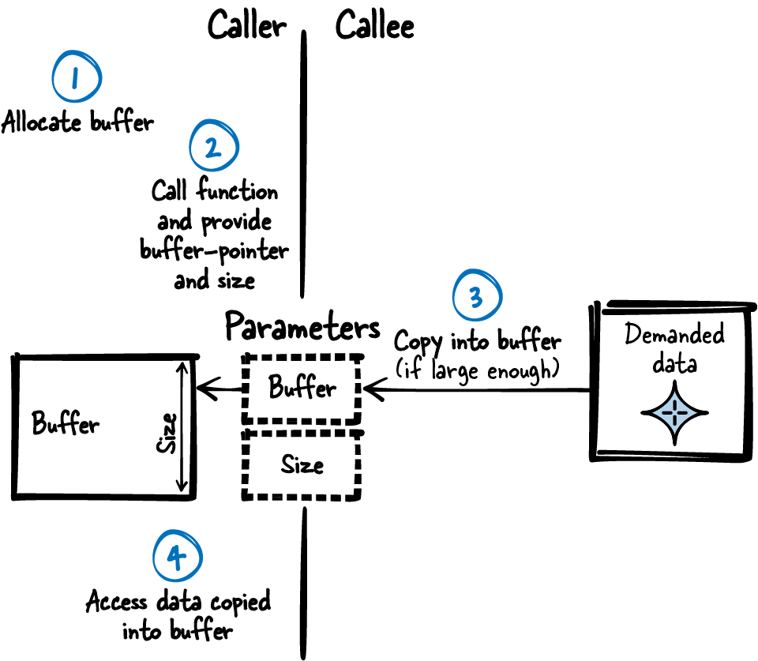
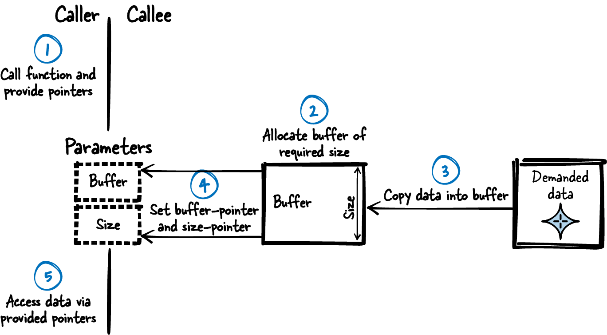

# Chapter 4. Returning Data from C Functions

Returning data from a function call is a task you are faced with when writing any kind of code that is longer than 10 lines and that you intend to be maintainable. Returning data is a simple task—you simply have to pass the data you want to share between two functions—and in C you only have the option to directly return a value or to return data via emulated “by-reference” parameters. There are not many choices and there is not much guidance to give—right? Wrong! Even the simple task of returning data from C functions is already tricky, and there are many routes you can take to structure your program and your function parameters.

Especially in C, where you have to manage the memory allocation and deallocation on your own, passing complex data between functions becomes tricky because there is no destructor or garbage collector to help you clean up the data. You have to ask yourself: should the data be put on the stack, or should it be allocated? Who should allocate—the caller or the callee?

This chapter provides best practices on how to share data between functions. These patterns help C programming beginners to understand techniques for returning data in C, and they help advanced C programmers to better understand why these different techniques are applied.

[Figure 4-1](#fig_returning_data) shows an overview of the patterns discussed in this chapter and their relationships, and [Table 4-1](#tab_returning_data) provides a summary of the patterns.


###### Figure 4-1. Overview of patterns for returning information

|  | Pattern name | Summary |
|----|----|----|
|  | Return Value | The function parts you want to split are not independent from one another. As usual in procedural programming, some part delivers a result that is then needed by some other part. The function parts that you want to split need to share some data. Therefore, simply use the one C mechanism intended to retrieve information about the result of a function call: the Return Value. The mechanism to return data in C copies the function result and provides the caller access to this copy. |
|  | Out-Parameters | C only supports returning a single type from a function call, which makes it complicated to return multiple pieces of information. Therefore, return all the data with a single function call by emulating by-reference arguments with pointers. |
|  | Aggregate Instance | C only supports returning a single type from a function call, which makes it complicated to return multiple pieces of information. Therefore, put all data that is related into a newly defined type. Define this Aggregate Instance to contain all the related data that you want to share. Define it in the interface of your component to let the caller directly access all the data stored in the instance. |
|  | Immutable Instance | You want to provide information held in large pieces of immutable data from your component to a caller. Therefore, have an instance (for example, a `struct`) containing the data to share in static memory. Provide this data to users who want to access it and make sure that they cannot modify it. |
|  | Caller-Owned Buffer | You want to provide complex or large data of known size to the caller, and that data is not immutable (it changes at runtime). Therefore, require the caller to provide a buffer and its size to the function that returns the large, complex data. In the function implementation, copy the required data into the buffer if the buffer size is large enough. |
|  | Callee Allocates | You want to provide complex or large data of unknown size to the caller, and that data is not immutable (it changes at runtime). Therefore, allocate a buffer with the required size inside the function that provides the large, complex data. Copy the required data into the buffer and return a pointer to that buffer. |

Table 4-1. Patterns for returning information

# Running Example

You want to implement the functionality to display diagnostic information for an Ethernet driver to the user. First, you simply add this functionality directly into the file with the Ethernet driver implementation and directly access the variables that contain the required information:

```
void ethShow()
{
  printf("%i packets received\n", driver.internal_data.rec);
  printf("%i packets sent\n", driver.internal_data.snd);
}
```

Later on, you realize that the functionality to display diagnostic information for your Ethernet driver will quite likely grow, so you decide to put it into a separate implementation file in order to keep your code clean. Now you need some simple way to transport the information from your Ethernet driver component to your diagnostics component.

One solution would be to use global variables to transport this information, but if you use global variables, then the effort to split the implementation file will have been useless. You split the files because you want to show that these code parts are not tightly coupled—with global variables you would bring that tight coupling back in.

A much better and very simple solution is the following: let your Ethernet component have getter-functions that provide the desired information as a Return Value.

# Return Value

## Context

You want to split your code into separate functions, as having everything in one function and in one implementation file is bad practice because it gets difficult to read and to debug the code.

## Problem

**The function parts you want to split are not independent from one another. As usual in procedural programming, some part delivers a result that is then needed by some other part. The function parts that you want to split need to share some data.**

You want to have a mechanism for sharing data that makes your code easy to understand. You want to make it explicit in your code that data is shared between functions, and you want to make sure that functions don’t communicate over side-channels not clearly visible in the code. Thus, using global variables to return information to a caller is not a good solution for you because global variables can be accessed and modified from any other part of the code. Also, it is not clear from the function signature which exact global variable is used for returning data.

Global variables also have the drawback that they can be used to store state information, which could lead to different results for identical function calls. This makes the code more difficult to understand. Aside from that, code using global variables for returning information would not be reentrant, and it would not be safe to use in a multithreaded environment.

## Solution

**Simply use the one C mechanism intended to retrieve information about the result of a function call: the Return Value. The mechanism to return data in C copies the function result and provides the caller access to this copy.**

[Figure 4-2](#fig_return_value) and the following code show how to implement the Return Value.


###### Figure 4-2. Return Value

*Caller’s code*

```
int my_data = getData();
/* use my_data */
```

\
*Callee’s code*

```
int getData()
{
  int requested_data;
  /* .... */
  return requested_data;
}
```

## Consequences

A Return Value allows the caller to retrieve a copy of the function result. No other code apart from the function implementation can modify this value, and, as it is a copy, this value is solely used by the calling function. Compared to using global variables, it is more clearly defined which code influences the data retrieved from the function call.

Also, by not using global variables and using the copy of the function result instead, the function can be reentrant, and it can safely be used in a multithreaded environment.

However, for built-in C types, a function can return only a single object of the type specified in the function signature. It is not possible to define a function with multiple return types. You cannot, for example, have a function that returns three different `int` objects. If you want to return more information than contained in just one simple, scalar C type, then you have to use an Aggregate Instance or Out-Parameters.

Also, if you want to return data from an array, then the Return Value is not what you want because it does not copy the content of the array, but only the pointer to the array. The caller might then end up with a pointer to data that ran out of scope. For returning arrays, you have to use other mechanisms like a Caller-Owned Buffer or like when the Callee Allocates.

Remember that whenever the simple Return Value mechanism is sufficient, then you should always take this most simple option to return data. You should not go for more powerful, but also more complex, patterns like Out-Parameters, Aggregate Instance, Caller-Owned Buffer, or Callee Allocates.

## Known Uses

The following examples show applications of this pattern:

- You can find this pattern everywhere. Any non-`void` function returns data in this way.

- Every C program has a `main` function that already provides a return value to its caller (such as the operating system).

## Applied to Running Example

Applying Return Value was simple. Now you have a new diagnostic component in an implementation file separate from the Ethernet driver, and this component obtains the diagnostic information from the Ethernet driver as shown in the following code:

*Ethernet driver API*

```
/* Returns the number of total received packets*/
int ethernetDriverGetTotalReceivedPackets();

/* Returns the number of total sent packets*/
int ethernetDriverGetTotalSentPackets();
```

\
*Caller’s code*

```
void ethShow()
{
  int received_packets = ethernetDriverGetTotalReceivedPackets();
  int sent_packets = ethernetDriverGetTotalSentPackets();
  printf("%i packets received\n", received_packets);
  printf("%i packets sent\n", sent_packets);
}
```

This code is easy to read, and if you want to add additional information, you can simply add additional functions to obtain this information. And that is exactly what you want to do next. You want to show more information about the sent packets. You want to show the user how many packets were successfully sent and how many failed. Your first attempt is to write the following code:

```
void ethShow()
{
  int received_packets = ethernetDriverGetTotalReceivedPackets();
  int total_sent_packets = ethernetDriverGetTotalSentPackets();
  int successfully_sent_packets = ethernetDriverGetSuccesscullySentPackets();
  int failed_sent_packets = ethernetDriverGetFailedPackets();
  printf("%i packets received\n", received_packets);
  printf("%i packets sent\n", total_sent_packets);
  printf("%i packets successfully sent\n", successfully_sent_packets);
  printf("%i packets failed to send\n", failed_sent_packets);
}
```

With this code, you eventually realize that sometimes, different from what you expected, `successfully_sent_packets` plus `failed_sent_packets` results in a number higher than `total_sent_packets`. This is because your Ethernet driver runs in a separate thread, and between your function calls to obtain the information, the Ethernet driver continues working and updates its packet information. So, if, for example, the Ethernet driver successfully sends a packet between your `ethernetDriverGet​To⁠tal​SentPackets` call and `ethernetDriverGetSuccesscullySentPackets`, then the information that you show to the user is not consistent.

A possible solution would be to make sure that the Ethernet driver is not working while you call the functions to obtain the packet information. You could, for example, use a Mutex or a Semaphore to make sure of this, but for such a simple task like obtaining packet statistics, you’d expect that you are not the one who has to cope with this issue.

As a much easier alternative, you can return multiple pieces of information from one function call by using Out-Parameters.

# Out-Parameters

## Context

You want to provide data that represents related pieces of information from your component to a caller, and these pieces of information may change between separate function calls.

## Problem

**C only supports returning a single type from a function call, which makes it complicated to return multiple pieces of information.**

Using global variables to transport the data representing your pieces of information is not a good solution because code using global variables for returning information would not be reentrant, and it would not be safe to use in a multithreaded environment. Aside from that, global variables can be accessed and modified from any other part of the code, and when using global variables, it is not clear from the function signature which exact global variables are used for returning the data. Thus, global variables would make your code hard to understand and maintain. Also, using the Return Values of multiple functions is not a good option because the data you want to return is related, so splitting it across multiple function calls makes the code less readable.

Because the pieces of data are related, the caller wants to retrieve a consistent snapshot of all this data. That becomes an issue when using multiple Return Values in a multithreaded environment because the data can change at runtime. In that case, you would have to make sure that the data does not change between the caller’s multiple function calls. But you cannot know whether the caller already finished reading all the data or whether there will be another piece of information that the caller wants to retrieve with another function call. Because of that, you cannot make sure that the data is not modified between the caller’s function calls. If you are using multiple functions to provide related information, then you don’t know the timespan during which the data must not change. Thus, with this approach, you cannot guarantee that the caller will retrieve a consistent snapshot of the information.

Having multiple functions with Return Values also might not be a good solution if a lot of preparation work is required for calculating the related pieces of data. If, for example, you want to return the home and mobile telephone number for a specified person from an address book and you have separate functions to retrieve the numbers, you’d have to search through the address book entry of this person separately for each of the function calls. This requires unnecessary computation time and resources.

## Solution

**Return all the data with one function call by emulating by-reference arguments with pointers.**

C does not support returning multiple types using the Return Value, nor does C natively support by-reference arguments, but by-reference arguments can be emulated as shown in [Figure 4-3](#fig_out) and the following code.


###### Figure 4-3. Out-Parameters

*Caller’s code*

```
int x,y;
getData(&x,&y);
/* use x,y */
```

\
*Callee’s code*

```
void getData(int* x, int* y)
{
  *x = 42;
  *y = 78;
}
```

Have a single function with many pointer arguments. In the function implementation, dereference the pointers and copy the data you want to return to the caller into the instance pointed to. In the function implementation, make sure that the data does not change while copying. This can be achieved by mutual exclusion.

##### Multithreaded Environments

In modern systems, it is common to work in a multithreaded environment. To avoid synchronization issues in such environments, it is best to either have immuatble data or to not share the data or functions (see the video [“Thinking Outside the Synchronisation Quadrant”](https://oreil.ly/SI1ta) by Kevlin Henney). But this is not possible in all cases, and things become difficult because you have to implement your functions in a way that they can safely be called by multiple threads in arbitrary order or even at the same time.

That requires your functions to be reentrant, which means that the function still works properly if it is interrupted at any time and continued later on. When working on shared resources such as global variables, you have to make sure to protect these resources from simultaneous access by other threads. This can be done with synchronization primitives such as Mutex or Semaphores.

This book does not focus on such synchronization primitives or how to use them, but the book *Real-Time Design Patterns: Robust Scalable Architecture for Real-Time Systems* by Bruce P. Douglass (Addison-Wesley, 2002) does; it also provides C patterns on concurrency and resource management.

## Consequences

Now all data that represents related pieces of information are returned in one single function call and can be kept consistent (for example, by copying data protected by Mutex or Semaphores). The function is reentrant and can safely be used in a multi-threaded environment.

For each additional data item, an additional pointer is passed to the function. This has the drawback that if you want to return a lot of data, the function’s parameter list becomes longer and longer. Having many parameters for one function is a code smell because it makes the code unreadable. That is why multiple Out-Parameters are rarely used for a function and instead, to clean up the code, related pieces of information are returned with an Aggregate Instance.

Also, for each piece of data, the caller has to pass a pointer to the function. This means that for each piece of data, an additional pointer has to be put onto the stack. If the caller’s stack memory is very limited, that might become an issue.

Out-Parameters have the disadvantage that when only looking at the function signature, they cannot clearly be identified as Out-Parameters. From the function signature, callers can only guess whenever they see a pointer that it might be an Out-Parameter. But such a pointer parameter could also be an input for the function. Thus, it has to be clearly described in the API documentation which parameters are for input and which are for output.

For simple, scalar C types the caller can simply pass the pointer to a variable as a function argument. For the function implementation all the information to interpret the pointer is specified because of the specified pointer type. To return data with complex types, like arrays, either a Caller-Owned Buffer has to be provided, or the Callee Allocates and additional information about the data, like its size, has to be communicated.

## Known Uses

The following examples show applications of this pattern:

- The Windows `RegQueryInfoKey` function returns information about a registry key via the function’s Out-Parameters. The caller provides `unsigned long` pointers, and the function writes, among other pieces of information, the number of subkeys and the size of the key’s value into the `unsigned long` variables being pointed to.

- Apple’s Cocoa API for C programs uses an additional `NSError` parameter to store errors occurring during the function calls.

- The function `userAuthenticate` of the real-time operating system VxWorks uses Return Values to return information, in this case whether a provided password is correct for a provided login name. Additionally, the function takes an Out-Parameter to return the user ID associated with the provided login name.

## Applied to Running Example

By applying Out-Parameters you’ll get the following code:

*Ethernet driver API*

```
/* Returns driver status information via out-parameters.
   total_sent_packets   --> number of packets tried to send (success and fail)
   successfully_sent_packets --> number of packets successfully sent
   failed_sent_packets  --> number of packets failed to send */
void ethernetDriverGetStatistics(int* total_sent_packets,
      int* successfully_sent_packets, int* failed_sent_packets); 
```

[](#co_returning_data_from_c_functions_CO1-1)  
To retrieve information about sent packets, you have only one function call to the Ethernet driver, and the Ethernet driver can make sure that the data delivered within this call is consistent.

*Caller’s code*

```
void ethShow()
{
  int total_sent_packets, successfully_sent_packets, failed_sent_packets;
  ethernetDriverGetStatistics(&total_sent_packets, &successfully_sent_packets,
                              &failed_sent_packets);
  printf("%i packets sent\n", total_sent_packets);
  printf("%i packets successfully sent\n", successfully_sent_packets);
  printf("%i packets failed to send\n", failed_sent_packets);

  int received_packets = ethernetDriverGetTotalReceivedPackets();
  printf("%i packets received\n", received_packets);
}
```

You consider also retrieving the `received_packets` in the same function call with the sent packets, but you realize that the one function call becomes more and more complicated. Having one function call with three Out-Parameters is already complicated to write and read. When calling the functions, the parameter order could easily be mixed up. Adding a fourth parameter wouldn’t make the code better.

To make the code more readable, an Aggregate Instance can be used.

# Aggregate Instance

## Context

You want to provide data that represents related pieces of information from your component to a caller, and these pieces of information may change between separate function calls.

## Problem

**C only supports returning a single type from a function call, which makes it complicated to return multiple pieces of information.**

Using global variables to transport the data representing your pieces of information is not a good solution because code using global variables for returning information would not be reentrant, and it would not be safe to use in a multithreaded environment. Aside from that, global variables can be accessed and modified from any other part of the code, and when using global variables, it is not clear from the function signature which exact global variables are used for returning the data. Thus, global variables would make your code hard to understand and maintain. Also, using the Return Values of multiple functions is not a good option because the data you want to return is related, so splitting it across multiple function calls makes the code less readable.

Having a single function with many Out-Parameters is also not a good idea because if you have many such Out-Parameters, it gets easy to mix them up and your code becomes unreadable. Also, you want to show that the parameters are closely related, and you might even need the same set of parameters to be provided to or returned by other functions. When explicitly doing that with function parameters, you’d have to modify each such function in case additional parameters are added later on.

Because the pieces of data are related, the caller wants to retrieve a consistent snapshot of all this data. That becomes an issue when using multiple Return Values in a multithreaded environment because the data can change at runtime. In that case, you would have to make sure that the data does not change between the caller’s multiple function calls. But you cannot know whether the caller already finished reading all the data or whether there will be another piece of information that the caller wants to retrieve with another function call. Because of that, you cannot make sure that the data is not modified between the caller’s function calls. If you are using multiple functions to provide related information, then you don’t know the timespan during which the data must not change. Thus, with this approach, you cannot guarantee that the caller will retrieve a consistent snapshot of the information.

Having multiple functions with Return Values also might not be a good solution if a lot of preparation work is required for calculating the related pieces of data. If, for example, you want to return the home and mobile telephone number for a specified person from an address book and you have separate functions to retrieve the numbers, you’d have to search through the address book entry of this person separately for each of the function calls. This requires unnecessary computation time and resources.

## Solution

**Put all data that is related into a newly defined type. Define this Aggregate Instance to contain all the related data that you want to share. Define it in the interface of your component to let the caller directly access all the data stored in the instance.**

To implement this, define a `struct` in your header file and define all types to be returned from the called function as members of this `struct`. In the function implementation, copy the data to be returned into the `struct` members as shown in [Figure 4-4](#fig_aggregate). In the function implementation, make sure that the data does not change while copying. This can be achieved by mutual exclusion via Mutex or Semaphores.


###### Figure 4-4. Aggregate Instance

To actually return the `struct` to the caller, there are two main options:

- Pass the whole `struct` as a Return Value. C allows not only built-in types to be passed as a Return Value of functions but also user-defined types such as a `struct`.

- Pass a pointer to the `struct` using an Out-Parameter. However, when only passing pointers, the issue arises of who provides and owns the memory being pointed to. That issue is addressed in Caller-Owned Buffer and Callee Allocates. Instead of passing a pointer and letting the caller directly access the Aggregate Instance, you could consider hiding the `struct` from the caller by using a Handle.

The following code shows the variant with passing the whole `struct`:

*Caller’s code*

```
struct AggregateInstance my_instance;
my_instance = getData();
/* use my_instance.x
   use my_instance.y, ... */
```

\
*Callee’s code*

```
struct AggregateInstance
{
  int x;
  int y;
};

struct AggregateInstance getData()
{
  struct AggregateInstance inst;
  /* fill inst.x and inst.y */
  return inst; 
}
```

[](#co_returning_data_from_c_functions_CO2-1)  
When returning, the content of `inst` is copied (even though it is a `struct`), and the caller can access the copied content even after `inst` runs out of scope.

## Consequences

Now the caller can retrieve multiple data that represent related pieces of information via the Aggregate Instance with a single function call. The function is reentrant and can safely be used in a multithreaded environment.

This provides the caller with a consistent snapshot of the related pieces of information. It also makes the caller’s code clean because they don’t have to call multiple functions or one function with many Out-Parameters.

When passing data between functions without pointers by using Return Values, all this data is put on the stack. When passing one `struct` to 10 nested functions, this `struct` is on the stack 10 times. In some cases this is not a problem, but in other cases it is—especially if the `struct` is too large and you don’t want to waste stack memory by copying the whole `struct` onto the stack every time. Because of this, quite often instead of directly passing or returning a `struct`, a pointer to that `struct` is passed or returned.

When passing pointers to the `struct`, or if the `struct` contains pointers, you have to keep in mind that C does not perform the work of doing a deep copy for you. C only copies the pointer values and does not copy the instances they point to. That might not be what you want, so you have to keep in mind that as soon as pointers come into play, you have to deal with providing and cleaning up the memory being pointed to. This issue is addressed in Caller-Owned Buffer and Callee Allocates.

## Known Uses

The following examples show applications of this pattern:

- The article [“Patterns of Argument Passing”](https://oreil.ly/VlCgm) by Uwe Zdun describes this pattern, including C++ examples, as Context Object, and the book *Refactoring: Improving the Design of Existing Code* by Martin Fowler (Addison-Wesley, 1999) describes it as Parameter Object.

- The code of the game NetHack stores monster-attributes in Aggregate Instances and provides a function for retrieving this information.

- The implementation of the text editor sam copies `structs` when passing them to functions and when returning them from functions in order to keep the code simpler.

## Applied to Running Example

With the Aggregate Instance, you’ll get the following code:

*Ethernet driver API*

```
struct EthernetDriverStat{
  int received_packets;         /* Number of received packets */
  int total_sent_packets;       /* Number of sent packets (success and fail)*/
  int successfully_sent_packets;/* Number of successfully sent packets */
  int failed_sent_packets;      /* Number of packets failed to send */
};

/* Returns statistics information of the Ethernet driver */
struct EthernetDriverStat ethernetDriverGetStatistics();
```

\
*Caller’s code*

```
void ethShow()
{
  struct EthernetDriverStat eth_stat = ethernetDriverGetStatistics();
  printf("%i packets received\n", eth_stat.received_packets);
  printf("%i packets sent\n", eth_stat.total_sent_packets);
  printf("%i packets successfully sent\n",eth_stat.successfully_sent_packets);
  printf("%i packets failed to send\n", eth_stat.failed_sent_packets);
}
```

Now you have one single call to the Ethernet driver, and the Ethernet driver can make sure that the data delivered within this call is consistent. Also, your code looks cleaned up because the data that belongs together is now collected in a single `struct`.

Next, you want to show more information about the Ethernet driver to your user. You want to show the user to which Ethernet interface the packet statistics information belongs to, and thus you want to show the driver name including a textual description of the driver. Both are contained in a string stored in the Ethernet driver component. The string is quite long and you don’t exactly know how long it is. Luckily, the string does not change during runtime, so you can access an Immutable Instance.

# Immutable Instance

## Context

Your component contains a lot of data, and another component wants to access this data.

## Problem

**You want to provide information held in large pieces of immutable data from your component to a caller.**

Copying the data for each and every caller would be a waste of memory, so providing all the data by returning an Aggregate Instance or by copying all the data into Out-Parameters is not an option due to stack memory limitations.

Usually, simply returning a pointer to such data is tricky. You’d have the problem that with a pointer, such data can be modified, and as soon as multiple callers read and write the same data, you have to come up with mechanisms to ensure that the data you want to access is consistent and up-to-date. Luckily, in your situation the data you want to provide to the caller is fixed at compile time or at boot time and does not change at runtime.

## Solution

**Have an instance (for example, a `struct`) containing the data to share in static memory. Provide this data to users who want to access it and make sure that they cannot modify it.**

Write the data to be contained in the instance at compile time or at boot time and do not change it at runtime anymore. You can either directly write the data hardcoded in your program, or you can initialize it at program startup (see [“Software-Module with Global State”](Chapter_05_Data_Lifetime_and_Ownership.md) for initialization variants and [“Eternal Memory”](Chapter_03_Memory_Management.md) for storage variants). As shown in [Figure 4-5](#fig_immutable), even if multiple callers (and multiple threads) access the instance at the same time, they don’t have to worry about each other because the instance does not change and is thus always in a consistent state and contains the required information.

Implement a function that returns a pointer to the data. Alternatively, you could even directly make the variable containing the data global and put it into your API because the data does not change at runtime anyway. But still, the getter-function is better because compared to global variables, it makes writing unit tests easier, and in case of future behavior changes of your code (if your data is not immutable anymore), you’d not have to change your interface.



###### Figure 4-5. Immutable Instance

To make sure that the caller does not modify the data, when returning a pointer to the data, make the data being pointed to `const` as shown in the following code:

*Caller’s code*

```
const struct ImmutableInstance* my_instance;
my_instance = getData(); 
/* use my_instance->x,
   use my_instance->y, ... */
```

[](#co_returning_data_from_c_functions_CO3-1)  
The caller obtains a reference but doesn’t get ownership of the memory.

\
*Callee API*

```
struct ImmutableInstance
{
  int x;
  int y;
};
```

\
*Callee Implementation*

```
static struct ImmutableInstance inst = {12, 42};
const struct ImmutableInstance* getData()
{
   return &inst;
}
```

## Consequences

The caller can call one simple function to get access to even complex or large data and does not have to care about where this data is stored. The caller does not have to provide buffers in which this data can be stored, does not have to clean up memory, and does not have to care about the lifetime of the data—it simply always exists.

The caller can read all data via the retrieved pointer. The simple function for retrieving the pointer is reentrant and can safely be used in multithreaded environments. Also the data can safely be accessed in multithreaded environments because it does not change at runtime, and multiple threads that only read the data are no problem.

However, the data cannot be changed at runtime without taking further measures. If it is necessary for the caller to be able to change the data, then something like copy-on-write can be implemented. If the data in general can change at runtime, then an Immutable Instance isn’t an option and instead, for sharing complex and large data, a Caller-Owned Buffer has to be used or the Callee Allocates.

## Known Uses

The following examples show applications of this pattern:

- In his article [“Patterns in Java: Patterns of Value”](https://oreil.ly/cVY9N), Kevlin Henney describes the similar Immutable Object pattern in detail and provides C++ code examples.

- The code of the game NetHack stores immutable monster-attributes in an Immutable Instance and provides a function for retrieving this information.

## Applied to Running Example

Usually, returning a pointer to access data stored within a component is tricky. This is because if multiple callers access (and maybe write) this data, then a plain pointer isn’t the solution for you because you never know if the pointer you have is still valid and if the data contained in this pointer is consistent. But in this case we are lucky because we have an Immutable Instance. The driver name and description are both information that is determined at compile time and does not change afterwards. Thus, we can simply retrieve a constant pointer to this data:

*Ethernet driver API*

```
struct EthernetDriverInfo{
  char name[64];
  char description[1024];
};

/* Returns the driver name and description */
const struct EthernetDriverInfo* ethernetDriverGetInfo();
```

\
*Caller’s code*

```
void ethShow()
{
  struct EthernetDriverStat eth_stat = ethernetDriverGetStatistics();
  printf("%i packets received\n", eth_stat.received_packets);
  printf("%i packets sent\n", eth_stat.total_sent_packets);
  printf("%i packets successfully sent\n",eth_stat.successfully_sent_packets);
  printf("%i packets failed to send\n", eth_stat.failed_sent_packets);

  const struct EthernetDriverInfo* eth_info = ethernetDriverGetInfo();
  printf("Driver name: %s\n", eth_info->name);
  printf("Driver description: %s\n", eth_info->description);
}
```

As a next step, in addition to the name and description of the Ethernet interface, you also want to show the user the currently configured IP address and subnet mask. The addresses are stored as a string in the Ethernet driver. Both addresses are information that might change during runtime, so you cannot simply return a pointer to an Immutable Instance.

While it would be possible to have the Ethernet driver pack these strings into an Aggregate Instance and simply return this instance (arrays in a `struct` are copied when returning the `struct`), such a solution is rather uncommon for large amounts of data because it consumes a lot of stack memory. Usually, pointers are used instead.

Using pointers is the exact solution you are looking for: use a Caller-Owned Buffer.

# Caller-Owned Buffer

## Context

You have large data that you want to share between different components.

## Problem

**You want to provide complex or large data of known size to the caller, and that data is not immutable (it changes at runtime).**

Because the data changes at runtime (maybe because you provide the callers with functions to write the data), you cannot simply provide the caller with a pointer to static data (as is the case with an Immutable Instance). If you simply provide the callers with such a pointer, you’d run into the problem that the data one caller reads might be inconsistent (partially overwritten) because, in a multithreaded environment, another caller might simultaneously write that data.

Simply copying all the data into an Aggregate Instance and passing it via the Return Value to the caller is not an option because, as the data is large, it cannot be passed via the stack, which only has very limited memory.

When instead only returning a pointer to the Aggregate Instance, there would be no problem with stack memory limitations anymore, but you have to keep in mind that C does not do the work of performing a deep copy for you. C only returns the pointer. You have to make sure that the data (stored in an Aggregate Instance or in an array) being pointed to is still valid after the function call. For example, you cannot store the data in auto-variables within your function and provide a pointer to these variables because after the function call, the variables run out of scope.

Now the question arises of where the data should be stored. It has to be clarified whether the caller or the callee should provide the required memory and which one is then responsible for managing and cleaning up the memory.

## Solution

**Require the caller to provide a buffer and its size to the function that returns the large, complex data. In the function implementation, copy the required data into the buffer if the buffer size is large enough.**

Make sure that the data does not change while copying. This can be achieved by mutual exclusion via Mutex or Semaphores. The caller then has a snapshot of the data in the buffer, is the sole owner of this snapshot, and thus can consistently access this snapshot even if the original data changes in the meantime.

The caller can provide the buffer and its size each as a separate function parameter, or the caller can pack the buffer and its size into an Aggregate Instance and pass a pointer to the Aggregate Instance to the function.

As the caller has to provide the buffer and its size to the function, the caller has to know the size beforehand. To let the caller know what size the buffer has to be, the size requirement has to be present in the API. This can be implemented by defining the size as a macro or by defining a `struct` containing a buffer of the required size in the API.

[Figure 4-6](#fig_caller_buffer) and the following code show the concept of a Caller-Owned Buffer.



###### Figure 4-6. Caller-Owned Buffer

*Caller’s code*

```
struct Buffer buffer;

getData(&buffer);
/* use buffer.data */
```

\
*Callee’s API*

```
#define BUFFER_SIZE 256
struct Buffer
{
  char data[BUFFER_SIZE];
};

void getData(struct Buffer* buffer);
```

\
*Callee’s implementation*

```
void getData(struct Buffer* buffer)
{
  memcpy(buffer->data, some_data, BUFFER_SIZE);
}
```

## Consequences

The large, complex data can be consistently provided to the caller with a single function call. The function is reentrant and can safely be used in a multithreaded environment. Also, the caller can safely access the data in multithreaded environments because the caller is the sole owner of the buffer.

The caller provides a buffer of the expected size and can even decide the kind of memory for that buffer. The caller can put the buffer on the stack (see [“Stack First”](Chapter_03_Memory_Management.md)) and benefit from the advantage that stack memory will be cleaned up after the variable runs out of scope. Alternatively, the caller can put the memory on the heap to determine the lifetime of the variable or to not waste stack memory. Also, the calling function might only have a reference to a buffer obtained by its calling function. In this case this buffer can simply be passed on and there is no need to have multiple buffers.

The time-intensive operation of allocating and freeing memory is not performed during the function call. The caller can determine when these operations take place, and thus the function call becomes quicker and more deterministic.

From the API it is absolutely clear that the caller has Dedicated Ownership of the buffer. The caller has to provide the buffer and clean it up afterwards. If the caller allocated the buffer, then the caller is the one responsible for freeing it afterwards.

The caller has to know the size of the buffer beforehand and because this size is known, the function can safely operate in the buffer. But in some cases the caller might not know the exact size required, and it would be better if instead the Callee Allocates.

## Known Uses

The following examples show applications of this pattern:

- The NetHack code uses this pattern to provide the information about a savegame to the component that then actually stores the game progress on the disk.

- The B&R Automation Runtime operating system uses this pattern for a function to retrieve the IP address.

- The C stdlib function `fgets` reads input from a stream and stores it in a provided buffer.

## Applied to Running Example

You now provide a Caller-Owned Buffer to the Ethernet driver function, and the function copies its data into this buffer. You have to know beforehand how large the buffer has to be. In the case of obtaining the IP address string, this is not a problem because the string has a fixed size. So you can simply put the buffer for the IP address on the stack and provide this stack variable to the Ethernet driver. Alternatively, it would have been possible to allocate the buffer on the heap, but in this case that is not required because the size of the IP address is known and the size of the data is small enough to fit on the stack:

*Ethernet driver API*

```
struct IpAddress{
  char address[16];
  char subnet[16];
};

/* Stores the IP information into 'ip', which has to be provided
   by the caller*/
void ethernetDriverGetIp(struct IpAddress* ip);
```

\
*Caller’s code*

```
void ethShow()
{
  struct EthernetDriverStat eth_stat = ethernetDriverGetStatistics();
  printf("%i packets received\n", eth_stat.received_packets);
  printf("%i packets sent\n", eth_stat.total_sent_packets);
  printf("%i packets successfully sent\n",eth_stat.successfully_sent_packets);
  printf("%i packets failed to send\n", eth_stat.failed_sent_packets);

  const struct EthernetDriverInfo* eth_info = ethernetDriverGetInfo();
  printf("Driver name: %s\n", eth_info->name);
  printf("Driver description: %s\n", eth_info->description);

  struct IpAddress ip;
  ethernetDriverGetIp(&ip);
  printf("IP address: %s\n", ip.address);
}
```

Next, you want to extend your diagnostic component to also print a dump of the last received packet. This is now a piece of information that is too large to put on the stack, and because Ethernet packets have variable size, you cannot know beforehand how large the buffer for the packet has to be. Therefore, Caller-Owned Buffer isn’t an option for you.

You could, of course, simply have functions `EthernetDriverGetPacketSize()` and `EthernetDriverGetPacket(buffer)`, but here again you’d have the problem that you’d have to call two functions. Between the two function calls the Ethernet driver could receive another packet, which would make your data inconsistent. Also, this solution is not very elegant because you’d have to call two different functions to achieve one purpose. Instead, it is much easier if the Callee Allocates.

# Callee Allocates

## Context

You have large data that you want to share between different components.

## Problem

**You want to provide complex or large data of unknown size to the caller, and that data is not immutable (it changes at runtime).**

The data changes at runtime (maybe because you provide the callers with functions to write the data), so you cannot simply provide the caller with a pointer to static data (as is the case with an Immutable Instance). If you simply provide the callers with such a pointer, you’d run into the problem that the data one caller reads might be inconsistent (partially overwritten) because, in a multithreaded environment, another caller might simultaneously write that data.

Simply copying all the data into an Aggregate Instance and passing it via the Return Value to the caller is not an option. With the Return Value you can only pass data of known size, and because the data is large, it cannot be passed via the stack, which only has very limited memory.

When instead only returning a pointer to the Aggregate Instance, there would be no problem with stack memory limitations anymore, but you have to keep in mind that C does not do the work of performing a deep copy for you. C only returns the pointer. You have to make sure that the data (stored in an Aggregate Instance or in an array) being pointed to is still valid after the function call. For example, you cannot store the data in auto-variables within your function and provide a pointer to these variables because after the function call, the variables run out of scope and are being cleaned up.

Now the problem arises of where the data should be stored. It has to be clarified whether the caller or the callee should provide the required memory and which one is then responsible for managing and cleaning up the memory.

The amount of data you want to provide is not fixed at compile time. For example, you want to return a string of previously unknown size. That makes using a Caller-Owned Buffer impractical because the caller does not know the size of the buffer beforehand. The caller could beforehand ask for the required buffer size (for example, with a `getRequiredBufferSize()` function), but that is also impractical because in order to retrieve one piece of data, the caller would have to make multiple function calls. Also, the data you want to provide could potentially change between those function calls, and then the caller would again provide a buffer of the wrong size.

## Solution

**Allocate a buffer with the required size inside the function that provides the large, complex data. Copy the required data into the buffer and return a pointer to that buffer.**

Provide the pointer to the buffer and its size to the caller as Out-Parameters. After the function call, the caller can operate on the buffer, knows its size, and has the sole ownership of the buffer. The caller determines its lifetime and thus is responsible for cleaning it up as shown in [Figure 4-7](#fig_callee_allocates) and the following code.



###### Figure 4-7. Callee Allocates

*Caller’s code*

```
char* buffer;
int size;
getData(&buffer, &size);
/* use buffer */
free(buffer);
```

*Callee’s code*

```
void getData(char** buffer, int* size)
{
  *size = data_size;
  *buffer = malloc(data_size);
  /* write data to buffer */ 
}
```

[](#co_returning_data_from_c_functions_CO4-1)  
When copying the data into that buffer, make sure that it does not change in the meantime. This can be achieved by mutual exclusion via Mutex or Semaphores.

Alternatively, the pointer to the buffer and the size can be put into an Aggregate Instance provided as a Return Value. To make it clearer for the caller that there is a pointer in the Aggregate Instance that has to be freed, the API can provide an additional function for cleaning it up. When also providing a function to clean up, the API already looks very similar to an API with a Handle, which would bring the additional benefit of flexibility while maintaining API compatibility.

No matter whether the called function provides the buffer via an Aggregate Instance or via Out-Parameters, it has to be made clear to the caller that the caller owns the buffer and is responsible for freeing it. That Dedicated Ownership has to be well documented in the API.

## Consequences

The caller can retrieve the buffer of previously unknown size with a single function call. The function is reentrant, can safely be used in multithreaded environments, and provides the caller with consistent information about the buffer and its size. Knowing the size, the caller can safely operate on the data. For example, the caller can even handle unterminated strings transported via such buffers.

The caller has ownership of the buffer, determines its lifetime, and is responsible for freeing it (just like would be the case with a Handle). From looking at the interface, it has to be made very clear that the caller has to do this. One way of making this clear is to document it in the API. Another approach is to have an explicit cleanup function to make it more obvious that something has to be cleaned up. Such a cleanup function has the additional advantage that the same component that allocates the memory also frees it. This is important if the two involved components are compiled with different compilers or if they run on different platforms—in such cases the functions for allocating and freeing memory could differ between the components, which makes it mandatory that the same component that allocates also frees.

The caller cannot determine which kind of memory should be used for the buffer—that would have been possible with a Caller-Owned Buffer. Now the caller must use the kind of memory that is allocated inside the function call.

Allocating takes time, which means that compared to Caller-Owned Buffer, the function call becomes slower and less deterministic.

## Known Uses

The following examples show applications of this pattern:

- The `malloc` function does exactly that. It allocates some memory and provides it to the caller.

- The `strdup` function takes a string as input, allocates the duplicated string, and returns it.

- The `getifaddrs` Linux function provides information about configured IP addresses. The data holding this information is stored in a buffer allocated by the function.

- The NetHack code uses this pattern to retrieve buffers.

## Applied to Running Example

The following final code of your diagnostic component retrieves the packet data in a buffer that the Callee Allocates:

*Ethernet driver API*

```
struct Packet
{
  char data[1500]; /* maximum 1500 byte per packet */
  int size;        /* actual size of data in the packet */
};

/* Returns a pointer to a packet that has to be freed by the caller */
struct Packet* ethernetDriverGetPacket();
```

\
*Caller’s code*

```
void ethShow()
{
  struct EthernetDriverStat eth_stat = ethernetDriverGetStatistics();
  printf("%i packets received\n", eth_stat.received_packets);
  printf("%i packets sent\n", eth_stat.total_sent_packets);
  printf("%i packets successfully sent\n",eth_stat.successfully_sent_packets);
  printf("%i packets failed to send\n", eth_stat.failed_sent_packets);

  const struct EthernetDriverInfo* eth_info = ethernetDriverGetInfo();
  printf("Driver name: %s\n", eth_info->name);
  printf("Driver description: %s\n", eth_info->description);

  struct IpAddress ip;
  ethernetDriverGetIp(&ip);
  printf("IP address: %s\n", ip.address);

  struct Packet* packet = ethernetDriverGetPacket();
  printf("Packet Dump:");
  fwrite(packet->data, 1, packet->size, stdout);
  free(packet);
}
```

With this final version of the diagnostic component, we can see all the presented ways of how to retrieve information from another function. Mixing all these ways in one piece of code might not be what you actually want to do because it gets a bit confusing to have one piece of data on the stack and another piece of data on the heap. As soon as you allocate buffers, you don’t want to mix different approaches, so using Caller-Owned Buffer and Callee Allocates in a single function might not be what you want to do. Instead, pick the one approach that suits all your needs and stick to that within one function or component. This makes your code more uniform and easier to understand.

However, if you have to obtain just a single piece of data from another component and you have the choice to use the easier alternatives to retrieve data (the patterns covered earlier in this chapter), then always do that to keep your code simple. For example, if you have the option of putting buffers on the stack, then do that, because it saves you the effort to free the buffer.

# Summary

This chapter showed different ways of how to return data from functions and how to handle buffers in C. The simplest way is to use Return Value to return a single piece of data, but if multiple pieces of related data have to be returned, then instead use Out-Parameters or, even better, Aggregate Instance. If the data to be returned does not change at runtime, Immutable Instance can be used. When returning data in a buffer, Caller-Owned Buffer can be used if the size of the buffer is known beforehand, and Callee Allocates can be used if the size is unknown beforehand.

With the patterns from this chapter, a C programmer has some basic tools and guidance on how to transport data between functions and how to cope with returning, allocating, and freeing buffers.

# Outlook

The next chapter covers how larger programs are organized into software-modules and how lifetime and ownership of data is handled by these software-modules. These patterns give an overview of the building blocks that are used to construct larger pieces of C code.

