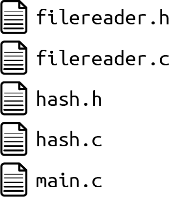
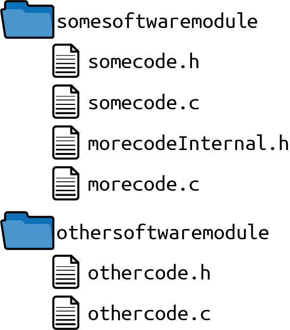
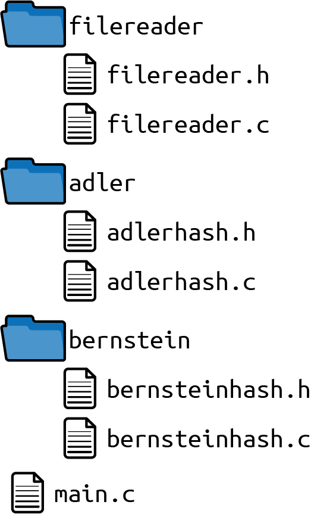
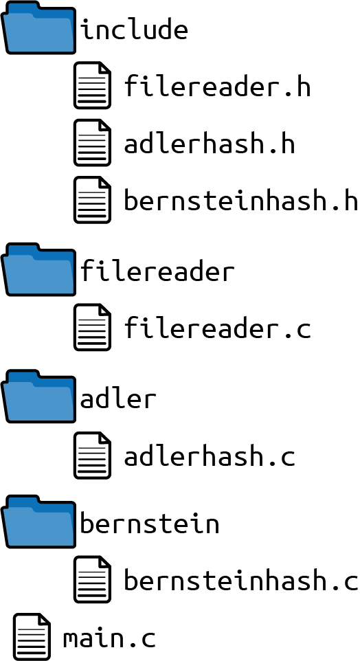
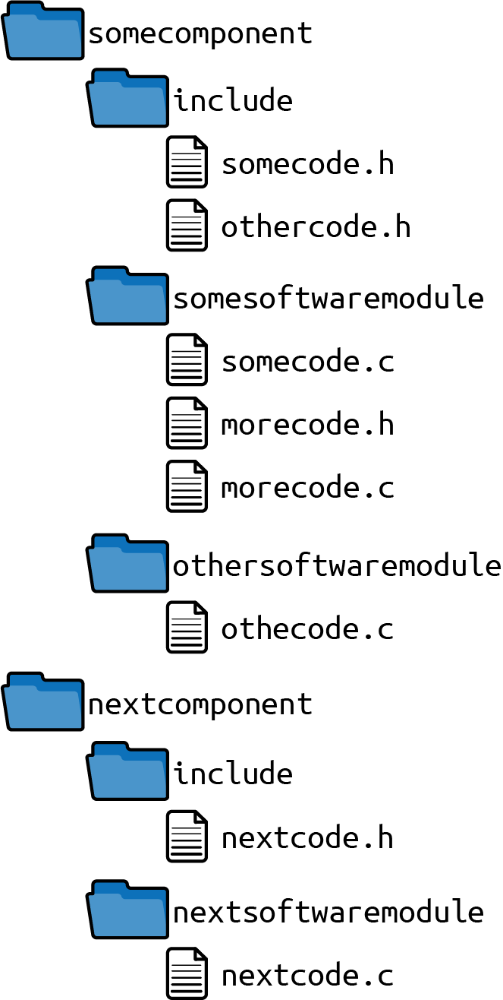
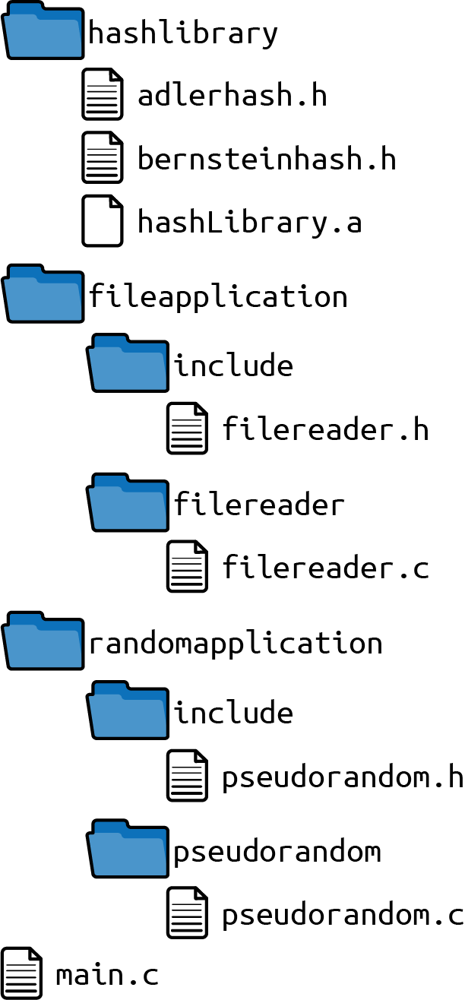

# Chapter 8. Organizing Files in Modular Programs

Any programmer who implements a larger piece of software and wants to make that software maintainable confronts the question of how to make the software modular. The most important part of that question that is related to dependencies between software-modules is answered, for example, by the SOLID design principles described in the book *Clean Code: A Handbook of Agile Software Craftsmanship* by Robert C. Martin (Prentice Hall, 2008) or by the design patterns described in the book *Design Patterns: Elements of Reusable Object-Oriented Software* by the Gang of Four (Prentice Hall, 1997).

However, making software modular also raises the question of how to organize the source files in a way that allows someone to make the software modular. That question has not yet been answered very well, which results in bad file structures in codebases. It is difficult to make such codebases modular later on, because you don’t know which files you should separate into different software-modules or into different codebases. Also, as a programmer, it is difficult to find the files containing APIs that you are supposed to use, and thus you might bring in dependencies to APIs that you are not supposed to use. This is an issue for C in particular because C does not support any mechanism to mark APIs for internal use only and restrict access to them.

There are such mechanisms in other programming languages, and there is advice on how to structure files. For example, the Java programming language comes with the concept of *packages*. Java provides a default way for the developer to organize the classes for these packages and thus the files within the package. For other programming languages, such as C, there is no such advice on how to structure files. Developers have to come up with their own approach for how to structure the header files containing the C function declarations and the implementation files containing the C function definitions.

This chapter shows how to tackle this problem by providing guidance for C programmers on how to structure implementation files, in particular, how to structure header files (APIs) in order to allow the development of large, modular C programs.

[Figure 8-1](#overview_directory) shows an overview of the patterns covered in this chapter, and [Table 8-1](#tab_directory) provides a short description of these patterns.


###### Figure 8-1. Overview of patterns for how to organize your code files

|  | Pattern name | Summary |
|----|----|----|
|  | Include Guard | It’s easy to include a header file multiple times, but including the same header file leads to compile errors if types or certain macros are part of it, because during compilation they get redefined. Therefore, protect the content of your header files against multiple inclusion so that the developer using the header files does not have to care whether it is included multiple times. Use an interlocked `#ifdef` statement or a `#pragma once` statement to achieve this. |
|  | Software-Module Directories | Splitting code into different files increases the number of files in your codebase. Having all files in one directory makes it difficult to keep an overview of all the files, particularly for large codebases. Therefore, put header files and implementation files that belong to a tightly coupled functionality into one directory. Name that directory after the functionality that is provided via the header files. |
|  | Global Include Directory | To include files from other software-modules, you have to use relative paths like *../othersoftwaremodule/file.h*. You have to know the exact location of the other header file. Therefore, have one global directory in your codebase that contains all software-module APIs. Add this directory to the global include paths in your toolchain. |
|  | Self-Contained Components | From the directory structure it is not possible to see the dependencies in the code. Any software-module can simply include the header files from any other software-module, so it’s impossible to check dependencies in the code via the compiler. Therefore, identify software-modules that contain similar functionality and that should be deployed together. Put these software-modules into a common directory and have a designated subdirectory for their header files that are relevant for the caller. |
|  | API Copy | You want to develop, version, and deploy the parts of your codebase independently from one another. However, to do that, you need clearly defined interfaces between the code parts and the ability to separate that code into different repositories. Therefore, to use the functionality of another component, copy its API. Build that other component separately and copy the build artifacts and its public header files. Put these files into a directory inside your component and configure that directory as a global include path. |

Table 8-1. Patterns for how to organize your code files

# Running Example

Imagine you want to implement a piece of software that prints the hash value for some file content. You start with the following code for a simple hash function:

*main.c*

```
#include <stdio.h>

static unsigned int adler32hash(const char* buffer, int length)
{
  unsigned int s1=1;
  unsigned int s2=0;
  int i=0;

  for(i=0; i<length; i++)
  {
    s1=(s1+buffer[i]) % 65521;
    s2=(s1+s2) % 65521;
  }
  return (s2<<16) | s1;
}

int main(int argc, char* argv[])
{
  char* buffer = "Some Text";
  unsigned int hash = adler32hash(buffer, 100);
  printf("Hash value: %u", hash);
  return 0;
}
```

The preceding code simply prints the hash output of a fixed string to the console output. Next, you want to extend that code. You want to read the content of a file and print the hash of the file content. You could simply add all this code to the *main.c* file, but that would make the file very long, and it would make the code more unmaintainable the more it grows.

Instead, it is much better to have separate implementation files and access their functionality with Header Files. You now have the following code for reading the content of a file and printing the hash of the file content. To make it easier to see which parts of the code changed, the implementations that did not change are skipped:

*main.c*

```
#include <stdio.h>
#include <stdlib.h>
#include "hash.h"
#include "filereader.h"

int main(int argc, char* argv[])
{
  char* buffer = malloc(100);
  getFileContent(buffer, 100);
  unsigned int hash = adler32hash(buffer, 100);
  printf("Hash value: %u", hash);
  return 0;
}
```

\
*hash.h*

```
/* Returns the hash value of the provided "buffer" of size "length".
   The hash is calculated according to the Adler32 algorithm. */
unsigned int adler32hash(const char* buffer, int length);
```

\
*hash.c*

```
#include "hash.h"

unsigned int adler32hash(const char* buffer,  int length)
{
  /* no changes here */
}
```

\
*filereader.h*

```
/* Reads the content of a file and stores it in the  provided "buffer"
   if is is long enough according to its provided "length" */
void getFileContent(char* buffer, int length);
```

\
*filereader.c*

```
#include <stdio.h>
#include "filereader.h"

void getFileContent(char* buffer, int length)
{
  FILE* file = fopen("SomeFile", "rb");
  fread(buffer, length, 1, file);
  fclose(file);
}
```

Organizing the code in separate files made the code more modular because dependencies in the code can now be made explicit as all related functionality is put into the same file. Your codebase files are currently all stored in the same directory, as shown in [Figure 8-2](#fig_dir1).



###### Figure 8-2. File overview

Now that you have separate header files, you can include these header files in your implementation files. However, you’ll soon end up with the problem that you get a build error if the header files are included multiple times. To help out with this issue, you can install Include Guards.

# Include Guard

## Context

You split your implementation into multiple files. Inside the implementation you include header files to get forward declarations of other code that you want to call or use.

## Problem

**It’s easy to include a header file multiple times, but including the same header file leads to compile errors if types or certain macros are part of it, because during compilation they get redefined.**

In C, during compilation, the `#include` directive lets the C preprocessor fully copy the included file into your compilation unit. If, for example, a `struct` is defined in the header file and that header file is included multiple times, then that `struct` definition is copied multiple times and is present multiple times in the compilation unit, which then leads to a compile error.

To avoid this, you could try to not include files more than once. However, when including a header file, you usually don’t have the overview of whether other additional header files are included inside that header file. Thus, it is easy to include files multiple times.

## Solution

**Protect the content of your header files against multiple inclusion so that the developer using the header files does not have to care whether it is included multiple times. Use an interlocked `#ifdef` statement or a `#pragma once` statement to achieve this.**

The following code shows how to use the Include Guard:

*somecode.h*

```
#ifndef SOMECODE_H
#define SOMECODE_H
 /* put the content of your headerfile here */
#endif
```

\
*othercode.h*

```
#pragma once
 /* put the content of your headerfile here */
```

During the build procedure, the interlocked `#ifdef` statement or the `#pragma once` statement protects the content of the header file against being compiled multiple times in a compilation unit.

The `#pragma once` statement is not defined in the C standard, but it is supported by most C preprocessors. Still, you have to keep in mind that you could have a problem with this statement when switching to a different toolchain with a different C preprocessor.

While the interlocked `#ifdef` statement works with all C preprocessors, it brings the difficulty that you have to use a unique name for the defined macro. Usually, a name scheme that relates to the name of the header file is used but that could lead to outdated names if you rename a file and forget to change the Include Guard. Also, you could run into problems when using third-party code, because the names of your Include Guards might collide. A way to avoid these problems is to not use the name of the header file, but instead use some other unique name like the current timestamp or a UUID.

## Consequences

As a developer who includes header files, you now don’t have to care whether that file might be included multiple times. This makes life a lot easier, especially when you have nested `#include` statements, because it is difficult to know exactly which files are already included.

You have to either take the nonstandard `#pragma once` statement, or you have to come up with a unique naming scheme for your interlocked `#ifdef` statement. While filenames work as unique names most of the time, there could still be problems with similar names in third-party code that you use. Also, there could be inconsistent names of the `#define` statements when renaming your own files, but some IDEs help out here. They already create an Include Guard when creating a new header file or adapt the name of the `#define` when renaming the header file.

The interlocked `#ifdef` statements prevent compilation errors when you have a file included multiple times, but they don’t prevent opening and copying the included file multiple times into the compilation unit. That is an unnecessary part of the compilation time and could be optimized. One approach to optimize would be to have an additional Include Guard around each of your `#include` statements, but this makes including the files more cumbersome. Also, this is unnecessary for most modern compilers because they optimize compilation by themselves (for example, by caching the header file content or remembering which files are already included).

## Known Uses

The following examples show applications of this pattern:

- Pretty much every C code that consists of more than one file applies this pattern.

- The book *Large-Scale C++ Software Design* by John Lakos (Addison-Wesley, 1996) describes optimizing the performance of Include Guards by having an additional guard around each `#include` statement.

- The Portland Pattern Repository describes the Include Guard pattern and also describes a pattern to optimize compilation time by having an additional guard around each `#include` statement.

## Applied to Running Example

The Include Guard in the following code ensure that even if a header file is included multiple times, no build error occurs:

*hash.h*

```
#ifndef HASH_H
#define HASH_H
/* Returns the hash value of the provided "buffer" of size "length".
   The hash is calculated according to the Adler32 algorithm. */
unsigned int adler32hash(const char* buffer, int length);
#endif
```

\
*filereader.h*

```
#ifndef FILEREADER_H
#define FILEREADER_H
/* Reads the content of a file and stores it in the provided "buffer"
   if is is long enough according to its provided "length" */
void getFileContent(char* buffer, int length);
#endif
```

As the next feature of your code, you want to also print the hash value calculated by another kind of hash function. Simply adding another *hash.c* file for the other hash function is not possible because filenames have to be unique. It would be an option to give another name to the new file. However, even if you do that, you are still not happy with the situation because more and more files are now in one directory, which makes it difficult to get an overview of the files and to see which files are related. To improve the situation, you could use Software-Module Directories.

# Software-Module Directories

## Context

You split your source code into different implementation files, and you utilize header files to use functionality from other implementation files. More and more files are being added to your codebase.

## Problem

**Splitting code into different files increases the number of files in your codebase. Having all files in one directory makes it difficult to keep an overview of all the files, particularly for large codebases.**

Putting the files into different directories raises the question of which files you want to put into which directory. It should be easy to find files that belong together, and it should be easy to know where to put files if additional files have to be added later.

## Solution

**Put header files and implementation files that belong to a tightly coupled functionality into one directory. Name that directory after the functionality that is provided via the header files.**

The directory and its content is furthermore called a *software-module*. Quite often, a software-module contains all code that provides operations on an instance addressed with Handles. In that case, the software-module is the non-object-oriented equivalent to an object-oriented class. Having all files for a software-module in one directory is the equivalent to having all files for a class in one directory.

The software-module could contain a single header file and a single implementation file or multiple such files. The main criteria for putting the files into one directory is high cohesion between the files within the directory and low coupling to other Software-Module Directories.

When you have header files used only inside the software-module and header files used outside the software-module, name the files in a way that makes clear which header files are not to be used outside the software-module (for example, by giving them the postfix *internal* as shown in [Figure 8-3](#fig_dir2) and the following code):



###### Figure 8-3. File overview

*somecode.c*

```
#include "somecode.h"
#include "morecode.h"
#include "../othersoftwaremodule/othercode.h"
...
```

\
*morecode.c*

```
#include "morecode.h"
...
```

\
*othercode.c*

```
#include "othercode.h"
...
```

The preceding code excerpt shows how the files are being included, but it does not show the implementation. Note that files from the same software-module can easily be included. In order to include header files of other software-modules, it is necessary to know the path to these software-modules.

When your files are distributed across different directories, you have to make sure that your toolchain is configured in a way to compile all these files. Maybe your IDE automatically compiles all files in subdirectories of your codebase, but you might have to adapt build settings or manipulate Makefiles to compile the files from the new directories.

# Configuring Include Directories and Files to Compile

Modern C programming IDEs usually provide a carefree environment where the C programmer can focus on programming and does not necessarily have to get in touch with the build procedure. These IDEs provide build settings that allow you to easily configure which directories contain the implementation files to be built and which directories contain your include files. This allows the C programmer to focus on programming and not on writing Makefiles and compiler commands. This chapter assumes you have such an IDE and doesn’t focus on Makefiles and their syntax.

## Consequences

Splitting code files into different directories makes it possible to have the same filenames in different directories. This comes in handy when using third-party code, because otherwise those filenames might clash with the filenames in your own codebase.

However, having similar filenames, even when they are in different directories, is not recommended. For header files in particular, it is advisable to have unique filenames to make sure that the file that will be included does not depend on the search order of your include paths. To make filenames unique, you can use a short and unique prefix for all files of your software-module.

Putting all files that are related to a software-module into one directory makes it easier to find files that are related, because you only have to know the name of the software-module. The number of files inside a software-module is usually low enough to be able to quickly spot files in that directory.

Most code dependencies are local to each software-module, so you now have the highly dependent files within the same directory. This makes it much easier for programmers trying to understand some part of the code to see which other files are also relevant. Any implementation files outside the software-module directory are usually not relevant for understanding the functionality of that software-module.

## Known Uses

The following examples show applications of this pattern:

- The Git source code structures some of its code in directories, and other code then includes these headers by using relative paths. For example, *kwset.c* includes *compat/obstack.h*.

- The Netdata real-time performance monitoring and visualization system organizes its code files into directories like *database* or *registry*, which contain a handful of files each. To include files from another directory, relative include paths are used.

- The network mapper Nmap organizes its software-modules into directories like *ncat* or *ndiff*. Header files from other software-modules are included using relative paths.

## Applied to Running Example

The code pretty much stayed the same. Only a new header file and a new implementation file for the new hash function were added. The location of the files changed, as you can see from the include paths. In addition to putting the files into separate directories, their names were also changed to make the filenames unique:

*main.c*

```
#include <stdio.h>
#include <stdlib.h>
#include "adler/adlerhash.h"
#include "bernstein/bernsteinhash.h"
#include "filereader/filereader.h"

int main(int argc, char* argv[])
{
  char* buffer = malloc(100);
  getFileContent(buffer, 100);

  unsigned int hash = adler32hash(buffer, 100);
  printf("Adler32 hash value: %u", hash);

  unsigned int hash = bernsteinHash(buffer, 100);
  printf("Bernstein hash value: %u", hash);

  return 0;
}
```

\
*bernstein/bernsteinhash.h*

```
#ifndef BERNSTEINHASH_H
#define BERNSTEINHASH_H
/* Returns the hash value of the provided "buffer" of size "length".
   The hash is calculated according to the D.J. Bernstein algorithm. */
unsigned int bernsteinHash(const char* buffer, int length);
#endif
```

\
*bernstein/bernsteinhash.c*

```
#include "bernsteinhash.h"

unsigned int bernsteinHash(const char* buffer, int length)
{
  unsigned int hash = 5381;
  int i;
  for(i=0; i<length; i++)
  {
    hash = 33 * hash ^ buffer[i];
  }
  return hash;
}
```

Splitting the code files into separate directories is very common. It makes it easier to find a file and makes it possible to have files with similar filenames. Still, instead of having similar filenames it might even be better to have unique filenames, for example, by having a unique filename prefix per software-module. Without these prefixes, you’ll end up with the directory structure and filenames shown in [Figure 8-4](#fig_dir3).



###### Figure 8-4. File overview

All files that belong together are now in the same directory. The files are well structured into directories, and the header files from other directories can be accessed with relative paths.

However, relative paths bring the problem that if you want to rename one of the directories, you also have to touch other source files to fix their include paths. This is a dependency you don’t want, and you can get rid of it by having a Global Include Directory.

# Global Include Directory

## Context

You have header files, and you have structured your code into Software-Module Directories.

## Problem

**To include files from other software-modules, you have to use relative paths like *../othersoftwaremodule/file.h*. You have to know the exact location of the other header file.**

If the path to the other header file changes, you have to change your code that includes that header file. If, for example, the other software-module is renamed, you have to change your code. So you have a dependency on the name and location of the other software-module.

As a developer, you want to clearly see which header files belong to the API of a software-module that you are supposed to use and which header files are internal header files that nobody outside the software-module should use.

## Solution

**Have one global directory in your codebase that contains all software-module APIs. Add this directory to the global include paths in your toolchain.**

Leave all implementation files and all header files that are only used by one software-module in the directory of that software-module. If a header file is used by other code as well, then put it in the global directory, which is commonly named */include*, as shown in [Figure 8-5](#fig_dir5) and in the following code.


###### Figure 8-5. File overview

The configured global include path is */include*.

\
*somecode.c*

```
#include <somecode.h>
#include <othercode.h>
#include "morecode.h"
...
```

\
*morecode.c*

```
#include "morecode.h"
...
```

\
*othercode.c*

```
#include <othercode.h>
...
```

The preceding code excerpt shows how the files are being included. Note that there are no more relative paths. To make it clearer in this code which files are included from the global include path, all these files are included with angle brackets in the `#include` statement.

# \#include Syntax

For all of the included files, the syntax with the quotation marks could be used as well (`#include "stdio.h"`). Most C preprocessors would look up these include files by relative path first, not find them there, and then look them up in the global directories configured on your system and used by the toolchain. In C, you usually use the syntax with the angle brackets (`#include <stdio.h>`), which only searches the global directories, when including files from outside of your codebase. But that syntax could also be used for files in your own codebase if they are not included by a relative path.

The global include path has to be configured in the build settings of your toolchain, or if you manually write Makefiles and compiler commands, you have to add the include path there.

If the number of header files in this directory grows large, or if there are very specific header files that are used by only a few software-modules, you should consider splitting your codebase into Self-Contained Components.

## Consequences

It is very clear which header files are supposed to be used by other software-modules and which header files are internal and are supposed to be used within this software-module only.

Now there is no more need to use relative directories in order to include files from other software-modules. But the code from other software-modules is not inside a single directory anymore and is instead split over your codebase.

Putting all APIs into one directory might lead to many files inside this directory, which would make it difficult to find files that belong together. You have to be careful not to end up with all your header files of the whole codebase in that one include directory. That would mitigate the benefits of having Software-Module Directories. And what would you do if software-module A is the only one that needs the interfaces of software-module B? With the proposed solution, you’d put the interfaces of software-module B into the Global Include Directory. However, if nobody else needs these interfaces, then you might not want them to be available for everyone in your codebase. To avoid that problem, use Self-Contained Components.

## Known Uses

The following examples show applications of this pattern:

- The OpenSSL code has an */include* directory that contains all header files that are used in multiple software-modules.

- The code of the game NetHack has all its header files in the directory */include*. The implementations are not organized into software-modules, but instead they are all in one single */src* directory.

- The OpenZFS code for Linux has one global directory called */include* that contains all header files. This directory is configured as an include path in the Makefiles that are in the directories of the implementation files.

## Applied to Running Example

The location of the header files changed in your codebase. You moved them to a Global Include Directory that you configured in your toolchain. Now you can simply include the files without searching through relative filepaths. Note that because of this, angle brackets instead of quotation marks are now used for the `#include` statements:

*main.c*

```
#include <stdio.h>
#include <stdlib.h>
#include <adlerhash.h>
#include <bernsteinhash.h>
#include <filereader.h>

int main(int argc, char* argv[])
{
  char* buffer = malloc(100);
  getFileContent(buffer, 100);

  unsigned int hash = adler32hash(buffer, 100);
  printf("Adler32 hash value: %u", hash);

  hash = bernsteinHash(buffer, 100);
  printf("Bernstein hash value: %u", hash);

  return 0;
}
```

In your code, you now have the file organization and the global include path */include* configured in your toolchain as shown in [Figure 8-6](#fig_dir6).



###### Figure 8-6. File overview

Now, even if you rename one of the directories, you do not have to touch the implementation files. So you decoupled the implementations a bit more.

Next, you want to extend the code. You want to use the hash functions not only to hash the content of the files but also in another application context, calculating a pseudorandom number based on the hash function. You want to make it possible to develop the two applications, which both use the hash functions, independently from each other, maybe even by independent development teams.

Having to share one global include directory with another development team is not an option, as you don’t want to mix the code files between the different teams. You want to separate the two applications as far as possible from each other. To do that, organize them as Self-Contained Components.

# Self-Contained Component

## Context

You have Software-Module Directories and maybe a Global Include Directory. The number of software-modules keeps growing, and your code becomes larger.

## Problem

**From the directory structure it is not possible to see the dependencies in the code. Any software-module can simply include the header files from any other software-module, so it’s impossible to check dependencies in the code via the compiler.**

Including header files can be done by using relative paths, which means that any software-module can include the header files from any other software-module.

Keeping an overview of the software-modules gets difficult as their number grows. Just like before you used Software-Module Directories, where you had too many files in a single directory, now you have too many Software-Module Directories.

As with the dependencies, it is also not possible to see the code responsibility from the code structure. If multiple development teams work on the code, you might want to define who is responsible for which software-module.

## Solution

**Identify software-modules that contain similar functionality and that should be deployed together. Put these software-modules into a common directory and have a designated subdirectory for their header files that are relevant for the caller.**

Furthermore, such a group of software-modules including all their header files will be called a *component*. Compared to software-modules, a component is usually bigger and could be deployed independently from the rest of the codebase.

When grouping the software-modules, check which part of your code could be independently deployed from the rest of the codebase. Check which part of the code is developed by separate teams and thus might be developed in a way to only have loose coupling to the rest of the codebase. Such software-module groups are candidates for components.

If you have one Global Include Directory, move all header files from your component from that directory and put them inside the designated directory in your component (for example, *myComponent/include*). Developers who use the component can add this path to their global include paths in their toolchain or can modify the Makefile and compiler command accordingly.

You can use the toolchain to check if the code in one of the components only uses functionality that it is allowed to use. For example, if you have a component that abstracts the operating system, you might want all other code to use that abstraction and to not use operating system–specific functions. You can configure your toolchain to set the include paths to the operating system–specific functions only for your component that abstracts the operating system. For all other code, only the directory with the interface of your operating-system abstraction is configured as the include path. Then an unexperienced developer who does not know that there is an operating system abstraction and tries to use the operating system–specific functions directly would have to use the relative include path to these function declarations to get the code compiling (and this will hopefully discourage the developer from doing that).

[Figure 8-7](#fig_dir7) and the following code show the file structure and the include filepaths.



###### Figure 8-7. File overview

Configured global include paths:

- */somecomponent/include*

- */nextcomponent/include*

*somecode.c*

```
#include <somecode.h>
#include <othercode.h>
#include "morecode.h"
...
```

\

*morecode.c*

```
#include "morecode.h"
...
```

\
*othercode.c*

```
#include <othercode.h>
...
```

\
*nextcode.c*

```
#include <nextcode.h>
#include <othercode.h> // use API of other component
...
```

## Consequences

The software-modules are well organized, and it is easier to find software-modules that belong together. If the components are well split, then it should also be clear to which component which kind of new code should be added.

Having everything that belongs together in a single directory makes it easier to configure specific things for that component in the toolchain. For example, you can have stricter compiler warnings for new components that you create in your codebase, and you can automatically check code dependencies between components.

When developing the code in multiple teams, component directories make it easier to set the responsibilities between the teams because these components usually have very low coupling between each other. Even the functionality for the overall product might not depend on these components. It is easier to split responsibilities on a component level than on a software-module level.

## Known Uses

The following examples show applications of this pattern:

- The GCC code has separate components with their own directories gathering its header files. For example, */libffi/include* or *libcpp/include*.

- The operating system RIOT organizes its drivers into well-separated directories. For example, the directories */drivers/xbee* and */drivers/soft_spi* each contain an *include* subdirectory that contains all interfaces for that software-module.

- The Radare reverse engineering framework has well-separated components, each with its own *include* directory that contains all its interfaces.

## Applied to Running Example

You added the implementation of pseudorandom numbers that uses one of the hash functions. Apart from that, you isolated three different parts of your code:

- The hash functions

- The hash calculation of a file content

- The pseudorandom number calculation

All three parts of the code are now well separated and could easily be developed by different teams or could even be deployed independently from one another:

*main.c*

```
#include <stdio.h>
#include <stdlib.h>
#include <adlerhash.h>
#include <bernsteinhash.h>
#include <filereader.h>
#include <pseudorandom.h>

int main(int argc, char* argv[])
{
  char* buffer = malloc(100);
  getFileContent(buffer, 100);

  unsigned int hash = adler32hash(buffer, 100);
  printf("Adler32 hash value: %u", hash);

  hash = bernsteinHash(buffer, 100);
  printf("Bernstein hash value: %u", hash);

  unsigned int random = getRandomNumber(50);
  printf("Random value: %u", random);

  return 0;
}
```

\
*randrandomapplication/include/pseudorandom.h*

```
#ifndef PSEUDORANDOM_H
#define PSEUDORANDOM_H
/* Returns a pseudo random number lower than the
   provided maximum number (parameter `max')*/
unsigned int getRandomNumber(int max);
#endif
```

\
*randomapplication/pseudorandom/pseudorandom.c*

```
#include <pseudorandom.h>
#include <adlerhash.h>

unsigned int getRandomNumber(int max)
{
  char* seed = "seed-text";
  unsigned int random = adler32hash(seed, 10);
  return random % max;
}
```

Your code now has the following directory structure. Note how each part of the code files is well separated from the other parts. For example, all code related to hashes is in one directory. For a developer using these functions, it is easy to spot where to find the API to these functions, which are in the *include* directory as shown in [Figure 8-8](#fig_dir8).


###### Figure 8-8. File overview

For this code, the following global include directories are configured in the toolchain:

- */hashlibrary/include*

- */fileapplication/include*

- */randomapplication/include*

Now the code is well separated into different directories, but there are still dependencies that you could remove. Have a look at the include paths. You have one codebase and all include paths are used for all that code. However, for the code of the hash functions, there is no need to have the file handling include path.

Also, you compile all code and simply link all the objects into one executable file. However, you might want to split that code and independently deploy it. You might want to have one application that prints the hash output and one application that prints the pseudorandom number. Those two applications should be independently developed, but both should use, for example, the same hash function code, which you do not want to duplicate.

To decouple the applications and have a defined way to access the functionality from other parts without having to share private information, like include paths to those parts, you should have an API Copy.

# API Copy

## Context

You have a large codebase with different teams developing it. In the codebase, the functionality is abstracted via header files that are organized in Software-Module Directories. Best case is that you have well-organized Self-Contained Components, and the interfaces have existed for some time, so you are quite sure they are stable.

## Problem

**You want to develop, version, and deploy the parts of your codebase independently from one another. However, to do that, you need clearly defined interfaces between the code parts and the ability to separate that code into different repositories.**

If you have Self-Contained Components then you are nearly there. The components have well-defined interfaces, and all code for those components is already in separate directories, so they could easily be checked in to separate repositories.

But there is still a directory structure dependency between the components: the configured include path. That path still includes the full path to the code of the other component and, for example, if the name of that component changes, you have to change the configured include path. That is a dependency you do not want to have.

## Solution

**To use the functionality of another component, copy its API. Build that other component separately and copy the build artifacts and its public header files. Put these files into a directory inside your component and configure that directory as a global include path.**

Copying code may seem like a bad idea. In general it is, but here you only copy the interface of another component. You copy the function declarations of the header files, so there are no multiple implementations. Think about what you do when you install a third-party library: you also have a copy of its interfaces to access its functionality.

In addition to the copied header files, you have to use other build artifacts during the build of your component. You could version and deploy the other component as a separate library that you’d have to link to your component. [Figure 8-9](#fig_dir9) and the following code show the overview of the involved files.


###### Figure 8-9. File overview

Configured global include paths for `somecomponent`:

- */include*

- */include-from-nextcomponent*

*somecode.c*

```
#include <somecode.h>
#include <othercode.h>
#include "morecode.h"
...
```

\
*morecode.c*

```
#include "morecode.h"
...
```

\
*othercode.c*

```
#include <othercode.h>
...
```

\
Configured global include path for `nextcomponent`:

- */include*

*nextcode.c*

```
#include <nextcode.h>
...
```

Note that the preceding code is now split into two different code blocks. It is now possible to split the code and put it into separate repositories, or in other words: to have separate codebases. There are no more dependencies involving the directory structure between the components. However, now you are in the situation that different versions of the components have to ensure that their interfaces stay compatible even if their implementations change. Depending on your deployment strategy, you have to define which kind of interface compatibility (API compatible or ABI compatible) you want to provide. To keep your interfaces flexible while being compatible, you can use Handles, Dynamic Interfaces, or Function Controls.

# Interface Compatibility

The *application programming interface* (API) stays compatible if there is no need to change anything in the caller’s code. You break API compatibility if you, for example, add another parameter to an existing function, or if you change the type of the return value or the parameters.

The *application binary interface* (ABI) stays compatible if there is no need to recompile the caller’s code. You break the ABI compatibility if you, for example, change the platform for which you compile your code, or if you update your compiler to a newer version that has a different function, calling convention compared to previous compiler versions.

## Consequences

Now there are no more dependencies involving the directory structure between the components. It is possible to rename one of the components without having to change the include directives of the code from other components (or as you can call them now, other codebases).

Now the code can be checked into different repositories, and there is absolutely no need to know the path to other components in order to include their header files. To get to the header files of another component, you copy it. So initially you have to know from where to get the header files and build artifacts. Maybe the other component provides some kind of setup installer, or maybe it just provides a versioned list of all required files.

You need an agreement that the interfaces of the components will stay compatible in order to use the main benefit of the split codebases: independent development and versioning. The requirement for compatible interfaces restricts the development of components providing such interfaces, because once a function can be used by others, it cannot be freely changed anymore. Even compatible changes, like adding a new function to an existing header file, could become more difficult. This is because then you’d provide a different set of functionality with different versions of that header file, which makes it more difficult for your callers to know which version of the header file they should use. It also makes it difficult to write code that works with any version of your header file.

You buy the flexibility of separate codebases with the additional complexity of having to cope with API compatibility requirements and with more complexity in the build procedure (copying header files, keeping them in sync, linking the other component, versioning the interfaces).

# Version Numbers

The way you version your interfaces should specify if a new version brings incompatible changes. Commonly, [*semantic versioning*](https://semver.org) is used to indicate in the version number whether there are major changes. With semantic versioning you have a three-digit version number for your interface (for example, 1.0.7), and only a change in the first number means an incompatible change.

## Known Uses

The following examples show applications of this pattern:

- Wireshark copies the APIs of the independently deployed Kazlib to use its exception emulation functionality.

- The B&R Visual Components software accesses functionality from the underlying Automation Runtime operating system. The Visual Components software is independently deployed and versioned from Automation Runtime. To access the Automation Runtime functionality, its public header files are copied into the Visual Components codebase.

- The Education First company develops digital learning products. In their C code, they copy include files into a global include directory when building the software in order to decouple the components in their codebase.

## Applied to Running Example

Now the different parts of the code are well separated. The hash implementation has a well-defined interface to the code for printing file hashes and to the code for generating pseudorandom numbers. Additionally, these parts of the code are well separated into directories. Even the APIs of other components are copied, so that all code that has to be accessed by one of the components is in its own directory. The code for each of the components could even be stored in its own repository and deployed and versioned independently from the other components.

The implementations did not change at all. Only the APIs of other components were copied and the include paths for the codebases changed. The hashing code is now isolated from even the main application. The hashing code is treated as an independently deployed component and is only linked to the rest of the application. [Example 8-1](#dir_rex_7_1) shows the code of your main application, which is now separated from the hash library.

##### Example 8-1. Code of the main application

*main.c*

```
#include <stdio.h>
#include <stdlib.h>
#include <adlerhash.h>
#include <bernsteinhash.h>
#include <filereader.h>
#include <pseudorandom.h>

int main(int argc, char* argv[])
{
  char* buffer = malloc(100);
  getFileContent(buffer, 100);

  unsigned int hash = adler32hash(buffer, 100);
  printf("Adler32 hash value: %u\n", hash);

  hash = bernsteinHash(buffer, 100);
  printf("Bernstein hash value: %u\n", hash);

  unsigned int random = getRandomNumber(50);
  printf("Random value: %u\n", random);

  return 0;
}
```

\
*randomapplication/include/pseudorandom.h*

```
#ifndef PSEUDORANDOM_H
#define PSEUDORANDOM_H
/* Returns a pseudorandom number lower than the provided maximum number
   (parameter `max')*/
unsigned int getRandomNumber(int max);
#endif
```

\
*randomapplication/pseudorandom/pseudorandom.c*

```
#include <pseudorandom.h>
#include <adlerhash.h>

unsigned int getRandomNumber(int max)
{
  char* seed = "seed-text";
  unsigned int random = adler32hash(seed, 10);
  return random % max;
}
```

\

*fileapplication/include/filereader.h*

```
#ifndef FILEREADER_H
#define FILEREADER_H
/* Reads the content of a file and stores it in the provided "buffer"
   if is is long enough according to its provided "length" */
void getFileContent(char* buffer, int length);
#endif
```

    _fileapplication/filereader/filereader.c_

```
#include <stdio.h>
#include "filereader.h"

void getFileContent(char* buffer, int length)
{
  FILE* file = fopen("SomeFile", "rb");
  fread(buffer, length, 1, file);
  fclose(file);
}
```

This code has the directory structure and include path shown in [Figure 8-10](#fig_dir10) and the following code example. Note that no source code regarding the hash implementation is part of this codebase anymore. The hash functionality is accessed by including the copied header files, and then the *.a* file has to be linked to the code in the build process.



###### Figure 8-10. File overview

Configured include paths:

- */hashlibrary*

- */fileapplication/include*

- */randomapplication/include*

[Example 8-2](#dir_rex_7_2) for the hash implementation is now managed in its own repository. Every time the code changes, a new version of the hash library can be shipped. That means that the object file compiled for that library has to be copied into the other code, and as long as the API of the hash library does not change, there is nothing more to do.

##### Example 8-2. Code of the hash library

*inc/adlerhash.h*

```
#ifndef ADLERHASH_H
#define ADLERHASH_H
/* Returns the hash value of the provided "buffer" of size "length".
   The hash is calculated according to the Adler32 algorithm. */
unsigned int adler32hash(const char* buffer, int length);
#endif
```

\
*adler/adlerhash.c*

```
#include "adlerhash.h"

unsigned int adler32hash(const char* buffer, int length)
{
  unsigned int s1=1;
  unsigned int s2=0;
  int i=0;

  for(i=0; i<length; i++)
  {
    s1=(s1+buffer[i]) % 65521;
    s2=(s1+s2) % 65521;
  }
  return (s2<<16) | s1;
}
```

\
*inc/bernsteinhash.h*

```
#ifndef BERSTEINHASH_H
#define BERNSTEINHASH_H
/* Returns the hash value of the provided "buffer" of size "length".
   The hash is calculated according to the D.J. Bernstein algorithm. */
unsigned int bernsteinHash(const char* buffer, int length);
#endif
```

\
*bernstein/bernsteinhash.c*

```
#include "bernsteinhash.h"

unsigned int bernsteinHash(const char* buffer, int length)
{
  unsigned int hash = 5381;
  int i;
  for(i=0; i<length; i++)
  {
    hash = 33 * hash ^ buffer[i];
  }
  return hash;
}
```

This code has the directory structure and include path shown in [Figure 8-11](#fig_dir11). Note that source code regarding the file handling or the pseudorandom number calculation is not part of this codebase anymore. The codebase here is generic and could be used in other contexts as well.


###### Figure 8-11. File overview

Configured include paths:

- */include*

Starting from a simple hash application, we ended up with this code, which lets you develop and deploy the hash code separately from its application. Going one step further, the two applications could even be split into separate parts, which can be separately deployed.

Organizing the directory structure as proposed in this example is not at all the most important issue in making the code modular. There are many more important issues that are not explicitly addressed in this chapter and in this running example, like code dependencies, which can be addressed by applying the SOLID principles. However, once the dependencies are set in a way that makes the code modular, the directory structure as shown in this example makes it easier to split the ownership of the code and to version and deploy the code independently from other parts of the codebase.

# Summary

This chapter presented patterns on how to structure source and header files in order to build large modular C programs.

The Include Guard pattern makes sure header files are not included multiple times. Software-Module Directories suggests putting all files for a software-module into one directory. Global Include Directory suggests having all header files that are used by multiple software-modules in one global directory. For larger programs, Self-Contained Component suggests instead having one global header file directory per component. In order to decouple these components, API Copy suggests copying the header files and build artifacts that are used from other components.

The presented patterns to some extent build on one another. The later patterns in this chapter can be applied more easily if the former ones were already applied. After applying all of the patterns to your codebase, the codebase reaches a high level of flexibility for developing and deploying parts of it separately. However, that flexibility is not always needed and it does not come for free: with each of these patterns, you add complexity to your codebase. For very small codebases in particular, it will not be required to deploy parts of the codebase separately, so it will likely not be necessary to apply API Copy. It might even be sufficient to simply stop after applying Header Files and Include Guard. Do not blindly apply all of the patterns. Instead, only apply them if you face the problems described in the patterns and if solving these problems is worth the additional complexity.

With these patterns as part of the programming vocabulary, a C programmer has a toolbox and step-by-step guidance on how to build modular C programs and organize their files.

# Outlook

The next chapter covers an aspect of many large-scale programs: handling multiplatform code. The chapter presents patterns on how to implement code in a way that makes it easier to have a single codebase for multiple processor architectures or multiple operating systems.

