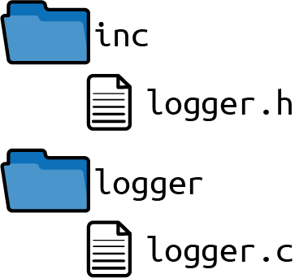

# Chapter 10. Implementing Logging Functionality

Choosing the right patterns in the right situations helps a lot when designing software. But sometimes it is difficult to find the right pattern and to decide when to apply it. You can find guidance for that in the context and problem sections of the patterns from [Part I](Part_01_C_Patterns.md) of this book. But usually it is much easier to understand how to do something by looking at a concrete example.

This chapter tells the story of applying the patterns from [Part I](Part_01_C_Patterns.md) of this book to a running example that was abstracted from an industrial-strength implementation of a logging system. To keep the example code easy to grasp, not all aspects of the original industrial-strength code are covered. For example, the code design does not focus on performance or testability aspects. Still, the example nicely shows how to build a logging system piece by piece by applying patterns.

# The Pattern Story

Imagine you have a C program out in the field that you have to maintain. If an error occurs, you get into your car, drive to the customer, and debug the program. This works fine until your customer moves to another city. The car ride now takes several hours, which is not at all satisfactory.

You’d prefer to solve the problem from your desk to save both time and nerves. In some instances, you can utilize remote debugging. In other instances, you need detailed data about the exact software states in which the error occurred, which is very hard to get via a remote connection—especially in instances of sporadic errors.

Perhaps you’ve already guessed what the solution is to avoiding your long car rides. Your solution is to implement a logging functionality and to ask your customer in case of error to send you the log files containing the debug information. In other words, you want to implement the Log Errors pattern to be able to analyze bugs after they occur, which allows you to more easily fix those bugs without having to reproduce them. While this sounds simple, there are many crucial design decisions you’ll need to make to implement logging functionality.

## File Organization

To get started, organize the header and implementation files that you expect to need. You already have a large codebase, so you want to clearly separate these files from the rest of your code. How should you organize the files? Should you put all your logging-related files into the same directory? Should you put all the header files of your code into a single directory?

To answer these questions, you search for patterns on organizing files and find them in Chapters [6](Chapter_06_Flexible_APIs.md) and [8](Chapter_08_Organizing_Files_in_Modular_Programs.md). You read through the problem statements of these patterns, and you trust in the knowledge provided in the described solutions. You end up with the following three patterns that nicely address your problems:

| Pattern name | Summary |
|----|----|
| Software-Module Directories | Put header files and implementation files that belong to a tightly coupled functionality into one directory. Name that directory after the functionality that is provided via the header files. |
| Header Files | Provide function declarations in your API for any functionality you want to provide to your user. Hide any internal functions, internal data, and your function definitions (the implementations) in your implementation file and don’t provide this implementation file to the user. |
| Global Include Directory | Have one global directory in your codebase that contains all software-module APIs. Add this directory to the global include paths in your toolchain. |

Create a Software-Module Directory for your implementation files and put the Header File of your logging software-module into the already existing Global Include Directory of your codebase. Having this header file in the Global Include Directory has the advantage that the callers of your code will definitely know which header file they are supposed to use.

Your file structure should appear as shown in [Figure 10-1](#fig_story1).



###### Figure 10-1. File structure

With this file structure, you can put any implementation files that only concern your logging software-module into the *logger* directory. You can put the interface, which can be used from other parts of your program, into the *inc* directory.

## Central Logging Function

As a start, implement a central function for error logging that takes custom error texts, adds the current timestamp to the texts, and prints it to the standard output. The timestamp information will make it easier for you to analyze the error texts later on.

Put the function declaration into the *logger.h* file. To protect your header file against multiple inclusion, add an Include Guard. There is no need to store any information in that code or to initialize it; simply implement a Stateless Software-Module. Having a stateless logger brings many benefits: you keep your logging code simple, and things get easier when calling the code in a multithreaded environment.

| Pattern name | Summary |
|----|----|
| Include Guard | Protect the content of your header files against multiple inclusion so that the developer using the header files does not have to care whether it is included multiple times. Use an interlocked `#ifdef` statement or a `#pragma once` statement to achieve this. |
| Stateless Software-Module | Keep your functions simple and don’t build up state information in your implementation. Put all related functions into one header file and provide the caller this interface to your software-module. |

*logger.h*

```
#ifndef LOGGER_H
#define LOGGER_H
void logging(const char* text);
#endif
```

\
*Caller’s code*

```
logging("Some text to log");
```

To implement the function in your *logger.h* file, call a `printf` to write the timestamp and the text to `stdout`. But what if the caller of your function provides invalid logging input like a `NULL` pointer? Should you check for such invalid input and provide error information to the caller? Adhere to the Samurai Principle, according to which you should not return error information about programming errors.

| Pattern name | Summary |
|----|----|
| Samurai Principle | Return from a function victorious or not at all. If there is a situation for that you know that an error cannot be handled, then abort the program. |

Forward the provided text to the `printf` function, and in case of invalid input your program simply crashes, which makes it easy for the caller to find out programming errors regarding invalid input:

*logger.c*

```
void logging(const char* text)
{
  time_t mytime = time(NULL);
  printf("%s %s\n", ctime(&mytime), text);
}
```

And what if you call the function in the context of a multithreaded program? Can the string provided to the function be changed by other threads, or is it necessary for the string to remain unchanged until the logging function is finished? In the preceding code example, the caller has to provide `text` as input for the `logging` function and is responsible for ensuring that the string is valid until the function returns. So we have a Caller-Owned Buffer here. That behavior has to be documented in the function’s interface.

| Pattern name | Summary |
|----|----|
| Caller-Owned Buffer | Require the caller to provide a buffer and its size to the function that returns the large, complex data. In the function implementation, copy the required data into the buffer if the buffer size is large enough. |

*logger.h*

```
/* Prints the current timestamp followed by the provided string to stdout.
   The string must be valid until this function returns. */
void logging(const char* text);
```

## Logging Source Filter

Now imagine that every software-module calls the logging function in order to log some information. The output can become quite messy, especially if you have a multithreaded program.

To make it easier to get the information you are looking for, you want to make it possible to configure the code so that it only prints the logging information for configured software-modules. To achieve this, add an additional parameter to your function which identifies the current software-module. Add a function to enable printing output for a software-module. If that function is called, all future logging output for that software-module will be printed:

*logger.h*

```
/* Prints the current timestamp followed by the provided string to stdout.
   The string must be valid until this function returns. The provided module
   identifies the software-module that calles this function. */
void logging(const char* module, const char* text);

/* Enables printing output for the provided module. */
bool enableModule(const char* module);
```

\
*Caller’s code*

```
logging("MY-SOFTWARE-MODULE", "Some text to log");
```

How will you keep track of which software-modules’ logging information should be printed? Should you store that state information in a global variable, or is each global variable a code smell? Or in order to avoid global variables, should you pass an additional parameter to all your functions that stores this state information? Should the required memory be allocated throughout the whole lifetime of your program? The answer to these questions involves implementing a Software-Module with Global State using Eternal Memory.

| Pattern name | Summary |
|----|----|
| Software-Module with Global State | Have one global instance to let your related functions share common resources. Put all functions that operate on this instance into one header file and provide the caller this interface to your software-module. |
| Eternal Memory | Put your data into memory that is available throughout the whole lifetime of your program. |

*logger.c*

```
#define MODULE_SIZE 20
#define LIST_SIZE 10
typedef struct
{
  char module[MODULE_SIZE];
}LIST;
static LIST list[LIST_SIZE];
```

The list in the preceding code example is populated by enabling software-modules with the following function:

*logger.c*

```
bool enableModule(const char* module)
{
  for(int i=0; i<LIST_SIZE; i++)
  {
    if(strcmp(list[i].module, "") == 0)
    {
      strcpy(list[i].module, module);
      return true;
    }
    if(strcmp(list[i].module, module) == 0)
    {
      return false;
    }
  }
  return false;
}
```

The preceding code adds the software-module name to the list if a slot in the list is empty and if that name is not already in the list. The caller sees through the Return Value whether an error occurred but does not see which of these errors occurred. You don’t Return Status Codes; you only Return Relevant Errors, because there is no relevant scenario in which the caller could react differently to the described error situations. You should also document this behavior in your function definition.

| Pattern name | Summary |
|----|----|
| Return Value | Simply use the one C mechanism intended to retrieve information about the result of a function call: the Return Value. The mechanism to return data in C copies the function result and provides the caller access to this copy. |
| Return Relevant Errors | Only return error information to the caller if that information is relevant to the caller. Error information is only relevant to the caller if the caller can react to that information. |

*logger.h*

```
/* Enables printing output for the provided module. Returns true on success
   and false on error (no more modules can be enabled or module was already
   enabled). */
bool enableModule(const char* module);
```

## Conditional Logging

Now, with the activated software-modules in your list, you can conditionally log information depending on the activated modules, as shown in the following code:

*logger.c*

```
void logging(const char* module, const char* text)
{
  time_t mytime = time(NULL);
  if(isInList(module))
  {
    printf("%s %s\n", ctime(&mytime), text);
  }
}
```

But how do you implement the `isInList` function? There are several ways to iterate through a list. You could have a Cursor Iterator that provides a `getNext` method to abstract the underlying data structure. But is that necessary here? After all, you only go through an array in your own software-module. Because the iterated data is not carried across API boundaries that might have to be kept compatible, you can apply a much simpler solution here. Index Access directly uses an index to access the elements you want to iterate:

| Pattern name | Summary |
|----|----|
| Index Access | Provide a function that takes an index to address the element in your underlying data structure and return the content of this element. The user calls this function in a loop to iterate over all elements. |

*logger.c*

```
bool isInList(const char* module)
{
  for(int i=0; i<LIST_SIZE; i++)
  {
    if(strcmp(list[i].module, module) == 0)
    {
      return true;
    }
  }
  return false;
}
```

Now all your code for software-module-specific logging is written. The code simply iterates the data structure by incrementing an index. The same kind of iteration was already used in your `enableModule` function.

## Multiple Logging Destinations

Next, you want to provide different destinations for your log entries. Until now, all output is logged to the `stdout`, but you want your caller to be able to configure your code to directly log into a file. Such a configuration is usually done before the action to be logged is started. Start with a function that allows you to configure the logging destination for all future loggings:

*logger.h*

```
/* All future log messages will be logged to stdout */
void logToStdout();

/* All future log messages will be logged to a file */
void logToFile();
```

To implement this log destination selection, you could simply have an `if` or `switch` statement to call the right function depending on the configured logging destination. However, each time you add another logging destination, you’d have to touch that piece of code. That is not a good solution according to the open-closed principle. A much better solution is to implement a Dynamic Interface.

| Pattern name | Summary |
|----|----|
| Dynamic Interface | Define a common interface for the deviating functionalities in your API and require the caller to provide a callback function for that functionality which you then call in your function implementation. |

*logger.c*

```
typedef void (*logDestination)(const char*);
static logDestination fp = stdoutLogging;

void stdoutLogging(const char* buffer)
{
  printf("%s", buffer);
}

void fileLogging(const char* buffer)
{
  /* not yet implemented */
}

void logToStdout()
{
  fp = stdoutLogging;
}

void logToFile()
{
  fp = fileLogging;
}

#define BUFFER_SIZE 100
void logging(const char* module, const char* text)
{
  char buffer[BUFFER_SIZE];
  time_t mytime = time(NULL);
  if(isInList(module))
  {
    sprintf(buffer, "%s %s\n", ctime(&mytime), text);
    fp(buffer);
  }
}
```

A lot changed in the existing code, but now additional log destinations can be added without any changes to the `logging` function. In the preceding code, the `stdoutLogging` function is already implemented, but the `fileLogging` function is still missing.

## File Logging

To log to a file, you could simply open and close the file each time you log a message. But that is not very efficient, and if you want to log a lot of information, that approach takes a lot of time. So what alternative do you have? You could simply open the file once and then leave it open. But how do you know when to open the file? And when would you close it?

After reviewing the patterns in this book, you cannot find one that solves your problem. However, a quick Google search will lead you to the pattern that solves your problem: Lazy Acquisition. In the first call to your `fileLogging` function, open the file once and then leave it open. You can store the file descriptor in Eternal Memory.

| Pattern name | Summary |
|----|----|
| Lazy Acquisition | Implicitly initialize the object or data the first time it is used (see *Pattern-Oriented Software Architecture: Volume 3: Patterns for Resource Management* by Michael Kirchner and Prashant Jain \[Wiley, 2004\]) |
| Eternal Memory | Put your data into memory that is available throughout the whole lifetime of your program. |

*logger.c*

```
void fileLogging(const char* buffer)
{
  static int fd = 0; 
  if(fd == 0)
  {
    fd = open("log.txt", O_RDWR | O_CREAT, 0666);
  }
  write(fd, buffer, strlen(buffer));
}
```

[](#co_implementing_logging_functionality_CO1-1)  
Such `static` variables are only initialized once and not each time the function is called.

To keep the code example simple, it does not target thread safety. In order to be thread-safe, the code would have to protect the Lazy Acquisition with a Mutex to make sure that the acquisition only happens once.

What about closing the file? For some applications, like the one in this chapter, not closing the file is a valid option. Imagine that you want to log as long as your application is running, and when you shut the application down, you rely on the operating system to clean up the file that you left open. If you are afraid that the information is not stored in case of a system crash, you could even flush the file content from time to time.

## Cross-Platform Files

The code so far implements logging to a file on Linux systems, but you also want to use your code on Windows platforms, for which the current code won’t yet work.

To support multiple platforms, you first consider to Avoid Variants so that you only have common code for all platforms. That would be possible for writing files by simply using the `fopen`, `fwrite`, and `fclose` functions, which are available on Linux as well as on Windows systems.

| Pattern name | Summary |
|----|----|
| Avoid Variants | Use standardized functions that are available on all platforms. If there are no standardized functions, consider not implementing the functionality. |

However, you want to make your file logging code as efficient as possible and using the platform-specific functions for accessing files is more efficient. But how do you implement platform-specific code? Duplicating your codebase to have one full code version for Windows and one full code version for Linux is not an option because future changes and maintenance of duplicated code can become a nightmare.

You decide to use `#ifdef` statements in your code to differentiate between the platforms. But isn’t that a code duplication as well? After all, when you have huge `#ifdef` blocks in your code, all the program logic in these statements is duplicated. How can you avoid code duplication while still supporting multiple platforms?

Again the patterns show you the way. First, define platform-independent interfaces for the functionality that requires the platform-dependent functions. In other words, define an Abstraction Layer.

| Pattern name | Summary |
|----|----|
| Abstraction Layer | Provide an API for each functionality that requires platform-specific code. Define only platform-independent functions in the header file and put all platform-specific `#ifdef` code into the implementation file. The caller of your functions includes only your header file and does not have to include any platform-specific files. |

*logger.c*

```
void fileLogging(const char* buffer)
{
  void* fileDescriptor = initiallyOpenLogFile();
  writeLogFile(fileDescriptor, buffer);
}

/* Opens the logfile at the first call.
   Works on Linux and on Windows systems */
void* initiallyOpenLogFile()
{
  ...
}

/* Writes the provided buffer to the logfile.
   Works on Linux and on Windows systems */
void writeLogFile(void* fileDescriptor, const char* buffer)
{
  ...
}
```

Behind this Abstraction Layer you have Isolated Primitives of your code variants. That means you don’t use `#ifdef` statements across several functions, but you stick to one `#ifdef` for one function. Should you have an `#ifdef` statement across the whole function implementation or just across the platform-specific part?

The solution is to have both. You should have Atomic Primitives. The functions should be on a granularity so that they only contain platform-specific code. If they don’t, then you can split these functions up further. That is the best way to keep platform-dependent code manageable.

| Pattern name | Summary |
|----|----|
| Isolated Primitives | Isolate your code variants. In your implementation file, put the code handling the variants into separate functions and call these functions from your main program logic, which then contains only platform-independent code. |
| Atomic Primitives | Make your primitives atomic. Only handle exactly one kind of variant per function. If you handle multiple kinds of variants, for example, operating system variants and hardware variants, then have separate functions for that. |

The following code shows the implementations of your Atomic Primitives:

*logger.c*

```
void* initiallyOpenLogFile()
{
#ifdef __unix__
  static int fd = 0;
  if(fd == 0)
  {
    fd = open("log.txt", O_RDWR | O_CREAT, 0666);
  }
  return fd;
#elif defined _WIN32
  static HANDLE hFile = NULL;
  if(hFile == NULL)
  {
    hFile = CreateFile("log.txt", GENERIC_WRITE, 0, NULL,
                       CREATE_NEW, FILE_ATTRIBUTE_NORMAL, NULL);
  }
  return hFile;
#endif
}

void writeLogFile(void* fileDescriptor, const char* buffer)
{
#ifdef __unix__
  write((int)fileDescriptor, buffer, strlen(buffer));
#elif defined _WIN32
  WriteFile((HANDLE)fileDescriptor, buffer, strlen(buffer), NULL, NULL);
#endif
}
```

The preceding code doesn’t look great. But then again, any platform-dependent code rarely looks nice. Is there anything else you can do to make that code easier to read and maintain? A possible approach to improve things is to Split Variant Implementations into separate files.

| Pattern name | Summary |
|----|----|
| Split Variant Implementations | Put each variant implementation into a separate implementation file and select per file what you want to compile for which platform. |

*fileLinux.c*

```
#ifdef __unix__
void* initiallyOpenLogFile()
{
  static int fd = 0;
  if(fd == 0)
  {
    fd = open("log.txt", O_RDWR | O_CREAT, 0666);
  }
  return fd;
}

void writeLogFile(void* fileDescriptor, const char* buffer)
{
  write((int)fileDescriptor, buffer, strlen(buffer));
}
#endif
```

\
*fileWindows.c*

```
#ifdef _WIN32
void* initiallyOpenLogFile()
{
  static HANDLE hFile = NULL;
  if(hFile == NULL)
  {
    hFile = CreateFile("log.txt", GENERIC_WRITE, 0, NULL,
                       CREATE_NEW, FILE_ATTRIBUTE_NORMAL, NULL);
  }
  return hFile;
}

void writeLogFile(void* fileDescriptor, const char* buffer)
{
  WriteFile((HANDLE)fileDescriptor, buffer, strlen(buffer), NULL, NULL);
}
#endif
```

Both of the shown code files are a lot easier to read compared to the code where Linux and Windows code is mixed within a single function. Also, instead of conditionally compiling the code on a platform via `#ifdef` statements, it is now possible to eliminate all `#ifdef` statements and to use Makefiles to select which files to compile.

## Using the Logger

With these final changes to your logging functionality, your code can now log messages for configured software-modules to `stdout` or to cross-platform files. The following code shows how to use the logging functionality:

```
enableModule("MYMODULE");
logging("MYMODULE", "Log to stdout");
logToFile();
logging("MYMODULE", "Log to file");
logging("MYMODULE", "Log to file some more");
```

After you finish making all these coding decisions and then implementing them, you are very relieved. You take your hands off the keyboard and look at the code in admiration. You are astonished at how some of your initial questions that seemed difficult to you were easily resolved by the patterns. The benefit to utilizing the patterns is that they remove the burden of making hundreds of decisions by yourself.

The long car rides to fix bugs on site are in the past. Now you simply get the debug information that you need via the log files. That makes your customer happy, because they get quicker bug fixes. More importantly, it makes your own life better. You can provide more professional software, and you now have the time to get home from work early.

# Summary

You constructed the code for this logging functionality step by step by applying the patterns presented in [Part I](Part_01_C_Patterns.md) in order to solve one problem after another. At the start you had many questions on how to organize the files or how to cope with error handling. The patterns showed you the way. They gave you guidance and made it easier to construct this piece of code. They also provide understanding as to why the code looks and behaves the way it does. [Figure 10-2](#fig_story1_patterns) shows an overview of the decisions that the patterns helped you make.

There are, of course, still a lot of potential feature improvements for your code. The code, for example, doesn’t handle maximum file sizes or rotation of logfiles, and doesn’t support configuration of a log level to skip very detailed logging. To keep things simple and easier to grasp, these features are not covered but could be added to the code examples.

The next chapter will tell another story on how to apply the patterns to build another larger industrial-strength piece of code.


###### Figure 10-2. The patterns applied throughout this story

