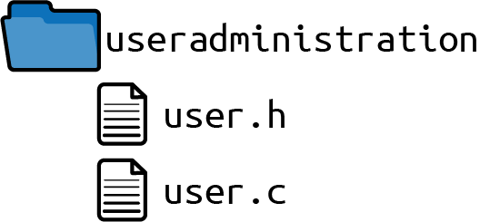

# Chapter 11. Building a User Management System

This chapter tells the story of applying the patterns from [Part I](Part_01_C_Patterns.md) of this book to a running example. With that example, it illustrates how design choices made with the aid of patterns provide benefits and support for programmers. This chapter’s running example is abstracted from an industrial-strength implementation of a user management system.

# The Pattern Story

Imagine you are fresh from university and start working for a software development company. Your boss hands you a product specification for a piece of software that stores usernames and passwords and tells you to implement it. The software should provide functionality to check whether a provided password for a user is correct and functionality to create, delete, and view existing users.

You are eager to show your boss that you are a good programmer, but before you even start, your mind fills with questions. Should you write all code into a single file? You know from your studies that this is bad practice, but what’s a good number of files? Which parts of the code will you put into the same files? Should you check the input parameters for each function? Should your functions return detailed error information? At university you learned how to build a software program that works, but you did not learn how to write good code that is maintainable. So what should you do? How do you start?

## Data Organization

To answer your questions, start by reviewing the patterns in this book to get guidance on how to build good C programs. Begin with the part of your system that stores the usernames and passwords. Your questions should now focus on how to store the data in your program. Should you store it in global variables? Should you hold the data in local variables inside a function? Should you allocate dynamic memory?

First, consider the exact problem that you want to solve in your application: you are not sure how to store the username data. Currently, there is no need to make this data persistent; you simply want to be able to build up and access this data at runtime. Also, you don’t want the caller of your functions to have to cope with explicit allocation and initialization of the data.

Next, look for patterns that address your specific problem. Review the C patterns on data lifetime and ownership from [Chapter 5](Chapter_05_Data_Lifetime_and_Ownership.md), which addresses the issue of who is responsible of holding which data. Read through all the problem sections of these patterns and find one pattern that matches your problem very well and describes consequences which are acceptable to you. That pattern is the Software-Module with Global State pattern, which suggests having Eternal Memory in the form of global variables with scope limited to the file in order for that data to be accessed from within that file.

| Pattern name | Summary |
|----|----|
| Software-Module with Global State | Have one global instance to let your related functions share common resources. Put all functions that operate on this instance into one header file and provide the caller this interface to your software-module. |
| Eternal Memory | Put your data into memory that is available throughout the whole lifetime of your program. |

```
#define MAX_SIZE 50
#define MAX_USERS 50

typedef struct
{
  char name[MAX_SIZE];
  char pwd[MAX_SIZE];
}USER;

static USER userList[MAX_USERS]; 
```

[](#co_building_a_user_management_system_CO1-1)  
The `userList` contains the data for your users. It is accessible within the implementation file. Because it is kept in the static memory, there is no need to manually allocate it (which would make the code more flexible, but also more complicated).

# Storing Passwords

In this simplified example, we keep the password in plain text. Never, ever do this in real-life applications. When storing passwords, you should instead store a [salted hash value](https://oreil.ly/5y7yO) of the plain text password.

## File Organization

Next, define an interface for your caller. Make sure that it is easy for you to change your implementation later on without requiring the caller to change any code. Now you have to decide which part of your program should be defined in the interface and which part should be defined in your implementation file.

Solve this problem by using Header Files. Put as few things as possible (only those things that are relevant to the caller) into the interface (*.h* file). All the rest goes into your implementation files (*.c* files). To protect against multiple inclusion of header files, implement an Include Guard.

| Pattern name | Summary |
|----|----|
| Header Files | Provide function declarations in your API for any functionality you want to provide to your user. Hide any internal functions, internal data, and your function definitions (the implementations) in your implementation file and don’t provide this implementation file to the user. |
| Include Guard | Protect the content of your header files against multiple inclusion so that the developer using the header files does not have to care whether it is included multiple times. Use an interlocked `#ifdef` statement or a `#pragma once` statement to achieve this. |

*user.h*

```
#ifndef USER_H
#define USER_H

#define MAX_SIZE 50

#endif
```

\
*user.c*

```
#include "user.h"

#define MAX_USERS 50

typedef struct
{
  char name[MAX_SIZE];
  char pwd[MAX_SIZE];
}USER;

static USER userList[MAX_USERS];
```

Now the caller can use the defined `MAX_SIZE` to know how long the strings provided to the software-module can be. By convention, the caller knows that everything in the *.h* file can be used but that nothing in the *.c* file should be used.

Next, make sure that your code files are well separated from your caller’s code to avoid name clashes. Should you put all your files into one directory, or should you, for example, have all *.h* files in the whole codebase in one directory to make it easier to include them?

Create a Software-Module Directory and put all your files for your software-module, the interfaces and the implementations, into one directory.

| Pattern name | Summary |
|----|----|
| Software-Module Directories | Put header files and implementation files that belong to a tightly coupled functionality into one directory. Name that directory after the functionality that is provided via the header files. |

With the directory structure shown in [Figure 11-1](#fig_story2), it is now possible to easily spot all files that are related to your code. Now you don’t have to worry that the names of your implementation files will clash with other filenames.



###### Figure 11-1. File structure

## Authentication: Error Handling

Now it is time to implement the first functionality to access the data. Start by implementing a function that checks whether a provided password matches the previously saved password for a provided user. Define the behavior of the function by declaring the function in the header file and documenting that behavior with code comments next to the function declaration.

The function should let the caller know whether the provided password is correct for a provided user. Tell the caller by using the Return Value of the function. But which information should you return? Should you provide the caller with any error information that occurs?

Only Return Relevant Errors because for any security-related functionality, it is common to provide only the information that you must provide and no more. Don’t let the caller know whether the provided user does not exist or whether the provided password is wrong. Instead, simply tell the caller whether authentication worked or not.

| Pattern name | Summary |
|----|----|
| Return Value | Simply use the one C mechanism intended to retrieve information about the result of a function call: the Return Value. The mechanism to return data in C copies the function result and provides the caller access to this copy. |
| Return Relevant Errors | Only return error information to the caller if that information is relevant to the caller. Error information is only relevant to the caller if the caller can react to that information. |

*user.h*

```
/* Returns true if the provided username exists and
   if the provided password is correct for that user. */
bool authenticateUser(char* username, char* pwd);
```

This code defines which value is returned by the function very well, but it does not specify the behavior in case of invalid input. How should you cope with invalid input like `NULL` pointers? Should you check against `NULL` pointers, or should you simply ignore invalid input?

Require your user to provide valid input, because invalid input would be a programming error of that user, and such errors should not go unnoticed. According to the Samurai Principle, you abort the program in case of invalid input and document that behavior in the header file.

| Pattern name | Summary |
|----|----|
| Samurai Principle | Return from a function victorious or not at all. If there is a situation for which you know that an error cannot be handled, then abort the program. |

*user.h*

```
/* Returns true if the provided username exists and
   if the provided password is correct for that user,
   returns false otherwise. Asserts in case of invalid
   input (NULL string) */
bool authenticateUser(char* username, char* pwd);
```

\
*user.c*

```
bool authenticateUser(char* username, char* pwd)
{
  assert(username);
  assert(pwd);

  for(int i=0; i<MAX_USERS; i++)
  {
    if(strcmp(username, userList[i].name) == 0 &&
       strcmp(pwd, userList[i].pwd) == 0)
    {
      return true;
    }
  }
  return false;
}
```

With the Samurai Principle, you take the burden from your caller of checking for specific return values indicating invalid input. Instead, for invalid input the program crashes. You chose to use explicit `assert` statements instead of letting the program crash in an uncontrolled way (e.g., by passing invalid input to the `strcmp` function), In the context of security-critical applications, you want your program to have a defined behavior even in error situations.

At first glance, letting the program crash looks like a brutal solution, but with that behavior, calls with invalid parameters do not go unnoticed. Over the long term, this strategy makes the code more reliable. It does not let subtle bugs, like invalid parameters, manifest and show up somewhere else in the caller’s code.

## Authentication: Error Logging

Next, keep track of callers who provide you with the wrong password. Log Errors if your `authenticateUser` function fails so this information is available for security audits later on. For logging, either take the code from [Chapter 10](Chapter_10_Implementing_Logging_Functionality.md) or implement a simpler version for logging as shown in the following.

| Pattern name | Summary |
|----|----|
| Log Errors | Use different channels to provide error information that is relevant for the calling code and error information that is relevant for the developer. For example, write debug error information into a log file and don’t return the detailed debug error information to the caller. |

It is difficult to provide this logging mechanism on different platforms—for example on Linux as well as on Windows—because the different operating systems provide different functions for accessing files. Also, multiplatform code is hard to implement and maintain. So how can you implement your logging functionality as simply as possible? Make sure to Avoid Variants and to use standardized functions, which are available on all platforms.

| Pattern name | Summary |
|----|----|
| Avoid Variants | Use standardized functions that are available on all platforms. If there are no standardized functions, consider not implementing the functionality. |

Luckily, the C standard defines functions for accessing files, and these can be used on Windows and Linux systems. While there are operating system–specific functions for accessing files which might be more performant or might provide you with operating system–specific features, these are not necessary here. Simply use the file access functions defined by the C standard.

To implement your logging functionality, call the following function if the wrong password was provided:

*user.c*

```
static void logError(char* username)
{
  char logString[200];
  sprintf(logString, "Failed login. User:%s\n", username);
  FILE* f = fopen("logfile", "a+"); 
  fwrite(logString, 1, strlen(logString), f);
  fclose(f);
}
```

[](#co_building_a_user_management_system_CO2-1)  
Use the platform-independent functions `fopen`, `fwrite`, and `fclose`. This code works on Windows and Linux platforms, and there are no nasty `#ifdef` statements to handle the platform variants.

For storing the log information, the code uses Stack First, because the log message is small enough to fit on the stack. This is also easiest for you because you don’t have to deal with memory cleanup.

| Pattern name | Summary |
|----|----|
| Stack First | Simply put your variables on the stack by default to profit from automatic cleanup of stack variables. |

## Adding Users: Error Handling

Looking at the whole code, you now have a function to check whether a password is correct for a username stored in your list, but your list of users is still empty. To fill your list of users, implement a function that allows the caller to add new users.

Make sure that the usernames are unique, and let the caller know whether adding the new user worked or not, either because the username already exists or because there is no more space in your user list.

Now you have to decide how you want to inform the caller about these error situations. Should you use the Return Value to return this information, or should you set the `errno` variable? Additionally, what kind of information will you provide the caller, and what data type will you use to return that information?

In this instance, Return Status Codes because you have different error situations and you want to inform your caller about these different situations. In addition, in case of invalid parameters, abort the program (Samurai Principle). Define the error codes in your interface to allow you and your caller to have a mutual understanding of how the error codes map to different error situations so the caller can react accordingly.

| Pattern name | Summary |
|----|----|
| Return Status Codes | Use the Return Value of a function to return status information. Return a value that represents a specific status. Both of you as the callee and the caller must have a mutual understanding of what the value means. |

*user.h*

```
typedef enum{
  USER_SUCCESSFULLY_ADDED,
  USER_ALREADY_EXISTS,
  USER_ADMINISTRATION_FULL
}USER_ERROR_CODE;

/* Adds a new user with the provided `username' and the provided password
   `pwd' (asserts on NULL). Returns USER_SUCCESSFULLY_ADDED on success,
   USER_ALREADY_EXISTS if a user with the provided username already exists
   and USER_ADMINISTRATION_FULL if no more users can be added. */
USER_ERROR_CODE addUser(char* username, char* pwd);
```

Next, implement the `addUser` function. Check whether such a user already exists and then add the user. To separate these tasks, perform a Function Split to split the different tasks and responsibilities into different functions. First, implement a function to check whether the user already exists.

| Pattern name | Summary |
|----|----|
| Function Split | Split up the function. Take a part of a function that seems useful on its own, create a new function with that, and call that function. |

*user.c*

```
static bool userExists(char* username)
{
  for(int i=0; i<MAX_USERS; i++)
  {
    if(strcmp(username, userList[i].name) == 0)
    {
      return true;
    }
  }
  return false;
}
```

This function can now be called inside the function that adds new users in order to add new users only if they don’t yet exist. Should you check for existing users at the beginning of the function or right before you add the user to the list? Which of these alternatives would make your function easier to read and maintain?

Implement a Guard Clause at the beginning of the function that will return immediately if the action cannot be performed because the user already exists. A check right at the beginning of the function makes it easier to follow the program flow.

| Pattern name | Summary |
|----|----|
| Guard Clause | Check whether you have pre-conditions and immediately return from the function if these pre-conditions are not met. |

*user.c*

```
USER_ERROR_CODE addUser(char* username, char* pwd)
{
  assert(username);
  assert(pwd);

  if(userExists(username))
  {
    return USER_ALREADY_EXISTS;
  }

  for(int i=0; i<MAX_USERS; i++)
  {
    if(strcmp(userList[i].name, "") == 0)
    {
      strcpy(userList[i].name, username);
      strcpy(userList[i].pwd, pwd);
      return USER_SUCCESSFULLY_ADDED;
    }
  }

  return USER_ADMINISTRATION_FULL;
}
```

With the implemented code fragments so far, you can fill your user administration with users and to check whether a provided password is correct for these users.

## Iterating

Next, provide some functionality to read out all usernames by implementing an iterator. While you may want to simply provide an interface that lets the caller access the `userList` array by index, you’d be in trouble if the underlying data structure changes (for example, to a linked list), or if the caller wants to access the array while another caller modifies the array.

To provide an iterator interface to the caller that solves the mentioned issues, implement a Cursor Iterator, which uses a Handle to hide the underlying data structure from the caller.

| Pattern name | Summary |
|----|----|
| Cursor Iterator | Create an iterator instance that points to an element in the underlying data structure. An iteration function takes this iterator instance as argument, retrieves the element the iterator currently points to, and modifies the iteration instance to point to the next element. The user then iteratively calls this function to retrieve one element at a time. |
| Handle | Have a function to create the context on which the caller operates and return an abstract pointer to internal data for that context. Require the caller to pass that pointer to all your functions, which can then use the internal data to store state information and resources. |

*user.h*

```
typedef struct ITERATOR* ITERATOR;

/* Create an iterator instance. Returns NULL on error. */
ITERATOR createIterator();

/* Retrieves the next element from an iterator instance. */
char* getNextElement(ITERATOR iterator);

/* Destroys an iterator instance. */
void destroyIterator(ITERATOR iterator);
```

The caller has full control of when to create and destroy the iterator. Thus, you have Dedicated Ownership with a Caller-Owned Instance. The caller can simply create the iterator Handle and use it to access the list of usernames. If creation fails, then the Special Return Value `NULL` indicates this. Having this Special Return Value instead of explicit error codes makes using the function easier because no additional function parameters are needed to return error information. When the caller is done with iterating, the caller can destroy the Handle.

| Pattern name | Summary |
|----|----|
| Dedicated Ownership | Right at the time when you implement memory allocation, clearly define where it’s going to be cleaned up and who is going to do that. |
| Caller-Owned Instance | Require the caller to pass an instance, which is used to store resource and state information, along to your functions. Provide explicit functions to create and destroy these instances, so that the caller can determine their lifetime. |
| Special Return Values | Use the Return Value of your function to return the data computed by the function. Reserve one or more special values to be returned if an error occurs. |

Because the interface provides the caller with explicit functions to create and destroy the iterator, this naturally leads to separate functions for initializing and cleaning up the resources for your iterator in the implementation. This Object-based Error Handling brings the advantage of nicely separated responsibilities in your functions, which makes them easier to extend if necessary later on. You can see this separation in the following code where all initialization code is in one function, and all cleanup code is in another function.

| Pattern name | Summary |
|----|----|
| Object-Based Error Handling | Put initialization and cleanup into separate functions, similar to the concept of constructors and destructors in object-oriented programming. |

*user.c*

```
struct ITERATOR
{
  int currentPosition;
  char currentElement[MAX_SIZE];
};

ITERATOR createIterator()
{
  ITERATOR iterator = (ITERATOR) calloc(sizeof(struct ITERATOR),1);
  return iterator;
}

char* getNextElement(ITERATOR iterator)
{
  if(iterator->currentPosition < MAX_USERS)
  {
    strcpy(iterator->currentElement,userList[iterator->currentPosition].name);
    iterator->currentPosition++;
  }
  else
  {
    strcpy(iterator->currentElement, "");
  }
  return iterator->currentElement;
}

void destroyIterator(ITERATOR iterator)
{
  free(iterator);
}
```

When implementing the preceding code, how should you provide the username data to the caller? Should you simply provide the caller with a pointer to that data? If you copy that data into a buffer, who should allocate it?

In this situation, the Callee Allocates the string buffer. This makes it possible for the caller to have full access to that string without having the possibility of changing the data in the `userList`. Additionally, the caller avoids accessing data that might be changed by other callers at the same time.

| Pattern name | Summary |
|----|----|
| Callee Allocates | Allocate a buffer with the required size inside the function that provides the large, complex data. Copy the required data into the buffer and return a pointer to that buffer. |

## Using the User Management System

You have now completed your user management code. The following code shows how to use that user management system:

```
char* element;
addUser("A", "pass");
addUser("B", "pass");
addUser("C", "pass");

ITERATOR it = createIterator();

while(true)
{
  element = getNextElement(it);
  if(strcmp(element, "") == 0)
  {
    break;
  }

  printf("User: %s ", element);
  printf("Authentication success? %d\n", authenticateUser(element, "pass"));
}

destroyIterator(it);
```

Throughout this chapter, the patterns helped you to design this final piece of code. Now you can tell your boss you completed the task of implementing the requested system for storing usernames and passwords. By utilizing pattern-based design for that system, you rely on documented solutions that are proven in use.

# Summary

You constructed the code in this chapter step by step by applying the patterns presented in [Part I](Part_01_C_Patterns.md) in order to solve one problem after another. At the start you had many questions on how to organize the files and how to cope with error handling. The patterns showed you the way. They gave you guidance and made it easier to construct this piece of code. They also provide understanding as to why the code looks and behaves the way it does. Throughout this chapter, you applied the patterns shown in [Figure 11-2](#fig_story2_patterns). In the figure, you can see how many decisions you had to make and how many decisions were guided by the patterns.

The constructed user administration system contains basic functionalities to add, find, and authenticate users. Again, there are many other functionalities that could be added to that system, like the functionality to change passwords, to not store them in plain text, or to check that the passwords meet some security criteria. The advanced functionality is not addressed in this chapter to make the pattern application easier to grasp.


###### Figure 11-2. The patterns applied throughout this story

