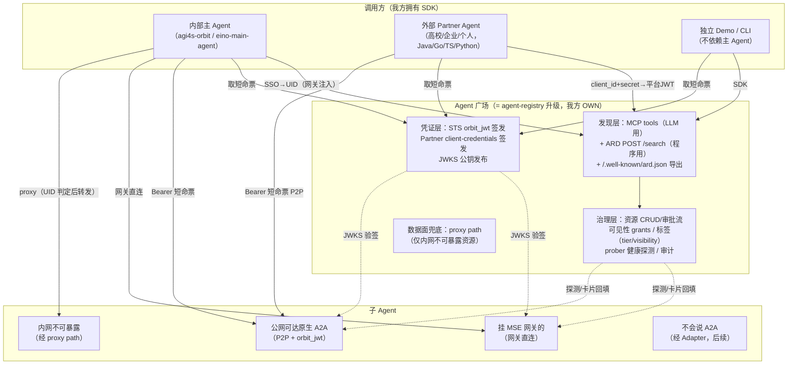

# Agent Registry + ARD：调研、目标架构与升级设计

> 日期：2026-09-16
> 性质：对草稿《Agent Registry + ARD》（Downloads 版）的全面升级——外部调研背书 + 目标架构 + 基于 `work/agent-registry` 代码的落地设计。
> 代码基线：`agent-registry` main 分支（活跃维护至 2026-09-09，含 `resource_jwt_keys` 自签 JWT 链路）。
> 相关既有材料：`agent-registry-a2a-design-notes.md`（2026-08-12）、`agent-registry-and-a2a-client-research-2026-09-01.md`、`docs/p2-orbit-jwt.md`、`docs/adapter.md`。

---

## 1. 调研结论速览（先给答案）

1. **方向被行业强烈背书。** AWS 于 2026-08 把 Agent Registry 做到 GA——"企业内私有、受治理的 Agent/工具/Skill/MCP 目录，支持审批流、审计、标签治理、以 MCP Server 形态暴露、从运行时自动发现同步"。这与我们要做的"Agent 广场"是同一物种。Salesforce AgentExchange、Google Agentspace 同期在做商业化集市。**"企业 Agent 目录/广场"已从设想变成 2026 年的收敛品类。**
2. **标准层时机极好。** A2A 协议已到 **1.0.0**（150+ 组织、进入主流云平台与企业生产）；ARD 已升级为 Google/Microsoft(HF/Snowflake/GitHub) 联合背书的 **Agentic Resource Discovery 规范 v0.91**（2026-08-26），定义了 `/.well-known/ard.json`、URN 标识、`POST /search` 联邦检索接口、trustManifest 信任清单。我们代码里实现的 `ai-catalog.json` 正是它官方声明兼容的**前身格式**——升级路径是现成的，而且我们的 `representative_queries` 字段与新规范的 `representativeQueries`（SHOULD，2–5 条）天然对齐。
3. **"流量不经过广场"的原则正确，但要精确化。** 草稿说"通信流量不经过广场中转"——代码现状已经是这个模型（默认 MSE 网关直连 / P2P；proxy path 只给内网不可暴露的兜底）。对外表述应改为：**"广场是控制面（目录+身份+授权），数据面按部署形态分流（网关直连为主、registry proxy 兜底），长任务靠 A2A 任务持久性而不是靠中转维持。"**
4. **双模鉴权方向正确，实现要统一到"Principal"模型。** 行业收敛为两层：内部用户走 SSO→平台身份；外部主体走 client credentials 拿短命 JWT；跨主体委托用 RFC 8693 token exchange（`act` 声明）。我们的 `orbit_jwt` STS 本质上已经是"平台身份→资源级短命票"的 token exchange 私有实现，只差把"身份"从 MSE UID 扩展成 `user | partner` 两类主体。
5. **Java 适配风险大幅消解。** 草稿担心"SDK 跨语言适配、Java Agent 接口转换层工作量大"——官方 `a2a-java` SDK 已发布 1.1.0.Final（对齐 A2A 1.0.0），Spring AI / Quarkus / Langchain4j 均有集成范式。SDK 不需要自研协议转换层，只需要做"鉴权 + 发现 + 连接装配"的薄胶水层（Go/Java/TS 三份，每份预计 <2k 行）。
6. **草稿里一处事实错误要修正。** 草稿把"Agent Registry 底座（基础注册能力）"划给核心团队——实际上 `agent-registry`（Go 版）从设计到实现到部署（a2a-dev.intern-ai.org.cn）都是我方的。真实的边界是：**主 Agent（agi4s-orbit / eino-main-agent）归对方团队，Registry/广场/SDK/STS 归我方**。谈判口径应基于这个事实，否则等于把已有地盘让出去。

---

## 2. 外部调研详情

### 2.1 A2A 协议现状：1.0.0，进入生产期

- **版本**：最新规范 **1.0.0**（历史 0.1.0 → 0.2.6 → 0.3.0 → 1.0.0），2026-08-27 官方博客宣布 A2A 加入 Agentic AI Foundation（此前 2025 年由 Google 捐给 Linux Foundation 治理）。参与组织 150+，已进入主流云平台与企业生产。规范以 `spec/a2a.proto` 为唯一权威定义。来源：[A2A Specification](https://a2a-protocol.org/latest/specification/)、[Linux Foundation 新闻稿](https://www.linuxfoundation.org/press/a2a-protocol-surpasses-150-organizations-lands-in-major-cloud-platforms-and-sees-enterprise-production-use-in-first-year)。
- **Agent Card**（v1.0 字段）：`name`、`description`、`supportedInterfaces`（有序 `AgentInterface` 列表，首个为偏好项）、`provider`、`version`、`capabilities`、**`securitySchemes`**（对齐 OpenAPI：APIKey / HTTPAuth / OAuth2 / OpenIDConnect / **MutualTls**）、`securityRequirements`、`defaultInputModes/OutputModes`、`skills`、**`signatures`**、`iconUrl`。发现路径走 well-known URI（IANA 注册中）。
- **版本协商**：不再有卡片级 `protocolVersion` 字段，改为按 `AgentInterface` 声明 + `A2A-Version` 头协商；不支持的版本返回 `VersionNotSupportedError`。
- **传输绑定**：三种官方绑定——JSON-RPC 2.0、gRPC、HTTP+JSON/REST（媒体类型 `application/a2a+json`）。方法：`SendMessage`、`SendStreamingMessage`、`GetTask`、`ListTasks`、`CancelTask`、`SubscribeToTask`、push notification 配置、`GetExtendedAgentCard`。
- **任务状态机**：v1.0 在 0.3 基础上增加 `REJECTED`，中断态为 `INPUT_REQUIRED` / **`AUTH_REQUIRED`**（新），终态 COMPLETED/FAILED/CANCELED/REJECTED。
- **流式**：SSE 为主，`StreamResponse` oneOf `task/message/statusUpdate/artifactUpdate`；多订阅者任务"必须向所有活跃流广播"。
- **扩展机制**：卡片声明 `AgentExtension`（URI，可 `required:true`），客户端用 `A2A-Extensions` 头示意支持——我们 thinking/tools_used 的 data part 约定将来可以正式化为扩展。
- **卡片签名**：`signatures` 字段为 JWS（RFC 7515）对卡片规范化形式的签名（§8.4），配合 Agent Card endpoint 自身的访问控制（[Red Hat 建议](https://developers.redhat.com/articles/2025/08/19/how-enhance-agent2agent-security)）。
- **安全研究**：已有系统性安全分析（[A2ABreak, arXiv 2026](https://arxiv.org/html/2609.10871v1)、[Palo Alto Networks 分析](https://live.paloaltonetworks.com/t5/community-blogs/safeguarding-ai-agents-an-in-depth-look-at-a2a-protocol-risks/ba-p/1235996)）指出发现与通信层的风险：上下文投毒、冒充、卡片篡改——这正好论证我们"目录受治理 + 卡片签名/探测"的价值。
- **对目录/注册中心**：A2A 规范本身**不定义**目录机制——目录是 ARD/各平台层的职责。这正是我们广场的空位。

### 2.2 ARD：Agentic Resource Discovery 规范 v0.91（2026-08-26）

- **出处**：Junjie Bu（Google）、R.V. Guha（Microsoft）、Shaun Smith（Hugging Face）联合提出，Apache 2.0，当前 v0.91 Proposal。背书方：Google、Microsoft/GitHub、Hugging Face、Snowflake（GitHub 的 agent finder 已构建在 ARD 上）。来源：[规范原文](https://agenticresourcediscovery.org/spec/)、[Google 官宣](https://developers.googleblog.com/announcing-the-agentic-resource-discovery-specification/)、[Microsoft 官宣](https://commandline.microsoft.com/agentic-resource-discovery-specification-ard/)、[HF](https://huggingface.co/blog/agentic-resource-discovery-launch)、[Snowflake](https://www.snowflake.com/en/blog/agentic-resource-discovery-specification/)。
- **发布机制**：域名根挂 `/.well-known/ard.json`（`entries[]` 数组）；**`ai-catalog.json` 与 `rel="ai-catalog"` 被声明为前身，消费者 MAY 兼容**；另有 JSON-LD 页内标记、robots.txt `Agentmap:` 指令、DNS 服务绑定等辅助机制。
- **条目模型**（JSON-LD，基础上下文 `https://agenticresourcediscovery.org/context/v1`）：
  - MUST：`identifier`（URN：`urn:air:<publisher>:<namespace>:<agent-name>`，publisher=FQDN）、`displayName`、`type`（IANA 媒体类型）、`url` 与 `data` **二选一**（不得同时携带）。
  - SHOULD：`representativeQueries`（2–5 条用户视角样例查询，缺失只是 conformance warning）。
  - MAY：`capabilities`（过滤 token）、`description`、`tags`、`version`、`updatedAt`、`metadata`、`trustManifest`。
  - **自定义命名空间**（如 `acme:serviceTier`）可通过 `@context` 扩展并成为过滤维度——**这就是"算力等级"标签的标准挂法**。
- **资源类型**：`application/a2a-agent-card+json`（A2A）、`application/mcp-server-card+json`（MCP）、`application/ai-skill+md`（Skill）、`application/ai-registry+json`（registry 自描述，用于发现上游 search base URL）。
- **Search API（registry MUST 实现）**：`POST /search`，入参 `text`（必填）、`filter`（OR within key / AND across keys，支持 `trustManifest.*`/`metadata.*` 的 JSON path）、`federation`（`auto` 默认 / `referrals` / `none`）、`pageSize`（默认 10，上限 100）、`pageToken`；响应 `results[]`（MUST 含 `identifier`，可选 `score` 0–100——明确"语义相关性打分，不得解释为信任/合规/安全判断"）、`referrals[]`、`pageToken`。可选 `POST /explore`（facet 聚合）、`GET /agents`（filter/orderBy/分页）。
- **联邦**：客户端控制——`auto`（registry 查上游并合并）/ `referrals`（返回结果 + 上游 registry 引用，客户端自选）/ `none`（仅本地索引）。
- **信任**：可选 `trustManifest`（identity/attestations/provenance/signatures），规范只强制 `identity`；**Publisher Authority Binding：信任域必须匹配 URN publisher 域名**（防命名空间抢注）；签名流程交给 `trustManifest.trustSchema` 指定的框架（SPIFFE/DID/PKI）。registry SHOULD 校验并可用于准入/排序。
- **registry 职责**：web 抓取（MUST）+ git/npm/OCI 扫描（可选）；MCP 工具/A2A skill 包装层（可选，但必须返回同一条目模型）；官方 conformance CLI。
- **对我们的意义**：`logic/ardexport` 的 `ai-catalog.json` 是前身格式；升级为 v0.91 conformant registry（`ard.json` + `POST /search`）后，我们同时获得：① 一个**标准 REST 发现接口**（SDK 的非 LLM 调用方正好需要，解了"Discovery 只有 MCP"决策对程序化调用方的限制）；② 与 GitHub agent finder / Google 生态的未来互通面；③ `federation=referrals` 正好落在我们已有的 `external_catalogs` 消费模型上。

### 2.3 MCP Registry（对标参照）

- 官方 registry 是"公开可访问 MCP server 的中心化元数据仓库"，标准格式 **`server.json`**，形态是"app store for MCP servers"；线上实例已抓取 ~13.8 万 server，做了握手验证与可靠性评分；npm 等包类型通过 `package.json` 的 `mcpName` 与 `server.json` 的 server name 匹配做**所有权验证**。来源：[MCP Registry About](https://modelcontextprotocol.io/registry/about)、[GitHub](https://github.com/modelcontextprotocol/registry)、[API 文档](https://registry.modelcontextprotocol.io/docs)。
- 借鉴点：① 所有权验证（对应我们"注册是治理动作、admin 审批"）；② 握手验证/可靠性评分（对应我们 prober 的 probe_status，可扩展为评分）；③ 大规模公开目录的滥用治理经验（rate limit、抓取准入）。

### 2.4 Agent 目录/广场生态：谁在同一天做这件事

| 平台 | 形态 | 与我们的关系 |
|---|---|---|
| **AWS Agent Registry**（2026-08 GA） | 企业内私有受治理目录：Agent/工具/Skill/MCP server 编目；console/CLI/SDK + **MCP Server 形态暴露**；**审批工作流**、CloudTrail 审计、标签（组织/成本/访问控制）、RAM 跨账号共享；**AgentCore 运行时自动发现同步**（组织内 agent 免手工登记）；Bedrock AgentCore/Quick/Kiro IDE 集成 | **最直接的同款参照物**。我们的 MCP 暴露、probe、grants 已对齐其核心；差审批流、审计、标签、运行时自动发现 |
| Salesforce AgentExchange | 商业化集市（合并 AppExchange/Slack 市场/Agentforce），Agentforce 同时是 MCP client 和 registry | 商业闭环参照：目录→购买→部署 |
| Google Agentspace | 企业 agent 平台 + 预置 agent | 集成面参照（A2A + ARD 同门） |
| **AGNTCY ADS** | IETF 草案 `draft-mp-agntcy-ads`：分布式（DHT）agent 目录，gRPC 参考实现，OASF 分类法 | 去中心化路线参照；我们明确不走 DHT（决策 8 不做 federation 公网协作），但分类法/记录模型可借鉴 |
| ANP（Agent Network Protocol） | did:based 身份 + P2P agent 网络发现（ADSP） | 身份路线参照（DID），企业内场景过重 |
| MCP Registry / Glama / MCP.so | 公开 MCP server 目录 | 公开目录治理参照 |

来源：[AWS Agent Registry GA](https://aws.amazon.com/about-aws/whats-new/2026/08/aws-agent-registry-generally-available/)、[AgentExchange](https://agentexchange.salesforce.com/)、[AGNTCY ADS 草案](https://www.ietf.org/archive/id/draft-mp-agntcy-ads-00.html)、[ADS 架构](https://docs.agntcy.org/dir/architecture/)、[发现协议全景草案](https://datatracker.ietf.org/doc/html/draft-jimenez-agent-directory-00)、[ADS 论文](https://arxiv.org/html/2509.18787v1)。

**生态结论**：2026 年行业分化为两条线——云厂商/SaaS 做"私有受治理目录"或"商业集市"（AWS/Salesforce/Google），开放标准做"厂商中立发现"（ARD/MCP Registry/AGNTCY）。我们＝**用开放标准（A2A+ARD）做私有受治理目录（AWS 形态）**，这个组合定位清晰且没有直接冲突的开源竞品。

### 2.5 鉴权与身份：行业收敛模式

- **两层主体模型**（行业共识）：
  - **Agent 作为主体（agent as principal）**：OAuth 2.0 client credentials——agent 代表自己行事。来源：[Prefactor 最佳实践](https://prefactor.tech/blog/best-practices-for-agent-to-agent-authentication)。
  - **Agent 代表用户（on-behalf-of）**：RFC 8693 Token Exchange，换出的票带委托声明，审计链不断。来源：[RFC 8693](https://datatracker.ietf.org/doc/html/rfc8693)、[Zitadel `act` 声明](https://zitadel.com/blog/ai-agent-impersonation)、[Keycard](https://keycard.ai/blog/how-to-authorize-ai-agents-using-token-exchange-open-standards/)、[Ping](https://developer.pingidentity.com/identity-for-ai/use-cases/idai-securing-agents-pingfed.html)。
  - **多跳委托是 2026 年公开难题**：链式换票导致审计/撤销断裂（[WorkOS 分析](https://workos.com/blog/oauth-multi-hop-delegation-ai-agents)、[Oleria](https://www.oleria.com/blog/on-behalf-of-identity-at-machine-speed)）。我们当前单跳（主 Agent→子 Agent）不受影响，但票里预留 `act` 类委托声明是低成本的前瞻。
- **A2A 的鉴权分工**：协议只在 Agent Card 里声明 `securitySchemes`（OpenAPI 对齐），凭据获取与 enforcement 归实现方——即**目录/STS 恰好是补位者**。A2A 官方 issue #19（Delegated User Authorization for A2A Servers）是委托授权的标准跟踪点。来源：[issue #19](https://github.com/a2aproject/A2A/issues/19)、[Zuplo 指南](https://zuplo.com/learning-center/agent-to-agent-a2a-protocol-guide)、[Microsoft Foundry A2A auth](https://learn.microsoft.com/en-us/azure/foundry/agents/concepts/agent-to-agent-authentication)。
- **对我们实现的对照**：
  - `orbit_jwt`（STS `POST /api/v1/a2a/sts/token`，RS256、`aud=资源名`、`sub=UID`、`scope=agent:invoke`、TTL 60–1800s、每资源独立密钥、JWKS 公开、换钥三步法）＝**一个工程质量相当高的私有 token exchange**。行业对照后值得保持的部分：短 TTL、per-resource audience、密钥隔离、快照热重载；值得补的部分：委托声明（`act`/`azp`）、撤销窗口、审计记录。
  - 外部 partner 直接发 JWT（草稿诉求）＝ client credentials 的私有简化。演进路径：先私有（`client_id + secret → 平台 JWT`），对外语义对齐 OAuth2 client credentials，未来可平移到标准 OAuth2 端点而不破坏 SDK 抽象。

### 2.6 草稿逐条校准表

| 草稿原表述 | 调研结论 | 校准 |
|---|---|---|
| "ARD AgentCard 元数据表 + 云上发现 Service" | ARD 是域名级资源发现规范（`ard.json`），AgentCard 是 A2A 的卡片；两者是信封与载荷关系 | 术语修正：广场 = "ARD conformant registry + A2A AgentCard 载荷库" |
| "流量不经过广场中转" | 方向正确；行业网关/代理用于内网可达性与审计，A2A 任务持久性使长任务不需要中转 | 表述精确化：控制面/数据面分离 + 三通道分流（§3.4） |
| 双模式鉴权（SSO→JWT / 外部直接 JWT） | 行业收敛 client credentials + token exchange | 保留双模式，实现统一 Principal 模型（§3.2） |
| "Java Agent 接口适配转换层工作量大" | 官方 a2a-java 1.1.0.Final（Spring/Quarkus/Langchain4j 生态） | SDK 只做薄胶水，风险降级 |
| "Registry 底座由核心团队负责" | 事实上 registry 全栈是我方代码 | 修正权责表（§3.6） |
| "SDK 建立调用方↔SubAgent 的 A2A 链路，承担接口适配" | 正确，但适配应基于官方 SDK 的 transport 层 | SDK 分层设计（§3.5） |
| 风险"JWT 有效期、权限隔离必须严格校验" | 已实现：短 TTL、aud 隔离、JWKS 轮换 | 风险清单更新为：撤销窗口、MSE 信任边界、partner secret 治理（§4.7） |

---

## 3. 目标架构

### 3.1 总览

一句话定位（对外口径）：**"Agent 广场是一个基于 A2A 1.0 与 ARD 规范的企业级 Agent 目录与连接平台：受治理地编录内外部 Agent，按身份分发可见性，签发短命票让调用方与子 Agent 点对点直连；广场自身可独立运行，不依附任何主 Agent。"**



分层要点：

| 层 | 职责 | 不做什么 |
|---|---|---|
| **发现层** | MCP tools（`search_agents` 等，LLM 消费）+ ARD `POST /search`（程序消费）+ `ard.json` 导出 | 不进业务消息 |
| **治理层** | 注册/审批/上下架、可见性（grants）、治理标签（tier/visibility）、健康探测、审计 | 不做 Agent 自注册 |
| **凭证层（STS）** | 平台身份→资源级短命 JWT（`orbit_jwt`）、partner client-credentials→平台 JWT、JWKS | 不托管长期凭据、不下发长期 key |
| **数据面** | 默认直连（网关/P2P）；proxy path 仅兜底内网资源 | 不做通用消息中转/路由/Inbox |
| **SDK** | 鉴权 + 发现 + A2A 连接装配的薄胶水（Go/Java/TS） | 不自研 A2A 协议栈 |

### 3.2 身份与鉴权：统一 Principal 模型（双模式的收敛实现）

**核心思想**：把"内部用户"和"外部 partner"统一为 Principal（`type: user | partner`），下游所有授权逻辑只认 Principal，双模式差异被压缩到"凭证获取方式"一步。

```
内部用户：  SSO 登录 → MSE 网关验签 → 注入 UID header → PublicAuth 产出 Principal{type=user, id=uid}
外部伙伴：  client_id + client_secret → POST /api/v1/oauth/token → 平台 JWT（RS256, sub=client_id）
           → 请求带 Authorization: Bearer → PublicAuth 验签产出 Principal{type=partner, id=client_id}
两者之后同权：发现接口按 Principal 过滤可见性；STS 按 Principal 检查 grants 并签资源级短命票
```

平台 JWT 票面（对齐行业 client credentials + 委托前瞻）：

```json
{
  "iss": "https://a2a-dev.intern-ai.org.cn/sts",
  "sub": "partner:uni-xxx-lab",
  "aud": "agent-registry",
  "scope": "registry:discover",
  "iat": 1234567890, "exp": 1234571490,
  "jti": "…"
}
```

资源级 `orbit_jwt` 票面（已有设计保持，`sub` 扩展为 Principal 字符串）：

```json
{
  "iss": "…/sts",
  "sub": "user:u12345" /* 或 "partner:uni-xxx-lab" */,
  "aud": "paper-agent",
  "scope": "agent:invoke",
  "act": { "sub": "user:u12345" }   // 预留：委托链（partner 代用户时填用户）
}
```

关键规则（大部分已有，两条新增）：

1. STS 只认可信 Principal（MSE 注入 UID 或验签后的平台 JWT），匿名 401、未授权 403、配置失败 503——**已实现**（`p2-orbit-jwt.md` 评审结论）。
2. partner secret 只存哈希（沿用 `keyutil` 的 sha256 模式，secret 为高熵随机），secret 泄露→status 置 revoked 即刻止血（新票停发，旧平台 JWT 最长 1h 过期）——**新增**。
3. 可见性矩阵从 `uid × resource` 扩展为 `Principal × resource`——**新增**（见 §4.3 迁移）。
4. JWKS/换钥三步法、TTL 60–1800s、aud=资源名、per-resource RSA——**已实现，保持**。

### 3.3 治理标签：可见范围 / 算力等级 / 访问权限（草稿"三元标记"的落地）

草稿要求"在 AgentCard 元数据中标记每个 SubAgent 的可见范围、算力等级、访问权限"。落地为三个正交维度，全部进目录与过滤：

| 维度 | 内部建模 | 发现面暴露 | ARD 导出 |
|---|---|---|---|
| **可见范围**（谁能看见） | `visibility` 列：`open`（默认，已认证 Principal 可见）/ `grants`（仅 grants 内）/ `sso_only`（仅内部用户） | MCP search 与 ARD search 的服务端过滤 | 不导出受限项（仅导出 `open`） |
| **算力等级**（调用成本档位） | `tier` 列：`standard` / `high_compute`（可扩展） | search 过滤参数 + 结果字段 | 自定义命名空间 `x-int:serviceTier`（ARD 明确支持的自定义过滤维度） |
| **访问权限**（怎么鉴权） | 既有 `AuthSchemeType/AuthSchemeConfig`（`none`/`orbit_jwt`/`token_exchange`…） | AgentCard 派生字段 `auth_scheme_type`（已实现） | A2A Card 的 `securitySchemes` 原样透出 |

这样"高算力内部 Agent 仅对特定身份开放" = `tier=high_compute` + `visibility=grants` + grants 只配特定 uid/partner——三个已有/低成本机制组合，无需新鉴权模型。

### 3.4 数据面：三通道 + 一个后续

维持 2026-08 收敛的"按部署形态分流"决策（`docs/guides/client-gateway-vs-p2p.md`、`data-plane-proxy-evaluation.md` 已论证），明确写入广场口径：

1. **网关直连**（默认，挂 MSE 的子 Agent）：平台 Bearer → MSE 验签注入 UID → 转发。访问控制在请求层。
2. **P2P + 短命票**（公网可达的原生 A2A Agent，外部 partner 场景主力）：STS 取 `orbit_jwt` → 直连资源 endpoint，子 Agent 用 JWKS 自验签。访问控制在票上（aud 隔离 + TTL）。
3. **proxy path 兜底**（内网不可暴露资源）：`/api/v1/proxy/a2a/:name`，UID/Principal 可见性判定后转发。已有，保持"兜底"定位不扩权。
4. **Adapter**（后续，`docs/adapter.md` 已有完整设计）：不会说 A2A 的接入方的协议翻译服务，独立部署、只在该类资源的数据路径上。

长任务不依赖任何中转：客户端策略"流的生命周期跟随服务端，流断转 GetTask/SubscribeToTask 轮询"（A2A 任务持久性），orbit 客户端已有 `a2aTaskWatcher` 同款实现。

### 3.5 SDK 设计：薄胶水，不自研协议栈

SDK 是调用方接入广场的唯一入口，也是对核心团队的"能力增强插件"交付物。**分层**：

```
agent-registry-sdk-{go,java,ts}
├── auth        TokenProvider 接口
│   ├── SsoTokenProvider     （内部：托管 SSO token/网关注入，or 现有 SsoSecretResolver 模式）
│   ├── PartnerCredentialsProvider（外部：client_id+secret → 平台 JWT，自动续期）
│   └── StsTokenProvider     （资源级 orbit_jwt：按 agent 名取票 + 401 刷新 + 提前续期）
├── discovery   RegistryClient
│   ├── Search(text, kind, tier, healthyOnly)  → []AgentSummary   （走 ARD POST /search）
│   ├── GetAgent(name) → AgentCard + endpoint + auth_scheme_type
│   └── （LLM 场景不用 SDK 这层——主 Agent 仍走 MCP，两入口并存）
└── a2a         A2AConnector（包装官方 SDK：go 用 a2a-go / java 用 a2a-java 1.1.x / ts 用 @a2a-js/sdk）
    ├── Resolve(card) → transport（JSONRPC/REST 自动协商，0.3 legacyCompat）
    ├── InjectAuth（把 StsTokenProvider 挂进 transport 的 fetch/auth 钩子）
    ├── SendMessage / Stream / Poll / Cancel（超时、重试、断流转轮询——A2ADelegate 状态机模式）
    └── RegistryDelegate(objective)（便捷单步：搜索→选→调，2026-08 笔记已有概念）
```

工程判断：

- **不写协议转换层**。草稿中"把 Java Agent 的接口和远端 A2A 接口做适配转换"交给官方 SDK 的 transport/ClientFactory；我们只贡献鉴权与目录装配。三语言胶水各 <2k 行。
- **发现走 REST（ARD search）而不是 MCP**：SDK 的调用方是控制代码不是 LLM。ARD search 端点同时满足"标准符合性 + SDK 需要"，一举两得。
- **TS 版可反哺 orbit 客户端**：orbit 侧 `a2aSdkClient`/`agentRegistryMcpClient` 的逻辑与 SDK 高度重合，长期收敛为同一实现（注意 orbit 仓库约束：`core/` 只读、Main 独占网络鉴权——SDK 设计成可在 Electron Main 中运行）。

### 3.6 团队边界与权责（基于事实修正）

| 事项 | 权属 | 依据 |
|---|---|---|
| 主 Agent 核心 Loop、意图识别、本地 runtime | **核心团队**（agi4s-orbit / eino-main-agent） | 现实：他们的仓库 |
| agent-registry 全栈（发现/治理/STS/proxy/ARD） | **我方** | 现实：我们设计、实现、部署、运维 |
| SDK（三语言） | **我方** | 新建仓库 |
| 子 Agent 接入审核、AgentCard 质量、grants 运营 | **我方**（admin 能力） | 治理动作 |
| 主 Agent 集成 SDK/MCP 的决策与排期 | 核心团队（我方提供适配支持） | 不侵入对方 Loop |
| Adapter 服务（后续） | 我方（独立服务，不在主 Agent 侧） | `docs/adapter.md` |

对核心团队的口径（保持草稿意图，事实修正后）：

> "Agent Registry 已独立运行（生产部署 + e2e 验证过）。你们集成方式二选一：主 Agent 加一行 `mcpServers`（已验证），或引入我们的 SDK（多了 STS 取票和直连装配）。两种方式都不改你们的 Loop；registry 不托管你们的任何凭据，不进你们的业务数据面。"

**破局点**（草稿的"价值双讲故事"保留并强化）：SDK + 独立 Demo（§4.6 M3）证明广场不依附主 Loop；ARD conformant 搜索接口 + JWKS 开放验签证明广场不依附内部生态——外部 partner 可以完全绕开我们的主 Agent 使用广场。

---

## 4. 结合代码的升级设计

### 4.1 现状资产盘点（已实现，升级的地基）

| 能力 | 实现位置 | 状态 |
|---|---|---|
| 三类资源合表（a2a/mcp/skill）+ 7 张表 | `internal/model/`，migrations 至 2026-09-09 | ✅ 生产 |
| MCP Discovery（list/search，BM25+同义词+representative_queries，与 eino 客户端契约对齐） | `internal/mcpserver/`、`internal/search/` | ✅ e2e 验证（2026-07-30） |
| 双路鉴权（PublicAuth 信 MSE UID / AdminAuth api_key）+ user grants 可见性 | `internal/middleware/`、`internal/authz/` | ✅ |
| STS：`orbit_jwt` 自签（per-resource RSA、JWKS、热重载、换钥三步法）+ `token_exchange` 出站换票（ep-agent/EarthLink） | `internal/handler/epagent/sts_token.go`、`internal/jwtsigner/`、`resource_jwt_keys` | ✅ 2026-09-09 落地 |
| proxy path（内网资源 UID 判定转发） | `internal/handler/proxy/`、`resource_proxy_map` | ✅ |
| prober（A2A card/MCP initialize 探测 + 状态机） | `internal/prober/`、`internal/worker/` | ✅ |
| ARD 双层（`ai-catalog.json` 导出 + 外部 catalog 抓取） | `internal/logic/ardexport/`、`internal/ardfetcher/` | ✅（旧版格式） |
| Admin CRUD（callers/resources/grants/synonyms/catalogs/probe/jwt-keys reload） | `internal/handler/admin/` | ✅ |
| 客户端侧 A2A 委托/流式/任务守护（反向参照） | orbit 客户端 `a2a-orchestration` 等（2026-08-12 笔记） | ✅ 对方仓库 |
| Adapter（协议翻译服务） | `docs/adapter.md` | 📐 设计完成未实现 |

### 4.2 差距清单（G1–G10）

> 每项：现状 → 差距 → 改法 → 落点。

**G1 ARD v0.91 对齐（最高优先，外部价值面）**
- 现状：导出 `/.well-known/ai-catalog.json`（前身格式）；消费侧 `ardfetcher` 只抓同格式。
- 差距：新规范要求 `/.well-known/ard.json`（JSON-LD entries、URN identifier）+ registry **MUST** `POST /search`；`trustManifest`/federation 未涉及。
- 改法：
  1. `logic/ardexport` 增加 `ard.json` 视图：`identifier=urn:air:intern-ai.org.cn:<namespace>:<name>`（namespace 建议=kind），`type` 按资源类型映射（`application/a2a-agent-card+json` / `mcp-server-card+json` / `ai-skill+md`），`url` 指卡片/接入信息、skill 用 `data` 内联（正好复用现有 data/url 二选一设计）；`representativeQueries` 字段直出；治理标签映射自定义命名空间（`x-int:serviceTier`、`x-int:visibility`）。**保留 `ai-catalog.json` 兼容输出。**
  2. 新增 `POST /search`（`internal/handler/` 新 ardsearch 组）：`text/filter/pageSize≤100/pageToken/federation`，首版 `federation=none`；复用 `internal/search` 的 BM25 内核（与 MCP search 共享查询内核，符合决策 2）。`score` 0–100 归一化输出。
  3. `ardfetcher` 扩展识别 `ard.json`（含 `type=application/ai-registry+json` 的 peer 上游）；trustManifest 校验首版只做"记录 + 展示"，不做准入阻断。
- 落点：`internal/logic/ardexport/`、新 `internal/handler/ardsearch/`、`internal/ardfetcher/`、`routes_custom.go`（公开路由挂 PublicAuth）。

**G2 外部 Partner 主体与 client-credentials 签发（草稿核心诉求）**
- 现状：身份只有 MSE UID（用户）与 admin api_key（运维）；外部方无法接入。
- 差距：高校/企业/个人 partner 需要"不接 SSO 的 JWT 凭证"。
- 改法：
  1. 新表 `partner_credentials`（`client_id` 唯一、`name/org/contact`、`secret_hash`、`status: active|revoked`、`created/updated`），Admin CRUD。
  2. 新端点 `POST /api/v1/oauth/token`：`X-Client-Id` + `X-Client-Secret`（或 Basic）→ 校验哈希与 status → 平台 JWT（RS256，`sub=partner:<client_id>`，`aud=agent-registry`，`scope=registry:discover`，TTL 默认 1h）。签名密钥：独立小表 `platform_jwt_keys`（`resource_jwt_keys` 以 `resource_id` 为主键装不下平台级密钥；同款 AES-GCM 密文 + 热重载快照），JWKS 合并发布、`kid` 区分。
  3. `PublicAuthMiddleware` 扩展双通道：优先验 `Authorization: Bearer`（平台 JWT，JWKS 验签）→ Principal{partner}；否则回落 MSE UID → Principal{user}（**必须保持"网关剥离外部 UID header"的部署前提**，KNOWN_ISSUES P1.1 一并处理：本地/直连 8888 的信任边界写进部署检查清单）。
  4. STS `sts_token.go`：接受两类 Principal；`orbit_jwt` 的 `sub` 带类型前缀。
- 落点：`internal/model/partner_credential.go`、`internal/handler/partner/`、`internal/middleware/`、`internal/handler/epagent/sts_token.go`、`internal/jwtsigner/`。

**G3 可见性/算力等级治理标签（草稿"三元标记"）**
- 现状：可见性=public+grants 二态；无算力等级概念。
- 改法：`resources` 加两列 `visibility varchar(16) default 'open'`、`tier varchar(16) default 'standard'`（plain column + 索引，MySQL 5.7 友好，符合决策 9 不搞复杂结构）；`internal/authz` 的可见性纯函数升级为三维判定（visibility→Principal 类型→grants）；MCP search 工具与 ARD `/search` 增加 `tier`/`visibility` 过滤参数；admin CRUD 透出两字段。
- 落点：`internal/model/resource.go`、`internal/authz/`、`internal/mcpserver/tools.go`、admin logic、新 migration。

**G4 grants 泛化为 Principal grants**
- 现状：`resource_user_grants(uid × resource)`。
- 改法：加列 `grantee_type varchar(8) default 'uid'`（`uid`|`partner`），`grantee_id` 存 uid 或 client_id；存量数据迁移默认 `uid`；判定函数改按 Principal 匹配。API：`POST /admin/agents/:id/user-grants` 请求体加 `grantee_type`。
- 落点：`internal/model/`、`internal/authz/`、`internal/handler/admin/grants/`、migration。

**G5 SDK 三语言仓库 + 独立 Demo（草稿"破局"的实物）**
- 现状：无 SDK；e2e 脚本在 `test/http/`；orbit 客户端有内嵌实现。
- 改法：新建 `agent-registry-sdk-go` / `-java` / `-ts`（结构 §3.5）；`agent-registry-demo`（Go CLI 起步：`demo login --partner | demo search "论文" | demo call paper-agent`，走全链路 鉴权→发现→STS→A2A 流式）；后续可加 Web playground。e2e 扩展 partner 链路用例。
- 落点：新仓库；registry 侧仅新增 G1/G2 依赖的端点。

**G6 审计与撤销（草稿风险 2 的工程闭环）**
- 现状：无签发审计、无撤销（文档已声明"撤销 grant 只影响再签发"）；KNOWN_ISSUES P1.3 token_exchange 缓存无上限。
- 改法（克制，遵守决策 11 范围最小化）：
  1. 新表 `sts_audit`（时间、principal、resource、jti、结果）——只记签发，不记票面；观测查询用。
  2. partner 撤销 = status flip（即时止血新签发）。
  3. 资源级紧急止血 = admin 下架资源（已有软删）+ 缩短 TTL 配置；`jti` 黑名单缓存列为后续可选（票最长 30 分钟，收益有限，先不做）。
  4. 修 P1.3 缓存（TTL 清扫 + 容量上限）。
- 落点：`internal/model/sts_audit.go`、`sts_token.go`、新 migration。

**G7 Agent Card 回填与签名（目录质量）**
- 现状：注册不回填 card（TODO P1 明确差距：`matched_skills` 永远空，search 打折）；prober 已拉 `/.well-known/agent-card.json` 但只判健康。
- 改法：prober 成功时把 card 存入 `config.agent_card` 并重拼 `search_text`（skills 进语料）；可选校验 card `signatures`（JWS）与 `supportedInterfaces` 版本，结果记入 probe 详情；ARD 导出与 MCP read 的 card 派生字段同源。
- 落点：`internal/prober/`、`internal/search/`（语料拼接）。

**G8 审批工作流（治理动作显性化）**
- 现状：注册即上架，审核靠流程外约定。
- 改法：`resources` 加 `status varchar(16) default 'published'`（`draft|pending_review|published|disabled`）；admin 注册默认 `draft`，`POST /admin/agents/:id/approve` 过审才进发现；已存量的默认 `published` 不受影响。对齐 AWS Agent Registry 的 approval workflow 形态。
- 落点：`internal/model/`、admin logic、discovery 过滤加 `status='published'`。

**G9 性能与工程收尾（既有 TODO 不重复展开）**
- MCP per-request N+1（grants 批量预取或 1–5s 快照）；doSearch 可见性下推；bootstrap admin key rotate；`CryptoMasterKeyBase64` 空值 fatal 确认——均已在 `TODO.md` P0/P1 列明，随 M1/M2 带上。

**G10 主 Agent 集成（协作面）**
- 现状：MCP 集成已验证；SDK 集成未开始。
- 改法：SDK 稳定后向核心团队提两条集成路径（MCP 现状保持 / SDK 渐进替换 `a2aSdkClient` 装配层）；提供集成测试环境（a2a-dev）与 e2e 用例；口径按 §3.6。
- 落点：对方仓库 + 我方支持。

### 4.3 数据模型变更汇总（migration 清单）

按 `db-migration-patterns`（up/down 成对、INPLACE、可空/带默认）：

| migration | 内容 |
|---|---|
| `2026xxxx_partner_credentials` | 新表 `partner_credentials`（client_id 唯一索引、status） |
| `2026xxxx_grants_grantee` | `resource_user_grants` 加 `grantee_type` 默认 `uid`；索引调整 `(resource_id, grantee_type, grantee_id)` |
| `2026xxxx_resource_governance` | `resources` 加 `visibility`（默认 open）、`tier`（默认 standard）、`status`（默认 published）三列 + 组合索引 |
| `2026xxxx_sts_audit` | 新表 `sts_audit`（按月分区预留，只追加） |
| `2026xxxx_platform_jwt_keys` | 新表 `platform_jwt_keys`（单行活跃平台密钥，结构与 `resource_jwt_keys` 同款 AES-GCM 密文；该表现以 `resource_id` 为主键，塞不进平台级密钥，独立建表最干净）——`jwtsigner` 签发快照合并平台密钥进 JWKS，`kid` 区分 |

### 4.4 API 变更汇总

| 端点 | 方法/路径 | 鉴权 | 说明 |
|---|---|---|---|
| ARD 导出 | `GET /.well-known/ard.json` | PublicAuth（匿名仅 open） | 新格式；`ai-catalog.json` 保留 |
| ARD 搜索 | `POST /search` | PublicAuth | v0.91 必备；`federation=none` 首版 |
| Partner 取票 | `POST /api/v1/oauth/token` | client 凭证 | 平台 JWT（client-credentials 语义） |
| STS（扩展） | `POST /api/v1/a2a/sts/token` | PublicAuth（user/partner 均可） | sub 带 Principal 前缀 |
| Grants（扩展） | `POST /admin/agents/:id/user-grants` | Admin | 请求体加 `grantee_type` |
| Partner 管理 | `/api/v1/admin/partners` CRUD | Admin | partner_credentials |
| 审批 | `POST /admin/agents/:id/approve`、`/disable` | Admin | 生命周期 |

### 4.5 里程碑（对齐草稿四步，改为可验收的切片）

| 里程碑 | 内容 | 验收 |
|---|---|---|
| **M1 身份与标准基座**（约 2–3 周） | G2（partner 主体+取票+PublicAuth 双通道）、G4（grants 泛化）、G1 的 `ard.json` 导出 | partner 凭证从注册到取平台 JWT 全流程跑通；`curl /.well-known/ard.json` 通过官方 conformance CLI（或人工核对 MUST 项） |
| **M2 治理与质量**（约 2–3 周） | G1 的 `POST /search`、G3（标签）、G6（审计+缓存修复）、G7（card 回填）、G8（审批流）、G9 收尾 | 高算力 Agent 对无 grant 的 partner 不可见且 STS 拒签；搜索含 skills 语料；draft 资源不出现在任何发现面 |
| **M3 SDK 与独立 Demo**（约 3–4 周） | G5：三语言 SDK + CLI Demo + e2e partner 用例 | 不依赖 orbit/主 Agent，`demo search → demo call` 端到端流式输出；Java SDK 用 a2a-java 跑通同一 Demo |
| **M4 集成与放量**（持续） | G10 主 Agent SDK 集成支持、3–5 个外部 partner 试点接入、（可选）`federation=referrals`、Adapter 启动（按 `docs/adapter.md`） | 主 Agent 经 SDK 调用链路 e2e；至少 1 个高校/企业 partner 生产调用 |

### 4.6 风险清单（替代草稿 §风险点）

| # | 风险 | 评估与对策 |
|---|---|---|
| 1 | **MSE 信任边界**（PublicAuth 依赖网关注入 UID；8888 直连可伪造） | KNOWN_ISSUES P1.1：部署层强制（STS/OAuth 端点仅经 MSE 路由可达 + 网关剥离外部 UID header）；M2 在 `/readyz` 或启动时探测并告警 |
| 2 | partner secret 治理 | 高熵随机 + 只存哈希 + status 即时吊销 + TTL 上限；泄露影响面=已签发票≤30 分钟 |
| 3 | 撤销窗口（资源级票无法即时作废） | 接受短 TTL 窗口（行业默认做法）；紧急路径=下架资源+缩 TTL；`jti` 黑名单列为观察项 |
| 4 | ARD 规范未定稿（v0.91 Proposal） | 双格式导出（ard.json + ai-catalog.json）+ 依赖的字段子集（identifier/type/url|data/search）；升级成本低、回退无损 |
| 5 | 团队协作（核心团队抵触） | 双集成路径（MCP 已验证零改动 / SDK 渐进）；独立 Demo 消解"依附"叙事；权责表以代码事实为基础（§3.6） |
| 6 | SDK 维护三语言的成本 | 胶水层刻意薄（<2k 行/语言）；协议层全部委托官方 SDK；CI 复用 registry 的 e2e 环境 |
| 7 | 多跳委托（partner 代用户调用） | 当前不做（单跳）；票面已预留 `act`，需要时启用 RFC 8693 语义 |
| 8 | A2A 生态漂移（规范仍在演进） | 协议版本协商交给官方 SDK（`A2A-Version`）；我们只锁 `agent-card.json` 路径与 JWKS 合同，其余透传 |

---

## 5. 对外沟通摘要（替换草稿末尾版本）

> 我们运营一套基于 A2A 1.0 与 ARD 规范的企业级 Agent 目录平台（Agent 广场）：受治理地编录内部与外部 SubAgent（A2A Agent / MCP Server / Skill 三类），按身份（内部 SSO 用户 / 外部 partner 凭证）分发可见性与短命访问票，调用方与子 Agent 点对点直连，业务流量不经过广场。广场以 MCP Server 与标准 ARD 搜索接口双形态暴露，配套 Go/Java/TS 轻量 SDK 与独立 Demo——主 Agent 集成即获得子 Agent 发现与连接能力（能力增强组件，不改核心 Loop），外部 Agent 不经我们主 Agent 也能直接使用目录。对标 AWS Agent Registry（2026-08 GA）的私有受治理目录形态，采用开放标准协议。

---

## 6. 参考资料

**规范与协议**
- A2A Specification 1.0.0：https://a2a-protocol.org/latest/specification/ ｜ https://github.com/a2aproject/A2A
- A2A 一周年（150+ 组织、生产采用）：https://www.linuxfoundation.org/press/a2a-protocol-surpasses-150-organizations-lands-in-major-cloud-platforms-and-sees-enterprise-production-use-in-first-year
- ARD v0.91 规范：https://agenticresourcediscovery.org/spec/
- ARD 官宣：Google https://developers.googleblog.com/announcing-the-agentic-resource-discovery-specification/ ｜ Microsoft https://commandline.microsoft.com/agentic-resource-discovery-specification-ard/ ｜ Hugging Face https://huggingface.co/blog/agentic-resource-discovery-launch ｜ Snowflake https://www.snowflake.com/en/blog/agentic-resource-discovery-specification/
- MCP Registry：https://modelcontextprotocol.io/registry/about ｜ https://github.com/modelcontextprotocol/registry ｜ https://registry.modelcontextprotocol.io/docs

**生态与竞品**
- AWS Agent Registry GA（2026-08）：https://aws.amazon.com/about-aws/whats-new/2026/08/aws-agent-registry-generally-available/
- Salesforce AgentExchange：https://agentexchange.salesforce.com/
- AGNTCY ADS（IETF 草案）：https://www.ietf.org/archive/id/draft-mp-agntcy-ads-00.html ｜ https://docs.agntcy.org/dir/architecture/ ｜ 论文 https://arxiv.org/html/2509.18787v1
- Agent 发现协议全景：https://datatracker.ietf.org/doc/html/draft-jimenez-agent-directory-00

**鉴权与身份**
- RFC 8693 Token Exchange：https://datatracker.ietf.org/doc/html/rfc8693
- A2A 委托授权跟踪：https://github.com/a2aproject/A2A/issues/19
- Agent 间鉴权最佳实践：https://prefactor.tech/blog/best-practices-for-agent-to-agent-authentication
- 多跳委托难题：https://workos.com/blog/oauth-multi-hop-delegation-ai-agents ｜ https://www.oleria.com/blog/on-behalf-of-identity-at-machine-speed
- Zitadel `act` 声明：https://zitadel.com/blog/ai-agent-impersonation ｜ Keycard：https://keycard.ai/blog/how-to-authorize-ai-agents-using-token-exchange-open-standards/

**SDK**
- 官方 SDK 总表：https://a2a-protocol.org/latest/sdk/ ｜ a2a-java：https://github.com/a2aproject/a2a-java（1.1.0.Final：https://a2aproject.github.io/a2a-java/posts/a2a-java-sdk-1-1-0-final-released/）｜ Spring AI × A2A：https://spring.io/blog/2026/01/29/spring-ai-agentic-patterns-a2a-integration

**安全研究**
- A2ABreak（arXiv 2026）：https://arxiv.org/html/2609.10871v1 ｜ Palo Alto Networks A2A 风险：https://live.paloaltonetworks.com/t5/community-blogs/safeguarding-ai-agents-an-in-depth-look-at-a2a-protocol-risks/ba-p/1235996 ｜ Red Hat Agent Card 防护：https://developers.redhat.com/articles/2025/08/19/how-enhance-agent2agent-security
