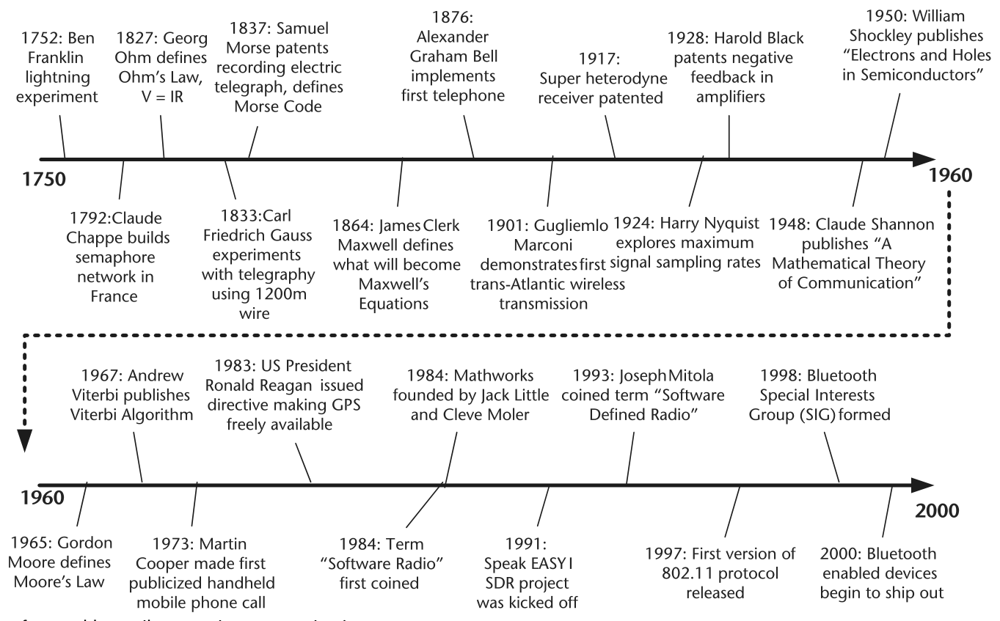
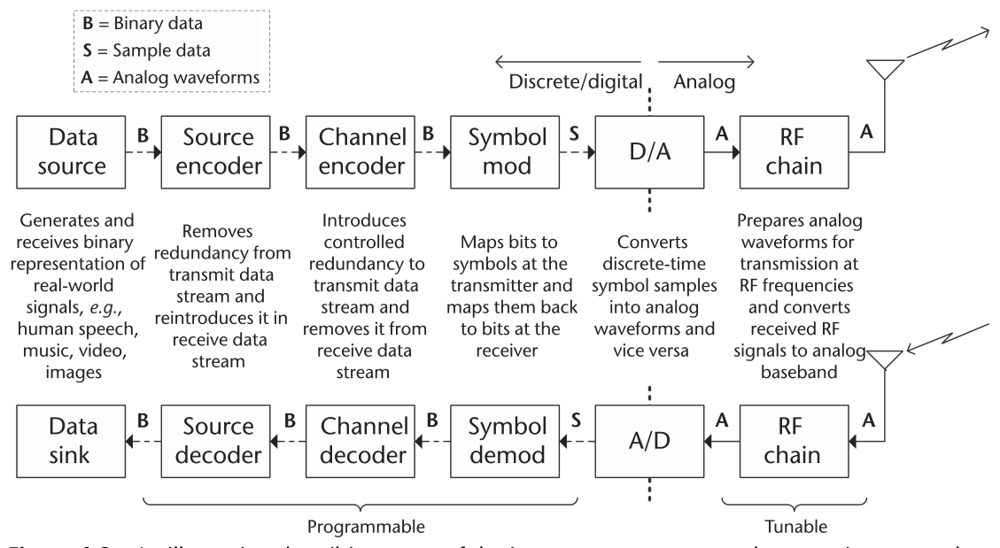
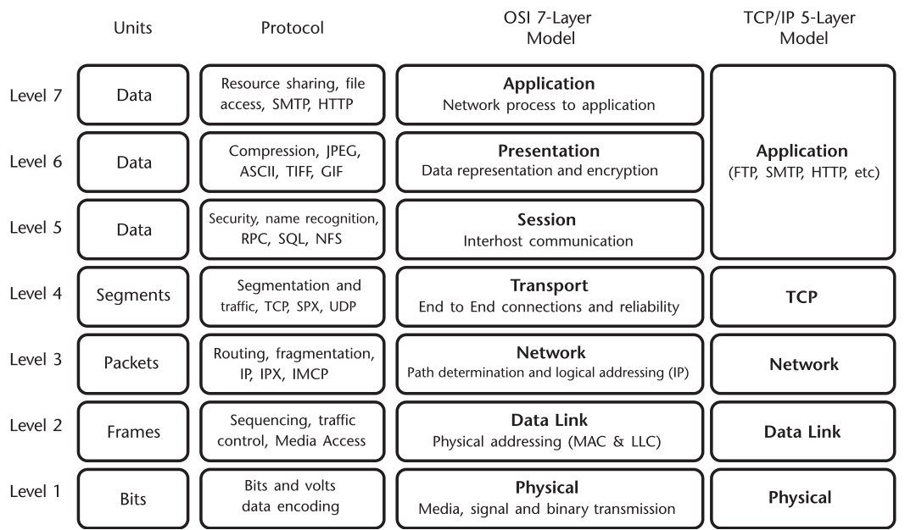
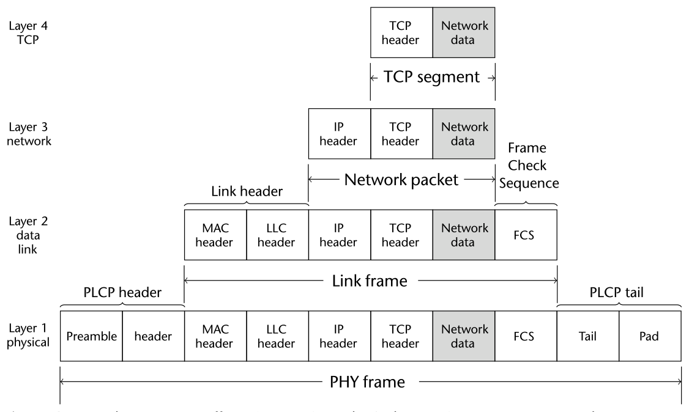
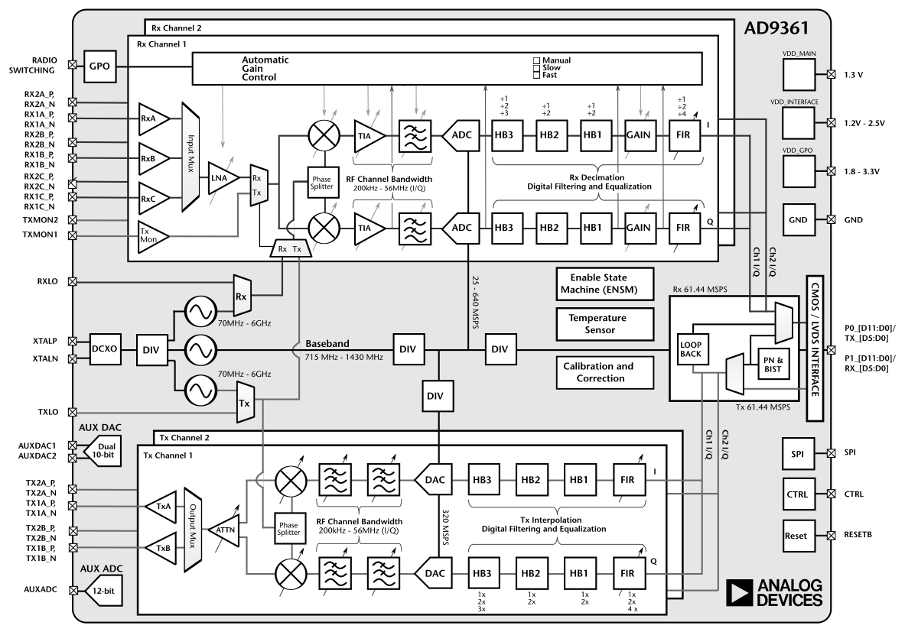

# 第 1 章　软件定义无线电导论

数千年间，人类的通信形式不断演进。口中说出的话语可以从一个人嘴里发出，被另一个人听到或接收。直到现代，各地的街头公告员（town crier）还会举行一年一度的比赛，看谁能在最远的距离上喊出一条听得懂的消息 [1]。然而，"最响公告员"的世界纪录虽然有 112.8 分贝，能被人听懂的距离却不到 100 米。想比喊叫更高效地交流——这个愿望和语言本身一样古老。

随着计算技术、数字信号处理与数字通信算法、人工智能、射频（RF）硬件设计、网络拓扑以及其他众多领域的现代进展，现代通信系统已经演化为复杂、智能、高性能的平台：它们能适应运行环境，实时、无误地传递海量信息。通信系统技术的最新一步，就是软件定义无线电（software-defined radio，SDR）——它吸收各领域的最新成果，打造出终极的发射机与接收机。

## 1.1　简史

SDR 技术背后的这段演进史颇为精彩，图 1.1 给出了过去四个世纪中若干重要里程碑的时间线。这段历史的主旋律，是人们研究想法与概念、发表成果，再让同行与同事在他们的工作之上继续建造。其中许多人把成果变成了商业产品，名利双收；也有一些人两者皆无。与 SDR 技术相关的主要里程碑的完整清单，有兴趣的读者可以参阅附录 A。

## 1.2　什么是软件定义无线电？

每个专业组织都会尝试建立一套通用的术语与定义框架，让从事相似研究或产品开发的专业人士之间便于交流。无线通信与 SDR 领域也不例外。IEEE P1900.1 工作组制定了以下定义，确保领域内的每个人都使用一致的术语 [2]：

**无线电（Radio）**
1. 以无线方式发射或接收电磁辐射、以实现信息传递的技术。
2. 包含定义（1）所述技术的系统或设备。
3. 泛指无线电波的使用。

**无线电节点（Radio Node）**
一个包含无线电发射机或接收机的无线接入点。

**软件（Software）**
由可编程处理设备执行的可修改指令。

**物理层（Physical Layer）**
无线协议中对射频（RF）、中频（IF）或基带信号（含信道编码）进行处理的层。它是 ISO 七层模型针对无线发射与接收改造后的最底层。

**数据链路层（Data Link Layer）**
通过恰当的差错检测与控制流程以及介质访问控制，负责在无线链路上可靠地传输帧的协议层。

**软件控制（Software Controlled）**
指在无线电系统或设备内使用软件处理来**选择**运行参数。

**软件定义（Software Defined）**
指在无线电系统或设备内使用软件处理来**实现**操作功能（而非控制功能）。

**软件控制无线电（Software Controlled Radio）**
部分或全部物理层功能由软件控制的无线电。

**软件定义无线电（Software-Defined Radio, SDR）**
部分或全部物理层功能由软件定义的无线电。

**发射机（Transmitter）**
为进行无线电通信而产生射频能量的装置。

**接收机（Receiver）**
接收无线电信号并从中提取出信息的设备。

**空中接口（Air Interface）**
用于在两个无线电终端之间建立通信的波形功能子集。它是无线物理层与无线数据链路层在波形层面的对应物。

**波形（Waveform）**
1. 施加于待传信息的一组变换，以及将接收信号还原为其信息内容所对应的逆变换集合。
2. 信号在空间中的表示。
3. 已发射射频信号的表示，外加可选的直至全部网络层的其他无线电功能。

数字处理与模拟射频的组合向来是通信系统的构成基础。在现代系统中，信号处理已经发展到这样的程度：大部分基带功能都在软件中实现。射频硬件可被重新调配、重新配置的灵活性，使得一个射频前端就能应对绝大多数射频系统——通常这个射频前端是**软件控制**的，而非软件**定义**的。这种灵活射频前端与软件信号处理的现代组合，催生了软件定义无线电的诞生。

这一点可以从 Analog Devices 的 ADF7030 这类器件中看出来，如图 1.2 所示。ADF7030 是一款低功耗、高性能的集成射频收发机，支持 169.4–169.6 MHz ISM 频段的窄带工作。它使用 2GFSK 调制支持 2.4 kbps 与 4.8 kbps 的收发操作，并使用 4GFSK 调制支持 6.4 kbps 的发射操作。它包含一个片上 ARM Cortex-M0 处理器，负责无线电控制、校准以及分组管理。有了它，再配上一颗传感器，就足以支撑智能抄表或有源标签资产追踪这类应用了。而这只是摩尔定律的一个副产品——系统级集成。

![图 1.2　ADF7030 框图 [3]](images/fig_0102.png)

一套 SDR 系统是个复杂装置，需要同时执行多项复杂任务，才能实现数据的无缝收发。一般而言，数字通信系统由一系列相互依赖的操作组成：取某种信息——无论是人声、音乐还是视频图像——将其经空中接口发射给接收机，再经处理与解码还原为原始信息信号的重建版本。如果原始信息是模拟的（如音频），必须先用量化等技术将其数字化，得到二进制表示。变成二进制之后，发射机对这些信息进行数字处理，将其转换为电磁正弦波形；该波形由其物理特性唯一确定，如信号幅度、载波频率与相位。在通信链路的另一端，接收机的任务是正确识别经可能充满噪声与失真的信道传来的已调波形的物理特性，并最终把截获的信号还原为正确的二进制表示。数字通信系统的基本组成框图见图 1.3。

图 1.3 显示，发射机的输入与接收机的输出分别来自数字信源（digital source）与送往数字信宿（digital sink）。这两个模块代表了待通信数字信息的来源与去处。二进制信息进入发射机后，要做的第一件事是移除信息中所有冗余/重复的二进制模式，以提高传输效率。这由**信源编码器**（source encoder）完成，其设计目标就是剥离信息中的全部冗余。注意在接收机一侧，信源译码器会把冗余重新引入，将二进制信息恢复为原始形态。发射机移除冗余之后，接着由**信道编码器**（channel encoder）向信息流中引入数量受控的冗余，以保护信息在穿越噪声信道的过程中免受潜在差错的影响。信道译码器则负责移除这部分受控冗余，把二进制信息还原回原样。发射机的下一步，是将二进制信息映射为独特的电磁波形属性，如幅度、载波频率与相位。这个映射过程称为**调制**（modulation）。相应地，接收机一侧的**解调**过程把电磁波形转换回对应的二进制表示。最后，调制模块输出的离散采样经重采样后，由数模转换器（DAC）转换为基带模拟波形，再由通信系统的射频前端（RFFE）处理并上变频到射频载波频率。接收机则执行相反的操作：截获的模拟信号先由 RFFE 下变频到基带频率，再由模数转换器（ADC）采样与处理。

考虑到 SDR 平台及其组件的复杂性，理解特定 SDR 平台的限制、以及各种设计决策会如何影响原型系统的性能，是至关重要的。例如，对于频谱感知与捷变发射这类要求高计算吞吐与低时延的操作，人们非常希望有实时基带处理。然而，如果 SDR 平台所采用的微处理器不够强大、无法支撑数字通信系统的运算需求，就必须重新考虑整个收发信机的设计，或降低对低时延高吞吐的要求。否则，SDR 实现将无法正常工作，产生传输差错与糟糕的通信性能。

基于 SDR 平台设计数字通信系统时，需要考虑的设计要点包括：

- 通过在嵌入式处理器上实现实时协议，把物理层与网络层集成起来。注意，大多数通信系统都按逻辑分层（见 1.3 节），以便更容易地设计通信系统；但由于各层之间强烈的相互依赖，每一层都必须被正确设计。
- 确保射频前端具备足够宽的带宽、在多个子信道上的捷变性、以及可扩展的天线数量以进行空间处理。既然许多先进的通信系统设计都用到了多天线与宽带传输，弄清 SDR 硬件在这些物理属性上的能力边界是很重要的。
- 许多采用数字通信系统的网络拥有集中式架构来控制整个网络的运作（例如控制信道的实现）。了解无线网络的架构很重要，因为它决定了一台数字收发信机要与另一台通信时哪些操作是必不可少的。
- 能够在不同环境（如阴影与多径、室内与室外）中进行**受控实验**，对于证明某个 SDR 实现的可靠性很重要。换句话说，如果一个涉及 SDR 原型系统的实验在完全相同的环境、完全相同的运行参数下连续做两次，其输出与性能应当相同。因此，能做受控实验，就为 SDR 设计者提供了一种"健全性检查"的能力。
- 通过面向算法与协议描述的软件设计流程，实现可重配置与快速原型化。

如今许多日常使用的通信系统，已不再使用固定的模拟处理与固定电路，而是采用基于微电子的灵活中频（IF）、数字信号处理器、可编程数字逻辑、加速器以及其他类型的计算引擎来实现。为了利用计算引擎的新进展，人们转而使用 MATLAB® 和 Simulink 这样的高级语言，而非 C 或汇编。计算技术的这一转变，催生了新的通信功能与能力，例如先进的卫星通信、移动通信、数据调制解调器以及数字电视广播。

## 1.3　网络与 SDR

随着数字通信系统演化为高度复杂的设备，人们清楚地认识到：要让这类系统的设计与实现可行且可控，需要分而治之的策略。于是，研究者们把数字通信系统划分为一组互补的层（layer），每一层执行特定的功能，作为整个信息收发过程的一部分。得益于这种分而治之的策略，通信系统迅速演化为能力强大的平台，执行着从网页浏览、电子邮件到流媒体内容的各种业务。这个策略如此成功，以至于出现了只专注于其中一层、完全不碰其他层的研究群体——他们对上下层来的信息照单全收。

一般而言，把通信系统划分为层有两种模型：开放系统互连（OSI）七层模型与传输控制协议（TCP）/网际协议（IP）五层模型，如图 1.4 所示。两个模型的功能大致相同，只是 TCP/IP 模型把最上面的几层合并成了一层。聚焦于 TCP/IP 五层模型，自顶向下依次为：

- **应用层（Application Layer）**：让用户与来自通信系统的数据交互。例如，应用层包含来自或发往网页浏览器、电子邮件客户端、流媒体接口等软件的数据。这些应用通常通过指定的套接字（socket）寻址。
- **传输层（Transport Layer）**：负责在客户端应用与服务器应用之间运送应用层报文，确保可靠的数据传输。
- **网络层（Network Layer）**：负责把网络层分组从一台主机搬到另一台主机。它定义数据报（datagram）的格式、端系统与路由器如何处理数据报，以及数据报在源与目的地之间选取的路由。

- **链路层（Link Layer）**：处理两个或多个直连设备之间的数据交换问题。可靠性方面，它包括差错检测、纠错，以及对不同通信系统的寻址。
- **物理层（Physical Layer）**：把一个个比特从一台通信系统直接送往另一台通信系统。它还涵盖数据发送设备与传输介质之间的物理接口。

从无线电系统及其实现的视角看，系统设计的重心在物理层（本书亦然），但链路层对物理层的影响也不能忘记。不过，既然基带处理全部在软件中完成，通信系统同样可以在软件中实现协议栈的更高层。许多通信标准已经采用了这种方案——整个协议栈所有层的通信系统全部由软件实现，尽管依数据速率要求不同，这可能要求系统具备相当强的计算能力才能实时运行。全软件实现让功能升级无需更换硬件。实践中，这通常只出现在新兴标准或数据速率相对较低的场合。然而，不妨想象一下：给 Wi-Fi 路由器做一次软件升级，就能支持下一代标准，而不必换硬件。这种可软件升级的系统更复杂，成本也可能高于固定硬件系统——但消费者愿意为此多付钱吗？历史给出的答案是否定的。对于那种大批量的消费类应用，价位往往才是产品成败最关键的因素。大多数终端消费者在亚马逊上对比琳琅满目的产品时，并不会考虑长期维护与总拥有成本。哪个功能、哪一层放在固定硬件里做、哪个放在灵活的软件里做，是基于出货量、成本、功耗、复杂度等许多因素的工程决策。

近年来，将 SDR 技术与软件定义网络（SDN）相结合的兴趣日益浓厚——后者关注让更高的通信层去适配当前的运行环境。这使得诸如"依据物理层提供的启发式信息来修改路由"之类的做法成为可能。自愈型网格网络（self-healing mesh network）就是这类实现的一个例子。

链路层同样会影响无线通信系统的物理层（PHY），如图 1.5 所示。以 802.11（Wi-Fi）为例，PHY 层（第 1 层）实际上进一步细分为物理层收敛协议（PLCP）子层与物理介质相关（PMD）子层。PMD 子层负责通过无线介质在两个站点之间收发物理层数据单元，并将其交给 PLCP；PLCP 则向上对接 MAC 层、各管理实体以及通用管理原语，以最大化数据速率。

在 PHY 层，图 1.4 中标注的单位是比特；但穿越无线与有线链路时，这些数据会以更适合模拟传输的形式编码，称为**符号**（symbol）。图 1.5 中第 1 层标出的前导码（preamble），在接收机处多半永远不会按符号形式解调出来。这样的序列只被 PHY 层用来补偿链路中的非理想性，对上面的层几乎没有意义。然而，对用 SDR 做实现的人来说，这些看似简单的部分恰恰是主角，而帧的其余部分不过是任意数据。

## 1.4　SDR 的射频架构

下一代通信系统带来了新的挑战，其解决方案已超出单器件优化的范畴。向无线电注入更多软件控制与认知能力，要求射频设计在频率与带宽上更加灵活。为此，需要把静态滤波器去掉、换成可调谐滤波器。类似地，"通用平台"的概念可以缩短开发时间、降低制造成本，并让系统之间具备更好的互操作性。通用平台要求射频系统能为那些传统上架构迥异的应用同时提供完整性能。最后，未来的平台正把尺寸与功耗推到新的极限：手持电台越来越强、越来越复杂，却同时要求更好的电池效率；小型无人机（UAV）没有大型飞机的发电能力，射频系统每消耗一毫瓦，都直接换算成载荷电池的重量，进而缩短续航时间。为克服这些挑战、打造下一代航空航天与防务方案，人们正在发展新的无线电架构。

自诞生以来，超外差（superheterodyne）架构一直是无线电设计的基石。无论是手持电台、无人机数据链，还是信号情报接收机，单级或双级混频的超外差架构都是常见选择（见图 1.6）。这种设计的好处显而易见：恰当的频率规划可以把杂散发射压得很低；信道带宽与选择性由中频（IF）滤波器决定；各级之间的增益分配，则让设计者可以在噪声系数与线性度之间做折中。

![图 1.6　多级超外差接收与发射信号链 [4]](images/fig_0106.png)

在使用了一百多年之后（更多信息见附录），超外差架构在整条信号链上的性能都获得了巨大提升。微波与射频器件在降低功耗的同时提升了性能；ADC 与 DAC 的采样率、线性度和有效位数（ENOB）不断提高；FPGA 与 DSP 的处理能力跟随摩尔定律与日俱增，支撑起更高效的算法、数字校正与更深度的集成；封装技术在提高引脚密度的同时改善了散热。然而，这些器件层面的改进正开始进入收益递减的阶段。尽管射频器件整体上遵循着缩减尺寸、重量与功耗（SWaP）的趋势，高性能滤波器却依然体积庞大，且往往是定制设计，推高了系统总成本。此外，IF 滤波器决定了平台的模拟信道带宽，使得难以做出能跨多种系统复用的通用平台设计。就封装技术而言，大多数产线不会做到低于 0.65 mm 或 0.8 mm 的球间距，这意味着引脚数众多的复杂器件在物理尺寸上存在下限。

超外差架构的一个替代方案——零中频（zero-IF, ZIF）架构——近年来重新回到人们视野，成为一种潜在的解决方案。ZIF 接收机（见图 1.7）采用单级频率混频，将本振（LO）直接设为感兴趣的频段，把接收信号直接搬移到基带，输出同相（I）与正交（Q）信号。这种架构缓解了超外差严苛的滤波要求，因为所有模拟滤波都发生在基带——基带滤波器的设计比定制射频/中频滤波器容易得多、也便宜得多。ADC 与 DAC 此时处理的是基带 I/Q 数据，相对于被转换带宽而言采样率可以降低，显著节省功耗。在许多设计方面，得益于模拟前端复杂度与器件数量的减少，ZIF 收发信机带来了可观的 SWaP 缩减。

![图 1.7　零中频架构 [4]](images/fig_0107.png)

这种直接变频到基带的做法，可能引入载波泄漏与镜像频率分量。由于信号链中工艺偏差与温度差异等现实因素，I 与 Q 信号之间不可能维持完美的 90° 相位差，导致镜像抑制性能恶化。此外，混频级中本振隔离的不完美会引入载波泄漏分量。若不加校正，镜像与载波泄漏会恶化接收机灵敏度，并在发射时产生不合要求的频谱发射。

历史上，I/Q 失配曾把 ZIF 架构的适用范围限制得很窄。原因有二：其一，分立器件实现的 ZIF 架构中，单片器件之间以及 PCB 本身都会引入失配；而且单片器件可能来自不同批次，固有的工艺波动让精确匹配异常困难。其二，分立实现中处理器与射频器件物理上分离，使得正交校正算法很难在频率、温度与带宽的整个范围内实施。

摩尔定律——或者说把 ZIF 架构集成进单片收发信机器件——为下一代系统指明了出路。把模拟与射频信号链放在同一块硅片上，工艺波动就被控制在最小范围。数字信号处理（DSP）模块可以并入收发信机内部，消除正交校准算法与信号链之间的边界。这一途径既带来了 SWaP 上无可匹敌的改善，又能在性能指标上与超外差架构平起平坐。

图 1.8 所示的 Pluto SDR 这类器件，把完整的射频、模拟与数字信号链集成到单个 CMOS 器件上，并包含数字处理电路，在全过程的工艺、频率与温度变化下实时运行正交与载波泄漏校正。AD9361 这类器件聚焦中等性能指标与极低功耗，适用于无人机数据链、手持通信系统与小尺寸 SDR 应用。AD9371 则为高性能指标与中等功耗做了优化。此外，AD9371 还具备精细的校准控制、用于功率放大器（PA）线性化的观测接收机、以及用于空白频段检测的嗅探接收机。这为另一类应用打开了新的设计空间：使用宽带波形或占用非连续频谱的通信平台，现在可以做得小巧得多。

## 1.5　SDR 的处理架构

过去六十年，微电子产业飞速演进，微处理器系统的无数进步支撑起了我们如今习以为常的大量应用。这一演进的速度长期由著名的摩尔定律刻画——它定义了集成电路可容纳晶体管数量的长期趋势：单块集成电路上的晶体管数量大约每两年翻一番，并进而影响微处理器系统的处理速度与内存等性能。过去半个世纪中，微电子产业产生深远影响的一个领域就是数字通信系统：微处理器系统被越来越多地用于数字收发信机的实现，造就了更通用、更强大、更便携的通信系统平台，能够执行越来越多的先进操作与功能。随着微电子与微处理器系统的最新进展，软件定义无线电（SDR）技术应运而生——基带无线电功能可以完全用数字逻辑与软件实现，如图 1.3 所示。用于 SDR 实现的微处理器系统有好几种类型，包括：

- **通用微处理器**常用于 SDR 实现与原型开发，因为它们在可重配置性上非常灵活，实现新设计也容易。另一方面，通用微处理器并非为数学计算专门优化，功耗效率可能不佳。
- **数字信号处理器（DSP）**专为数学计算而生，新数字通信模块的实现相对容易，功耗效率也相对较好（例如手机中就在用 DSP）。但 DSP 不太擅长计算密集型任务，速度可能相当慢。
- **现场可编程门阵列（FPGA）**非常适合定制化的数字信号处理应用，因为它们可以实现定制的、全并行的算法。DSP 应用会用到大量二进制乘法器与累加器，它们可以用专用的 DSP 切片（slice）实现，如图 1.9 所示。这包括 25×18 位二补码乘法器、48 位累加器、省电预加器，以及单指令多数据（SIMD）算术单元——后者支持双 24 位或四 12 位的加/减/累加。MathWorks HDL Coder 这类工具让创建新模块、部署 FPGA 变得更容易：它可以从 MATLAB 函数、Simulink 模型与 Stateflow 图生成可移植、可综合的 Verilog 与 VHDL 代码，非常适合把信号处理算法从概念推向量产。

![图 1.9　DSP48E1 切片的基本功能 [5]](images/fig_0109.png)

- **图形处理器（GPU）**计算能力极其强大。大众市场游戏对实时计算机图形的需求，把这些处理器推到了很高的性能水平与很低的价位。过去十年间，GPU 已演化为通用可编程架构及配套生态，使其能够胜任大范围的非图形应用 [6]。Nvidia 等厂商提供的 GPU 加速库，提供了比纯 CPU 方案快 2 到 10 倍的高度优化函数。面向线性代数、信号处理与图像视频处理的 GPU 加速库，为未来的软件定义无线电应用运行在这类架构上奠定了基础 [7]。
- **精简指令集机器（ARM）**近年来因其低成本、小尺寸、低功耗与不俗的计算能力而备受关注。这类处理器与一个像样的 RFFE 相组合，就构成了适合移动通信与移动计算的平台。ARM 为 Cortex-A 系列与 Cortex-R52 处理器新增的 SIMD 指令集（称为 NEON [8]）可加速信号处理算法与函数，让软件定义无线电应用跑得更快。

对算法开发者而言，这是个激动人心的时代：在硬件上实现信号处理应用的新方法、高级方法层出不穷。难点在于确保无论选择哪种硬件来跑算法，该硬件与开发方法论在五年后仍有人支持。

## 1.6　SDR 的软件环境

如 1.2 节所述，大多数商用 SDR 平台在最基础的层面上，是把实时射频信号变换为数字基带采样，再用软件定义的调制解调机制来传递真实世界的数据。回看图 1.3：通信系统中模拟世界与数字世界的边界位于 ADC 与 DAC 处，信号信息在那里于连续信号与离散采样值之间转换。通常，电台可以配置中心频率、采样率、带宽等参数，来收发感兴趣的信号。剩下的就是调制解调技术本身了，它们通过两步的开发流程来研制：

1. **针对特定的采样率、带宽与环境，开发、调优并优化调制解调算法。**这通常在主机 PC 上完成，因为调试与可视化都容易得多。在开发的这个阶段，射频前端的调制解调都在主机上进行，为算法想法的实验与测试提供了极大的灵活性。
2. **把上述可能是用高级语言、以浮点写成的算法，移植到可量产的环境里编码实现**，并围绕产品的尺寸、重量、功耗与成本（SWaP-C）做出量产折中。当板载硬件与嵌入式处理器被编程为执行特定应用的数字通信与信号处理功能时，这些平台才是真正"软件定义"的。

本书只专注于 SDR 开发流程的第一步（算法步骤），但纵观整个开发流程时，第二步（量产步骤）绝不能被排除在外。除非你的目标只是发一篇论文、从没有做出能工作的原型的打算，否则就必须把完整的开发流程记在心里。

第一步需要一种便捷的机制来采集数据，用于信号分析以及开发处理这些信号的算法。因此，拥有高效可靠的 PC 端软件，来开发与测试无线通信系统中的数据传输和数字信号处理功能，是至关重要的。

满足这一要求的一个软件环境是 MathWorks 的 MATLAB。MATLAB 是一个技术计算环境与编程语言，开发上手容易，可视化机制出色。附加产品 Communications System Toolbox（通信系统工具箱）则补充了物理层算法、信道模型、参考模型，以及连接 SDR 硬件收发实时信号的能力。MATLAB 是跨平台的（Windows、Linux、macOS），支持许多流行的商用射频前端。使用 MATLAB 可以形成一条渐进迭代的 SDR 开发工作流：

- 通过链路级仿真进行算法开发与设计验证；
- 连接商用 SDR 硬件，用实时信号对算法进行验证。

MathWorks 还提供 Simulink——一个面向真实系统仿真与软硬件自动代码生成的环境。它让无线电开发者得以延续到量产开发的第二阶段。Simulink 的这些能力提供了一条通往量产的路径：

- 开发并验证一个硬件级精确的模型；
- 用自动 HDL 与 C 代码生成，在 SDR 硬件上实现原型；
- 将原型与已验证模型进行比对验证；
- 把实现部署到量产 SDR 硬件上。

尽管本书基本上不会用到 Simulink，但对于想做出真正量产无线电的人来说，能拥有一个从概念贯穿到量产的单一环境，威力巨大，不应忽视。

另一种流行的 SDR 软件架构是开源的 GNU Radio 软件 [9]。它是一个自由（free as in freedom）软件开发工具包，提供实现软件定义无线电与信号处理系统的信号处理模块。它可以配合外部射频硬件组成软件定义无线电，也可以脱离硬件、在仿真环境中使用。它在爱好者、学术界与工业界都被广泛用于无线通信研究和真实世界的无线电系统。

在 GNU Radio 中，大量用 C++ 库实现的数字通信与数字信号处理算法，通过 Python 与 SWIG（一个把 C/C++ 程序与 Python 等多种高级语言连接起来的软件开发工具）整合在一起。这些库由开源社区产出，向所有人自由共享。

本书作者在科研、产品开发以及本科生与研究生课程教学中用过 MATLAB、Simulink 与 GNU Radio 等多种工具。每种工具各有优劣，适用于研发周期的不同阶段。作者们相信：各种软件环境既可以被用对、也可以被用错地来教授无线物理层基础，只是各工具的前置要求不同。对选择 GNU Radio 路线的人来说，需要熟练掌握 Linux、Python、C++ 与 SWIG——门槛相当高。这对计算机专业的学生很平常，对大多数通信专业的学生却不然：要求某人在学通信理论的同时还去学工具，会很吃力。当然，GNU Radio 里可以用现成模块，绕开理解 Python 与 C++ 的要求，但这样一来，演示与实验通信基础理论的许多机会也就丢掉了——因为学生只是用了一个别人写的模块，并不明白它在做什么。Simulink 也一样：它是非常强大的工具，有大量现成的定时恢复与载波同步模块。然而，用这些模块并不能让多数学生理解模块内部发生了什么，于是学生也就难以理解如何针对自己的情形去调这些模块。

**这正是本书选择 MATLAB 的原因。**它是一个跨平台环境，学生可以用自己熟悉的工具；而且本书给出的所有"模块"都是 MATLAB 脚本，没有任何隐藏。学生若想更深入地理解某处，整个算法就写在 MATLAB 代码里，没有任何东西会遮挡通信理论本身。

## 1.7　延伸阅读

本章只是对不断扩张的 SDR 技术领域做了简要介绍，公开文献中还有几本书能提供更详尽的视角。例如，Reed 的书全面覆盖了 SDR 平台软件架构的诸多议题 [10]；建造 SDR 硬件原型及其射频前端的许多设计考量与方法，则见之于 Kensington 的书 [11]。关于 SDR 系统硬件实现的另一部优秀参考书来自 Grayver [12]。此外，理解模数分界的重要性、以及 SDR 系统如何跨越这道分界，是 Machado 与 Wyglinski 论文的主题 [13]。最后，IEEE Communications Magazine 上有一组出色的论文，覆盖 SDR 技术的最新进展，并对它自二十年前以来的演进给出了一些透视 [14, 15]。

## 参考文献

[1] American Guild Of Town Criers Website, 1997. http://www.americantowncriers.com/.

[2] IEEE Project 1900.1 — Standard Definitions and Concepts for Dynamic Spectrum Access: Terminology Relating to Emerging Wireless Networks, System Functionality, and Spectrum Management. https://standards.ieee.org/develop/project/1900.1.html.

[3] Analog Devices ADF7030. http://www.analog.com/ADF7030

[4] Hall, B., and W. Taylor, "X- and Ku-Band Small Form Factor Radio Design." http://www.analog.com/en/technical-articles/x-and-ku-band-small-form-factor-radio-design.html.

[5] Xilinx Inc., "7 Series DSP48E1 User Guide," UG479 (v1.9), September 27, 2016. https://www.xilinx.com/support/documentation/user_guides/ug479_7Series_DSP48E1.pdf

[6] McCool, M., "Signal Processing and General-Purpose Computing on GPUs," IEEE Signal Processing Magazine, Vol. 24, No. 3, May 2007. http://ieeexplore.ieee.org/document/4205095/.

[7] Nvidia, "GPU-accelerated Libraries for Computing." https://developer.nvidia.com/gpu-accelerated-libraries.

[8] ARM NEON. https://developer.arm.com/technologies/neon.

[9] GNU Radio, "Welcome to GNU Radio!" http://gnuradio.org/.

[10] Reed, J. H., *Software Radio: A Modern Approach to Radio Engineering*, Upper Saddle River, NJ: Prentice Hall PTR, 2002.

[11] Kensington, P., *RF and Baseband Techniques for Software Defined Radio*, Norwood, MA: Artech House, 2005.

[12] Grayver, E., *Implementing Software Defined Radio*, New York: Springer-Verlag, 2012.

[13] Machado, R. G., and A. M. Wyglinski, "Software-Defined Radio: Bridging the Analog–Digital Divide," *Proceedings of the IEEE*, Vol. 103, No. 3, March 2015, pp. 409–423.

[14] Mitola, J., P. Marshall, K. C. Chen, M. Mueck, and Z. Zvonar, "Software Defined Radio — 20 Years Later: Part 1 [guest editorial]," *IEEE Communications Magazine*, Vol. 53, No. 9, September 2015, pp. 22–23. http://ieeexplore.ieee.org/document/7263341/.

[15] Mitola, J., P. Marshall, K. C. Chen, M. Mueck, and Z. Zvonar, "Software Defined Radio — 20 Years Later: Part 2 [guest editorial]," *IEEE Communications Magazine*, Vol. 54, No. 1, January 2016, p. 58. http://ieeexplore.ieee.org/stamp/stamp.jsp?arnumber=7378426.
