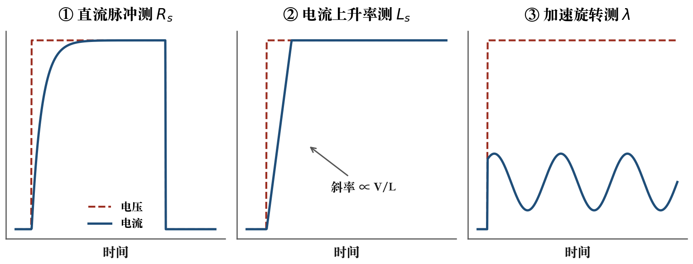

# 第 3 章　软件开发环境

> **核心命题**　STM32 电机控制的软件栈分两层：通用开发工具（CubeMX + 任一 IDE）负责把芯片跑起来，电机专用工具（MC Workbench / Motor Profiler / ST MC Monitor）负责把电机转起来。本章把两类工具的定位、安装与基本操作讲清楚，第 7、8 章的实验将直接使用本章搭好的环境。

---

## 3.1　开发环境概述

先建立全局图景，再逐个安装。围绕 P-NUCLEO-IHM03 的开发工具按角色分四类：

1. **代码配置与生成**：STM32CubeMX——图形化配置外设/时钟/引脚，生成初始化代码；
2. **编译 / 烧录 / 调试**：任选其一——STM32CubeIDE（免费一体化的官方推荐）、Keil MDK-ARM、IAR EWARM；
3. **电机控制专用**：X-CUBE-MCSDK 包里的三件套——MC Workbench（图形化配置电机工程并生成代码）、Motor Profiler（自动测量电机参数）、ST MC Monitor（运行时监控调参）；
4. **简易实时观测**：STM Studio（读取固件变量画曲线，现已被 STM32CubeMonitor 系列取代，但 5.x 时代文档大量基于它）。

各工具之间的数据流如下：MC Workbench 从电机参数（由 Motor Profiler 测得或手工输入）和板卡信息出发生成完整工程 → 在 IDE 里编译烧录 → 电机运行时用 MC Monitor / STM Studio 观察、调参。


**最小安装组合建议**：STM32CubeIDE + X-CUBE-MCSDK 全包，两个安装包解决全部需求。

## 3.2　STM32CubeMX

### 3.2.1　下载和安装

CubeMX 是免费的 Java 桌面应用：在 st.com 注册账号 → 搜索 STM32CubeMX → 下载对应操作系统的安装包（Win 下为 exe 安装器，macOS 为 dmg）。它也内嵌在 CubeIDE 里（IDE 内即叫 "CubeMX 透视页"）。首次启动会提示下载各系列的固件包，勾选 STM32G4 系列即可。

### 3.2.2　工具界面

CubeMX 四大功能区：

- **Pinout & Configuration**：中间是芯片引脚图，点击引脚选择复用功能；左侧树形列出 MCU 所有外设——配置 TIM1、ADC、GPIO 都在这里；
- **System Core → Clock Configuration**：时钟树图形化配置，从 HSI/PLL 一路到内核与外设频率，非法配置会红字提示；
- **System Core → SYS / GPIO**：调试接口、中断优先级（NVIC）配置；
- **GENERATE CODE**：按所选 IDE 生成工程，用户代码写在生成的注释对（如 `/* USER CODE BEGIN 4 */`）之间，重新生成时保留。

第 4 章的基础实验全部走 "CubeIDE 内建 CubeMX 配置 → 生成 → 补用户代码” 的流程。

## 3.3　STM32CubeIDE

### 3.3.1　下载和安装

st.com 免费下载（注册后取 license-free 安装包），Windows/macOS/Linux 均有。安装后第一次启动时在组件安装向导里同样勾选 STM32G4 固件包。

### 3.3.2　工具界面

CubeIDE 是基于 Eclipse 的集成环境：

- **工程管理器**（左）：源码树，自动按 CubeMX 生成的结构组织；
- **编辑器**（中）：C 编辑器，带语法补全；
- **CubeMX 透视页**（内嵌）：不离开 IDE 完成外设配置；
- **调试透视页**：ST-LINK 连接后的断点/单步/变量观察（含实时变量图表 SVD 视图）。

**新建一个点灯工程的完整流程**（第 4.1 节的预演）：File → New STM32 Project → 选板卡 NUCLEO-G431RB（TAB "Board Selector"）→ 工程名 → 在 CubeMX 页把 PA5 设为 GPIO_Output → 生成代码 → 在 `main.c` 的 while 循环里写翻转语句 → 点 Run 烧录。全程约五分钟。

## 3.4　Keil（MDK-ARM）

### 3.4.1　下载和安装

Keil MDK 是商业工具（有代码规模受限的免费 Lite 版）：keil.com 下载 MDK 安装，安装完成后在 Pack Installer 里安装 `STMicroelectronics STM32G4 Series Device Support`（DFP 包）与 ST-Link 驱动。

### 3.4.2　操作简介

MDK 的典型流程：MC Workbench 生成工程时选择 MDK-ARM V5 → 得到 `.uvprojx` 工程 → 打开后 Configure → Debug 里选 ST-Link → Flash → Download 烧录。MDK 的仿真器（Logic Analyzer 观察全局变量）在做电流环行为分析时很好用。本书截图与步骤以 CubeIDE 为主，MDK 用户在生成工程时选择对应目标即可，源码完全一致。

## 3.5　IAR EWARM

### 3.5.1　下载和安装

IAR Embedded Workbench for Arm 是商业工具，iar.com 提供限期全功能评估版。安装后需在 IAR 的包管理里安装 STM32G4 设备支持。

### 3.5.2　操作简介

同样由 MC Workbench 生成 IAR 工程（.ewp），打开 → Project → Download and Debug。IAR 的静态分析与代码体积报告在工程化时用得上，学习阶段与 CubeIDE 无本质差别。

## 3.6　MotorControl Workbench（MC SDK）

### 3.6.1　下载和安装

X-CUBE-MCSDK 是一个整体包（st.com 搜索 X-CUBE-MCSDK），安装后同时得到：

- **MC Workbench**：桌面 GUI 配置工具；
- **Motor Profiler**：电机参数自辨识工具；
- **ST MC Monitor**：监控 GUI；
- **MC SDK 固件库**：FOC / 六步控制的 C 中间件源码（作为 CubeMX 扩展包安装到 IDE）。

5.x 系列的最后一个大版本是 5.4.x（其后由 6.x 接棒，界面与观测器有升级但概念一致）。本书按 5.x 讲——套件时代的教学资料与论坛存量答案大多基于 5.x，且 5.x 对 P-NUCLEO-IHM03 的支持最直接。

### 3.6.2　操作简介

MC Workbench 的核心是一个工程向导，从 "New Project" 开始依次：

1. **选控制板/套件**：下拉选择 P-NUCLEO-IHM03（或分别选 NUCLEO-G431RB + IHM16M1）——选定后电流检测拓扑、引脚映射、采样定标全部自动填好；
2. **电机参数页**：填极对数（7）、最大电流、相电阻、相电感、反电动势常数——这些可以先用 Motor Profiler 实测再回填（见 3.6.3）；
3. **电流检测**：Three-shunt（IHM16M1 默认）；
4. **控制策略页**：FOC 或 Six-Step；无感（STO 观测器）或有感（霍尔/编码器）；速度/转矩模式；
5. **PWM 频率与高级参数**：入门保持默认（如 FOC 默认 PWM 频率由工具按板卡给出）；
6. **生成工程**：选目标 IDE（CubeIDE / MDK / IAR / GCC Makefile）→ Generate。

生成物是一个完整可编译的工程：`main()` 里初始化电机控制栈，包含应用 API 头文件 `mc_api.h`。第 7 章第一节会把这个流程完整走一遍。

### 3.6.3　使用 ST Motor Profiler 获得电机参数

Motor Profiler 解决"手上只有电机、没有参数表"的冷启动问题。把套件连好，打开 Motor Profiler：

1. 选择板卡（P-NUCLEO-IHM03）与目标电机驱动；
2. 点击 Start Profile，工具先向电机注入测试激励，随后自动加速旋转；
3. 结束后给出测得的：**定子电阻 Rs、定子电感 Ls、磁链 λ（或等效反电动势常数）、极对数、转动惯量 J、摩擦系数 F**（视版本略有差异）；
4. 把这些数值填回 MC Workbench 的电机参数页，重新生成工程。

它的测量原理并不神秘（示意如图 3.2）：

- **测电阻**：施加已知的低压直流脉冲，稳态电流由 $I = V/R_s$ 反解电阻；
- **测电感**：观察电压阶跃后电流的初始上升率，由 $L_s = V / (\mathrm{d}i/\mathrm{d}t)$ 得到；
- **测磁链**：电机被拖到稳定高速时，反电动势占主导，从电压方程里把 $\lambda_f$ 解出来；
- **测惯量/摩擦**：分析自由减速段的转速衰减率。



第 6.2.5 节会从理论上解释这些步骤各自对应电机模型的哪一项——工具只是把"万用表 + LCR 表 + 对拖台"的古典流程自动化了。

### 3.6.4　ST MC SDK 5.x 固件

5.x 固件库的目录树（CubeMX 扩展包形式装在工程里）大致为：

```text
Middlewares/ST/STM32_Motor_Control_SDK
├── api/            mc_api.c/h —— 应用层公共 API（第 7.6 节速查表）
├── mc_core/        FOC 内核：Clarke/Park/PI/SVPWM 的定点/浮点实现
├── mclib/          观测器（STO）、速度环、保护状态机
├── mc_config/      MC Workbench 生成的参数与板级映射
└── ...             PWM/ADC 驱动适配层
```

分层结构与应用层 API 的详细解读放在第 7.1 节（图 7.1），此处只需建立印象：**用户代码只应调用 `mc_api.h` 暴露的函数，不要绕过 API 直接戳中间件内部**——这保证了将来升级 SDK 或换板卡时代码仍然成立。

## 3.7　STM Studio

### 3.7.1　下载和安装

STM Studio 是老牌的运行时变量监视工具（st.com 免费下载，Windows 平台）。安装后在固件工程里启用 ST-LINK 变量读写（SWD 在线读写 RAM 全局变量，不干扰运行）。

### 3.7.2　操作简介

典型用法：新建工程 → Import 固件的 axf/elf → 勾选要观察的全局变量（如速度、iq 电流）→ 以 1 kHz 级采样率画曲线 → 保存配置。电机调试中"看波形定问题"是核心手段：启动失败看 iq 是否爬升、速度抖动看观测器收敛性、过流看相电流尖峰。

**时效说明**：ST 已用 STM32CubeMonitor（及 MC SDK 6.x 内置的 MC Monitor）取代 STM Studio，功能是超集（还可接串口协议）。本书记述 STM Studio 是因为原书目录与 5.x 时代教程均以它为准；读者完全可以直接用新版工具，操作思想完全一致：**把固件里的变量变成 PC 上的实时曲线**。

## 本章小结

- 通用栈：CubeMX（配置）+ IDE（编译调试），推荐直接用 CubeIDE 一体化；
- 电机栈：MC Workbench（生成工程）、Motor Profiler（测 Rs/Ls/λ/J/F）、MC Monitor 或 STM Studio（运行监控）；
- Motor Profiler 的输出直接决定 FOC 参数质量——每次换电机都应重新 Profile；
- 用户代码只调用 `mc_api.h` 的公共 API，不碰中间件内部。

## 本章参考

- ST 官网：STM32CubeMX / STM32CubeIDE / X-CUBE-MCSDK 产品与文档页
- X-CUBE-MCSDK 5.4.x Release Notes（工具组成与版本）
- Motor Profiler 用户文档（随 SDK 安装）
