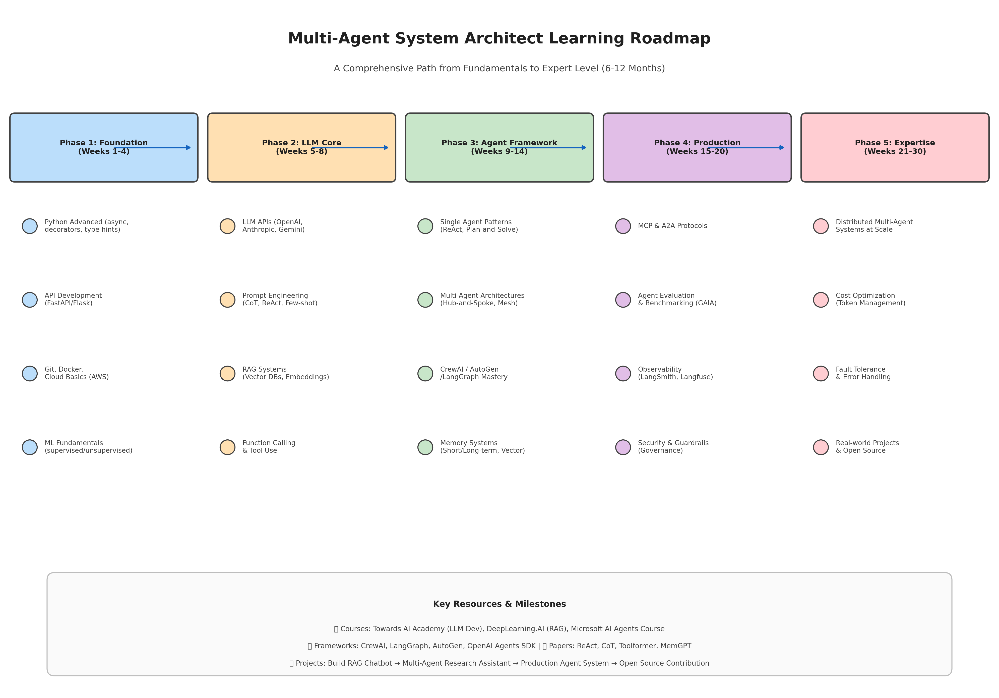
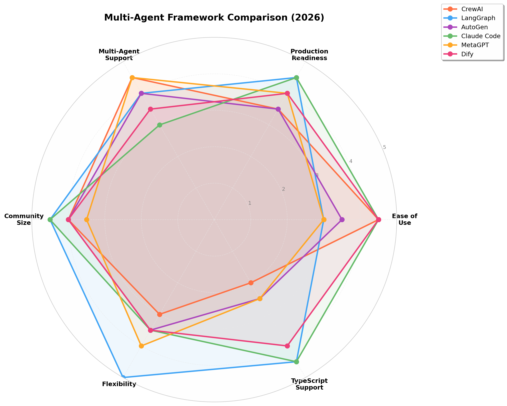
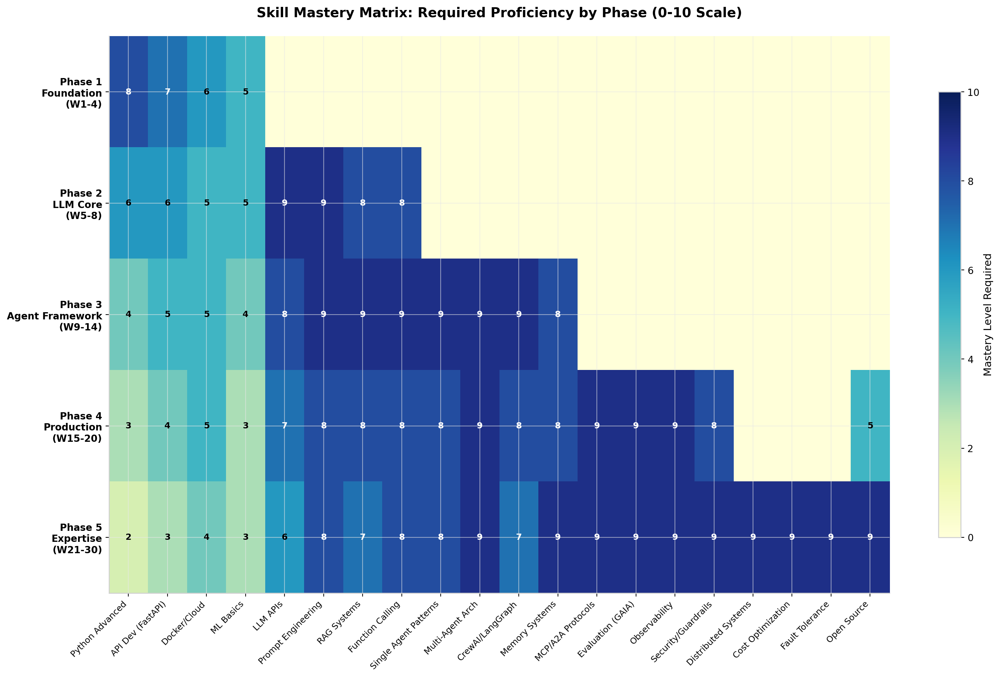

# Multi-Agent System Architect: A Comprehensive Learning Roadmap and Technical Guide

## TL;DR

This report presents a structured, evidence-based learning path for becoming a **Multi-Agent System (MAS) Architect** — one of the most in-demand roles in AI engineering for 2025-2026. The global Agentic AI market is projected to reach **$98.26 billion by 2033** (CAGR 46.87%) [^76^], with **40% of enterprise applications** expected to embed task-specific AI agents by end-2026 [^7^]. MAS Architects command salaries ranging from **$180,000 to $400,000+** in the US market, with Agentic AI workflow specialists earning **25-35% above** generalist AI engineers [^14^].

The roadmap outlined here spans **five phases over 6-12 months**: (1) **Foundation** (Python advanced, API development, Docker/Cloud, ML basics); (2) **LLM Core** (LLM APIs, Prompt Engineering, RAG, Function Calling); (3) **Agent Framework** (Single/Multi-Agent patterns, CrewAI/LangGraph/AutoGen, Memory systems); (4) **Production** (MCP/A2A protocols, Evaluation with GAIA benchmarks, Observability with LangSmith, Security/Guardrails); (5) **Expertise** (Distributed MAS at scale, Cost optimization, Fault tolerance, Real-world projects). Each phase includes specific skills, recommended courses, hands-on projects, and milestone deliverables. The three dominant production architecture patterns are **Hub-and-Spoke** (orchestrator-worker, 2-5s latency), **Flat Mesh** (peer-to-peer, high fault tolerance), and **Hierarchical** (tree-structured, for enterprise workflows) [^7^].

---

## 1. Understanding Multi-Agent Systems: Core Concepts and Architecture Patterns

A **Multi-Agent System (MAS)** is a framework where multiple autonomous AI agents, each with specialized roles, tools, and capabilities, coordinate within a shared environment to accomplish tasks beyond any single agent's scope [^7^]. Unlike single-agent systems that handle all tasks sequentially within one context window, MAS distributes work across specialized agents running in parallel, enabling the tackling of complex, multi-domain problems with greater precision and reliability. However, this power comes with trade-offs: Google research found that coordination overhead can reduce performance by **39-70%** on sequential reasoning tasks, which means matching the architecture to the task type is a critical architectural decision [^7^]. The global MAS market is projected to reach **$184.8 billion by 2034**, reflecting the massive enterprise adoption underway [^7^].

The effectiveness of any MAS hinges on three core mechanics: **task decomposition and delegation**, where the system breaks high-level requests into manageable sub-tasks; **communication protocols**, which standardize how agents exchange information and refine outputs; and **shared memory and context**, acting as a "single source of truth" that prevents agents from repeating work or losing track of the primary objective [^9^]. These mechanics are instantiated through specific architecture patterns, each with distinct trade-offs across control, fault tolerance, debugging complexity, and latency.

### 1.1 The Three Dominant Architecture Patterns

After analyzing production implementations cataloged in the AgentsIndex directory, **Hub-and-Spoke** emerges as the most common pattern in production environments in 2026, appearing in the overwhelming majority of implementations [^7^]. A structured evaluation across six criteria — task independence, fault tolerance requirements, debugging capacity, latency budget, team operational maturity, and workflow adaptability — reveals why most teams default to this pattern unless specific requirements justify alternatives [^7^].

| Architecture Pattern | Control Level | Fault Tolerance | Debugging | Latency | Best For |
|---|---|---|---|---|---|
| **Hub-and-Spoke** | High (centralized) | Low (single point of failure) | Easy | 2-5s per task | Independent subtasks, customer support triage, code generation |
| **Flat Mesh** | Low (emergent) | High (no central node) | Complex | Variable | Open-ended exploration, simulation, adaptive workflows |
| **Hierarchical** | Medium (layered) | Medium | Moderate | Higher (multi-tier) | Enterprise workflows with distinct domains, QA pipelines |

**Table 1: Comparison of the three dominant MAS architecture patterns** [^7^] [^98^]

**Hub-and-Spoke (Orchestrator-Worker)** represents the most prevalent production pattern. A central orchestrator agent acts as the hub, decomposing the user's goal into subtasks, routing each subtask to a specialized worker agent, and aggregating results. Workers do not communicate with each other; all coordination flows through the orchestrator. This creates a single traceable control flow, which makes debugging comparatively straightforward. Production latency runs **2-5 seconds per task delegation cycle** [^7^]. The orchestrator quality is the most critical design decision in any MAS — a flawed task decomposition causes the entire pipeline to fail regardless of how capable individual workers are [^7^]. This pattern is implemented in LangGraph (supervisor pattern), AutoGen (group chat with selector), CrewAI (manager mode), and the OpenAI Agents SDK. Centralized coordination offers easier conflict detection since everything flows through one point, but that same single point of failure creates a reliability liability [^98^].

**Flat Mesh (Peer-to-Peer)** enables agents to communicate directly with each other without a central coordinator. Coordination emerges from interaction protocols and shared state rather than top-down direction. This creates high fault tolerance (no single point of failure) and maximum flexibility, but at a real cost: observability. Debugging a complex flat-mesh workflow requires tracing across every agent pair, which is why this pattern is far less common in production in 2026 than hub-and-spoke [^7^]. CAMEL-AI is a well-documented example of a peer-to-peer multi-agent framework. Decentralized approaches provide greater robustness through redundancy — the system degrades gracefully — but emergent behavior creates unpredictability that requires LLM judges with rubrics rather than exact output matching [^98^]. This pattern suits open-ended exploration and scenarios where the coordination structure itself needs to adapt at runtime.

**Hierarchical** implements a tree structure where manager agents delegate to specialist agents, who in turn delegate to worker agents. Multiple layers allow domain expertise at each tier. A top-level manager understands the business objective; mid-tier specialists handle their domain (legal, financial, technical); workers execute atomic operations [^7^]. This architecture handles enterprise workflows that require genuine subject-matter expertise at each layer and cannot be flattened into a two-tier hub-and-spoke model. Hierarchical patterns offer scoped failure impact — supervisor failures affect sub-trees but not the entire system — and prevent task derailment through oversight [^98^]. When a worker loses focus or drifts from goals, supervisors detect this and provide redirect, context, or constraints to maintain goal alignment.

### 1.2 The Agent Communication Protocol Stack

Two protocols have emerged as the de facto standards for agent interoperability in 2025-2026: **MCP (Model Context Protocol)** and **A2A (Agent-to-Agent Protocol)**. These operate at different layers and complement each other — MCP handles how an individual agent accesses external capabilities, while A2A handles how agents within a system coordinate with each other [^7^].

**MCP**, launched by Anthropic in November 2024 and adopted by OpenAI, Google DeepMind, and Microsoft within 14 months, standardizes how AI agents connect to external tools using JSON-RPC 2.0 messaging [^7^]. In MAS, MCP preserves context across agent handoffs via Session IDs, so a task passed from orchestrator to worker carries full context without re-prompting from scratch. Before MCP, every agent-tool combination required custom integration code. In December 2025, Anthropic donated MCP to the Agentic AI Foundation, making it a community-governed open standard rather than a proprietary protocol [^7^]. MCP handles agent-to-tool connections at the integration layer and has been described as "the USB-C of AI" [^7^].

**A2A** standardizes how agents communicate with each other at the coordination layer. It provides a consistent message-passing format for orchestrator-worker handoffs and peer-to-peer agent communication, reducing the custom integration work required to connect agents built on different frameworks [^7^]. For teams building on multiple frameworks — say, a LangGraph orchestrator routing to a CrewAI worker — A2A reduces the glue code required to make that handoff reliable. Most enterprise settings will use MCP to enhance access to capabilities and A2A to enable collaborative orchestration across systems [^12^]. Organizations can implement both protocols together — MCP establishes structured data and tool connections, while A2A allows agents to exchange information and coordinate tasks dynamically [^12^].

---

## 2. Deep Dive: Production-Grade Multi-Agent Frameworks

Choosing a multi-agent framework is one of the most consequential architectural decisions in a project. The framework determines how agents communicate, how workflows are structured, how much control developers have over execution, and how painful debugging will be when things go wrong [^8^]. At minimum, a framework handles agent definition, tool integration, orchestration, memory, and error handling [^8^]. Without a framework, developers end up writing all of this infrastructure themselves.

The landscape in 2026 is dominated by four major frameworks, each reflecting a different philosophical approach to how agents should work [^8^]: **CrewAI** (agents are team members), **LangGraph** (agents are nodes in a graph), **AutoGen** (agents are participants in a conversation), and **Claude Code** (the agent is your pair programmer). Understanding the strengths and weaknesses of each is essential for making the right choice.

### 2.1 CrewAI: Role-Based Crews for Team Simulations

**CrewAI** orchestrates role-playing AI agents for collaborative tasks, launched in early 2024 with over **44,300 GitHub stars** and **5.2 million monthly downloads** [^23^]. Independent from LangChain, CrewAI offers simpler implementation for developers who want to build multi-agent systems without complex dependencies. Its intuitive mental model — the crew/role metaphor — maps directly to how people think about team collaboration, making it possible for non-technical stakeholders to understand the architecture [^8^]. Getting a multi-agent pipeline running takes less than 50 lines of code, and the framework handles context passing, agent coordination, and output formatting automatically [^8^].

CrewAI's unique dual-mode architecture combines autonomous agent teams ("Crews") with event-driven processes ("Flows"), allowing for both high-level autonomous decision-making and fine-grained control over business logic [^11^]. It provides built-in tools for web search, file operations, code execution, and more, and works with any LLM provider via LiteLLM (OpenAI, Anthropic, Google, Ollama) [^8^]. The framework is particularly popular in customer service and marketing sectors, with over **100,000 certified developers** [^11^].

However, CrewAI has notable limitations. Complex branching logic, conditional execution, and dynamic task creation are harder to express than in graph-based frameworks — developers are mostly constrained to linear or tree-shaped workflows [^8^]. When a crew produces bad output, tracing which agent made the wrong decision can be difficult despite improved console logging [^8^]. The role/backstory/goal system generates large system prompts for each agent, leading to significant cumulative token costs in long crews [^8^]. Additionally, there is no official TypeScript or JavaScript SDK, and the API surface changes frequently between versions [^8^].

### 2.2 LangGraph: Graph-Based State Machines for Complex Workflows

**LangGraph**, a specialized agent framework within the LangChain ecosystem released in 2024, has accumulated over **24,800 GitHub stars** and **34.5 million monthly downloads** [^23^]. It focuses on building controllable, stateful agents that maintain context throughout interactions. LangGraph models agent workflows as directed graphs where nodes represent agents or functions and edges represent transitions, enabling developers to define complex stateful interactions with fine-grained control over execution flows [^6^].

LangGraph's support for durable execution and comprehensive memory management (both short-term and persistent) ensures reliable long-running collaborations. Its integration with LangSmith provides visualizations of execution paths and state transitions, making it ideal for debugging network-based agent interactions [^6^]. Around **400 companies** now use LangGraph Platform to deploy agents in production, including Cisco, Uber, LinkedIn, BlackRock, and JPMorgan [^23^]. Klarna's customer support bot — built on this ecosystem — handles two-thirds of all customer inquiries, doing the work of 853 employees and saving the company **$60 million** [^23^].

LangGraph excels when developers need explicit control over execution flow, state checkpointing, conditional routing, and resumable workflows [^8^]. It offers full streaming support, high determinism, and very high maximum complexity capacity. The trade-off is a steeper learning curve — getting proficient typically takes days rather than hours — and the framework's density can be overwhelming for newcomers [^8^].

### 2.3 AutoGen: Conversational Multi-Agent Framework

**AutoGen**, developed by Microsoft Research and released in September 2023, has grown to over **54,600 GitHub stars** and **856,000 monthly downloads** [^23^]. It models multi-agent systems as conversations between agents, using an event-driven architecture for complex interactions. Instead of defining a graph or task pipeline, developers create agents and put them in a group chat where they talk to each other to solve problems. The framework handles turn-taking, message routing, and termination [^8^].

AutoGen's conversation-based approach is natural for tasks that benefit from debate, critique, and iterative refinement. Agents exchange messages in a shared conversation, and a speaker-selection mechanism determines who speaks next [^8^]. The framework is compatible with all major LLMs (OpenAI, Anthropic, Google Gemini) and supports both Azure cloud services and local open-source model deployment. It is highly optimized for software development with code template customization, automatic error correction, and cross-language support [^11^].

However, in October 2025, Microsoft announced that **AutoGen is now in maintenance mode** — it has been merged with Semantic Kernel into the unified Microsoft Agent Framework, with general availability targeted for end of Q1 2026 [^23^]. AutoGen currently receives only bug fixes and security patches, though existing projects continue to work. This makes it a less ideal choice for new projects unless specifically targeting the Microsoft ecosystem.

### 2.4 Decision Framework: Choosing the Right Framework

The framework selection should be guided by the project's primary task type, team expertise, and production requirements [^8^]. For **code generation and development automation**, Claude Code understands codebases natively and runs real commands. For **content/research pipelines with defined roles**, CrewAI's crew metaphor maps perfectly to workflows where specialists hand off work in sequence, offering the fastest time to working prototype [^8^]. For **complex stateful workflows with branches and loops**, LangGraph is the only choice that gives full control over execution flow, state checkpointing, and conditional routing [^8^]. For **iterative refinement through debate/critique**, AutoGen's conversation-based model is the most natural fit — though its maintenance-mode status requires consideration [^8^].

In practice, production systems often combine frameworks. Common hybrid patterns include: **Claude Code + LangGraph** (LangGraph defines the overall workflow while Claude Code handles coding steps), **CrewAI + Claude Code** (CrewAI crew for content generation, Claude Code for implementation), and **LangGraph + AutoGen** (LangGraph for high-level workflow graph, AutoGen group chats within specific nodes for discussion and iteration) [^8^].

| Dimension | CrewAI | LangGraph | AutoGen | Claude Code |
|---|---|---|---|---|
| **Time to Prototype** | Hours | Days | Hours | Minutes |
| **Production Readiness** | Medium | High | Medium | High |
| **Max Complexity** | Medium | Very High | Medium | High |
| **Learning Curve** | Low | High | Medium | Low |
| **TypeScript Support** | No | Yes | No | Native |
| **Custom Model Support** | Yes (any) | Yes (any) | Yes (any) | No (Claude only) |
| **Determinism** | Low-Medium | High | Low | Low-Medium |

**Table 2: Detailed framework comparison across key dimensions** [^8^]

---

## 3. Core Technical Stack: The Five Pillars of Agent Development

Building production-grade multi-agent systems requires mastery across five interconnected technical domains. These pillars form the foundation upon which all agent architectures rest, and each domain has its own depth of knowledge, tools, and best practices that an aspiring MAS Architect must internalize.

### 3.1 Prompt Engineering: From Basic to Advanced Techniques

Prompt engineering in 2025 has evolved far beyond simple instruction writing into a complex discipline requiring deep understanding of model behavior, structured thinking, and systematic evaluation [^46^]. Advanced prompting techniques solve different problems, and knowing which to apply is critical for production systems [^41^].

**Chain-of-Thought (CoT)** prompting enables step-by-step reasoning by adding instructions like "Let's think step by step" before generating answers. This technique produces a **10-40% accuracy lift** on multi-step tasks by generating the model's reasoning process before the final answer [^41^] [^49^]. **Self-Consistency** improves reliability by sampling multiple reasoning paths and implementing them to produce the most consistent answer, yielding a **12-18% accuracy lift** on reasoning tasks [^41^] [^49^]. **ReAct (Reasoning + Acting)** combines chain-of-thought reasoning with the ability to take actions through tool calls, following a Thought → Action → Observation cycle until the model has enough information to answer [^39^]. This pattern enables tasks impossible from context alone and is commonly integrated within RAG pipelines and agent-based systems [^49^].

**Tree-of-Thoughts (ToT)** generates various decomposed reasoning variations, evaluates them, and selects the best path, increasing exploration depth at the cost of significantly higher token consumption [^49^]. **Structured Outputs** enforce schema adherence (e.g., JSON) with over **99% schema adherence** versus approximately 82% with standard JSON mode [^41^]. Other important techniques include **Self-Discover** (selects and adapts pre-existing reasoning chains), **Chain-of-Verification** (minimizes hallucination risks), **Self-Refine** (iterative self-improvement), and **Graph-of-Thoughts** (models reasoning as graphs rather than trees) [^49^].

A practical framework for choosing techniques: use **CoT** when models skip steps or make reasoning errors, **Self-Consistency** when single output reliability is critical, **ReAct** when real-time data or tool use is needed, **Structured Outputs** when output format consistency is required, and **ToT** for high-stakes decisions where exploration depth justifies cost [^41^]. No single technique is universally better — self-consistency costs 3-5x tokens, ReAct requires tool infrastructure, and ToT incurs significant computational overhead [^41^].

### 3.2 Retrieval-Augmented Generation (RAG): Knowledge-Augmented Agents

RAG has become the go-to technique for building AI applications that can access and reason over proprietary data [^17^]. By combining LLMs with external knowledge sources, RAG enables chatbots, document analyzers, and AI assistants that provide accurate, cited responses instead of hallucinations. For MAS Architects, RAG is not optional — agents must be grounded in domain knowledge to make informed decisions.

The RAG pipeline consists of several key components: **Retrieval Engine** (vector databases like Pinecone, Weaviate, Chroma, Qdrant), **Generation Model** (GPT, Claude, Llama, Gemini), **Knowledge Base** (structured repositories of documents), and **Optimization Layer** (performance tuning, caching, monitoring) [^30^]. Advanced RAG techniques include sentence-window retrieval, auto-merging retrieval, query expansion, hybrid search systems, and multimodal RAG for images, audio, and video alongside text [^18^].

Enterprise-grade RAG implementation follows a structured learning path: **Foundations** (RAG fundamentals, concepts, core principles) → **Architecture** (system design, components, data flow) → **Data Processing** (document handling, preparation, quality control) → **Embeddings** (vector representations, similarity metrics, indexing) → **Retrieval** (search strategies, ranking, optimization) → **Generation** (LLM integration, response synthesis) → **Evaluation** (testing methodologies, quality metrics) → **Optimization** (performance tuning, production scaling) [^30^]. Key open-source RAG frameworks include **RAGFlow** (70k+ stars), **Cognita**, and **Verba** [^26^].

### 3.3 Function Calling and Tool Use: Extending Agent Capabilities

Tool use is what separates agents from chatbots. An AI agent, no matter how smart, accomplishes little without access to real data and the ability to act [^40^]. APIs connect an agent's intent to the digital world, letting it interact with SaaS applications, databases, and internal services. There are **five main integration patterns** for connecting agents to APIs [^40^]:

**Direct API calls** work best for 1-2 stable APIs but impose the highest maintenance and security burden. **Tool/Function calling** (native OpenAI/Anthropic function calling) suits a small, curated toolset where the developer still owns auth, execution, and upkeep. **MCP Gateway** is optimal for enterprise governance and tool discovery, adding infrastructure but centralizing control. **Unified API** (providers like Merge or Finch) handles 10-100+ SaaS integrations with the lowest maintenance since the provider manages auth and changes. **Agent-to-Agent (A2A)** is an emerging approach for multi-agent delegation that is still complex and early-stage [^40^].

The rule of thumb: as integrations and governance needs grow, move from direct/tool calling toward MCP/Unified API [^40^]. Best practices for function calling include keeping tool definitions under **10-15 for best accuracy** (more tools = more confusion about which to call), always validating tool call arguments before execution, implementing confirmation steps for high-risk actions (delete, overwrite), and never giving agents unrestricted access to destructive tools [^35^].

### 3.4 Memory Systems: Short-Term, Long-Term, and Beyond

Agent memory mirrors human cognition, organized into distinct types that serve different purposes [^38^]. A robust memory system is what enables agents to maintain continuity across sessions, learn from past interactions, and deliver personalized experiences.

**Short-term / Working Memory** holds recent conversation turns, intermediate reasoning, and session context. It supports expiration timestamps and is typically implemented as conversation buffers or in-memory caches. This is what allows a live chatbot to remember the last 5-10 exchanges [^38^]. **Long-term memory** survives session resets and powers continuity, stored in databases (PostgreSQL for structured facts, vector stores for embeddings). It has three sub-types: **Episodic Memory** (summarized history of specific interactions like "Last session the user updated Artifact X"), **Semantic Memory** (facts and preferences like "User likes dark mode, works in fintech"), and **Procedural Memory** (workflows and skills like "Step-by-step process for invoice approval") [^38^].

**Graph Memory** (advanced relational) uses Neo4j or similar to create entity-relationship graphs, excelling at multi-hop reasoning like "What products did this user review that are related to their previous purchase?" [^38^]. **Mem0** stands out as the most mature long-term memory solution in 2026, supporting all memory types in just a few lines of code with hybrid storage (Postgres for facts, Qdrant for semantic search, Neo4j for graph memory). Benchmarks show up to **26% accuracy gains** over plain vector approaches because it intelligently consolidates and forgets irrelevant data [^38^].

Hierarchical memory systems like **MemGPT** borrow from operating system design, using virtual memory concepts with main context (RAM), recall storage (disk), and archival storage (cold storage), moving data between tiers via memory management functions [^34^]. The key challenge is orchestration — page the wrong things in and you waste precious context tokens; archive too aggressively and you create "memory blindness" where the agent does not know that critical facts exist in cold storage [^34^].

### 3.5 Model Selection and Cost Optimization

LLM-based agents face substantial cost and efficiency constraints when deployed in production [^90^]. Multi-turn interaction and extended reasoning chains amplify latency and token consumption, making many real-world workflows difficult to scale. Achieving strong performance frequently depends on large-scale or proprietary reasoning models, whose API usage imposes significant financial overhead.

Key cost optimization strategies include: **Trajectory reduction** (aggressively compressing agent execution history to reduce token overhead) [^89^]; **LLM model routing by task complexity** (routing low-complexity tasks to small models while escalating high-reasoning tasks) [^96^]; **Semantic similarity caching** (using embeddings to detect near-duplicate inputs and reuse cached responses) [^96^]; **Prompt compression** (automated token pruning within RAG pipelines) [^96^]; and **Shift to domain-specific small models (SLMs)** (fine-tuned models with smaller context windows and lower compute requirements) [^96^].

One practitioner reported cutting LLM costs by **81%** through five changes: instrumenting every call for visibility, routing simple tasks to cheaper models (like Haiku instead of GPT-4), implementing semantic caching, using prompt compression, and leveraging provider-native caching discounts (Anthropic charges 90% less for cached reads, OpenAI charges 50% less) [^101^]. The implementation roadmap for enterprise cost optimization follows five phases: baseline assessment → quick wins (10-30% savings) → architectural optimization → governance and automation → continuous optimization [^96^].

---

## 4. Communication Protocols and Inter-Agent Coordination

The protocol layer is the nervous system of any multi-agent system. Without standardized communication, agents become isolated silos incapable of coordinated action. Two protocols have emerged as the dominant standards in 2025-2026, operating at complementary layers of the protocol stack.

### 4.1 Model Context Protocol (MCP): The USB-C of AI

MCP, launched by Anthropic in November 2024, standardizes how AI agents connect to external tools using JSON-RPC 2.0 messaging [^7^]. Its adoption by OpenAI, Google DeepMind, and Microsoft within 14 months makes it the most widely supported agent-tool integration standard [^7^]. MCP's architecture follows a client-host-server model: MCP clients (agents) connect to MCP servers (tools) through an MCP host that manages the connections [^2^].

In multi-agent systems, MCP preserves context across agent handoffs via Session IDs, ensuring a task passed from orchestrator to worker carries full context without re-prompting from scratch [^7^]. The protocol handles tool discovery, capability negotiation, and structured input/output schemas. In December 2025, Anthropic donated MCP to the **Agentic AI Foundation**, making it a community-governed open standard [^7^]. This governance model is critical for enterprise teams evaluating vendor lock-in risk — no single vendor controls the standard's direction.

MCP is best suited for scenarios with **10 or more tools, multi-model environments, and enterprise deployments** where standardized tool access and discovery provide long-term benefit [^37^]. For quick prototypes with 1-2 tools, native function calling or direct SDK integration reduces overhead. When the integration surface grows, MCP solves the N x M integration problem where N agents each need to connect to M tools [^37^].

### 4.2 Agent-to-Agent Protocol (A2A): Inter-Agent Orchestration

Where MCP handles agent-to-tool connections, A2A focuses on real-time communication and coordination between multiple AI agents [^12^]. A2A enables collaborative orchestration across systems, supporting task handoffs, parallel execution, and result aggregation. In most enterprise settings, MCP enhances access to capabilities while A2A enables collaborative orchestration across systems [^12^].

A2A is a good fit for workflows that require real-time, autonomous collaboration and handoffs among multiple AI agents, often across different operational domains [^12^]. Combining MCP and A2A accelerates interoperability — MCP establishes structured data and tool connections, while A2A allows agents to exchange information and coordinate tasks dynamically. Together, they enable unified ecosystems where AI agents work across departments, tools, and use cases [^12^].

### 4.3 Software Design Patterns for Inter-Agent Communication

Classical software design patterns have been re-evaluated and adapted for LLM-based multi-agent systems [^2^]. The **Mediator pattern** centralizes communication through an orchestrator agent, reducing direct connections between agents and simplifying coordination. The **Observer pattern** enables agents to subscribe to events and react to state changes, supporting reactive workflows. **Publish-Subscribe** decouples message senders from receivers through topics, enabling scalable event-driven architectures. The **Broker pattern** introduces intermediary agents that route messages, manage load balancing, and provide service discovery [^2^].

These patterns can be combined with MCP as a facilitation layer. Centralized communication architectures use MCP mediation where a central coordinator manages all tool access. Decentralized architectures leverage MCP resources for peer-to-peer coordination without central control. Hierarchical architectures use MCP-enabled delegation where managers delegate tool access permissions to workers. Adaptive and hybrid strategies combine patterns based on runtime conditions [^2^].

---

## 5. Production Deployment: Evaluation, Observability, and Reliability

Moving from prototype to production is where most agent projects fail. An agent that works perfectly in a Jupyter notebook may crumble under real-world load, unpredictable inputs, and the need for sustained reliable operation. Production-grade deployment requires systematic evaluation, comprehensive observability, and robust fault tolerance mechanisms.

### 5.1 Agent Evaluation: Measuring What Matters

AI agent evaluation follows a structured framework across four main metric categories [^54^]: **Goal Fulfillment** (containment rate — % of users who resolve issues without escalation; completion rate — % who successfully complete defined processes), **User Satisfaction** (Net Promoter Score, Customer Satisfaction Score), **Response Quality** (confusion triggers, one-answer success rate, feedback ratings, confidence score and hallucination detection), and **Usage** (interactions over time, average interactions per session, session duration). For LLM-based tools, it is also crucial to track **cost**, **latency**, **prompt injection vulnerability**, and **policy adherence rate** [^54^].

**Containment rate** is often the best indicator of how much the AI agent is driving real business outcomes, measuring the solution's ability to help users achieve what they came for [^54^]. Enterprise conversational systems typically aim for containment rates of **70-90%**, while simpler FAQ bots average closer to 40-60% [^54^]. Agents have launched with a 20% containment rate and, after focused optimization sprints, reached 60% or more [^54^].

Standardized benchmarks include: **GAIA (General AI Assistant Benchmark)** which simulates complex real-world queries requiring step-by-step planning [^54^]; **AlpacaEval** for instruction-following quality [^54^]; **LangBench** for conversational and task-oriented agents [^54^]; and **OpenAI Evals** for running targeted evaluations at scale [^54^]. Evaluation tools include **LangSmith** (detailed trace logs, step-by-step replay), **Galileo AI** (chain-based scoring, drift detection), **Patronus AI** (hallucination and safety detection), **DeepEval** (open-source toolkit for CI/CD integration), and **Langfuse** (cost tracking, performance visualization) [^54^].

### 5.2 Observability: Debugging Autonomous Systems

AI agent observability is fundamentally different from traditional application monitoring. In traditional software, you monitor request rates, error codes, and latency. For AI agents, you need to track whether the agent is making correct decisions, using appropriate tools, staying within cost budgets, and maintaining quality over time [^61^]. The difference is fundamental: traditional apps fail predictably with stack traces, while agents can fail silently by making poor decisions or gradually degrading in quality.

Industry data from 2025 reveals that **67% of production AI agent failures are discovered by users, not monitoring systems** [^61^]. Teams with comprehensive observability debug issues **10x faster** (median time to resolution: 12 minutes vs. 2 hours). Proper cost monitoring prevents an average of **$8,000 in unexpected LLM charges per month per production agent**. Systems with distributed tracing reduce mean time to resolution by **73%** [^61^].

The recommended implementation priority for observability follows a phased approach: **Week 1** — implement basic metrics (success rate, latency, costs) with Prometheus and Grafana; **Week 2** — add structured logging with trace IDs; **Week 3** — implement distributed tracing with OpenTelemetry and Jaeger; **Week 4** — set up critical alerts; **Month 2** — add agent-specific monitoring tools and business metrics [^61^].

### 5.3 Fault Tolerance: Four-Tier Resilience Model

Multi-agent systems inherit distributed systems problems: node failures, network partitions, message loss, and cascading errors [^98^]. Research on MAS fault injection has identified a comprehensive taxonomy of **15 fault categories** and a four-tier resilience model [^88^]:

**Mechanism-Level Fault Tolerance** derives from the system's structural design and temporal redundancy — features like iterative critique loops, multi-agent voting schemes, and redundant execution paths. These mechanisms operate independently of agent reasoning and are embedded in the coordination infrastructure. Under perturbations including Parameter Filling Error, Tool Format Error, and Tool Selection Error, systems demonstrate robust Mechanism-Level FT with occurrence rates consistently reaching **≥85%**, local recovery rates at **100%**, and final task success rates secured at **>61%** [^88^].

**Rule-Based Fault Tolerance** emerges from explicit procedural logic and deterministic rules hardcoded in the implementation. In MetaGPT, Rule-Based FT implemented as hardcoded filtering rules achieves perfect detection and recovery (**O=100%, L=100%**) for communication anomalies and context length violations, resulting in task success rates **>93%** [^88^].

**Prompt-Level Fault Tolerance** is rooted in the semantic robustness of system prompts. It leverages prompt engineering to guide agents through edge cases, clarify ambiguities, and maintain role boundaries. For Configuration Faults such as Role Ambiguity and Blind Trust, Prompt-Level FT achieves universal activation (**Of=100%**) across all architectures, though recovery success rates diverge sharply based on architecture [^88^].

**Reasoning-Level Fault Tolerance** is driven by the agent's high-level cognitive reflection, relying on the underlying model's semantic understanding to autonomously detect logical inconsistencies, infer missing context, and resolve conflicts through multi-agent debate. This tier is the most sophisticated but also the least predictable [^88^].

Centralized patterns (Hub-and-Spoke) have low fault tolerance due to the single point of failure but reduce reasoning-action mismatches through validation. Decentralized patterns (Flat Mesh) have high fault tolerance with graceful degradation but emergent behavior creates unpredictability. Hierarchical patterns provide moderate fault tolerance — supervisor failures affect sub-trees but not the entire system [^98^].

---

## 6. Security, Governance, and Guardrails

As agents transition from recommendation systems to autonomous actors that execute decisions across production infrastructure, security and governance become foundational rather than optional. An agent that produces a bad answer is a nuisance; an agent that executes a bad decision across production systems is a serious incident [^52^].

### 6.1 The Three Pillars of Agent Safety

Enterprise-grade agent security rests on three interconnected pillars [^57^]: **Guardrails** (define what the agent must not do — stopping harmful, unethical, or non-compliant actions from toxic outputs to unauthorized API execution), **Permissions** (define what the agent is allowed to do — a dynamic, machine-enforceable roles-and-responsibilities contract), and **Auditability** (capture exactly what the agent did, why it did it, and how it arrived at decisions — the source of truth for investigations, compliance, and accountability).

These pillars map to a layered defense strategy. **Technical Guardrails** (closest to the metal) include redaction pipelines removing PII before LLM ingestion, sandboxed execution environments preventing "runaway" agent behavior, real-time content safety filters, and tool access mediation ensuring only validated function calls execute [^57^]. **Policy Guardrails** encode compliance rules, data usage boundaries, model-specific limitations tied to risk categories, and regulatory constraints in machine-readable form. **Behavioral Guardrails** influence how the agent reasons through reinforcement learning-based reward models, grounding techniques that constrain hallucinations, and instruction-level guardrails baked into system prompts [^57^].

### 6.2 Runtime Security and Threat Defense

Agents remain vulnerable to **prompt injection** and **jailbreak attacks**, where crafted inputs can override intended behaviors or bypass system constraints [^90^]. In tool use settings, incorrect or manipulated intermediate outputs may propagate into external actions, leading to unintended or unsafe executions. **Runtime guardrails** act as a dynamic AI firewall that inspects and controls every prompt, tool call, and model output live [^58^].

Leading solutions include **Lakera Guard** (model-agnostic AI firewall detecting prompt injection, jailbreaks, and data leakage), **Wiz** (cloud-native runtime AI security with threat correlation across hybrid clouds), and **Cranium** (AI exposure management with automated remediation workflows) [^58^]. Defense strategies include multi-agent defense frameworks to filter harmful responses, input-output filtering, fact-checking pipelines, multi-model consensus, and human-in-the-loop validation [^90^].

The 2025 AI Agent Index found that **9 out of 30 agents** have no guardrails documented, and **7 out of 13 enterprise agents** describe options for setting up guardrails but no sandboxing or containment [^55^]. Documented security incidents concentrate in browser agents and relate to prompt injection, with 5 out of 30 agents having known incidents or reported security concerns [^55^].

### 6.3 Regulatory Compliance

The regulatory landscape is tightening rapidly. The **EU AI Act** formally classifies high-risk use cases, the **US NIST AI Risk Management Framework** is being adopted widely, and **Singapore's AI Verify** is gaining traction globally [^57^]. Sector-specific laws in finance, healthcare, and energy are tightening oversight. Responsible AI deployment is no longer "nice-to-have enterprise hygiene" — it is required infrastructure, foundational, structural, and non-negotiable [^57^].

---

## 7. Detailed Learning Roadmap: From Zero to Architect

The following roadmap is designed for intelligent, self-motivated learners with basic programming experience. It assumes approximately **20-30 hours per week** of focused study and hands-on practice. The entire journey spans **6-12 months** depending on prior experience and depth of exploration.

### 7.1 Phase 1: Foundation (Weeks 1-4)

**Objective**: Establish the technical foundation required for agent development.

**Python Advanced** is the starting point — not basic Python, but mastery of async/await patterns, decorators, type hints, error handling, and modular code structure. Complex agent systems are built around these primitives, and clean architecture with proper exception management is essential [^31^]. **API Development** comes next — at least an introductory understanding of FastAPI or Flask is critical because agents communicate with the outside world through APIs [^31^]. **Version Control & DevOps** covers Git workflows, Docker containerization, and basic familiarity with cloud platforms (AWS, Azure, or GCP) to enable effective collaboration and production deployment [^31^]. **Machine Learning Basics** provides the conceptual foundation for understanding how agents make decisions, covering supervised/unsupervised learning, model evaluation, and basic neural network concepts.

**Week 1-2**: Complete an advanced Python course focusing on async programming, decorators, and type hints. Build a small FastAPI service with endpoints for text processing. **Week 3**: Learn Docker basics, containerize your FastAPI service, deploy to AWS or GCP. **Week 4**: Study ML fundamentals through a structured course ( Towards AI Academy, fast.ai, or equivalent). Implement a simple classification model.

**Milestone Deliverable**: A containerized API service deployed to the cloud with a /predict endpoint that performs text classification.

### 7.2 Phase 2: LLM Core (Weeks 5-8)

**Objective**: Master the Large Language Model ecosystem and core interaction patterns.

**LLM APIs** are the power source for modern agents. Hands-on experience with GPT models, Claude, or equivalents via their APIs is non-negotiable [^31^]. This includes understanding rate limits, token counting, context windows, and pricing models. **Prompt Engineering** covers zero-shot, few-shot, chain-of-thought, ReAct, and structured output techniques. Understanding prompt engineering basics is essential because prompts are the primary interface for controlling agent behavior [^31^]. **RAG Systems** involves learning vector databases (Pinecone, Weaviate, Chroma, Qdrant), embedding models (OpenAI, Sentence-BERT, E5), and retrieval strategies. **Function Calling & Tool Use** teaches how to extend LLM capabilities through external tool integration.

**Recommended courses**: Towards AI Academy's "Beginner to Advanced LLM Dev" (project-based, builds AI tutor and RAG pipelines) [^21^], DeepLearning.AI's "Building and Evaluating Advanced RAG Applications", and IBM's RAG Professional Certificate on Coursera [^17^].

**Week 5-6**: Build projects using OpenAI/Anthropic APIs. Implement few-shot prompting, chain-of-thought, and ReAct patterns from scratch. **Week 7**: Build a complete RAG system — document ingestion, vector storage, retrieval, and generation with citation tracking. **Week 8**: Implement function calling with 3-5 tools (web search, calculator, database query).

**Milestone Deliverable**: A RAG-powered Q&A chatbot that can answer questions about a document collection using retrieved context, with function calling capabilities for real-time data.

### 7.3 Phase 3: Agent Framework Mastery (Weeks 9-14)

**Objective**: Build expertise in multi-agent system design and implementation.

**Single Agent Patterns** covers ReAct, Plan-and-Solve, and Reflexion patterns — understanding how a single agent reasons, plans, and executes. **Multi-Agent Architectures** dives deep into Hub-and-Spoke, Flat Mesh, and Hierarchical patterns, with hands-on implementation of each. **Framework Deep Dive** involves building projects with CrewAI (role-based crews), LangGraph (graph-based state machines), and AutoGen (conversation-based groups). Understanding the trade-offs between these frameworks is critical for architectural decision-making. **Memory Systems** implements short-term conversation buffers, long-term vector storage with Mem0, and graph-based memory with Neo4j.

**Week 9-10**: Build single-agent systems with ReAct and Plan-and-Solve patterns. Implement tool use, memory, and error handling from scratch (no framework). **Week 11-12**: Build multi-agent systems with CrewAI and LangGraph. Implement Hub-and-Spoke and Hierarchical architectures for different use cases. **Week 13**: Integrate memory systems (Mem0 for long-term, vector DB for semantic search). **Week 14**: Build a complex multi-agent research assistant that uses multiple agents for web search, synthesis, fact-checking, and report generation.

**Milestone Deliverable**: A multi-agent research assistant with 4-6 specialized agents (researcher, analyst, fact-checker, writer) that collaboratively produces research reports on any topic.

### 7.4 Phase 4: Production Systems (Weeks 15-20)

**Objective**: Learn to deploy, evaluate, monitor, and secure agent systems in production.

**MCP & A2A Protocols** covers implementing MCP servers and clients, enabling tool discovery, and building A2A communication between agents across different frameworks. **Agent Evaluation** implements evaluation pipelines using GAIA benchmarks, containment rate measurement, and A/B testing frameworks. **Observability** integrates LangSmith or Langfuse for tracing, metric collection (latency, cost, success rate), and alerting. **Security & Guardrails** implements input/output validation, prompt injection detection, PII redaction, and human-in-the-loop checkpoints for high-risk actions.

**Week 15-16**: Implement MCP servers for your tools. Build agents that communicate via A2A across framework boundaries (e.g., LangGraph orchestrator calling CrewAI workers). **Week 17**: Build an evaluation suite — define golden datasets, implement automated testing, measure containment rate and task success rate. **Week 18**: Integrate observability tools (LangSmith or Langfuse). Build dashboards for latency, cost, and success rate monitoring. **Week 19**: Implement security guardrails — input validation, output filtering, PII detection, tool permission controls. **Week 20**: Set up human-in-the-loop checkpoints for high-risk actions, audit logging, and compliance reporting.

**Milestone Deliverable**: A production-deployed multi-agent system with MCP/A2A integration, automated evaluation, observability dashboards, security guardrails, and human approval workflows.

### 7.5 Phase 5: Expertise and Specialization (Weeks 21-30)

**Objective**: Develop deep expertise in advanced topics and build a portfolio of real-world projects.

**Distributed Multi-Agent Systems at Scale** covers building systems with 10+ agents, handling agent discovery, load balancing, and fault tolerance in distributed environments. **Cost Optimization** implements trajectory reduction, model routing (small models for simple tasks, large models for complex reasoning), semantic caching, and token management strategies. **Advanced Fault Tolerance** designs systems with four-tier resilience (mechanism, rule-based, prompt-level, reasoning-level), implements retry logic with exponential backoff, and builds circuit breakers for failing tools. **Real-World Projects** involves contributing to open-source agent frameworks, building portfolio projects, and participating in the community.

**Week 21-23**: Build a distributed multi-agent system with 10+ agents handling a complex business process (e.g., automated software development, research report generation, customer support triage). **Week 24-26**: Implement cost optimization strategies — model routing, semantic caching, prompt compression. Target 50%+ cost reduction. **Week 27-28**: Build fault-tolerant systems with comprehensive error handling, retry mechanisms, and graceful degradation. **Week 29-30**: Contribute to an open-source agent framework or build a portfolio project that demonstrates end-to-end mastery.

**Milestone Deliverable**: A portfolio of 3-5 production-quality projects including: (1) a complex multi-agent system, (2) a cost-optimized agent pipeline, (3) a fault-tolerant distributed system, (4) an open-source contribution or original project.

---

## 8. Real-World Projects and Portfolio Building

Theory alone will not suffice. To become a MAS Architect, you must build and showcase projects that demonstrate end-to-end mastery [^65^]. The following project progression is designed to build skills incrementally while producing portfolio pieces that impress employers.

### 8.1 Project Progression: Beginner to Advanced

**Project 1: RAG Chatbot (Weeks 7-8)** — Build a question-answering system over a document collection. Skills: embeddings, vector DBs, retrieval strategies, LLM integration. Start with a simple implementation, then add features like hybrid search, reranking, and citation tracking.

**Project 2: Task Planning Agent (Weeks 9-10)** — Build a single-agent system that takes a complex goal, breaks it into subtasks, and executes them using tools. Skills: ReAct pattern, tool use, planning, error recovery. Implement from scratch before using frameworks.

**Project 3: Multi-Agent Research Assistant (Weeks 13-14)** — A team of agents that collaboratively research topics. One agent searches the web, another synthesizes findings, a third fact-checks, and a fourth writes the final report. Skills: multi-agent orchestration, inter-agent communication, result aggregation.

**Project 4: Automated Code Review System (Weeks 16-18)** — Agents that analyze pull requests, check for bugs, suggest improvements, run tests, and generate review comments. Skills: Git integration, code analysis, test execution, CI/CD integration.

**Project 5: Enterprise Workflow Automation (Weeks 21-26)** — A production-grade system automating a real business process (e.g., customer onboarding, invoice processing, content pipeline). Skills: end-to-end system design, security, observability, cost optimization, fault tolerance.

### 8.2 Open Source Contribution Opportunities

Contributing to open-source projects is one of the most effective ways to build expertise and credibility. Key repositories for contribution include:

| Repository | Stars | Contribution Opportunities |
|---|---|---|
| **CrewAI** | 44.3k | Agent tools, process models, documentation |
| **LangGraph** | 24.8k | Graph components, integrations, examples |
| **AutoGen** | 54.6k | Agent capabilities, group chat patterns |
| **MetaGPT** | High | SOP definitions, agent roles, benchmarks |
| **Mem0** | Growing | Memory adapters, integrations, optimizations |
| **RAGFlow** | 70k | RAG techniques, document processors |
| **Dify** | 120k | Workflow nodes, model providers, plugins |

**Table 3: Key open-source repositories for contribution** [^23^] [^63^]

Start by reading issues labeled "good first issue" or "help wanted". Fix bugs, improve documentation, add test coverage, or implement small features. As you gain familiarity, tackle larger features or performance improvements. Document your contributions in your portfolio.

### 8.3 Project Documentation Best Practices

Every project should have comprehensive documentation: a clear README explaining what the project does and how to run it, architecture diagrams showing the system design, a demo video or GIF showing the system in action, and a blog post explaining the technical decisions and lessons learned [^65^]. Host everything on GitHub with clean code, proper testing, and CI/CD pipelines. Share your projects on LinkedIn and relevant communities — a well-documented project often attracts more attention than a resume line item [^65^].

---

## 9. Career Path, Compensation, and Job Market

The market for Agentic AI professionals is emphatically candidate-driven in 2026, with AI job postings up **163% year-over-year** and **500,000+ positions unfilled** globally [^14^].

### 9.1 Compensation Landscape

AI engineer base salaries average **$206,000** in 2025, with a further **7% increase** tracked in Q1 2026 [^14^] [^16^]. The "Agentic Surge" of 2025 — driven by demand for engineers who could deploy autonomous workflows — caused mid-level salaries to jump **9.2%**, and the momentum continues into 2026 [^16^].

| Experience Level | Years | Base Salary (US) | Total Comp | Key Notes |
|---|---|---|---|---|
| **Entry-Level** | 0-2 | $95,000-$130,000 | Up to $173,500 | Junior hiring down 25% but AI roles resilient |
| **Mid-Level** | 3-5 | $130,000-$200,000 | $180,000-$280,000 | Fastest growth segment, +7% in 2026 |
| **Senior** | 6-10 | $180,000-$280,000 | $250,000-$450,000 | Agentic AI specialists earn 25-35% premium |
| **Staff/Principal** | 10+ | $250,000-$400,000+ | $400,000-$943,000+ | Premium widening 70%+ at top firms |
| **Director/VP** | 12+ | $220,000-$350,000 | $300,000-$600,000+ | Management track, lower than staff in some firms |

**Table 4: AI Engineer salary progression by experience level (US market, 2026)** [^14^]

Agentic AI workflow specialists command a **+25-35% premium** over generalist ML engineers [^14^]. LLM fine-tuning specialists earn **25-40% above** the median, and AI safety/alignment expertise commands a **45% premium** increase since 2023 [^14^]. Permanent hiring is outpacing contract work, but senior contractors still command **$65-$130/hr**, with director-level specialists reaching **$130/hr+** [^14^].

### 9.2 Skills That Command Premiums

The highest-paying specializations in 2026 include: **LLM Fine-Tuning / RAG Architecture** (+25-40% premium, fastest-growing with 135.8% demand surge) [^14^]; **AI Safety & Alignment** (+45% since 2023, critical shortage in regulated sectors) [^14^]; **Agentic AI Workflows** (+25-35%, primary driver of 2025 mid-level spike) [^14^]; and **MLOps / ML Platform Engineering** (+15-25%, production deployment bottleneck) [^14^].

Employer type significantly impacts compensation. **FAANG / Major AI Labs** offer $350,000-$943,000+ total comp with 15-40% equity. **AI Startups (Series B+)** provide $200,000-$400,000 with 0.05-0.5% equity. **Financial Services** firms offer $200,000-$350,000 with performance bonuses of 20-40% [^14^].

### 9.3 Interview Preparation

Generative AI system design interviews typically cover four major areas [^97^]: **Tool use and agent patterns** (when to use tools vs. pure text generation, planning-based agents vs. direct tool calls, guardrails for tool execution, retries and failure recovery, human-in-the-loop controls); **Safety and security** (prompt injection patterns and defenses, data exfiltration prevention, PII handling, least-privilege access for tools); **Evaluation and monitoring** (offline evaluation with golden datasets, A/B testing, user feedback loops, common failure taxonomies like hallucinations and tool misuse); and **System architecture** (the agent loop design, memory systems, communication protocols, scaling strategies).

Common interview questions include: "Describe how you would architect an AI agent system, including the agent loop, tools, memory, and safety considerations" [^97^]; "Design a conversational system that recommends products by combining chat, retrieval, and databases"; "How would you design a system that detects whether content violates policy or contains offensive material?" [^97^]; and "How would you build a scalable and efficient system for training a large language model, considering computational and data constraints?" [^97^].

---

## 10. Industry Outlook and Future Trends

The agentic AI market was valued at **$4.54 billion in 2025** and is expected to reach **$98.26 billion by 2033**, growing at a **CAGR of 46.87%** [^76^]. This represents one of the fastest-growing segments in technology, with Asia-Pacific identified as the fastest-growing region capturing **25.41% market share** in 2025 [^76^].

### 10.1 The 2026-2030 Trajectory

**2026 is the operationalization year** — pilot projects move to production, and the 62% of organizations experimenting with agents face a binary choice: scale or shelve [^75^]. Interoperability protocols (MCP, A2A, ACP) begin to mature, enabling cross-vendor agent orchestration. Governance frameworks become table stakes for enterprise procurement [^75^]. **2027-2028** will see multi-agent teams become standard, with Gartner's projection of **33% of enterprise software** including agentic AI materializing. The market crosses **$30 billion**, and AI employees become a hiring decision that every scaling business considers alongside human headcount [^75^]. **2029-2030** will push the market above **$47 billion**, with AI employees transitioning from innovation to infrastructure [^75^].

Gartner predicts that **40% of enterprise applications** will include task-specific AI agents by end-2026 (up from less than 5% in 2025), and that **90% of B2B buying** will be AI agent intermediated by 2028, pushing over **$15 trillion** of B2B spend through AI agent exchanges [^77^].

### 10.2 Key Trends Shaping the Field

**Multi-Agent Systems as the Digital Workforce** — The 2026 trend is away from single "God-models" toward specialized agents collaborating through protocols like MCP. The benefit is modularity — if a better reasoning model comes out, you swap the "brain" without rebuilding the workflow [^84^]. The reality is that orchestrating these agents without strict guardrails leads to "infinite loops" where agents ping-pong tasks while API costs skyrocket [^84^].

**Domain-Specific Language Models (DSLMs)** — Generic models are becoming commoditized plumbing. Gartner predicts over half of GenAI models used by enterprises will be domain-specific by 2028. A general-purpose model does not understand HIPAA compliance nuances or Boeing supply chain metallurgy requirements [^84^].

**Physical AI: Agents Get a Body** — The convergence of AI and robotics is accelerating. Amazon has deployed its millionth robot coordinated by "DeepFleet" AI, and BMW factories feature cars that drive themselves through production lines using agentic navigation [^84^].

**Memory-Driven Context-Aware Agents** — Long-term memory enables agents to recall previous conversations, track user preferences, and develop deeper contextual understanding, leading to AI systems that feel more human and smarter over time [^80^].

**The Programming Paradigm Shift** — Engineers are transitioning from writing every line of code to orchestrating AI agents that handle implementation. Internal research at Anthropic reveals developers use AI in roughly 60% of their work, with a net increase in output volume rather than just speed — about **27% of AI-assisted work** consists of tasks that would not have been done otherwise [^79^].

---

## 11. Essential Resources and References

### 11.1 Courses and Learning Platforms

| Course | Platform | Focus Area | Level |
|---|---|---|---|
| Beginner to Advanced LLM Dev | Towards AI Academy | Full LLM product lifecycle | Beginner-Advanced |
| Building and Evaluating Advanced RAG | DeepLearning.AI | RAG techniques, evaluation | Intermediate |
| AI Agents for Beginners | Microsoft GitHub | Agent concepts, first projects | Beginner |
| Agentic AI Engineering | Towards AI Academy | Production autonomous systems | Advanced |
| RAG Professional Certificate | IBM/Coursera | Enterprise RAG implementation | Intermediate |
| LLM Agent Systems (Ed-Donner) | GitHub | Deployable agent systems | Intermediate-Advanced |

### 11.2 Key Frameworks and Tools

| Framework | GitHub Stars | Best For | Language |
|---|---|---|---|
| **CrewAI** | 44.3k | Role-based teams, rapid prototyping | Python |
| **LangGraph** | 24.8k | Complex stateful workflows, production | Python, JS/TS |
| **AutoGen** | 54.6k | Conversational agents, debate/critique | Python, .NET |
| **Claude Code** | 46k | Code generation, dev automation | TypeScript |
| **MetaGPT** | High | SOP-driven software development | Python |
| **Dify** | 120k+ | Low-code RAG and agent apps | TypeScript |
| **RAGFlow** | 70k | Production RAG systems | Python |
| **Mem0** | Growing | Long-term memory for agents | Python |

### 11.3 Research Papers and Publications

**Foundational Papers**: ReAct (Yao et al., 2023) — reasoning and acting synergy [^39^]; Chain-of-Thought (Wei et al., 2022) — step-by-step reasoning [^49^]; Self-Consistency (Wang et al., 2023) — multiple reasoning paths [^49^]; Toolformer (Schick et al., 2023) — learning to use tools; and MemGPT (Packer et al., 2024) — virtual memory for LLMs [^34^].

**Recent Surveys**: "A Survey of Self-Evolving Agents" (2025) — population-based and evolutionary methods for multi-agent systems [^3^]; "Memory for Autonomous LLM Agents" (2026) — comprehensive memory mechanism taxonomy [^34^]; "LLM Agent Communication with MCP" (2025) — software design patterns for inter-agent communication [^2^]; and "The 2025 AI Agent Index" — safety features of deployed agentic systems [^55^].

**Benchmarks**: GAIA (General AI Assistant Benchmark) — complex real-world task evaluation [^54^]; AgentBench — systematic agent evaluation; SWE-bench — software engineering task evaluation; and MAS-FIRE — fault injection and robustness evaluation for MAS [^88^].

### 11.4 Communities and Continuous Learning

Stay active in the **LangChain/LangGraph Discord**, **CrewAI community**, **r/LocalLLaMA** and related subreddits, **Hugging Face forums**, and **AI engineering meetups** in your city. Follow key researchers and practitioners on Twitter/X and LinkedIn. The field moves fast — commit to spending at least 5 hours per week reading papers, exploring new tools, and engaging with the community.

---

## 12. Conclusion: Your Path Forward

Becoming a Multi-Agent System Architect is a journey that demands both breadth and depth. You must understand LLM fundamentals, master multiple frameworks, design robust production systems, and stay current with a field that evolves weekly. The good news: the demand for this expertise far outstrips supply, and the compensation reflects that reality.

The roadmap presented here is not a rigid prescription but a proven path. Adapt it to your background, interests, and constraints. If you are already strong in Python and APIs, compress Phase 1. If you have ML experience, move faster through Phase 2. The critical elements are: **build real projects**, **contribute to open source**, **write about what you learn**, and **engage with the community**.

The shift from predictive AI to agentic AI represents the biggest leap in software engineering since the cloud revolution [^57^]. Organizations that figure out how to build reliable, scalable, trustworthy multi-agent systems will have an insurmountable advantage. Those who master this discipline now — while the field is still forming — will define its standards and lead its evolution.

Start with Phase 1 this week. Build something. Share it. Iterate. The future belongs to those who build it.

---

*This report was compiled in April 2026 based on extensive research across academic publications, industry reports, framework documentation, and practitioner interviews. The field evolves rapidly — verify current versions and practices before implementation.*